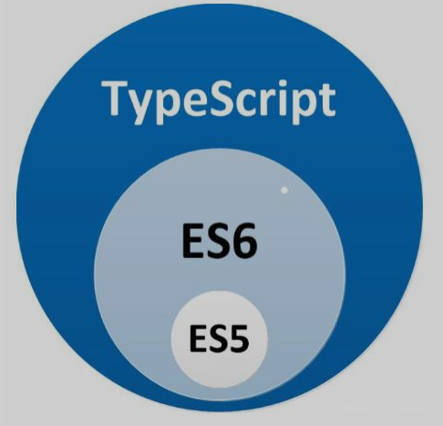

# 一、TypeScript 介绍

1. **TypeScript**是有微软公司开发的一款开源的编程语言。
2. **TypeScript**是**JavaScript**的超集，它可以变异成纯JavaScript，遵循最新的ES6、ES5规范。**TypeScript**扩展了**JavaScript**的语法。
3. **TypeScript** 更像后端java、C#这样的面向对象语言可以让JS开发大兴企业项目。
4. 谷歌也在大力支持**TypeScript** 的推广，谷歌的**Angular2.x+**就是基于**TypeScript** 语法。
5. 最新的**Vue**、**React**也可以集成**TypeScript** 。 



# 二、安装与编译 

```bash
# 安装
npm i -g typescript

# 编译
tsc ts后缀的文件
```

## Vscode自动编译 .ts 文件

1. 创建`tsconfig.json`文件----在目录下执行`tsc --init`命令 生成配置文件
2. 取消文件`tsconfig.json`里的`outDir:‘./js’` 路径表示js文件要保存的路径
3. 在vscode中选择 终端==》运行任务==》tsc: watch -tsconfig.json  监视tsconfig.json文件即可

# 三、数据类型

**类型校验：** 初始定义指定变量是什么类型，该变量就一直是什么类型，不可改变为其他类型

```typescript
// 字符串类型
var str: string = "Hello world";

// 数字类型
var num: number = 123;

// 布尔类型
var bln:boolean = true;

// 数组
var arr1: number[] = [11,-22,33.3];   //数组类型一 number换成any任意类型就表示数组可放任意值
var arr2: Array<number> = [11,-22,33.3];  //数组类型二

// 元组类型 tuple   属于数组的一种
let tuple: [number,string] = [1,'zs'];

// 枚举类型 enum
enum Flag { success = 0, error = 1 }; //如果没赋值默认是下标
var a:Flag = Flag.success;

// 任意类型 any
var an:any = "str";
var arr3: Array<any> = [11,-22,'aa'];

//null undefined
var aa:null;
var bb:undefined;
var cc:number | null | undefined; // 可以是数字或者null或者undefined

// void 类型
function fn():void{} // 表示该函数没有返回值

// never 类型 ：是其他类型（包括null和undefined）的子类型，代表从不会出现的值
 //这意味着声明never类型的只能被never类型赋值
var nev: never;
nev =( () => {
    throw new Error();
})();

//Object 表示非原始类型，也就是除number，string，boolean，symbol，null或undefined之外的类型。
```

# 四、定义函数

```typescript
//返回值类型定义
function fn1():number {
    return 1;
}
fn1();

//参数类型定义
function fn2(name:string,age:number):any {
    return {name:name,age:age};
}
fn2('zs',18);

//可选参数定义 ？  ----可选参数必须配置到参数的最后面
function fn3(name:string,age?:number):void {}
fn3('ls');
fn3('ls',20);

//默认参数
function fn4(name:string,age:number=18):void {}
fn4('ls');
fn4('ls',20);

//剩余参数  三点运算符
function sum(a:number, ...result: number[]): number {
    let sum: number = a;
    result.forEach(ele => {
        sum += ele;
    });
    return sum;
}

//方法重载
function getInfo(name: string): string;
function getInfo(age: number): number;
function getInfo(param: any): any {
    if(typeof param === 'string'){
        return `名字为${param}`;
    }else {
        return `年龄为${param}`;
    }
}
getInfo(‘zs’);
getInfo(18);
//getInfo(true); //报错
```

# 五、class 类

## 类的定义

```typescript
class Person {
    name: string;   //属性
    constructor(name: string) {  //构造函数
        this.name = name;
    }
    say(): void { }   //普通方法
}
```

## 类的继承

```typescript
class Father {
    name: string;
    constructor(name: string) {
        this.name = name;
    }
    say(): void { }
}
class son extends Father {  // 通过extends 来实现继承
    constructor(name: string) {
        super(name);  //通过super来调用父类的构造方法
    }
}
```

## 类的修饰符

**1. 权限修饰符**

三种修饰符

* **public**  ：公共的（默认）   在`类里`、`子类里`、`类外`都可以访问
* **protected** ：受保护的          在`类里`、`子类里`可以方法
* **private**  ：私有的                  在`类里`可以访问

**2. 静态修饰符 static**

```typescript
class Father {
    name: string;
    static age: number;   //静态属性
    constructor(name: string) {
        this.name = name;
    }
    say(): void { }
    static sayAge(): number { return Father.age }; //静态方法  静态方法只能调用到静态属性
}

//调用静态属性不需要实例化对象，直接拿类名调用
Father.age;
Father.sayAge();
```

**3. 抽象类与抽象方法 abstract**

`多态：父类的引用指向子类的方法，具体实现看子类 `

```typescript
abstract class Animal {  //抽象类  抽象类不可以单独创建对象 只能让子类继承
    abstract eat():void;  //抽象方法  抽象方法只能存在抽象类中
}

class Dog extends Animal{
    eat():void{}  //子类继承抽象类时，必须重写抽象中的所有抽象方法
}
```

# 六、interface 接口

`TypeScript的核心原则之一是对值所具有的*结构*进行类型检查。 它有时被称做“鸭式辨型法”或“结构性子类型化”。 在TypeScript里，接口的作用就是为这些类型命名和为你的代码或第三方代码定义契约。`

## 属性接口

```typescript
// ts定义一个接口
interface fullName {
    firstName:string;
    secondName？:string;  //#####可选属性 可传可不传
}

// 形参为一个接口类型的参数
function printName(name:fullName):void {
    console.log(name.firstName+name.secondName);
}
// 调用的函数传递的对象必须含有接口对应的属性 可选属性除外  不允许出现其他熟悉名
printName({firstName:'张',secondName:'三'}); 
printName({firstName:'张'});

//#####只读属性
interface Point {
    readonly x: number;
    readonly y: number;
}
// 赋值后， x和y再也不能被改变了
let p1: Point = { x: 10, y: 20 };
p1.x = 5; // error!
//TypeScript具有ReadonlyArray<T>类型，它与Array<T>相似，只是把所有可变方法去掉了，因此可以确保数组创建后再也不能被修改
let a: number[] = [1, 2, 3, 4];
let ro: ReadonlyArray<number> = a;
ro[0] = 12; // error!
ro.push(5); // error!
ro.length = 100; // error!
a = ro; // error!

//## readonly vs const
//最简单判断该用readonly还是const的方法是看要把它做为变量使用还是做为一个属性。 做为变量使用的话用 const，若做为属性则使用readonly。
```

## 函数类型接口

```typescript
// ts定义函数类型接口
interface keyAndValue {
    (key: number, value: string): string;
}

//函数实现接口
let kv: keyAndValue = function (key: number, value: string): string {  //参数类型如果不填，系统会推断出参数类型
    return key + ':' + value;
}
```

## 可索引的类型接口

*不常用*

* 对数组进行约束

  ```typescript
  interface StringArray {
      [index: number]: number;
  }
  
  let myArray: StringArray = [123, 456];
  let myStr: string = myArray[0];
  ```

* 对对象进行约束

  ```typescript
  interface userObject {
      [index: string]: string;
  }
  
  let myObj: userObject = { name: "张三", sex: "男" };
  let myStr: string = myObj[name];
  ```

## 类类型接口

## 实现接口

```typescript
// 定义接口
interface Animal {
    name: string;
    eat(): void;
}

// 实现接口
class Cat implements Animal {
    constructor(name: string) {
        this.name = name;
    }
    //必须重写接口的全部属性和方法
    name: string;  
    eat(): void { } 
}
```

## 接口继承接口

```typescript
//接口A
interface Animal {
    name: string;
    eat(): void;
}
//接口B
interface Person extends Animal {
    work(): void;
}
//实现接口B
class Man implements Person {
    constructor(name: string) {
        this.name = name;
    }
    //必须重写接口 A和B 的全部属性和方法
    name: string;
    eat(): void { }
    work(): void { }
}
```

# 七、 泛型

泛型：可以支持不特定的数据类型  要求：传入的参数与返回的参数一致

```typescript
// T 表示泛型  具体调用什么类型有调用这个方法的时候决定
function getData<T>(value:T):T {
    return value;
}
getData<number>(123);
getData<string>('123');

// ts泛型类
class Person<T> {  //T就代表泛型  下方定义的数据类型设置T的话 实例化对象定义T是什么类型 则T就是什么类型
  name: T;
  constructor(name: T) {
    this.name = name;
  }
  getName(): T {
    return this.name;
  }
}

// ts泛型接口
// 1、定义泛型接口
interface ConfigFn {
  <T>(value: T): T;
}
// 给函数指定泛型接口 
var getData: ConfigFn = function<T>(value: T): T {
  return value;
};
getData<string>("张三");
// 2. 定义泛型接口
interface ConfigFn<T> {
  (value: T): T;
}
function getData<T>(value: T): T {
  return value;
}
var myGetData: ConfigFn<string> = getData;
myGetData("zs");
```

# 八 、模块化

```typescript
// test.tx中 暴露属性和方法
export var a = "123";
export function getName() {
  console.log("text getName");
}
//export {a,getName}
```

```typescript
// 获取暴露的属性和方法
import { a, getName as get } from "./test";  //as 起别名

console.log(a);
console.log(get());
```

## 默认导出

```typescript
export default function (s: string) {  //默认导出 只能导出一次
    return “”;
} 
```

```typescript
import validate from "./test"; //不用加{}
```

