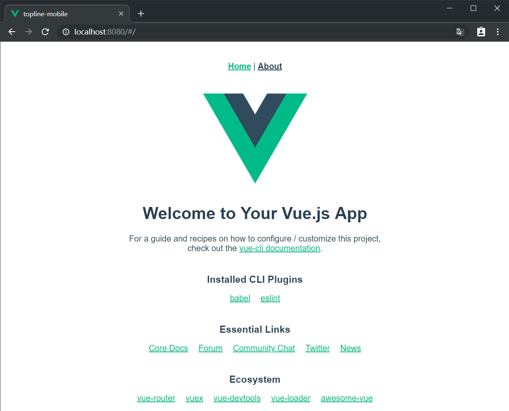
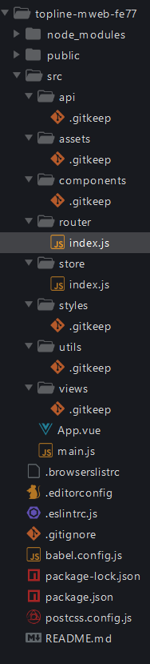

# 一、项目初始化

## 使用 Vue CLI 初始化项目

在命令行中输入以下命令创建 Vue 项目：

```bash
vue create topline-webapp
```

```
Vue CLI v3.11.0
? Please pick a preset:
  default (babel, eslint)
> Manually select features
```

> 选择第2种：手动选择特性，支持更多自定义选项

```
? Please pick a preset: Manually select features
? Check the features needed for your project:
 (*) Babel
 ( ) TypeScript
 ( ) Progressive Web App (PWA) Support
 (*) Router
 (*) Vuex
 (*) CSS Pre-processors
>(*) Linter / Formatter
 ( ) Unit Testing
 ( ) E2E Testing
```

> 分别选择：
>
> Babel：es6 转 es5
>
> Router：路由
>
> Vuex：容器
>
> CSS Pre-processors：CSS预处理器
>
> Linter / Formatter：代码格式校验

```
? Use history mode for router? (Requires proper server setup for index fallback in production) (Y/n) n
```

> 是否使用 history 路由模式，这里输入 n 不使用

```
? Pick a CSS pre-processor (PostCSS, Autoprefixer and CSS Modules are supported by default):

  Sass/SCSS (with dart-sass)
  Sass/SCSS (with node-sass)
> Less
  Stylus
```

> 选择 CSS 预处理器，这里选择我们熟悉的 Less

```bash
? Pick a linter / formatter config:
  ESLint with error prevention only
  ESLint + Airbnb config
> ESLint + Standard config
  ESLint + Prettier
```

> 选择校验工具，这里选择 ESLint + [Standard config](https://standardjs.com/)

```
? Pick additional lint features:
 (*) Lint on save
>(*) Lint and fix on commit
```

> 选择在什么时机下触发代码格式校验：
>
> - Lint on save：每当保存文件的时候
> - Lint and fix on commit：每当执行 `git commit` 提交的时候
>
> 这里建议两个都选上，更严谨。

```bash
? Where do you prefer placing config for Babel, PostCSS, ESLint, etc.? (Use arrow keys)
> In dedicated config files
  In package.json
```

> Babel、ESLint 等工具会有一些额外的配置文件，这里的意思是问你将这些工具相关的配置文件写到哪里：
>
> - In dedicated config files：分别保存到单独的配置文件
> - In package.json：保存到 package.json 文件中
>
> 这里讲义选择第1个，保存到单独的配置文件，这样方便我们做自定义配置。

```bash
? Save this as a preset for future projects? (y/N) n
```

> 这里是问你是否需要将刚才选择的一系列配置保存起来，然后它可以帮你记住上面的一系列选择，以便下次直接重用。
>
> 这里根据自己需要输入 y 或者 n，我这里输入 n 不需要。

```bash
✨  Creating project in C:\Users\LPZ\Desktop\topline-mweb.
�  Initializing git repository...
⚙  Installing CLI plugins. This might take a while...

[     .............] | loadDep:unpipe: s
```

> 向导配置结束，开始装包。
>
> 安装包的时间可能较长，请耐心等待......

```bash
added 132 packages from 118 contributors, updated 2 packages and moved 9 packages in 20.506s ⚓  Running completion hooks...

�  Generating README.md...

�  Successfully created project topline-mweb.
�  Get started with the following commands:

 $ cd topline-mweb
 $ npm run serve
```

> 安装结束，命令提示你项目创建成功，按照命令行的提示在终端中分别输入：
>
> - `cd 你的项目`
> - `npm run serve`

```bash
 DONE  Compiled successfully in 7527ms                                           


  App running at:
  - Local:   http://localhost:8080/
  - Network: http://192.168.10.216:8080/

  Note that the development build is not optimized.
  To create a production build, run npm run build.
  

```

> 启动成功，命令行中输出项目的 http 访问地址。
>
> 打开浏览器，输入其中任何一个地址进行访问。



如果能看到该页面，恭喜你，项目创建成功了。

## 目录结构

项目创建好以后，下面我们来了解一下目录结构的含义：

```
├── babel.config.js	babel配置文件
├── package-lock.json	npm相关文件
├── package.json	npm相关文件
├── postcss.config.js	postcss配置文件
├── public	静态资源托管目录
│   ├── favicon.ico
│   └── index.html
├── README.md	项目说明文件
└── src	源码
    ├── App.vue	根组件
    ├── assets	资源目录
    ├── components	组件目录
    ├── main.js	入口文件
    ├── router.js	路由模块
    ├── store.js	vuex容器模块
    └── views  视图组件目录
```

## 加入 Git 版本管理

几个好处：

- 代码备份
- 多人协作
- 历史记录


1、创建远程仓库（github、码云、coding。。。）

2、将本地仓库推到线上

正常的话我们需要创建仓库并提交历史记录：

```bash
git init
git add 文件
git commit "提交日志"
```


Vue CLI 生成的项目默认完成了Git仓库的初始化和一次提交，所以这里只需要 push 到线上即可。

```bash
git remote add 远程仓库地址
git push -u origin master
```


之后如果需要提交，则直接：

```bash
git add .
git commit -m "提交日志"
git push
```


## 调整目录结构

默认生成的目录结构不满足我们的开发需求，所以这里需要做一些自定义改动。

这里主要就是下面的两个工作：

- 删除初始化的默认文件
- 新增调整我们需要的目录结构

```
├── babel.config.js	babel配置文件
├── package-lock.json	npm相关文件
├── package.json	npm相关文件
├── postcss.config.js	postcss配置文件
├── public	静态资源托管目录
│   ├── favicon.ico
│   └── index.html
├── README.md	项目说明文件
└── src	源码
    ├── api	请求接口封装模块
    ├── App.vue	根组件
    ├── assets	资源目录
    ├── components	组件目录
    ├── main.js	入口文件
    ├── router	路由模块
    ├── store	 Vuex容器模块
    ├── styles 样式目录
    ├── utils  工具模块目录
    └── views  视图组件目录
```

在 src 中创建以下目录：

- api
  - 存储请求函数模块
- router
  - 路由文件模块
- store
  - Vuex 容器模块
- styles
  - 样式文件模块
- utils
  - 工具函数模块


将 `App.vue` 修改为：

```html
<template>
  <div id="app">
    <router-view />
  </div>
</template>

<script></script>

<style></style>

```

删除默认生成的 `src/router.js`，然后创建 `src/router/index.js` 并写入以下内容：

```js
import Vue from 'vue'
import VueRouter from 'vue-router'

Vue.use(VueRouter)

const router = new VueRouter({
  // 配置路由表
  routes: []
})

export default router

```

删除 `src/store.js`，然后创建 `src/store/index.js` 并写入：

```js
import Vue from 'vue'
import Vuex from 'vuex'

Vue.use(Vuex)

export default new Vuex.Store({
  state: {

  },
  mutations: {

  },
  actions: {

  }
})

```

删除默认生成的一些文件：

- components/HelloWorld.vue
- views/Home.vue
- views/About.vue
- assets/logo.png


Git 只能管理文件，对于空目录不会进行版本管理，所以建议在空目录中添加一个 `.gitkeep` 空文件以保持提交历史中的目录结构。


调整之后的目录结构如下：




最后，让我们来提交一下：

```bash
git add .
git commit -m "项目初始化-调整目录结构"

git push
```


## 导入 Vant

> 参考：
>
> - https://youzan.github.io/vant/#/zh-CN/quickstart

基于 Vue.js 的移动端组件库有很多，在官方的 [awesome](https://github.com/vuejs/awesome-vue#mobile) 中也推荐了一些，在我们的项目中使用的是有赞开发的 [Vant](https://github.com/youzan/vant)。

全部引入

- 好处：使用方便
- 缺点：打包体积大

按需引入（建议）

- 好处：打包体积小
- 缺点：相对于全部引入要稍微麻烦一些


将 Vant 导入项目中，推荐使用官网提供的自动按需引入组件的方式。

下面是具体操作步骤。

一、安装 Vant

```bash
npm i vant
```


二、[配置按需引入 Vant 组件](https://youzan.github.io/vant/#/zh-CN/quickstart#fang-shi-yi.-zi-dong-an-xu-yin-ru-zu-jian-tui-jian)

1、安装依赖

```bash
npm i babel-plugin-import -D
```

2、然后将 `babel.config.js` 中修改为

```js
module.exports = {
  presets: [
    '@vue/app'
  ],
+  plugins: [
+    ['import', {
+      libraryName: 'vant',
+      libraryDirectory: 'es',
+      style: true
+    }, 'vant']
+  ]
}

```

配置完毕，最好重启一下。


三、注册使用

注册组件：

```bash
// 按需注册 Vant 组件
import {
  Button,
  Cell,
  CellGroup
} from 'vant'

Vue
  .use(Button)
  .use(Cell)
  .use(CellGroup)
```

测试使用：

```html
<van-button type="default">默认按钮</van-button>
<van-button type="primary">主要按钮</van-button>
<van-button type="info">信息按钮</van-button>
<van-button type="warning">警告按钮</van-button>
<van-button type="danger">危险按钮</van-button>
```


> 提示：之后无论使用哪个组件，一定要记得：**先注册，后使用**。

## 配置 REM 适配（后面讲）

二、使用 [postcss-pxtorem](https://github.com/cuth/postcss-pxtorem) 将 px 转为 rem

安装：

```bash
# yarn add -D postcss-pxtorem
npm install postcss-pxtorem --save-dev
```

然后将项目中的 `postcss.config.js` 修改为：

```js {5-11}
module.exports = {
  plugins: {
    'autoprefixer': {
      browsers: ['Android >= 4.0', 'iOS >= 7']
    },
    'postcss-pxtorem': {
      rootValue: 37.5,
      propList: ['*']
    }
  }
}
```

在浏览器中审查元素的样式查看是否已转换为 rem。

> 注意：
>
> - **只能转换单独的 .css|.less|.scss 之类的文件、.vue 文件中的 style 中的 px**
> - **不能转换行内样式中的 px**


一、使用 [amfe-flexible](https://github.com/amfe/lib-flexible) 动态设置 html 标签的字体大小

安装：

```bash
npm i amfe-flexible
```

然后在 `main.js` 中新增：

```js
...
import 'amfe-flexible/index.js'

```

测试：在浏览器中切换不同的手机设备尺寸，观察 html 标签 `font-size` 的变化。


## 封装 axios 请求函数

这里我们直接把 axios 封装为一个请求模块，在需要的时候直接加载使用。

1、安装 axios

```bash
npm i axios
```


2、创建 `utils/request.js` 并写入以下代码

```js
import axios from 'axios'

// axios.create 方法
// 建议使用 create 方式，我们可以拥有
// 说白了就是复制了一个 axios，拥有和 axios 完全一样的功能，但是配置可以不一样
// 例如我们可以创建多个请求对象，而不同的请求对象拥有不同的 baseURL
// 例如我们可以有 a 请求的拦截器，也可以专门定制 b 请求的拦截器
const request = axios.create({
  baseURL: 'http://ttapi.research.itcast.cn'
})

export default request

```

调用测试。

## 处理后端返回数据超出 JS 安全整数范围问题

> 注意：该项目所使用的后端接口数据中包含超出 JavaScript 安全整数范围的数字，所以也需要像之前的 PC 端项目一样使用 [json-bigint](https://github.com/sidorares/json-bigint) 将后端返回数据处理一下才能正确使用。

1、安装依赖：

```bash
npm i json-bigint
```


2、在 `utils/request.js` 中新增：

```js
/**
 * axios 请求相关操作封装到这里
 */
import axios from 'axios'
+ import jsonBig from 'json-bigint'

const request = axios.create({
  // 请求的基础路径
  baseURL: 'http://ttapi.research.itcast.cn/'
})

/**
 * 配置处理后端返回数据中超出 js 安全整数范围问题
 */
+ request.defaults.transformResponse = [function (data) {
+  return data ? jsonBig.parse(data) : {} // 换了一个转化方法 使得 计算更精确 保证id不失真
+ }]

/**
 * 请求拦截器
 */

/**
* 响应拦截器
*/

// 导出这个请求对象，哪里需要发请求，哪里就加载使用
export default request

```

最后请求测试。

## 补充：关于 npm 和 yarn

npm 和 yarn 都是管理第三方包的。

yarn 相比 npm 稍微快一些。

下面是npm 和 yarn 常用命令对照表：

```bash
# yarn init
npm init

# yarn add 包名
npm install 包名

# yarn install 或者直接 yarn
npm install

# yarn add -D 包名
npm install -D 包名

# yarn remove 包名
npm uninstall 包名

# yarn global remove 包名
npm uninstall --global 包名

# yarn global add 包名
npm install --global 包名
```

在一个项目中，使用哪个包管理工具那你就自始至终都使用这个工具，千万不要混用，否则会导致文件丢失。

如果你想切换项目使用的包管理工具：

1、删除 node_modules

2、删除 yarn.lock/package-lock.json

3、使用你要使用的新的包管理工具把所有依赖重新安装一遍

- yarn
- npm install

4、之后就可以正常使用了

