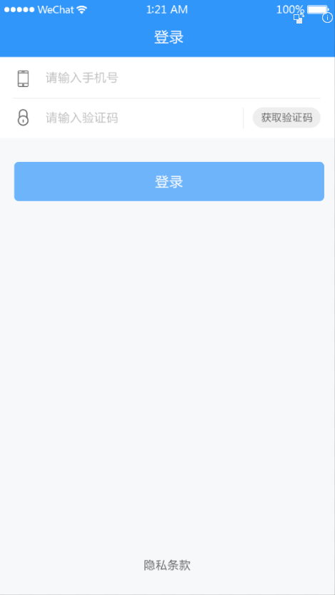
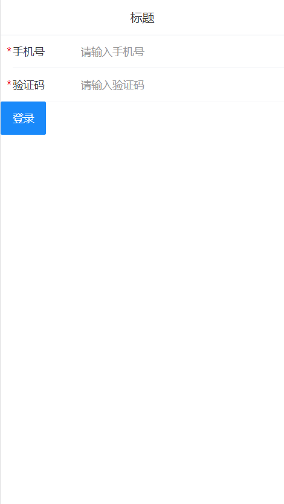
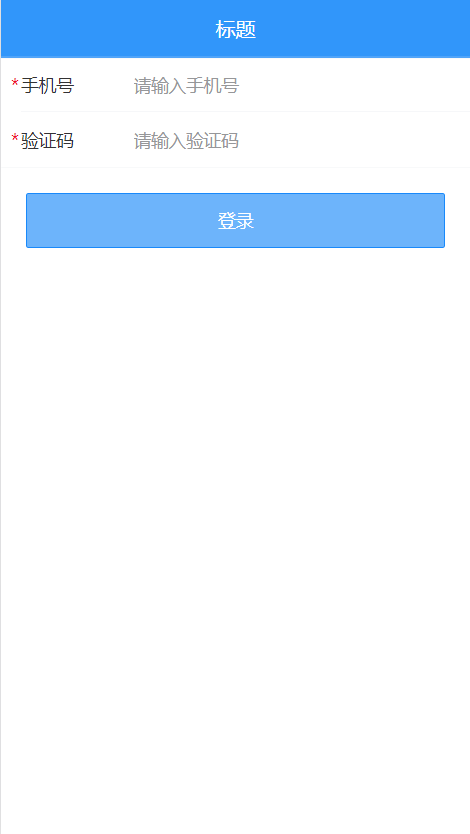
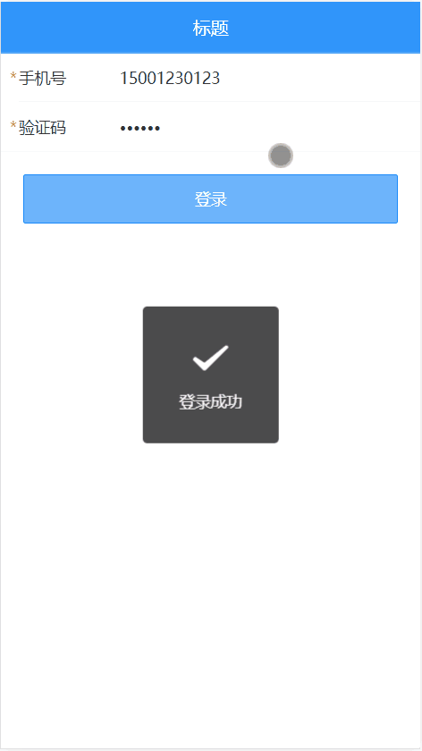

# 二、从登陆开始



流程：

- 创建登录组件并配置路由
- 布局
- 完成登录功能


## 准备

### 创建登录组件并配置路由


1、创建 `views/login/index.vue` 并写入以下内容：

```html
<template>
  <div class="login">登录页面</div>
</template>

<script>
export default {
  name: 'LoginIndex'
}
</script>

<style lang="less" scoped>
</style>

```

2、然后在 `router/index.js` 中配置路由表：

```js
import Vue from 'vue'
import Router from 'vue-router'
+ import Login from '@/views/login'

Vue.use(Router)

export default new Router({
  routes: [
+    {
+      name: 'login',
+      path: '/login',
+      component: Login
+    }
  ]
})

```

最后，访问 `/login` 查看是否能访问到登录页面组件。

### 页面结构



这里主要使用到三个 Vant 组件：

- [NavBar 导航栏](https://youzan.github.io/vant/#/zh-CN/nav-bar)
- [Field 输入框](https://youzan.github.io/vant/#/zh-CN/field)
- [Button 按钮](https://youzan.github.io/vant/#/zh-CN/button)

1、将登录页修改为：

```html
<template>
  <div class="login">
    <!-- 导航栏 -->
    <van-nav-bar
      title="标题"
    />
    <!-- /导航栏 -->

    <!-- 登录表单 -->
    <van-cell-group>
      <van-field
        required
        clearable
        label="手机号"
        placeholder="请输入手机号"
      />

      <van-field
        type="password"
        label="验证码"
        placeholder="请输入验证码"
        required
      />
    </van-cell-group>
    <!-- /登录表单 -->

    <!-- 登录按钮 -->
    <div>
      <van-button type="info">登录</van-button>
    </div>
    <!-- /登录按钮 -->
  </div>
</template>

<script>
export default {
  name: 'LoginIndex'
}
</script>

<style>

</style>

```

### 样式调整



我们把设置登录页头部的样式写到全局（全局生效），因为其它页面也要使用。把非公共样式写到页面组件内部，避免和其它组件样式冲突。

下面是具体实现步骤。

一、添加全局样式

1、创建 `styles/index.less` 并写入以下内容：

```less
.van-nav-bar {
  background-color: #3196fa;
  .van-nav-bar__title {
    color: #fff;
  }
}

```

2、然后在 `main.js` 中加载使其生效：

```js
...
import './styles/index.less'
```

完了测试查看效果。

二、添加局部样式

将 `views/login/index.vue` 组件中的 style 修改为：

```css
<style lang="less" scoped>
.login {
  .btn-wrap {
    padding: 20px;
    .btn {
      width: 100%;
      background-color: #6db4fb;
      color: #fff;
    }
  }
}
</style>
```


## 实现基本登录功能



实现流程：

- 获取表单数据（绑定）
- 注册点击登录的事件
- 表单验证
- 发请求提交
- 根据请求结果做下一步处理


下面是具体的实现过程：

一、数据绑定

1、根据接口要求绑定表单数据

在登录页面组件的实例选项 data 中添加 `user` 数据字段：

```js
...
data () {
  return {
    user: {
      mobile: '',
      code: ''
    }
  }
}
```

2、在表单中使用 `v-model` 绑定对应数据：

```html
<!-- van-cell-group 仅仅是提供了一个上下外边框，能看到包裹的区域 -->
<van-cell-group>
  <van-field
+    v-model="user.mobile"
    required
    clearable
    label="手机号"
    placeholder="请输入手机号"
  />

  <van-field
+    v-model="user.code"
    type="password"
    label="验证码"
    placeholder="请输入验证码"
    required
  />
</van-cell-group>
```

最后在浏览器使用 VueDevtools 调试工具查看是否绑定成功。

二、请求提交

1、给登录按钮注册点击事件处理函数

```html
...
<van-button type="info" @click="onLogin">登录</van-button>
```


2、登录处理函数

```js
import request from '@/utils/request'

async onLogin () {
  try {
    // 请求提交表单数据
    const { data } = await request({
      method: 'POST',
      url: '/app/v1_0/authorizations',
      data: this.user
    })
    this.$toast.success('登录成功')
  } catch (err) { // 所有大于等于 400 的状态码都会进入 catch
    if (err.response && err.response.status === 400) {
      this.$toast.fail('登录失败，手机号或验证码错误')
    }
  }
}

```

## 登录中 loading 提示

文字提示：

```js
this.$toast('提示内容')
```

加载提示（永远不会关闭）：

```js
this.$toast.loading({
  mask: true,
  message: '加载中...'
})
```

成功/失败提示：

```js
this.$toast.success('提示内容')

this.$toast.fail('提示内容')

// 根据文档提示，我们可以看到这两个方法也支持自定义方式
this.$toast.success({
  一坨的选项
})
```

可以手动控制关闭的 loading：

```js
// 开启
const toast = this.$toast.loading({
  duration: 0,       // 持续展示 toast
  forbidClick: true, // 禁用背景点击
  loadingType: 'spinner',
  message: '倒计时 3 秒'
})

// 结束 loading
// 如果后面有 success、fail 之类的提示，就不需要手动关闭 loading 了
toast.clear()
```


## 封装 api 请求模块

我们建议将所有请求都封装为函数的方式来进行使用，这样做的主要目的是为了便于重用和维护。

下面是具体的实现方式：

1、创建 `api/user.js` 并写入

```js
import request from '@/utils/request'

/**
* 登录
*/
export function login (user) {
  return request({
    // method 用来指定请求方法，这是 axios 的固定 API，不能瞎写
    method: 'POST',
    // url 用来指定请求路径
    url: '/app/v1_0/authorizations',
    // data 是 axios 请求要求的字段名，用来传递请求体数据的
    data: user
  })
}

```


2、然后在登录页面中加载调用：

```js
+ import { login } from '@/api/user'

async onLogin () {
  // 表单验证

  // 验证通过，loading，请求
  const toast = this.$toast.loading({
    duration: 0, // 持续展示 toast
    forbidClick: true, // 禁用背景点击
    loadingType: 'spinner',
    message: '登录中'
  })

  try {
    // 请求提交表单数据
+    const { data } = await login(this.user)

    console.log(data)

    // 先清除 loading
    toast.clear()

    // 再提示登录成功
    this.$toast.success('登录成功')
  } catch (err) { // 所有大于等于 400 的状态码都会进入 catch
    toast.clear()
    if (err.response && err.response.status === 400) {
      this.$toast.fail('登录失败，手机号或验证码错误')
    }
  }
}
```

之后项目中所有的请求就都不要直接在组件中去直接发了，而是都采用上面的方式封装之后进行使用，这是一个建议的做法。

## 表单验证

方式一：HTML5自带的表单验证（了解即可）

```html
<!DOCTYPE html>
<html lang="en">
<head>
  <meta charset="UTF-8">
  <meta name="viewport" content="width=device-width, initial-scale=1.0">
  <meta http-equiv="X-UA-Compatible" content="ie=edge">
  <title>Document</title>
</head>
<body>
  <form action="">
    <!-- 
      required 必填项
      max
      min
      length
      email
      ....

      兼容不好，各大浏览器实现不一致
     -->
    <input type="text" required max="5">
    <input type="submit" value="提交表单">
  </form>
</body>
</html>

```


方式二：自己写，建议参考 Vue 官方 Cookbook 写的[表单校验](https://cn.vuejs.org/v2/cookbook/form-validation.html)

方式三：使用组件库内置的验证

- 例如 element 内置的验证功能

- vant 没有提供

方式四：使用专门的验证插件

- [vuelidate](https://github.com/monterail/vuelidate)
- [VeeValidate](https://github.com/baianat/vee-validate)
- ...


这里我们以使用 VeeValidate 为例。


### 安装和配置

1、安装

```bash
# yarn add vee-validate
npm install vee-validate
```


2、在 `main.js` 中

```js
..
import { ValidationProvider, ValidationObserver, extend } from 'vee-validate'
import zhCN from 'vee-validate/dist/locale/zh_CN' // 加载验证插件的语言包
import * as rules from 'vee-validate/dist/rules'

// 配置使用中文语言
for (let rule in rules) {
  extend(rule, {
    ...rules[rule], // add the rule
    message: zhCN.messages[rule] // add its message
  })
}

// 注册为全局组件
Vue.component('ValidationProvider', ValidationProvider)
Vue.component('ValidationObserver', ValidationObserver)

```

### 基本使用

在模板中为需要验证的表单字段配置验证规则：

```html
<!-- 登录表单 -->
+ <ValidationObserver ref="loginForm">
  <van-cell-group>
    <!--
      name 提示的文本
      rules 验证规则
        required 必填项
        email
        max
        ....
        参考文档：https://logaretm.github.io/vee-validate/api/rules.html#alpha

      v-slot="{ errors }" 获取校验结果数据
        errors[0] 读取校验结果的失败信息
      -->
    <!-- <ValidationProvider name="手机号" rules="required|email|max:5" v-slot="{ errors }"> -->
+    <ValidationProvider name="手机号" rules="required" v-slot="{ errors }">
      <van-field
        v-model="user.mobile"
        required
        clearable
        label="手机号"
        placeholder="请输入手机号"
+        :error-message="errors[0]"
      />
+    </ValidationProvider>

+    <ValidationProvider name="验证码" rules="required|max:6" v-slot="{ errors }">
      <van-field
        v-model="user.code"
        type="password"
        label="验证码"
        placeholder="请输入验证码"
        required
+        :error-message="errors[0]"
      />
+    </ValidationProvider>
   </van-cell-group>
+ </ValidationObserver>
<!-- /登录表单 -->
```

当表单提交的时候，调用 js 进行验证

```js {3-6}
async onLogin () {
  // 表单验证
+  const isValid = await this.$refs.loginForm.validate()

+  // 如果验证失败，阻止表单提交
+  if (!isValid) {
+    return
+  }

  ...
}
```

测试效果。


如何自定义扩展校验规则，在 `main.js` 中：

```js
// 扩展自定义校验规则
// extend('规则名称', 配置对象)
extend('phone', {
  // 验证方法，value 是需要校验的数据，返回一个布尔值，表示验证成功与否
  validate: function (value) {
    return /^1\d{10}$/.test(value)
  },
  // 错误提示消息
  message: '请输入有效的手机号码'
})
```


