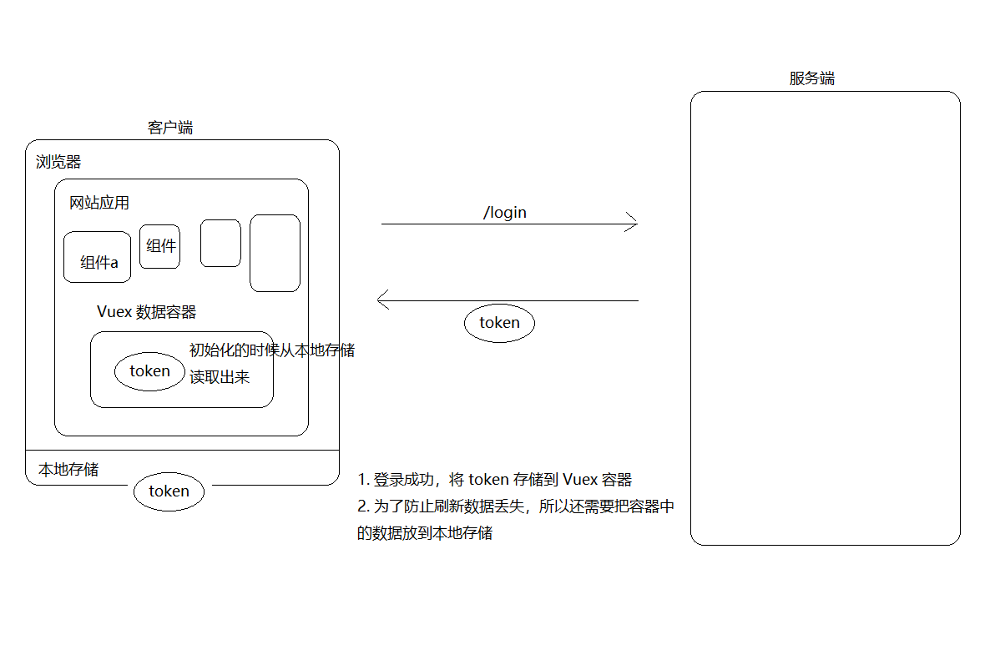

# 三、Token 处理

- 什么是 Token？一个令牌，用来请求需要权限的接口用的。
- 将 token 存储到了本地存储
  - 为了在其它地方能获取
  - 防止页面刷新丢失


如何存储：

- 为了方便获取：我们建议放到 Vuex 容器中
  - 组件中无论是直接通过 js 来获取还是直接在模板中获取都非常方便
  - $store
  - 如果只是纯粹的放到本地存储，那我在使用的时候，首先读取出来，然后放到 data 中，然后才能在模板中使用
- 为了防止刷新丢失：我们会把数据存储到本地存储



## 使用 Vuex 容器存储 token

1、在 `store/index.js` 中：

```js
import Vue from 'vue'
import Vuex from 'vuex'

Vue.use(Vuex)

export default new Vuex.Store({
  state: {
+    user: null
  },
  mutations: {
+    setUser (state, user) {
+      state.user = user
+    }
  },
  actions: {
  }
})

```

2、登录成功以后将数据存储到容器中

```js
async onLogin () {
  ...
  
  // 登录成功，将数据存储到容器中
  this.$store.commit('setUser', data.data)
}
```


## 持久化 token

Vuex 容器中的数据只是为了方便在其他任何地方能方便的获取登录状态数据，但是页面刷新还是会丢失数据状态，所以我们还要把数据进行持久化中以防止页面刷新丢失状态的问题。

前端持久化常见的方式就是：

- 本地存储
- Cookie

这里我们以使用本地存储持久化用户状态为例。

为了方便，这里先封装一个用于操作本地存储的存储模块。

1、创建 `src/utils/storage.js` 并写入以下内容

```js
export const getItem = name => {
  return JSON.parse(window.localStorage.getItem(name))
}

export const setItem = (name, data) => {
  return window.localStorage.setItem(name, JSON.stringify(data))
}

export const removeItem = name => {
  window.localStorage.removeItem(name)
}

```


2、然后在登录成功以后，将 token 存储到本地存储

```js
+ import { setItem } from '@/utils/storage'

async onLogin () {
  ...
  
  // 登录成功，将数据存储到容器中
  this.$store.commit('setUser', data.data)
  
  // 为了防止页面刷新数据丢失，将数据存储到本地存储
+  setItem('user', data.data)
}
```


3、最后，在容器中使用本地存储中的数据进行初始化

```js
import Vue from 'vue'
import Vuex from 'vuex'
+ import { getItem } from '@/utils/storage'

Vue.use(Vuex)

export default new Vuex.Store({
  state: {
    // 初始化的时候从本地存储获取数据，没有就是 null
+    user: getItem('user')
  },
  mutations: {
    setUser (state, user) {
      state.user = user
    }
  },
  actions: {

  }
})

```


## 使用请求拦截器统一添加 token

很多接口都需要提供 token 才能访问。

方式一：在每次请求的时候手动添加（麻烦）

```js
axios({
  method: '',
  url: '',
  headers: {
  	token数据
  }
})
```

方式二：使用请求拦截器统一添加（推荐，更方便）

在 `utils/request.js` 中添加拦截器统一设置 token：

```js
...
// 非组件模块访问容器直接加载即可
// 这里得到的 store 和组件中访问的 this.$store 是一个东西
import store from '@/store'

/**
 * 请求拦截器，请求到达后台之前拦截
 */
request.interceptors.request.use(function (config) {
  // 在发起请求请做一些业务处理
  // config是要发送请求的配置信息
  const user = store.state.user
  if (user) {
    // Authorization 是后端要求的名字，不能瞎写
    // 数据值 "Bearer空格token" 也是后端要求的数据格式，不能瞎写
    // 千万!千万!千万!注意，Bearer 和 token 之间的空格不能少
    // 什么意义？这是后端要求的，我们决定不了。
    config.headers['Authorization'] = `Bearer ${user.token}` // 统一注入token 到headers属性 因为所有接口要求的token格式是一样的
  }
  return config
}, function (error) {
  // 对请求失败做处理
  return Promise.reject(error)
})

```


## 处理 token 过期（后面讲）

