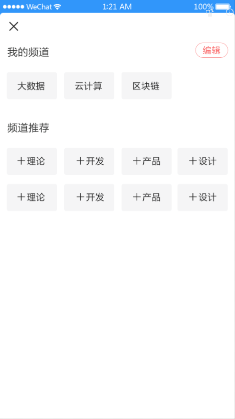
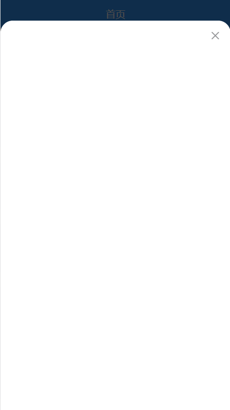
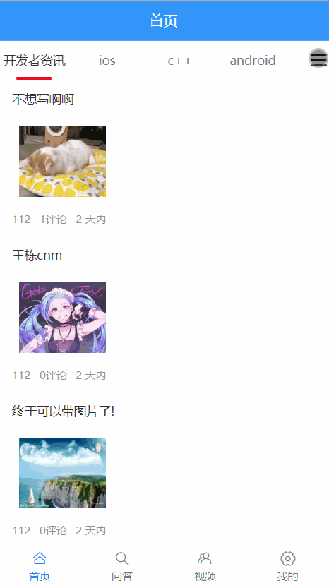
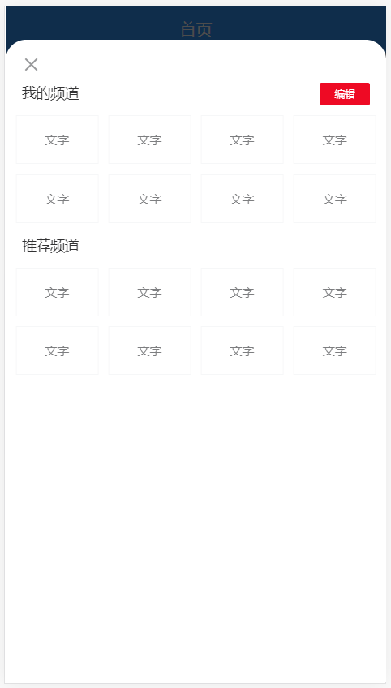
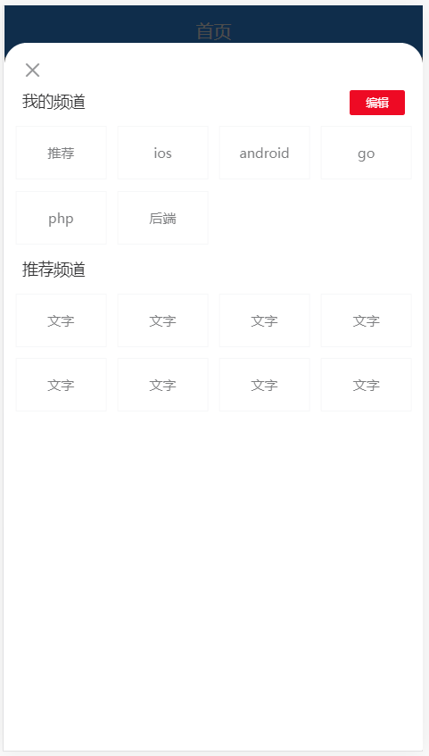
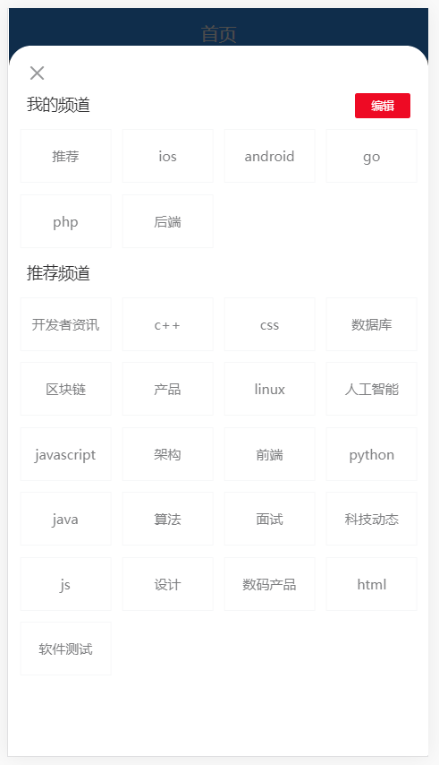
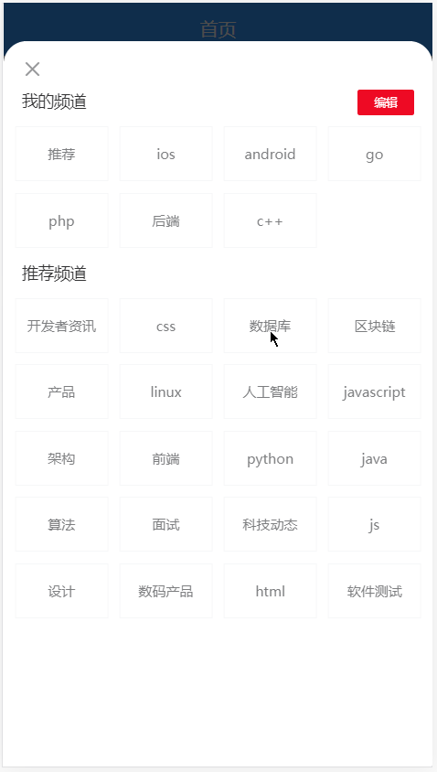
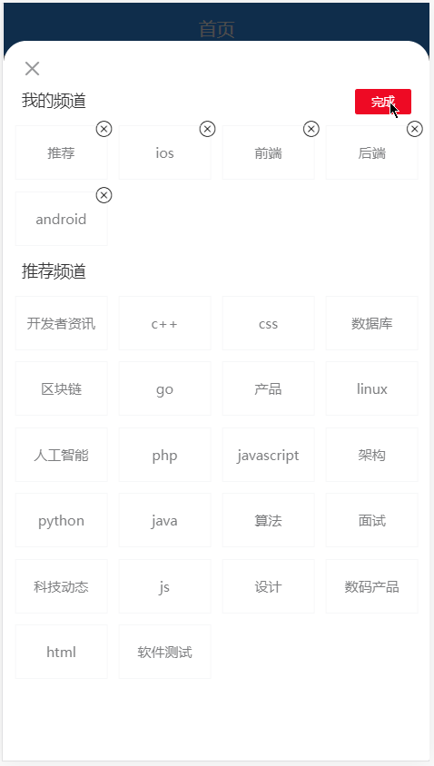
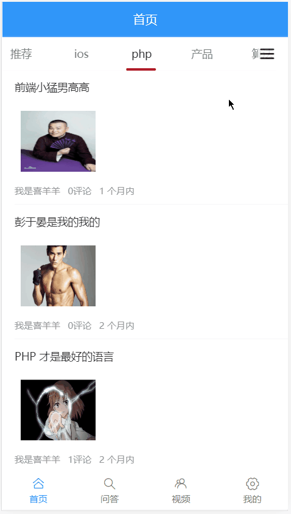

# 五、首页（下）



## 频道弹窗

### 弹窗组件

1、在首页中添加弹层组件用来展示频道管理

```html
<!-- 编辑频道 -->
<van-popup
  v-model="isChannelEditShow"
  position="bottom"
  :style="{ height: '95%' }"
  round
/>
<!-- /编辑频道 -->
```

2、然后在 `data `中添加一个数据用来控制弹窗的显示和隐藏

```js
data () {
  return {
    ...
    isChannelEditShow: true // 这里我们先设置为 true 就能看到弹窗的页面了
  }
}
```

测试查看结果。



### 点击面包按钮展示频道弹窗

在 `views/home/index.vue` 中添加按钮模板：

```html
<!-- 频道列表 -->
<van-tabs v-model="active">
  ...
  <!-- 面包按钮 -->
  <div slot="nav-right" class="wap-nav" @click="isChannelEditShow = true">
    <van-icon name="wap-nav" size="24" />
  </div>
  <!-- /面包按钮 -->
</van-tabs>
<!-- /频道列表 -->
```

> 注意：我们这里是把面包按钮通过 van-tabs 组件的 nav-right 插槽插入进去的。

别忘了给它设置一下样式，定位到右侧不动：

```css
.wap-nav {
  position: sticky;
  right: 0;
  display: flex;
  align-items: center;
  background-color: #fff;
  opacity: 0.8;
}
```

测试查看结果。



## 组件布局



1、在频道管理的弹层中添加

```html
<!-- 频道管理 -->
<van-popup
  v-model="isChannelShow"
  round
  position="bottom"
  :style="{ height: '95%' }"
  closeable
  close-icon-position="top-left"
>
  <div class="channel-container">
    <van-cell title="我的频道" :border="false">
      <van-button type="danger" size="mini">编辑</van-button>
    </van-cell>
    <van-grid :gutter="10">
      <van-grid-item
        v-for="value in 8"
        :key="value"
        text="文字"
      />
    </van-grid>

    <van-cell title="推荐频道" :border="false" />
    <van-grid :gutter="10">
      <van-grid-item
        v-for="value in 8"
        :key="value"
        text="文字"
      />
    </van-grid>
  </div>
</van-popup>
<!-- /频道管理 -->
```

别忘了添加一个样式：

```css
.home {
  ...
+  .channel-container {
+    padding-top: 30px;
+  }
}
```


## 展示我的频道



直接在我的频道中遍历 `channels` 数据就可以了。

```html
<van-cell title="我的频道" :border="false">
  <van-button type="danger" size="mini">编辑</van-button>
</van-cell>
<van-grid :gutter="10">
  <van-grid-item
+    v-for="(channel, index) in channels"
+    :key="index"
+    :text="channel.name"
  />
</van-grid>
```


## 展示推荐频道列表



思路：`所有频道列表 - 我的频道 = 剩余的频道`。

实现过程所以一共分为两大步：

- 获取所有频道
- 获取剩余频道


一、获取所有频道

1、在 `api/channel.js` 中新增

```js
/**
 * 获取所有频道列表
 */
export function getAllChannels () {
  return request({
    method: 'GET',
    url: '/app/v1_0/channels'
  })
}
```

2、然后在首页组件中

```js
...
import { getUserOrDefaultChannels, getAllChannels } from '@/api/channel'

export default {
  name: 'HomeIndex',
  data () {
    return {
      ...
+      allChannels: [] // 存储所有频道列表
    }
  },

  created () {
    this.loadUserOrDefaultChannels()
+    this.loadAllChannels()
  },

  methods: {
    // 原来的 loadAllChannels 改名为 loadUserOrDefaultChannels
    async loadUserOrDefaultChannels () {
      。。。
    },

    /**
     * 获取所有频道
     */
+    async loadAllChannels () {
+      const { data } = await getAllChannels()
+      this.allChannels = data.data.channels
+    }
  }
}
```

最后回到浏览器中测试结果。


二、处理获取展示剩余频道

1、封装一个计算属性用来获取剩余频道

```js
computed: {
  /**
   * 获取推荐频道列表
   */
  recommondChannels () {
    const arr = []
    // 遍历所有频道
    this.allChannels.forEach(channel => {
      // 判断 channel 是否存在我的频道中
      // 如果不存在，就证明它是剩余推荐的频道

      // 数组的 find 方法
      // 它会遍历数组，每遍历一次，它就判定 item.id === channel.id
      // 如果 true，则停止遍历，返回满足该条件的元素
      // 如果 false，则继续遍历
      // 如果直到遍历结束都没有找到符合 item.id === channel.id 条件的元素，则返回 undefined
      const ret = this.channels.find(item => item.id === channel.id)
      if (!ret) {
        arr.push(channel)
      }
    })

    return arr
    // return 所有频道 - 我的频道
  }
},
```

2、模板绑定进行展示

```html
<van-cell title="推荐频道" :border="false" />
<van-grid :gutter="10">
  <van-grid-item
    v-for="(channel, index) in recommondChannels"
    :key="index"
    :text="channel.name"
  />
</van-grid>
```


## 添加频道



1、给推荐频道中的频道注册点击事件

```html
<van-cell title="推荐频道" :border="false" />
<van-grid :gutter="10">
  <van-grid-item
    v-for="(channel, index) in recommondChannels"
    :key="index"
    :text="channel.name"
+    @click="onAddChannel(channel)"
  />
</van-grid>
```

2、在添加频道事件处理函数中

```js
/**
 * 添加频道
 */
onAddChannel (channel) {
  // 将频道添加到我的频道中
  this.channels.push(channel)
}
```

然后你会神奇的发现点击的那个推荐频道跑到我的频道中了，我们并没有去手动的删除点击的这个推荐频道，但是它没了！主要是因为推荐频道是通过一个计算属性获取的，计算属性中使用了 channels（我的频道）数据，所以只要我的频道中的数据发生变化，那么计算属性就会重新运算获取最新的数据。

## 频道数据持久化

1、当我们添加或是删除频道的时候都需要对频道数据进行持久化，所以为了方便，我们可以利用 Vue 中的 watch  功能来监视频道数据的变化，当数据发生改变，就把数据重新存储到本地存储

```js
import { getItem, setItem } from '@/utils/storage'

watch: {
  // 函数名就是要监视的数据成员名称
  channels (newVal) {
    setItem('channels', newVal)
  }
},
```

2、因为我们把数据持久化到了本次存储，所以我们需要在页面初始化的时候优先从本地存储来获取频道数据

```js
/**
 * 加载我的频道列表
 */
async loadChannels () {
+  let channels = []

  // 读取本地存储中的频道列表
+  const localChannels = getItem('channels')

  // 如果有本地存储的频道列表就使用本地存储的频道列表
+  if (localChannels) {
+    channels = localChannels
+  } else {
    // 如果没有本地存储的频道列表，则请求获取后台推荐的频道列表
+    const { data } = await getDefaultChannels()
+    channels = data.data.channels
+  }

  // 根据需要扩展自定义数据，用以满足我们的业务需求
  channels.forEach(channel => {
    channel.articles = [] // 存储频道的文章列表
    channel.finished = false // 存储频道的加载结束状态
    channel.loading = false // 存储频道的加载更多的 loading 状态
    channel.timestamp = null // 存储获取频道下一页的时间戳
    channel.isPullDownLoading = false // 存储频道的下拉刷新 loading 状态
  })

  // 最后把数据更新到组件中
  this.channels = channels
},
```


## 处理编辑频道按钮的切换显示



1、首先在 data 中初始化一个数据成员用来控制删除按钮的显示和隐藏

```js
data () {
  return {
    ...
    isEditShow: false
  }
}
```

2、然后在我的频道模板中

```html
<van-cell title="我的频道" :border="false">
  <van-button
    type="danger"
    size="mini"
+    @click="isEditShow = !isEditShow"
+  >{{ isEditShow ? '完成' : '编辑' }}</van-button>
</van-cell>
<van-grid :gutter="10">
  <van-grid-item
    v-for="(channel, index) in channels"
    :key="index"
    :text="channel.name"
  >
+    <van-icon v-show="isEditShow" class="close-icon" slot="icon" name="close" />
  </van-grid-item>
</van-grid>
```

别忘了给关闭按钮通过样式处理将其定位到频道项的右上角：

```css
.close-icon {
  position: absolute;
  top: -5px;
  right: -5px;
}
```

## 切换频道和删除频道



两个功能需求：

- 切换频道
- 删除频道

1、首先给我的频道中的频道项注册点击事件

```html
<van-cell title="我的频道" :border="false">
  <van-button
    type="danger"
    size="mini"
    @click="isEditShow = !isEditShow"
  >{{ isEditShow ? '完成' : '编辑' }}</van-button>
</van-cell>
<van-grid :gutter="10">
  <van-grid-item
    v-for="(channel, index) in channels"
    :key="index"
    :text="channel.name"
+    @click="onMyChannelClick(index)"
  >
    <van-icon v-show="isEditShow" class="close-icon" slot="icon" name="close" />
  </van-grid-item>
</van-grid>
```

2、在事件处理函数中

```js
/**
 * 我的频道项点击处理函数
 */
onMyChannelClick (index) {
  if (this.isEditShow) {
    // 如果是编辑状态，删除频道
    this.channels.splice(index, 1)
  } else {
    // 如果是非编辑状态，切换频道展示

    // 切换当前激活的频道
    this.active = index

    // 关闭频道弹层
    this.isChannelShow = false
  }
}
```

最后测试结果。


## 补充：关于 axios 传参

Headers 参数：

> 比较常见

```js
axios({
  method: 'xxx',
  headers: {
    名字: 值
  }
})
```

Query 参数：

> 常见于 GET 请求

```js
axios({
  method: 'xxx',
  params: {
    名字: 值
  }
})
```

Body 参数：

> 常见于 POST、PUT、PATCH 请求

```js
axios({
  method: 'xxx',
  data: {
    名字: 值
  }
})
```

路径参数：

> 文档中一般是在 url 中通过 :xxx 表示的

```
/app/v1_0/users/:target
/app/v1_0/sms/codes/:mobile
/app/v1_0/article/dislikes/:target
/app/v1_0/comment/likings/:target
```

这种参数必须手动拼接在 url 中。

```js
var userId = 3

axios({
  method: 'xxx',
  url: '/app/v1_0/users/' + userId
})
```

## 补充：关于第三方组件的插槽使用

```html
<!--
  一般在使用第三方组件的时候，它们默认给出的是最常用的功能
  如果需要自定义内容展示，那就看文档，看看人家是否支持自定义插槽
  -->
<van-cell title="单元格" value="内容" label="hello" />

<van-cell title="单元格" value="内容" label="hello">
  <button slot="title">hello</button>

  <!-- 当你没有给元素插槽起名字的时候，这个组件提供了默认插槽 -->
  <span>默认内容</span>
  <span slot="default">默认内容</span>

  <!-- 同名插槽可以插入多次 -->
  <span slot="title">world</span>
</van-cell>
```

## 功能优化：不删除推荐频道

```html
<template>
  <div class="home">
    <!-- 导航栏 -->
    <van-nav-bar title="首页" fixed />
    <!-- /导航栏 -->

    <!-- 频道列表 -->
    <!--
      v-model="active" 用来控制当前激活的频道索引
     -->
    <van-tabs v-model="active" animated swipeable>
      <!-- 面包菜单按钮 -->
      <div slot="nav-right" class="wap-nav" @click="isChannelShow = true">
        <van-icon name="wap-nav" size="24" />
      </div>
      <!-- /面包菜单按钮 -->
      <van-tab
        :title="channel.name"
        v-for="channel in channels"
        :key="channel.id"
      >
        <!-- 文章列表 -->
        <!--
          v-model="isLoading" 控制下拉刷线的 loading 状态
          @refresh 下拉刷新的时候会触发该事件
         -->
        <van-pull-refresh v-model="channel.isPullDownLoading" @refresh="onRefresh">
          <!--
            loading  控制上拉加载更多的 loading 效果
            finished 控制是否已加载结束
            finished-text 加载结束的提示文本
            @load="onLoad" 上拉加载更多触发的事件

            列表组件会在初始化的时候自动触发 load 事件调用 onLoad 方法
          -->
          <van-list
            v-model="channel.loading"
            :finished="channel.finished"
            finished-text="没有更多了"
            @load="onLoad"
          >
            <!-- 列表内容 -->
            <!--
              key 只能是数字或者字符串，不能是数组或对象
            -->
            <!-- <van-cell
              v-for="(article, index) in channel.articles"
              :key="index"
              :title="article.title"
            /> -->
            <van-cell
              v-for="(article, index) in channel.articles"
              :key="index"
              :title="article.title"
              >
              <div slot="label">
                <van-grid :border="false" :column-num="3">
                  <van-grid-item v-for="(img, index) in article.cover.images" :key="index">
                    <van-image lazy-load height="80" :src="img" />
                  </van-grid-item>
                </van-grid>
                <div class="article-info">
                  <div class="meta">
                    <span>{{ article.aut_name }}</span>
                    <span>{{ article.comm_count }}评论</span>
                    <span>{{ article.pubdate | relativeTime }}</span>
                  </div>
                </div>
              </div>
            </van-cell>
            <!-- /列表内容 -->
          </van-list>
        </van-pull-refresh>
        <!-- /文章列表 -->
      </van-tab>
    </van-tabs>
    <!-- /频道列表 -->

    <!-- 频道管理 -->
    <van-popup
      v-model="isChannelShow"
      round
      position="bottom"
      :style="{ height: '95%' }"
      closeable
      close-icon-position="top-left"
    >
      <div class="channel-container">
        <van-cell title="我的频道" :border="false">
          <van-button
            type="danger"
            size="mini"
            @click="isEditShow = !isEditShow"
          >{{ isEditShow ? '完成' : '编辑' }}</van-button>
        </van-cell>
        <van-grid :gutter="10">
+          <van-grid-item text="推荐" @click="switchChannel(0)" />
          <van-grid-item
+            v-for="(channel, index) in channels.slice(1)"
            :key="index"
            :text="channel.name"
            @click="onMyChannelClick(index)"
          >
            <van-icon v-show="isEditShow" class="close-icon" slot="icon" name="close" />
          </van-grid-item>
        </van-grid>

        <van-cell title="推荐频道" :border="false" />
        <van-grid :gutter="10">
          <van-grid-item
            v-for="(channel, index) in recommondChannels"
            :key="index"
            :text="channel.name"
            @click="onAddChannel(channel)"
          />
        </van-grid>
      </div>
    </van-popup>
    <!-- /频道管理 -->
  </div>
</template>

<script>
import { getDefaultChannels, getAllChannels } from '@/api/channel'
import { getArticles } from '@/api/article'
import { setItem, getItem } from '@/utils/storage'

export default {
  name: 'HomeIndex',
  data () {
    return {
      active: 0,
      // list: [],
      // loading: false,
      // finished: false,
      channels: [], // 我的频道列表
      isChannelShow: false, // 频道的显示状态
      allChannels: [], // 所有的频道列表
      isEditShow: false // 频道的编辑状态
    }
  },

  watch: {
    // 函数名就是要监视的数据成员名称
    channels (newVal) {
      setItem('channels', newVal)
    }
  },

  computed: {
    /**
     * 获取推荐频道列表
     */
    recommondChannels () {
      const arr = []
      // 遍历所有频道
      this.allChannels.forEach(channel => {
        // 判断 channel 是否存在我的频道中
        // 如果不存在，就证明它是剩余推荐的频道

        // 数组的 find 方法
        // 它会遍历数组，每遍历一次，它就判定 item.id === channel.id
        // 如果 true，则停止遍历，返回满足该条件的元素
        // 如果 false，则继续遍历
        // 如果直到遍历结束都没有找到符合 item.id === channel.id 条件的元素，则返回 undefined
        const ret = this.channels.find(item => item.id === channel.id)
        if (!ret) {
          arr.push(channel)
        }
      })

      return arr
      // return 所有频道 - 我的频道
    }
  },

  created () {
    // 获取我的频道
    this.loadChannels()

    // 获取所有频道
    this.loadAllChannels()
  },

  methods: {
    /**
     * 上拉加载更多
     */
    async onLoad () {
      // 获取当期激活的频道对象
      const activeChannel = this.channels[this.active]

      // 1. 请求获取数据
      const { data } = await getArticles({
        channel_id: activeChannel.id, // 频道ID
        // a: 3 b: 2
        // 4    3
        // 这里的这个时间戳就好比当前频道下一页的页码
        timestamp: activeChannel.timestamp || Date.now(), // 时间戳，请求新的推荐数据传当前的时间戳，请求历史推荐传指定的时间戳
        with_top: 1 // 是否包含置顶，进入页面第一次请求时要包含置顶文章，1-包含置顶，0-不包含
      })

      // 2. 将数据添加到当前频道.articles中
      // activeChannel.articles = activeChannel.articles.concat(data.data.results)
      activeChannel.articles.push(...data.data.results)

      // 3. 结束当前频道.loging = false
      activeChannel.loading = false

      // 4. 如果还有下一页数据
      if (data.data.pre_timestamp) {
        // 更新获取下一页数据的页码时间戳
        activeChannel.timestamp = data.data.pre_timestamp
      } else {
        // 如果没有下一页数据了，就意味着后面没有数据了
        activeChannel.finished = true
      }
    },

    /**
     * 加载我的频道列表
     */
    async loadChannels () {
      let channels = []

      // 读取本地存储中的频道列表
      const localChannels = getItem('channels')

      // 如果有本地存储的频道列表就使用本地存储的频道列表
      if (localChannels) {
        channels = localChannels
      } else {
        // 如果没有本地存储的频道列表，则请求获取后台推荐的频道列表
        const { data } = await getDefaultChannels()
        channels = data.data.channels
      }

      // 根据需要扩展自定义数据，用以满足我们的业务需求
      channels.forEach(channel => {
        channel.articles = [] // 存储频道的文章列表
        channel.finished = false // 存储频道的加载结束状态
        channel.loading = false // 存储频道的加载更多的 loading 状态
        channel.timestamp = null // 存储获取频道下一页的时间戳
        channel.isPullDownLoading = false // 存储频道的下拉刷新 loading 状态
      })

      // 最后把数据更新到组件中
      this.channels = channels
    },

    /**
     * 下拉刷新
     */
    async onRefresh () {
      // 获取当期激活的频道对象
      const activeChannel = this.channels[this.active]

      // 1. 请求获取最新推荐的文章列表
      const { data } = await getArticles({
        channel_id: activeChannel.id,
        timestamp: Date.now(), // 下拉刷新永远都是在获取最新推荐的文章列表，所以传递当前最新时间戳
        with_top: 1
      })

      // 2. 将数据添加到文章列表顶部
      activeChannel.articles.unshift(...data.data.results)

      // 3. 关闭下拉刷新的 loading 状态
      activeChannel.isPullDownLoading = false

      // 4. 提示
      this.$toast('刷新成功')
    },

    /**
     * 获取所有频道列表
     */
    async loadAllChannels () {
      const { data } = await getAllChannels()
      this.allChannels = data.data.channels
    },

    /**
     * 添加频道
     */
    onAddChannel (channel) {
      // 将频道添加到我的频道中
      this.channels.push(channel)
    },

    /**
     * 我的频道项点击处理函数
     */
    onMyChannelClick (index) {
      if (this.isEditShow) {
        // 如果是编辑状态，删除频道
        this.channels.splice(index, 1)
      } else {
        // 如果是非编辑状态，切换频道展示

        // 切换当前激活的频道
-        // this.active = index

        // 关闭频道弹层
-        // this.isChannelShow = false

  			// 因为这个数组不包括“推荐”频道，而首页中遍历的频道列表是包括推荐，所以让索引+1
+        this.switchChannel(index + 1)
      }
    },

    /**
     * 切换频道
     */
+    switchChannel (index) {
+      this.active = index
+      this.isChannelShow = false
+    }
  }
}
</script>

<!-- <style lang="less" scoped> -->
<style lang="less" scoped>
.home {
  .article-info {
    display: flex;
    align-items: center;
    justify-content: space-between;
    .meta span {
      margin-right: 10px;
    }
  }

  /** 展示频道的菜单按钮 */
  .wap-nav {
    position: sticky;
    right: 0;
    display: flex;
    align-items: center;
    background-color: #fff;
    opacity: 0.8;
  }

  /* 标签组件的根节点的类名 */
  .van-tabs {
    /deep/ .van-tabs__wrap {
      position: fixed;
      top: 46px;
      z-index: 2;
      left: 0;
      right: 15px;
    }

    /deep/ .van-tabs__content {
      margin-top: 90px;
      margin-bottom: 50px;
    }
  }

  .channel-container {
    padding-top: 30px;
    .close-icon {
      position: absolute;
      top: -5px;
      right: -5px;
    }
  }
}
</style>

```

## 解决新添加的频道报错问题

```html
<template>
  <div class="home">
    <!-- 导航栏 -->
    <van-nav-bar title="首页" fixed />
    <!-- /导航栏 -->

    <!-- 频道列表 -->
    <!--
      v-model="active" 用来控制当前激活的频道索引
     -->
    <van-tabs v-model="active" animated swipeable>
      <!-- 面包菜单按钮 -->
      <div slot="nav-right" class="wap-nav" @click="isChannelShow = true">
        <van-icon name="wap-nav" size="24" />
      </div>
      <!-- /面包菜单按钮 -->
      <van-tab
        :title="channel.name"
        v-for="channel in channels"
        :key="channel.id"
      >
        <!-- 文章列表 -->
        <!--
          v-model="isLoading" 控制下拉刷线的 loading 状态
          @refresh 下拉刷新的时候会触发该事件
         -->
        <van-pull-refresh v-model="channel.isPullDownLoading" @refresh="onRefresh">
          <!--
            loading  控制上拉加载更多的 loading 效果
            finished 控制是否已加载结束
            finished-text 加载结束的提示文本
            @load="onLoad" 上拉加载更多触发的事件

            列表组件会在初始化的时候自动触发 load 事件调用 onLoad 方法
          -->
          <van-list
            v-model="channel.loading"
            :finished="channel.finished"
            finished-text="没有更多了"
            @load="onLoad"
          >
            <!-- 列表内容 -->
            <!--
              key 只能是数字或者字符串，不能是数组或对象
            -->
            <!-- <van-cell
              v-for="(article, index) in channel.articles"
              :key="index"
              :title="article.title"
            /> -->
            <van-cell
              v-for="(article, index) in channel.articles"
              :key="index"
              :title="article.title"
              >
              <div slot="label">
                <van-grid :border="false" :column-num="3">
                  <van-grid-item v-for="(img, index) in article.cover.images" :key="index">
                    <van-image lazy-load height="80" :src="img" />
                  </van-grid-item>
                </van-grid>
                <div class="article-info">
                  <div class="meta">
                    <span>{{ article.aut_name }}</span>
                    <span>{{ article.comm_count }}评论</span>
                    <span>{{ article.pubdate | relativeTime }}</span>
                  </div>
                </div>
              </div>
            </van-cell>
            <!-- /列表内容 -->
          </van-list>
        </van-pull-refresh>
        <!-- /文章列表 -->
      </van-tab>
    </van-tabs>
    <!-- /频道列表 -->

    <!-- 频道管理 -->
    <van-popup
      v-model="isChannelShow"
      round
      position="bottom"
      :style="{ height: '95%' }"
      closeable
      close-icon-position="top-left"
    >
      <div class="channel-container">
        <van-cell title="我的频道" :border="false">
          <van-button
            type="danger"
            size="mini"
            @click="isEditShow = !isEditShow"
          >{{ isEditShow ? '完成' : '编辑' }}</van-button>
        </van-cell>
        <van-grid :gutter="10">
          <van-grid-item text="推荐" @click="switchChannel(0)" />
          <van-grid-item
            v-for="(channel, index) in channels.slice(1)"
            :key="index"
            :text="channel.name"
            @click="onMyChannelClick(index)"
          >
            <van-icon v-show="isEditShow" class="close-icon" slot="icon" name="close" />
          </van-grid-item>
        </van-grid>

        <van-cell title="推荐频道" :border="false" />
        <van-grid :gutter="10">
          <van-grid-item
            v-for="(channel, index) in recommondChannels"
            :key="index"
            :text="channel.name"
            @click="onAddChannel(channel)"
          />
        </van-grid>
      </div>
    </van-popup>
    <!-- /频道管理 -->
  </div>
</template>

<script>
import { getDefaultChannels, getAllChannels } from '@/api/channel'
import { getArticles } from '@/api/article'
import { setItem, getItem } from '@/utils/storage'

export default {
  name: 'HomeIndex',
  data () {
    return {
      active: 0,
      // list: [],
      // loading: false,
      // finished: false,
      channels: [], // 我的频道列表
      isChannelShow: false, // 频道的显示状态
      allChannels: [], // 所有的频道列表
      isEditShow: false // 频道的编辑状态
    }
  },

  watch: {
    // 函数名就是要监视的数据成员名称
    channels (newVal) {
      setItem('channels', newVal)
    }
  },

  computed: {
    /**
     * 获取推荐频道列表
     */
    recommondChannels () {
      const arr = []
      // 遍历所有频道
      this.allChannels.forEach(channel => {
        // 判断 channel 是否存在我的频道中
        // 如果不存在，就证明它是剩余推荐的频道

        // 数组的 find 方法
        // 它会遍历数组，每遍历一次，它就判定 item.id === channel.id
        // 如果 true，则停止遍历，返回满足该条件的元素
        // 如果 false，则继续遍历
        // 如果直到遍历结束都没有找到符合 item.id === channel.id 条件的元素，则返回 undefined
        const ret = this.channels.find(item => item.id === channel.id)
        if (!ret) {
          arr.push(channel)
        }
      })

      return arr
      // return 所有频道 - 我的频道
    }
  },

  created () {
    // 获取我的频道
    this.loadChannels()

    // 获取所有频道
    this.loadAllChannels()
  },

  methods: {
    /**
     * 上拉加载更多
     */
    async onLoad () {
      // 获取当期激活的频道对象
      const activeChannel = this.channels[this.active]

      // 1. 请求获取数据
      const { data } = await getArticles({
        channel_id: activeChannel.id, // 频道ID
        // a: 3 b: 2
        // 4    3
        // 这里的这个时间戳就好比当前频道下一页的页码
        timestamp: activeChannel.timestamp || Date.now(), // 时间戳，请求新的推荐数据传当前的时间戳，请求历史推荐传指定的时间戳
        with_top: 1 // 是否包含置顶，进入页面第一次请求时要包含置顶文章，1-包含置顶，0-不包含
      })

      // 2. 将数据添加到当前频道.articles中
      // activeChannel.articles = activeChannel.articles.concat(data.data.results)
      activeChannel.articles.push(...data.data.results)

      // 3. 结束当前频道.loging = false
      activeChannel.loading = false

      // 4. 如果还有下一页数据
      if (data.data.pre_timestamp) {
        // 更新获取下一页数据的页码时间戳
        activeChannel.timestamp = data.data.pre_timestamp
      } else {
        // 如果没有下一页数据了，就意味着后面没有数据了
        activeChannel.finished = true
      }
    },

    /**
     * 加载我的频道列表
     */
    async loadChannels () {
      let channels = []

      // 读取本地存储中的频道列表
      const localChannels = getItem('channels')

      // 如果有本地存储的频道列表就使用本地存储的频道列表
      if (localChannels) {
        channels = localChannels
      } else {
        // 如果没有本地存储的频道列表，则请求获取后台推荐的频道列表
        const { data } = await getDefaultChannels()
        channels = data.data.channels
      }

      // 根据需要扩展自定义数据，用以满足我们的业务需求
+      this.extendData(channels)
      
-      // channels.forEach(channel => {
-      //   channel.articles = [] // 存储频道的文章列表
-      //   channel.finished = false // 存储频道的加载结束状态
-      //   channel.loading = false // 存储频道的加载更多的 loading 状态
-      //   channel.timestamp = null // 存储获取频道下一页的时间戳
-      //   channel.isPullDownLoading = false // 存储频道的下拉刷新 loading 状态
-      // })

      // 最后把数据更新到组件中
      this.channels = channels
    },

    /**
     * 下拉刷新
     */
    async onRefresh () {
      // 获取当期激活的频道对象
      const activeChannel = this.channels[this.active]

      // 1. 请求获取最新推荐的文章列表
      const { data } = await getArticles({
        channel_id: activeChannel.id,
        timestamp: Date.now(), // 下拉刷新永远都是在获取最新推荐的文章列表，所以传递当前最新时间戳
        with_top: 1
      })

      // 2. 将数据添加到文章列表顶部
      activeChannel.articles.unshift(...data.data.results)

      // 3. 关闭下拉刷新的 loading 状态
      activeChannel.isPullDownLoading = false

      // 4. 提示
      this.$toast('刷新成功')
    },

    /**
     * 获取所有频道列表
     */
    async loadAllChannels () {
      const { data } = await getAllChannels()
      const channels = data.data.channels
+      this.extendData(channels)
      this.allChannels = channels
    },

    /**
     * 添加频道
     */
    onAddChannel (channel) {
      // 将频道添加到我的频道中
      this.channels.push(channel)
    },

    /**
     * 我的频道项点击处理函数
     */
    onMyChannelClick (index) {
      if (this.isEditShow) {
        // 如果是编辑状态，删除频道
        this.channels.splice(index, 1)
      } else {
        // 如果是非编辑状态，切换频道展示

        // 切换当前激活的频道
        // this.active = index

        // 关闭频道弹层
        // this.isChannelShow = false

        this.switchChannel(index + 1)
      }
    },

    /**
     * 切换频道
     */
    switchChannel (index) {
      this.active = index
      this.isChannelShow = false
    },

+    extendData (channels) {
+      channels.forEach(channel => {
+        channel.articles = [] // 存储频道的文章列表
+        channel.finished = false // 存储频道的加载结束状态
+        channel.loading = false // 存储频道的加载更多的 loading 状态
+        channel.timestamp = null // 存储获取频道下一页的时间戳
+        channel.isPullDownLoading = false // 存储频道的下拉刷新 loading 状态
+      })
+    }
  }
}
</script>

<!-- <style lang="less" scoped> -->
<style lang="less" scoped>
.home {
  .article-info {
    display: flex;
    align-items: center;
    justify-content: space-between;
    .meta span {
      margin-right: 10px;
    }
  }

  /** 展示频道的菜单按钮 */
  .wap-nav {
    position: sticky;
    right: 0;
    display: flex;
    align-items: center;
    background-color: #fff;
    opacity: 0.8;
  }

  /* 标签组件的根节点的类名 */
  .van-tabs {
    /deep/ .van-tabs__wrap {
      position: fixed;
      top: 46px;
      z-index: 2;
      left: 0;
      right: 15px;
    }

    /deep/ .van-tabs__content {
      margin-top: 90px;
      margin-bottom: 50px;
    }
  }

  .channel-container {
    padding-top: 30px;
    .close-icon {
      position: absolute;
      top: -5px;
      right: -5px;
    }
  }
}
</style>

```

