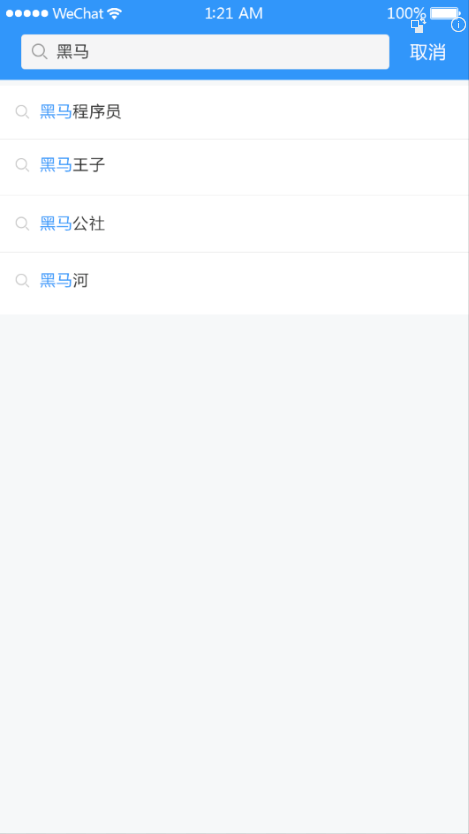
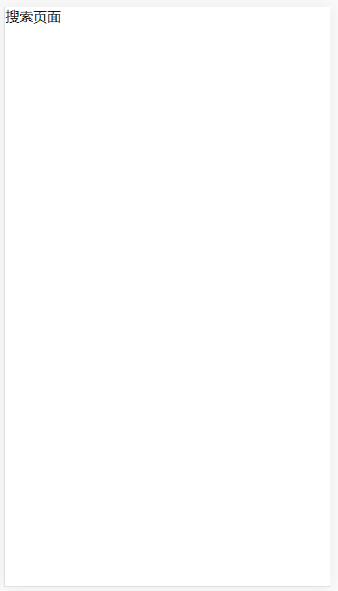
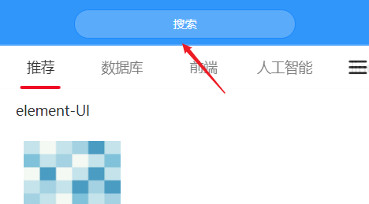
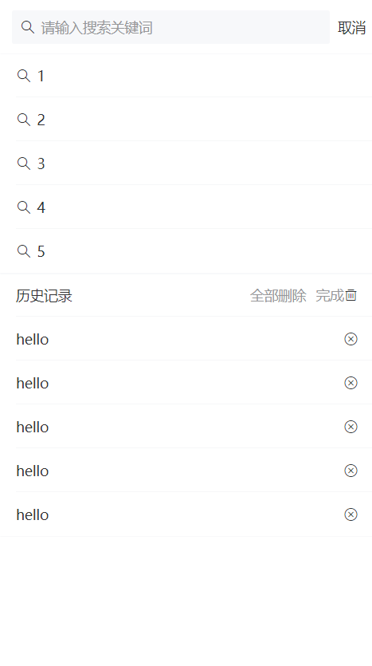
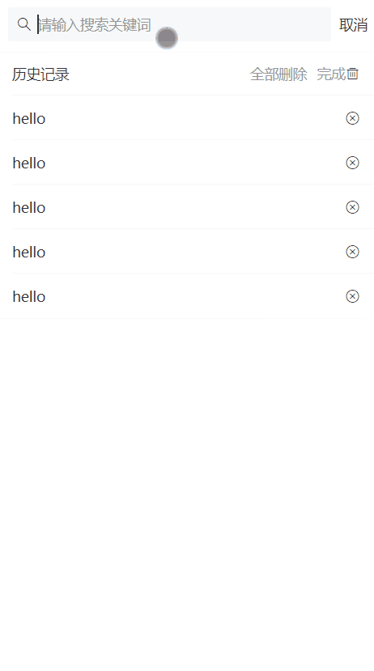
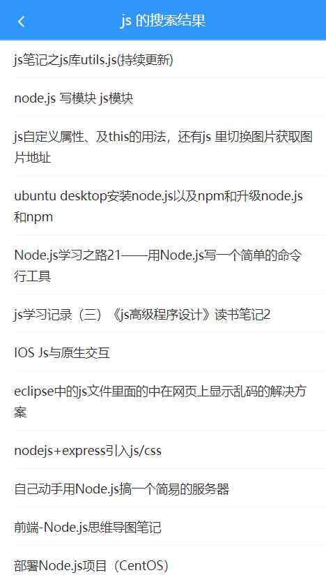

# 六、搜索




## 准备

### 创建组件并配置路由



1、创建 `views/search/index.vue` 并写入以下内容

```html
<template>
  <div class="search">搜索页面</div>
</template>

<script>
export default {
  name: 'SearchIndex'
}
</script>

```

2、然后在路由配置中新增

```js
import Vue from 'vue'
import VueRouter from 'vue-router'
import Login from '@/views/login'
import Tabbar from '@/views/tabbar'
import Home from '@/views/home'
import Search from '@/views/search'

Vue.use(VueRouter)

const router = new VueRouter({
  // 配置路由表
  routes: [
    {
      name: 'login',
      path: '/login',
      component: Login
    },
+    {
+      name: 'search',
+      path: '/search',
+      component: Search
+    },
    {
      path: '/',
      component: Tabbar,
      children: [
        {
          name: 'home',
          path: '', // 默认子路由
          component: Home
        }
      ]
    }
  ]
})

export default router

```

然后访问 `/search` 测试。

### 自定义首页中导航栏的搜索按钮



导航栏的标题默认只能渲染文字，如果想要渲染一些别的元素则可以使用组件的插槽的方式来自定义，查阅 Vant 的导航栏文档我们知道该组件支持自定义 title 插槽，所以这里我们可以通过自定义插槽的方式来渲染一个按钮到导航栏标题的位置：

```html
<template>
  <div class="home">
    <!-- 导航栏 -->
+    <van-nav-bar fixed>
+      <van-button
+        class="search-btn"
+        slot="title"
+        round
+        type="info"
+        size="small"
+        @click="$router.push('/search')"
+      >搜索</van-button>
+    </van-nav-bar>
    <!-- /导航栏 -->

    <!-- 频道列表 -->
    <!--
      v-model="active" 用来控制当前激活的频道索引
     -->
    <van-tabs v-model="active" animated swipeable>
      <!-- 面包菜单按钮 -->
      <div slot="nav-right" class="wap-nav" @click="isChannelShow = true">
        <van-icon name="wap-nav" size="24" />
      </div>
      <!-- /面包菜单按钮 -->
      <van-tab
        :title="channel.name"
        v-for="channel in channels"
        :key="channel.id"
      >
        <!-- 文章列表 -->
        <!--
          v-model="isLoading" 控制下拉刷线的 loading 状态
          @refresh 下拉刷新的时候会触发该事件
         -->
        <van-pull-refresh v-model="channel.isPullDownLoading" @refresh="onRefresh">
          <!--
            loading  控制上拉加载更多的 loading 效果
            finished 控制是否已加载结束
            finished-text 加载结束的提示文本
            @load="onLoad" 上拉加载更多触发的事件

            列表组件会在初始化的时候自动触发 load 事件调用 onLoad 方法
          -->
          <van-list
            v-model="channel.loading"
            :finished="channel.finished"
            finished-text="没有更多了"
            @load="onLoad"
          >
            <!-- 列表内容 -->
            <!--
              key 只能是数字或者字符串，不能是数组或对象
            -->
            <!-- <van-cell
              v-for="(article, index) in channel.articles"
              :key="index"
              :title="article.title"
            /> -->
            <van-cell
              v-for="(article, index) in channel.articles"
              :key="index"
              :title="article.title"
              >
              <div slot="label">
                <van-grid :border="false" :column-num="3">
                  <van-grid-item v-for="(img, index) in article.cover.images" :key="index">
                    <van-image lazy-load height="80" :src="img" />
                  </van-grid-item>
                </van-grid>
                <div class="article-info">
                  <div class="meta">
                    <span>{{ article.aut_name }}</span>
                    <span>{{ article.comm_count }}评论</span>
                    <span>{{ article.pubdate | relativeTime }}</span>
                  </div>
                </div>
              </div>
            </van-cell>
            <!-- /列表内容 -->
          </van-list>
        </van-pull-refresh>
        <!-- /文章列表 -->
      </van-tab>
    </van-tabs>
    <!-- /频道列表 -->

    <!-- 频道管理 -->
    <van-popup
      v-model="isChannelShow"
      round
      position="bottom"
      :style="{ height: '95%' }"
      closeable
      close-icon-position="top-left"
    >
      <div class="channel-container">
        <van-cell title="我的频道" :border="false">
          <van-button
            type="danger"
            size="mini"
            @click="isEditShow = !isEditShow"
          >{{ isEditShow ? '完成' : '编辑' }}</van-button>
        </van-cell>
        <van-grid :gutter="10">
          <van-grid-item text="推荐" @click="switchChannel(0)" />
          <van-grid-item
            v-for="(channel, index) in channels.slice(1)"
            :key="index"
            :text="channel.name"
            @click="onMyChannelClick(index)"
          >
            <van-icon v-show="isEditShow" class="close-icon" slot="icon" name="close" />
          </van-grid-item>
        </van-grid>

        <van-cell title="推荐频道" :border="false" />
        <van-grid :gutter="10">
          <van-grid-item
            v-for="(channel, index) in recommondChannels"
            :key="index"
            :text="channel.name"
            @click="onAddChannel(channel)"
          />
        </van-grid>
      </div>
    </van-popup>
    <!-- /频道管理 -->
  </div>
</template>

<script>
import { getDefaultChannels, getAllChannels } from '@/api/channel'
import { getArticles } from '@/api/article'
import { setItem, getItem } from '@/utils/storage'

export default {
  name: 'HomeIndex',
  data () {
    return {
      active: 0,
      // list: [],
      // loading: false,
      // finished: false,
      channels: [], // 我的频道列表
      isChannelShow: false, // 频道的显示状态
      allChannels: [], // 所有的频道列表
      isEditShow: false // 频道的编辑状态
    }
  },

  watch: {
    // 函数名就是要监视的数据成员名称
    channels (newVal) {
      setItem('channels', newVal)
    }
  },

  computed: {
    /**
     * 获取推荐频道列表
     */
    recommondChannels () {
      const arr = []
      // 遍历所有频道
      this.allChannels.forEach(channel => {
        // 判断 channel 是否存在我的频道中
        // 如果不存在，就证明它是剩余推荐的频道

        // 数组的 find 方法
        // 它会遍历数组，每遍历一次，它就判定 item.id === channel.id
        // 如果 true，则停止遍历，返回满足该条件的元素
        // 如果 false，则继续遍历
        // 如果直到遍历结束都没有找到符合 item.id === channel.id 条件的元素，则返回 undefined
        const ret = this.channels.find(item => item.id === channel.id)
        if (!ret) {
          arr.push(channel)
        }
      })

      return arr
      // return 所有频道 - 我的频道
    }
  },

  created () {
    // 获取我的频道
    this.loadChannels()

    // 获取所有频道
    this.loadAllChannels()
  },

  methods: {
    /**
     * 上拉加载更多
     */
    async onLoad () {
      // 获取当期激活的频道对象
      const activeChannel = this.channels[this.active]

      // 1. 请求获取数据
      const { data } = await getArticles({
        channel_id: activeChannel.id, // 频道ID
        // a: 3 b: 2
        // 4    3
        // 这里的这个时间戳就好比当前频道下一页的页码
        timestamp: activeChannel.timestamp || Date.now(), // 时间戳，请求新的推荐数据传当前的时间戳，请求历史推荐传指定的时间戳
        with_top: 1 // 是否包含置顶，进入页面第一次请求时要包含置顶文章，1-包含置顶，0-不包含
      })

      // 2. 将数据添加到当前频道.articles中
      // activeChannel.articles = activeChannel.articles.concat(data.data.results)
      activeChannel.articles.push(...data.data.results)

      // 3. 结束当前频道.loging = false
      activeChannel.loading = false

      // 4. 如果还有下一页数据
      if (data.data.pre_timestamp) {
        // 更新获取下一页数据的页码时间戳
        activeChannel.timestamp = data.data.pre_timestamp
      } else {
        // 如果没有下一页数据了，就意味着后面没有数据了
        activeChannel.finished = true
      }
    },

    /**
     * 加载我的频道列表
     */
    async loadChannels () {
      let channels = []

      // 读取本地存储中的频道列表
      const localChannels = getItem('channels')

      // 如果有本地存储的频道列表就使用本地存储的频道列表
      if (localChannels) {
        channels = localChannels
      } else {
        // 如果没有本地存储的频道列表，则请求获取后台推荐的频道列表
        const { data } = await getDefaultChannels()
        channels = data.data.channels
      }

      // 根据需要扩展自定义数据，用以满足我们的业务需求
      this.extendData(channels)
      // channels.forEach(channel => {
      //   channel.articles = [] // 存储频道的文章列表
      //   channel.finished = false // 存储频道的加载结束状态
      //   channel.loading = false // 存储频道的加载更多的 loading 状态
      //   channel.timestamp = null // 存储获取频道下一页的时间戳
      //   channel.isPullDownLoading = false // 存储频道的下拉刷新 loading 状态
      // })

      // 最后把数据更新到组件中
      this.channels = channels
    },

    /**
     * 下拉刷新
     */
    async onRefresh () {
      // 获取当期激活的频道对象
      const activeChannel = this.channels[this.active]

      // 1. 请求获取最新推荐的文章列表
      const { data } = await getArticles({
        channel_id: activeChannel.id,
        timestamp: Date.now(), // 下拉刷新永远都是在获取最新推荐的文章列表，所以传递当前最新时间戳
        with_top: 1
      })

      // 2. 将数据添加到文章列表顶部
      activeChannel.articles.unshift(...data.data.results)

      // 3. 关闭下拉刷新的 loading 状态
      activeChannel.isPullDownLoading = false

      // 4. 提示
      this.$toast('刷新成功')
    },

    /**
     * 获取所有频道列表
     */
    async loadAllChannels () {
      const { data } = await getAllChannels()
      const channels = data.data.channels
      this.extendData(channels)
      // channels.forEach(channel => {
      //   channel.articles = [] // 存储频道的文章列表
      //   channel.finished = false // 存储频道的加载结束状态
      //   channel.loading = false // 存储频道的加载更多的 loading 状态
      //   channel.timestamp = null // 存储获取频道下一页的时间戳
      //   channel.isPullDownLoading = false // 存储频道的下拉刷新 loading 状态
      // })
      this.allChannels = channels
    },

    /**
     * 添加频道
     */
    onAddChannel (channel) {
      // 将频道添加到我的频道中
      this.channels.push(channel)
    },

    /**
     * 我的频道项点击处理函数
     */
    onMyChannelClick (index) {
      if (this.isEditShow) {
        // 如果是编辑状态，删除频道
        this.channels.splice(index, 1)
      } else {
        // 如果是非编辑状态，切换频道展示

        // 切换当前激活的频道
        // this.active = index

        // 关闭频道弹层
        // this.isChannelShow = false

        this.switchChannel(index + 1)
      }
    },

    /**
     * 切换频道
     */
    switchChannel (index) {
      this.active = index
      this.isChannelShow = false
    },

    extendData (channels) {
      channels.forEach(channel => {
        channel.articles = [] // 存储频道的文章列表
        channel.finished = false // 存储频道的加载结束状态
        channel.loading = false // 存储频道的加载更多的 loading 状态
        channel.timestamp = null // 存储获取频道下一页的时间戳
        channel.isPullDownLoading = false // 存储频道的下拉刷新 loading 状态
      })
    }
  }
}
</script>

<!-- <style lang="less" scoped> -->
<style lang="less" scoped>
.home {
  .article-info {
    display: flex;
    align-items: center;
    justify-content: space-between;
    .meta span {
      margin-right: 10px;
    }
  }

+  .search-btn {
+    width: 100%;
+    background: #5babfb;
+  }

  /** 展示频道的菜单按钮 */
  .wap-nav {
    position: sticky;
    right: 0;
    display: flex;
    align-items: center;
    background-color: #fff;
    opacity: 0.8;
  }

  /* 标签组件的根节点的类名 */
  .van-tabs {
    /deep/ .van-tabs__wrap {
      position: fixed;
      top: 46px;
      z-index: 2;
      left: 0;
      right: 15px;
    }

    /deep/ .van-tabs__content {
      margin-top: 90px;
      margin-bottom: 50px;
    }
  }

  .channel-container {
    padding-top: 30px;
    .close-icon {
      position: absolute;
      top: -5px;
      right: -5px;
    }
  }
}
</style>

```

按钮的自定义样式如下：

```css
.search-btn {
  width: 100%;
  background: #5babfb;
}
```

### 页面布局



```html
<template>
  <div class="search">
    <!-- 搜索框 -->
+    <van-search
+      v-model="searchText"
+      placeholder="请输入搜索关键词"
+      show-action
+      shape="round"
+      @search="onSearch"
+    >
+      <div slot="action" @click="onSearch">搜索</div>
+    </van-search>
    <!-- /搜索框 -->

    <!-- 联想建议 -->
+    <van-cell-group>
+      <van-cell title="单元格" icon="search" />
+      <van-cell title="单元格" icon="search" />
+    </van-cell-group>
    <!-- /联想建议 -->
  </div>
</template>

<script>
export default {
  name: 'SearchIndex',
  data () {
    return {
+      searchText: ''
    }
  },

+  methods: {
+    onSearch () {
+      console.log('onSearch')
+    }
  }
}
</script>

<style>

</style>

```


## 搜索联想建议

步骤：

- 封装请求函数
- 当搜索输入变化的时候，请求加载联想建议的数据
- 将请求得到的结果绑定到模板中

1、封装数据接口，创建 `api/serach.js` 并写入

```js
/**
 * 搜索接口相关请求模块
 */
import request from '@/utils/request'

export function getSearchSuggestions (params) {
  return request({
    method: 'GET',
    url: '/app/v1_0/suggestion',
    params
  })
}

```


2、然后在 `search/index.vue` 中请求获取数据

```js
+ import { getSearchSuggestions } from '@/api/search'

export default {
  name: 'SearchIndex',
  data () {
    return {
      searchText: '',
+      searchSuggestions: [] // 联想建议列表
    }
  },

  methods: {
    onSearch () {
      console.log('onSearch')
    },

+    async onSearchInput () {
+      const searchText = this.searchText.trim()
+      if (!searchText) {
+        return
+      }
+      const { data } = await getSearchSuggestions({
+        q: this.searchText
+      })

+      this.searchSuggestions = data.data.options
+    }
  }
}
```

3、模板绑定

```html
<template>
  <div class="search">
    <!-- 搜索框 -->
    <van-search
      v-model="searchText"
      placeholder="请输入搜索关键词"
      show-action
      shape="round"
      @search="onSearch"
+      @input="onSearchInput"
    >
      <div slot="action" @click="onSearch">搜索</div>
    </van-search>
    <!-- /搜索框 -->

    <!-- 联想建议 -->
    <van-cell-group>
      <van-cell
+        :title="item"
        icon="search"
+        v-for="(item, index) in searchSuggestions"
+        :key="index"
      />
    </van-cell-group>
    <!-- /联想建议 -->
  </div>
</template>
```


## 搜索关键字高亮

```html
<template>
  <div class="search">
    <!-- 搜索框 -->
    <van-search
      v-model="searchText"
      placeholder="请输入搜索关键词"
      show-action
      shape="round"
      @search="onSearch"
      @input="onSearchInput"
    >
      <div slot="action" @click="onSearch">搜索</div>
    </van-search>
    <!-- /搜索框 -->

    <!-- 联想建议 -->
    <van-cell-group>
      <van-cell
        icon="search"
        v-for="(item, index) in searchSuggestions"
        :key="index"
      >
+        <div v-html="item" slot="title"></div>
      </van-cell>
    </van-cell-group>
    <!-- /联想建议 -->
  </div>
</template>

<script>
import { getSearchSuggestions } from '@/api/search'

export default {
  name: 'SearchIndex',
  data () {
    return {
      searchText: '',
      searchSuggestions: [] // 联想建议列表
    }
  },

  methods: {
    onSearch () {
      console.log('onSearch')
    },

    async onSearchInput () {
      const searchText = this.searchText.trim()
      if (!searchText) {
        return
      }

      const { data } = await getSearchSuggestions({
        q: this.searchText
      })

+      const searchSuggestions = data.data.options

      // 根据一个字符串创建一个正则表达式对象
+      const reg = new RegExp(searchText, 'g')

+      searchSuggestions.forEach((item, index) => {
+        searchSuggestions[index] = item.replace(reg, '<span style="color: red">'+ searchText +'</span>')
+      })

+      this.searchSuggestions = searchSuggestions
    }
  }
}
</script>

<style>

</style>

```


## 搜索结果

步骤：

- 注册搜索表单的提交事件处理函数
- 跳转到搜索结果页
  - 根据搜索关键字获取搜索结果
  - 展示到列表中





### 创建组件并配置路由

1、创建 `views/search-result/index.vue` 并写入以下内容：

```html
<template>
  <div class="serach-result">搜索结果</div>
</template>

<script>
export default {
  name: 'SearchResult'
}
</script>

<style>

</style>

```

2、然后在 `router/index.js` 中：

```js
import Vue from 'vue'
import VueRouter from 'vue-router'
import Login from '@/views/login'
import Tabbar from '@/views/tabbar'
import Home from '@/views/home'
import Search from '@/views/search'
import SearchResult from '@/views/search-result'

Vue.use(VueRouter)

const router = new VueRouter({
  // 配置路由表
  routes: [
    {
      name: 'login',
      path: '/login',
      component: Login
    },
    {
      name: 'search',
      path: '/search',
      component: Search
    },
+    {
+      name: 'search-result',
+      path: '/search/:q',
+      component: SearchResult
+    },
    {
      path: '/',
      component: Tabbar,
      children: [
        {
          name: 'home',
          path: '', // 默认子路由
          component: Home
        }
      ]
    }
  ]
})

export default router

```

最后访问 `/search/任意字符` 测试。

### 传递搜索参数

在 `views/search/index.vue` 中：

```html
<template>
  <div class="search">
    <!-- 搜索框 -->
    <van-search
      v-model="searchText"
      placeholder="请输入搜索关键词"
      show-action
      shape="round"
+      @search="onSearch(searchText)"
      @input="onSearchInput"
    >
+      <div slot="action" @click="onSearch(searchText)">搜索</div>
    </van-search>
    <!-- /搜索框 -->

    <!-- 联想建议 -->
    <van-cell-group>
      <van-cell
        icon="search"
        v-for="(item, index) in searchSuggestions"
        :key="index"
+        @click="onSearch(item)"
      >
        <!--
          这里不能使用过滤器
          因为过滤器只能用于 {{}}、v-bind
         -->
+        <div v-html="highlight(item)" slot="title"></div>
      </van-cell>
    </van-cell-group>
    <!-- /联想建议 -->
  </div>
</template>

<script>
import { getSearchSuggestions } from '@/api/search'

export default {
  name: 'SearchIndex',
  data () {
    return {
      searchText: '',
      searchSuggestions: [] // 联想建议列表
    }
  },

  methods: {
+    onSearch (str) {
+      this.$router.push('/search/' + str)
+    },

    async onSearchInput () {
      const searchText = this.searchText.trim()
      if (!searchText) {
        return
      }

      const { data } = await getSearchSuggestions({
        q: this.searchText
      })

      const searchSuggestions = data.data.options

      // 根据一个字符串创建一个正则表达式对象
-      // const reg = new RegExp(searchText, 'g')

-      // searchSuggestions.forEach((item, index) => {
-      //   searchSuggestions[index] = item.replace(reg, '<span style="color: red">'+ searchText +'</span>')
-      // })

      this.searchSuggestions = searchSuggestions
    },

+    highlight (str) {
      // 'AA'
      // 'a'、'a1'、'aaa'
+      const reg = new RegExp(this.searchText, 'g')
+      return str.replace(reg, '<span style="color: red">'+ this.searchText +'</span>')
+    }
  }
}
</script>

<style>

</style>

```


### 布局

```html
<template>
  <div class="serach-result">
    <!-- 导航栏 -->
    <van-nav-bar
      title="xxx 的搜索结果"
      left-arrow
      fixed
      @click-left="$router.back()"
    />
    <!-- /导航栏 -->

    <!-- 文章列表 -->
    <van-list
      class="article-list"
      v-model="loading"
      :finished="finished"
      finished-text="没有更多了"
      @load="onLoad"
    >
      <van-cell
        v-for="item in list"
        :key="item"
        :title="item"
      />
    </van-list>
    <!-- /文章列表 -->
  </div>
</template>

<script>
export default {
  name: 'SearchResult',
  data () {
    return {
      list: [],
      loading: false,
      finished: false
    }
  },

  methods: {
    onLoad () {
      // 异步更新数据
      setTimeout(() => {
        for (let i = 0; i < 10; i++) {
          this.list.push(this.list.length + 1)
        }
        // 加载状态结束
        this.loading = false

        // 数据全部加载完成
        if (this.list.length >= 40) {
          this.finished = true
        }
      }, 500)
    }
  }
}
</script>

<style lang="less" scoped>
.serach-result {
  .article-list {
    margin-top: 46px;
  }
}
</style>

```


### 展示搜索结果

步骤：

- 封装接口
- 发请求，获取结果
- 模板绑定

1、在 `api/serach.js` 封装请求方法

```js
/**
 * 搜索接口相关请求模块
 */
import request from '@/utils/request'

export function getSearchSuggestions (params) {
  return request({
    method: 'GET',
    url: '/app/v1_0/suggestion',
    params
  })
}

/**
 * 获取请求结果
 */
+ export function getSearch (params) {
+  return request({
+    method: 'GET',
+    url: '/app/v1_0/search',
+    params
+  })
+ }

```

2、然后在 `views/search-result/index.vue` 中

```js
+ import { getSearch } from '@/api/search'

export default {
  name: 'SearchResult',
  data () {
    return {
      list: [], // 数据列表
      loading: false, // 上拉加载更多的 loading
      finished: false, // 是否加载结束
+      page: 1,
+      perPage: 10
    }
  },

  methods: {
+    async onLoad () {
+      // 1. 请求获取数据
+      const { data } = await getSearch({
+        page: this.page, // 页数，不传默认为1
+        per_page: this.perPage, // 每页数量，不传每页数量由后端决定
+        q: this.$route.params.q // 搜索关键词
+      })

+      // 2. 将数据添加到数组中
+      this.list.push(...data.data.results)

+      // 3. 结束 loading
+      this.loading = false

+      // 4. 判断是否还有数据
+      if (data.data.results.length) {
+        // 如果有，更新页码
+        this.page++
+      } else {
+        // 如果没有，则将 finished 设置为 true
+        this.finished = true
+      }
+    }
    // onLoad () {
    //   // 异步更新数据
    //   setTimeout(() => {
    //     for (let i = 0; i < 10; i++) {
    //       this.list.push(this.list.length + 1)
    //     }
    //     // 加载状态结束
    //     this.loading = false

    //     // 数据全部加载完成
    //     if (this.list.length >= 40) {
    //       this.finished = true
    //     }
    //   }, 500)
    // }
  }
}
```

3、最后，模板绑定

```html
<template>
  <div class="serach-result">
    <!-- 导航栏 -->
    <van-nav-bar
+      :title="$route.params.q +  '的搜索结果'"
      left-arrow
      fixed
      @click-left="$router.back()"
    />
    <!-- /导航栏 -->

    <!-- 文章列表 -->
    <van-list
      class="article-list"
      v-model="loading"
      :finished="finished"
      finished-text="没有更多了"
      @load="onLoad"
    >
      <van-cell
+        v-for="(item, index) in list"
+        :key="index"
+        :title="item.title"
      />
    </van-list>
    <!-- /文章列表 -->
  </div>
</template>
```


## 搜索历史记录

### 布局

在 `views/serach/index.vue` 中新增：

```html
<template>
  <div class="search">
    <!-- 搜索框 -->
    <van-search
      v-model="searchText"
      placeholder="请输入搜索关键词"
      show-action
      shape="round"
      @search="onSearch(searchText)"
      @input="onSearchInput"
    >
      <div slot="action" @click="onSearch(searchText)">搜索</div>
    </van-search>
    <!-- /搜索框 -->

    <!-- 联想建议 -->
    <van-cell-group>
      <van-cell
        icon="search"
        v-for="(item, index) in searchSuggestions"
        :key="index"
        @click="onSearch(item)"
      >
        <!--
          这里不能使用过滤器
          因为过滤器只能用于 {{}}、v-bind
         -->
        <div v-html="highlight(item)" slot="title"></div>
      </van-cell>
    </van-cell-group>
    <!-- /联想建议 -->

    + <!-- 搜索历史记录 -->
    + <van-cell-group>
    +   <van-cell title="历史记录">
    +     <span>全部删除</span>&nbsp;&nbsp;
    +     <span>完成</span>
    +     <van-icon name="delete" />
    +   </van-cell>
    +   <van-cell title="单元格">
    +     <van-icon name="close" />
    +   </van-cell>
    +   <van-cell title="单元格">
    +     <van-icon name="close" />
    +   </van-cell>
    + </van-cell-group>
    + <!-- /搜索历史记录 -->
  </div>
</template>
```


### 保存搜索历史记录

```js
import { getSearchSuggestions } from '@/api/search'
+ import { getItem, setItem } from '@/utils/storage'

export default {
  name: 'SearchIndex',
  data () {
    return {
      searchText: '',
      searchSuggestions: [], // 联想建议列表
+      searchHistories: getItem('search-histories') || [] // 搜索历史记录
    }
  },

  methods: {
    onSearch (str) {
      // 存储搜索历史记录
      // 如果搜索历史记录中已存在，则直接移除
+      const index = this.searchHistories.indexOf(str)
+      if (index !== -1) {
+        this.searchHistories.splice(index, 1)
+      }
+      this.searchHistories.unshift(str)
      // 把最新的记录存储到数组的顶部

      // 持久化存储
+      setItem('search-histories', this.searchHistories)

      // 跳转到搜索结果页面
      this.$router.push('/search/' + str)
    },

    async onSearchInput () {
      const searchText = this.searchText.trim()
      if (!searchText) {
        return
      }

      const { data } = await getSearchSuggestions({
        q: this.searchText
      })

      const searchSuggestions = data.data.options

      // 根据一个字符串创建一个正则表达式对象
      // const reg = new RegExp(searchText, 'g')

      // searchSuggestions.forEach((item, index) => {
      //   searchSuggestions[index] = item.replace(reg, '<span style="color: red">'+ searchText +'</span>')
      // })

      this.searchSuggestions = searchSuggestions
    },

    highlight (str) {
      // 'AA'
      // 'a'、'a1'、'aaa'
      const reg = new RegExp(this.searchText, 'g')
      return str.replace(reg, '<span style="color: red">' + this.searchText + '</span>')
    }
  }
}
```

### 展示历史记录

```html
<template>
  <div class="search">
    <!-- 搜索框 -->
    <van-search
      v-model="searchText"
      placeholder="请输入搜索关键词"
      show-action
      shape="round"
      @search="onSearch(searchText)"
      @input="onSearchInput"
    >
      <div slot="action" @click="onSearch(searchText)">搜索</div>
    </van-search>
    <!-- /搜索框 -->

    <!-- 联想建议 -->
    <van-cell-group>
      <van-cell
        icon="search"
        v-for="(item, index) in searchSuggestions"
        :key="index"
        @click="onSearch(item)"
      >
        <!--
          这里不能使用过滤器
          因为过滤器只能用于 {{}}、v-bind
         -->
        <div v-html="highlight(item)" slot="title"></div>
      </van-cell>
    </van-cell-group>
    <!-- /联想建议 -->

    <!-- 搜索历史记录 -->
    <van-cell-group>
      <van-cell title="历史记录">
        <span>全部删除</span>&nbsp;&nbsp;
        <span>完成</span>
        <van-icon name="delete" />
      </van-cell>
+      <van-cell :title="item" v-for="item in searchHistories" :key="item">
+        <van-icon name="close" />
+      </van-cell>
    </van-cell-group>
    <!-- /搜索历史记录 -->
  </div>
</template>
```

### 点击历史记录跳转到搜索结果页

```html
<template>
  <div class="search">
    <!-- 搜索框 -->
    <van-search
      v-model="searchText"
      placeholder="请输入搜索关键词"
      show-action
      shape="round"
      @search="onSearch(searchText)"
      @input="onSearchInput"
    >
      <div slot="action" @click="onSearch(searchText)">搜索</div>
    </van-search>
    <!-- /搜索框 -->

    <!-- 联想建议 -->
    <van-cell-group>
      <van-cell
        icon="search"
        v-for="(item, index) in searchSuggestions"
        :key="index"
        @click="onSearch(item)"
      >
        <!--
          这里不能使用过滤器
          因为过滤器只能用于 {{}}、v-bind
         -->
        <div v-html="highlight(item)" slot="title"></div>
      </van-cell>
    </van-cell-group>
    <!-- /联想建议 -->

    <!-- 搜索历史记录 -->
    <van-cell-group>
      <van-cell title="历史记录">
        <span>全部删除</span>&nbsp;&nbsp;
        <span>完成</span>
        <van-icon name="delete" />
      </van-cell>
      <van-cell
        :title="item"
        v-for="item in searchHistories"
        :key="item"
+        @click="onSearch(item)"
      >
        <van-icon name="close" />
      </van-cell>
    </van-cell-group>
    <!-- /搜索历史记录 -->
  </div>
</template>
```


### 处理删除操作相关元素的显示状态

```html
<template>
  <div class="search">
    <!-- 搜索框 -->
    <van-search
      v-model="searchText"
      placeholder="请输入搜索关键词"
      show-action
      shape="round"
      @search="onSearch(searchText)"
      @input="onSearchInput"
    >
      <div slot="action" @click="onSearch(searchText)">搜索</div>
    </van-search>
    <!-- /搜索框 -->

    <!-- 联想建议 -->
    <van-cell-group>
      <van-cell
        icon="search"
        v-for="(item, index) in searchSuggestions"
        :key="index"
        @click="onSearch(item)"
      >
        <!--
          这里不能使用过滤器
          因为过滤器只能用于 {{}}、v-bind
         -->
        <div v-html="highlight(item)" slot="title"></div>
      </van-cell>
    </van-cell-group>
    <!-- /联想建议 -->

    <!-- 搜索历史记录 -->
    <van-cell-group>
      <van-cell title="历史记录">
+        <template v-if="isDeleteShow">
+          <span>全部删除</span>&nbsp;&nbsp;
+          <span @click="isDeleteShow = false">完成</span>
+        </template>
+        <van-icon v-else name="delete" @click="isDeleteShow = true" />
      </van-cell>
      <van-cell
        :title="item"
        v-for="item in searchHistories"
        :key="item"
        @click="onSearch(item)"
      >
+        <van-icon name="close" v-show="isDeleteShow" />
      </van-cell>
    </van-cell-group>
    <!-- /搜索历史记录 -->
  </div>
</template>

<script>
import { getSearchSuggestions } from '@/api/search'
import { getItem, setItem } from '@/utils/storage'

export default {
  name: 'SearchIndex',
  data () {
    return {
      searchText: '',
      searchSuggestions: [], // 联想建议列表
      searchHistories: getItem('search-histories') || [], // 搜索历史记录
+      isDeleteShow: false // 控制删除的显示状态
    }
  },

  methods: {
    onSearch (str) {
      // 存储搜索历史记录
      // 如果搜索历史记录中已存在，则直接移除
      const index = this.searchHistories.indexOf(str)
      if (index !== -1) {
        this.searchHistories.splice(index, 1)
      }
      this.searchHistories.unshift(str)
      // 把最新的记录存储到数组的顶部

      // 持久化存储
      setItem('search-histories', this.searchHistories)

      // 跳转到搜索结果页面
      this.$router.push('/search/' + str)
    },

    async onSearchInput () {
      const searchText = this.searchText.trim()
      if (!searchText) {
        return
      }

      const { data } = await getSearchSuggestions({
        q: this.searchText
      })

      const searchSuggestions = data.data.options

      // 根据一个字符串创建一个正则表达式对象
      // const reg = new RegExp(searchText, 'g')

      // searchSuggestions.forEach((item, index) => {
      //   searchSuggestions[index] = item.replace(reg, '<span style="color: red">'+ searchText +'</span>')
      // })

      this.searchSuggestions = searchSuggestions
    },

    highlight (str) {
      // 'AA'
      // 'a'、'a1'、'aaa'
      const reg = new RegExp(this.searchText, 'g')
      return str.replace(reg, '<span style="color: red">' + this.searchText + '</span>')
    }
  }
}
</script>

<style>

</style>

```

### 删除历史记录

两个功能：

- 删除单个
- 删除所有

```html
<template>
  <div class="search">
    <!-- 搜索框 -->
    <van-search
      v-model="searchText"
      placeholder="请输入搜索关键词"
      show-action
      shape="round"
      @search="onSearch(searchText)"
      @input="onSearchInput"
    >
      <div slot="action" @click="onSearch(searchText)">搜索</div>
    </van-search>
    <!-- /搜索框 -->

    <!-- 联想建议 -->
    <van-cell-group>
      <van-cell
        icon="search"
        v-for="(item, index) in searchSuggestions"
        :key="index"
        @click="onSearch(item)"
      >
        <!--
          这里不能使用过滤器
          因为过滤器只能用于 {{}}、v-bind
         -->
        <div v-html="highlight(item)" slot="title"></div>
      </van-cell>
    </van-cell-group>
    <!-- /联想建议 -->

    <!-- 搜索历史记录 -->
    <van-cell-group>
      <van-cell title="历史记录">
        <template v-if="isDeleteShow">
+          <span @click="searchHistories = []">全部删除</span>&nbsp;&nbsp;
          <span @click="isDeleteShow = false">完成</span>
        </template>
        <van-icon
          v-else
          name="delete"
          @click="isDeleteShow = true"
        />
      </van-cell>
      <van-cell
        :title="item"
        v-for="(item, index) in searchHistories"
        :key="item"
        @click="onSearch(item)"
      >
        <van-icon
          name="close"
          v-show="isDeleteShow"
+          @click.stop="searchHistories.splice(index, 1)"
        />
      </van-cell>
    </van-cell-group>
    <!-- /搜索历史记录 -->
  </div>
</template>

<script>
import { getSearchSuggestions } from '@/api/search'
import { getItem, setItem } from '@/utils/storage'

export default {
  name: 'SearchIndex',
  data () {
    return {
      searchText: '',
      searchSuggestions: [], // 联想建议列表
      searchHistories: getItem('search-histories') || [], // 搜索历史记录
      isDeleteShow: false
    }
  },

+  watch: {
+    searchHistories (newVal) {
+      setItem('search-histories', newVal)
+    }
+  },

  methods: {
    onSearch (str) {
      // 存储搜索历史记录
      // 如果搜索历史记录中已存在，则直接移除
      const index = this.searchHistories.indexOf(str)
      if (index !== -1) {
        this.searchHistories.splice(index, 1)
      }
      this.searchHistories.unshift(str)
      // 把最新的记录存储到数组的顶部

      // 持久化存储
      // 这里必须手动调用持久化存储数据，因为没来得及执行 watch，当前页面就跳转了
      setItem('search-histories', this.searchHistories)

      // 跳转到搜索结果页面
      this.$router.push('/search/' + str)
    },

    async onSearchInput () {
      const searchText = this.searchText.trim()
      if (!searchText) {
        return
      }

      const { data } = await getSearchSuggestions({
        q: this.searchText
      })

      const searchSuggestions = data.data.options

      // 根据一个字符串创建一个正则表达式对象
      // const reg = new RegExp(searchText, 'g')

      // searchSuggestions.forEach((item, index) => {
      //   searchSuggestions[index] = item.replace(reg, '<span style="color: red">'+ searchText +'</span>')
      // })

      this.searchSuggestions = searchSuggestions
    },

    highlight (str) {
      // 'AA'
      // 'a'、'a1'、'aaa'
      const reg = new RegExp(this.searchText, 'g')
      return str.replace(reg, '<span style="color: red">' + this.searchText + '</span>')
    }
  }
}
</script>

<style>

</style>

```


### 处理联想建议和历史记录的切换显示

```html
<template>
  <div class="search">
    <!-- 搜索框 -->
    <van-search
      v-model="searchText"
      placeholder="请输入搜索关键词"
      show-action
      shape="round"
      @search="onSearch(searchText)"
      @input="onSearchInput"
    >
      <div slot="action" @click="onSearch(searchText)">搜索</div>
    </van-search>
    <!-- /搜索框 -->

    <!-- 联想建议 -->
+    <van-cell-group v-if="searchText">
      <van-cell
        icon="search"
        v-for="(item, index) in searchSuggestions"
        :key="index"
        @click="onSearch(item)"
      >
        <!--
          这里不能使用过滤器
          因为过滤器只能用于 {{}}、v-bind
         -->
        <div v-html="highlight(item)" slot="title"></div>
      </van-cell>
    </van-cell-group>
    <!-- /联想建议 -->

    <!-- 搜索历史记录 -->
+    <van-cell-group v-else>
      <van-cell title="历史记录">
        <template v-if="isDeleteShow">
          <span @click="searchHistories = []">全部删除</span>&nbsp;&nbsp;
          <span @click="isDeleteShow = false">完成</span>
        </template>
        <van-icon
          v-else
          name="delete"
          @click="isDeleteShow = true"
        />
      </van-cell>
      <van-cell
        :title="item"
        v-for="(item, index) in searchHistories"
        :key="item"
        @click="onSearch(item)"
      >
        <van-icon
          name="close"
          v-show="isDeleteShow"
          @click.stop="searchHistories.splice(index, 1)"
        />
      </van-cell>
    </van-cell-group>
    <!-- /搜索历史记录 -->
  </div>
</template>

<script>
import { getSearchSuggestions } from '@/api/search'
import { getItem, setItem } from '@/utils/storage'

export default {
  name: 'SearchIndex',
  data () {
    return {
      searchText: '',
      searchSuggestions: [], // 联想建议列表
      searchHistories: getItem('search-histories') || [], // 搜索历史记录
      isDeleteShow: false
    }
  },

  watch: {
    searchHistories (newVal) {
      setItem('search-histories', newVal)
    }
  },

  methods: {
    onSearch (str) {
      // 存储搜索历史记录
      // 如果搜索历史记录中已存在，则直接移除
      const index = this.searchHistories.indexOf(str)
      if (index !== -1) {
        this.searchHistories.splice(index, 1)
      }
      this.searchHistories.unshift(str)
      // 把最新的记录存储到数组的顶部

      // 持久化存储
      // 这里必须手动调用持久化存储数据，因为没来得及执行 watch，当前页面就跳转了
      setItem('search-histories', this.searchHistories)

      // 跳转到搜索结果页面
      this.$router.push('/search/' + str)
    },

    async onSearchInput () {
      const searchText = this.searchText.trim()
      if (!searchText) {
        return
      }

      const { data } = await getSearchSuggestions({
        q: this.searchText
      })

      const searchSuggestions = data.data.options

      // 根据一个字符串创建一个正则表达式对象
      // const reg = new RegExp(searchText, 'g')

      // searchSuggestions.forEach((item, index) => {
      //   searchSuggestions[index] = item.replace(reg, '<span style="color: red">'+ searchText +'</span>')
      // })

      this.searchSuggestions = searchSuggestions
    },

    highlight (str) {
      // 'AA'
      // 'a'、'a1'、'aaa'
      const reg = new RegExp(this.searchText, 'g')
      return str.replace(reg, '<span style="color: red">' + this.searchText + '</span>')
    }
  }
}
</script>

<style>

</style>

```


## 函数防抖和函数节流

> 推荐资料：
>
> - https://zhuanlan.zhihu.com/p/38313717

干嘛的？限制函数调用的频率。

为什么要限制？例如搜索的时候请求联想建议，没必要每次内容改变就发请求，当用户输入的很快的时候，中间的请求都是无意义的，浪费资源，没必要。

### 函数防抖（Debounce）

**概念：** `在事件被触发n秒后再执行，如果在这n秒内又被触发，则重新计时。`

**生活中的实例：** `如果有人进电梯（触发事件），那电梯将在10秒钟后出发（执行事件监听器），这时如果又有人进电梯了（在10秒内再次触发该事件），我们又得等10秒再出发（重新计时）。`

我们先使用第三方包 [lodash]() 来体验什么是函数防抖：

首先把 lodash 安装到项目中：

```bash
# yarn add lodash
npm i lodash
```

示例：

```html
<!DOCTYPE html>
<html lang="en">
<head>
  <meta charset="UTF-8">
  <meta name="viewport" content="width=device-width, initial-scale=1.0">
  <meta http-equiv="X-UA-Compatible" content="ie=edge">
  <title>Document</title>
</head>
<body>
  <script src="./node_modules/lodash/lodash.js"></script>
  <script>
    // lodash 会在全局提供一个成员：_

    // _ 对象中有很多方法，其中有一个方法专门用于处理函数防抖
    // 方法名：debounce
    // 作用：函数防抖
    // 使用方式：

    function fn (foo) {
      console.log('hello', foo)
    }

    // 正常的函数调用：立即调用，而且是一定会调用
    // fn()
    // fn()
    // fn()

    // 我们可以使用函数防抖把一个正常的函数变得不正常
    // 两个参数：
    //   参数1：函数
    //   参数2：时间，单位是毫秒
    // 返回值：函数
    //   返回值函数的功能和 fn 和的功能是一样
    //   唯一的区别就是经过了防抖处理
    const newFn = _.debounce(fn, 1000)

    // 计时 1s
    newFn('a')

    // 当你不到 1s 的时候，再次调用
    // 先把之前的废掉，重新计时 1s
    newFn('b')

    newFn('b')
    newFn('b')
    // newFn()

    // he
  </script>
</body>
</html>

```

然后在我们的应用中将原来的搜索联想建议进行函数防抖优化：

```html
<template>
  <div class="search">
    <!-- 搜索框 -->
    <van-search
      v-model="searchText"
      placeholder="请输入搜索关键词"
      show-action
      shape="round"
      @search="onSearch(searchText)"
      @input="onSearchInput"
    >
      <div slot="action" @click="onSearch(searchText)">搜索</div>
    </van-search>
    <!-- /搜索框 -->

    <!-- 联想建议 -->
    <van-cell-group v-if="searchText">
      <van-cell
        icon="search"
        v-for="(item, index) in searchSuggestions"
        :key="index"
        @click="onSearch(item)"
      >
        <!--
          这里不能使用过滤器
          因为过滤器只能用于 {{}}、v-bind
         -->
        <div v-html="highlight(item)" slot="title"></div>
      </van-cell>
    </van-cell-group>
    <!-- /联想建议 -->

    <!-- 搜索历史记录 -->
    <van-cell-group v-else>
      <van-cell title="历史记录">
        <template v-if="isDeleteShow">
          <span @click="searchHistories = []">全部删除</span>&nbsp;&nbsp;
          <span @click="isDeleteShow = false">完成</span>
        </template>
        <van-icon
          v-else
          name="delete"
          @click="isDeleteShow = true"
        />
      </van-cell>
      <van-cell
        :title="item"
        v-for="(item, index) in searchHistories"
        :key="item"
        @click="onSearch(item)"
      >
        <van-icon
          name="close"
          v-show="isDeleteShow"
          @click.stop="searchHistories.splice(index, 1)"
        />
      </van-cell>
    </van-cell-group>
    <!-- /搜索历史记录 -->
  </div>
</template>

<script>
import { getSearchSuggestions } from '@/api/search'
import { getItem, setItem } from '@/utils/storage'
+ import { debounce } from 'lodash'

export default {
  name: 'SearchIndex',
  data () {
    return {
      searchText: '',
      searchSuggestions: [], // 联想建议列表
      searchHistories: getItem('search-histories') || [], // 搜索历史记录
      isDeleteShow: false
    }
  },

  watch: {
    searchHistories (newVal) {
      setItem('search-histories', newVal)
    }
  },

  methods: {
    onSearch (str) {
      // 存储搜索历史记录
      // 如果搜索历史记录中已存在，则直接移除
      const index = this.searchHistories.indexOf(str)
      if (index !== -1) {
        this.searchHistories.splice(index, 1)
      }
      this.searchHistories.unshift(str)
      // 把最新的记录存储到数组的顶部

      // 持久化存储
      // 这里必须手动调用持久化存储数据，因为没来得及执行 watch，当前页面就跳转了
      setItem('search-histories', this.searchHistories)

      // 跳转到搜索结果页面
      this.$router.push('/search/' + str)
    },

-    // async onSearchInput () {
+    onSearchInput: debounce(async function () {
      const searchText = this.searchText.trim()
      if (!searchText) {
        return
      }

      const { data } = await getSearchSuggestions({
        q: this.searchText
      })

      const searchSuggestions = data.data.options

      // 根据一个字符串创建一个正则表达式对象
      // const reg = new RegExp(searchText, 'g')

      // searchSuggestions.forEach((item, index) => {
      //   searchSuggestions[index] = item.replace(reg, '<span style="color: red">'+ searchText +'</span>')
      // })

      this.searchSuggestions = searchSuggestions
+    }, 300),

    highlight (str) {
      // 'AA'
      // 'a'、'a1'、'aaa'
      const reg = new RegExp(this.searchText, 'g')
      return str.replace(reg, '<span style="color: red">' + this.searchText + '</span>')
    }
  }
}
</script>

<style>

</style>

```

函数防抖的实现原理：

```js
function fn (foo) {
  console.log('hello', foo)
}

const newFn = debounce(fn, 1000)

// 计时 1s
newFn(123)

// 如果在 1s 之内重新调用
//   先把之前的废除
//   重新计时
newFn('world')
// newFn()


function debounce (callback, time) {
  let timer = null
  // 函数参数中的 ... 表示接收剩余参数
  // 它会把所有的参数收集到一个数组中
  return function (...args) {
    console.log(args)
    window.clearTimeout(timer)
    timer = setTimeout(() => {
      // 这里的 ... 表示数组展示操作符
      // args[0], args[1], args[2] .........
      callback(...args)
    }, time)
  }
}
```

### 函数节流（Throttle）

**概念：** `规定一个单位时间，在这个单位时间内，只能有一次触发事件的回调函数执行，如果在同一个单位时间内某事件被触发多次，只有一次能生效。`

生活中的例子：`函数节流就是开枪游戏的射速，就算一直按着鼠标射击，也只会在规定射速内射出子弹。`


我们先用 lodash 来体验节流的使用方式：

```js
function fn () {
  console.log('------ fire ------')
}


// 参数1：函数
// 参数2：间隔时间
// 返回值：函数（它的功能和保证的 fn 的功能是一样的，但是被进行了节流处理）
// 第1次直接调用，之后的按照一定频率进行调用
  const newFn = _.throttle(fn, 2000)

// newFn()
// newFn()

setInterval(() => {
  console.log('鼠标点击')
  newFn()
}, 200)

// 一上来就调用一次
// newFn()

// // 之后的调用，开始计时 1s
// newFn()

// // 1s 之内所有的调用只有1次
// newFn()
// newFn()
// newFn()
// newFn()
// newFn()
```


完了，我们再来研究它的原理实现。

```js
function throttle(callback, interval) {
  // 最后一次的调用时间
  let lastTime = 0
  
  // 定时器
  let timer = null
  
  // 返回一个函数
  return function () {
    // 清除定时器
    clearTimeout(timer)

    // 当前最新时间
    let nowTime = Date.now()

    // 如果当前最新时间 - 上一次时间 >= 时间间隔
    // 或者没有上一次时间，那就立即调用
    if (nowTime - lastTime >= interval) {
      callback()

      // 记录最后一次的调用时间
      // 1
      lastTime = nowTime
    } else {
      timer = setTimeout(() => {
        callback()
      }, interval)
    }
  }
}

const fn = throttle(函数, 1000)

// 
fn()

fn()

fn()

```


### 总结

- 函数防抖和函数节流都是防止某一时间频繁触发，但是这两兄弟之间的原理却不一样。
  - search搜索联想，用户在不断输入值时，用防抖来节约请求资源。
  - window触发resize的时候，不断的调整浏览器窗口大小会不断的触发这个事件，用防抖来让其只触发一次
- 函数防抖是某一段时间内只执行一次，而函数节流是间隔时间执行。
  - 鼠标不断点击触发，mousedown(单位时间内只触发一次)
  - 监听滚动事件，比如是否滑到底部自动加载更多，用throttle来判断


## lodash 函数库

lodash 是一个常用工具函数库，它里面封装了好多常用的工具函数：

- 官方文档： https://www.lodashjs.com/ 
- https://segmentfault.com/a/1190000008738183
- http://huzerui.com/blog/2017/01/22/lodash-useful-function/


