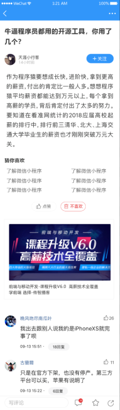

# 七、文章详情（上）



## 创建组件并配置路由

- 创建组件文件
- 配置路由
- 页面布局
- 功能编写


1、创建 `views/article/index.vue` 并写入以下内容

```html
<template>
  <div class="article-container">
    <!-- 导航栏 -->
    <van-nav-bar
      fixed
      left-arrow
      @click-left="$router.back()"
      title="文章详情"
    ></van-nav-bar>
    <!-- /导航栏 -->

    <!-- 加载中 loading -->
    <van-loading class="article-loading" />
    <!-- /加载中 loading -->

    <!-- 文章详情 -->
    <div class="detail">
      <h3 class="title">{{article.title}}</h3>
      <div class="author">
        <van-image round width="2rem" height="2rem" fit="fill" :src="article.aut_photo" />
        <div class="text">
          <p class="name">{{article.aut_name}}</p>
          <p class="time">{{article.pubdate}}</p>
        </div>
        <van-button
          round
          size="small"
          type="info"
        >+ 关注</van-button>
      </div>
      <div class="content" v-html="article.content"></div>
      <div class="zan">
        <van-button round size="small" hairline type="primary" plain icon="good-job-o">点赞</van-button>
        &nbsp;&nbsp;&nbsp;&nbsp;
        <van-button round size="small" hairline type="danger" plain icon="delete">不喜欢</van-button>
      </div>
    </div>
    <!-- /文章详情 -->

    <!-- 加载失败的消息提示 -->
    <div class="error">
      <p>网络超时，点击 <a href="#" @click.prevent="loadArticle">刷新</a> 试一试。</p>
    </div>
    <!-- /加载失败的消息提示 -->
  </div>
</template>

<script>
export default {
  name: 'ArticleIndex',
  data () {
    return {
      loading: true, // 控制加载中的 loading 状态
      article: { // 文章详情
        title: 'hello world',
        content: '<p>hello hello</p>',
        aut_name: 'LPZ',
        pubdate: '4天前',
        aut_photo: 'http://toutiao.meiduo.site/FsyeQUotMscq-vji-2ZDiXrc44k5'
      }
    }
  }
}
</script>

<style scoped lang='less'>
.article-container{
  position: absolute;
  left: 0;
  top: 0;
  overflow-y: scroll;
  width: 100%;
  height: 100%;
}
.article-loading {
  padding-top: 100px;
  text-align: center;
}
.error{
  padding-top: 100px;
  text-align: center;
}
.detail {
  padding: 50px 10px;
  .title {
    font-size: 16px;
  }
  .zan{
    text-align: center;
  }
  .author {
    padding: 10px 0;
    display: flex;
    .text {
      flex: 1;
      padding-left: 10px;
      line-height: 1.3;
      .name {
        font-size: 14px;
        margin: 0;
      }
      .time {
        margin: 0;
        font-size: 12px;
        color: #999;
      }
    }
  }
  .content {
    overflow: hidden;
    white-space: pre-wrap;
    word-break: break-all;
    /deep/ img{
      max-width:100%;
      background: #f9f9f9;
    }
  }
}
</style>

```

2、然后在 `router/index.js` 中新增路由配置项

```js
import Vue from 'vue'
import VueRouter from 'vue-router'
import Login from '@/views/login'
import Tabbar from '@/views/tabbar'
import Home from '@/views/home'
import Search from '@/views/search'
import SearchResult from '@/views/search-result'
import Article from '@/views/article'

Vue.use(VueRouter)

const router = new VueRouter({
  // 配置路由表
  routes: [
    {
      name: 'login',
      path: '/login',
      component: Login
    },
    {
      name: 'search',
      path: '/search',
      component: Search
    },
    {
      name: 'search-result',
      path: '/search/:q',
      component: SearchResult
    },
+    {
+      name: 'article',
+      path: '/article/:articleId',
+      component: Article
+    },
    {
      path: '/',
      component: Tabbar,
      children: [
        {
          name: 'home',
          path: '', // 默认子路由
          component: Home
        }
      ]
    }
  ]
})

export default router

```

然后在点击文章列表项的时候，传递文章id跳转到文章详情页：

```html
<van-cell
  v-for="article in channel.articles"
  :key="article.art_id.toString()"
  :title="article.title"
+ @click="$router.push({
+   name: 'article',
+   params: {
+     articleId: article.art_id.toString()
+   }
+ })"
>
</van-cell>
```


## 展示基本信息

这里我们主要实现两个主要功能：

- 获取展示文章详情
- 处理加载中 loading


**一、获取展示文章详情**

步骤：

- 封装接口
- 发送请求获取数据
- 模板绑定

下面是具体实现：

1、在 `api/article.js` 中新增

```js
/**
 * 文章接口相关请求模块
 */
import request from '@/utils/request'

/**
 * 获取文章列表
 */
export function getArticles (params) {
  return request({
    method: 'GET',
    url: '/app/v1_1/articles',
    params
  })
}

/**
 * 获取文章详情
 */
+ export function getArticle (articleId) {
+  return request({
+    method: 'GET',
+    url: '/app/v1_0/articles/' + articleId
+  })
+ }

```

2、在组件中调用获取文章详情

```js
+ import { getArticle } from '@/api/article'

export default {
  name: 'ArticleIndex',
  data () {
    return {
      loading: true, // 控制加载中的 loading 状态
      article: {} // 文章详情
    }
  },

+  created () {
+    this.loadArticle()
+  },

+  methods: {
+    async loadArticle () {
+      const { data } = await getArticle(this.$route.params.articleId)
+      this.article = data.data
+    }
  }
}
```

3、模板绑定

```html
<template>
  <div class="article-container">
    <!-- 导航栏 -->
    <van-nav-bar
      fixed
      left-arrow
      @click-left="$router.back()"
      title="文章详情"
    ></van-nav-bar>
    <!-- /导航栏 -->

    <!-- 加载中 loading -->
    <van-loading class="article-loading" />
    <!-- /加载中 loading -->

    <!-- 文章详情 -->
    <div class="detail">
+      <h3 class="title">{{ article.title }}</h3>
      <div class="author">
        <van-image round width="2rem" height="2rem" fit="fill" :src="article.aut_photo" />
        <div class="text">
+          <p class="name">{{ article.aut_name }}</p>
+          <p class="time">{{ article.pubdate | relativeTime }}</p>
        </div>
        <van-button
          round
          size="small"
          type="info"
        >+ 关注</van-button>
      </div>
+      <div class="content" v-html="article.content"></div>
      <div class="zan">
        <van-button round size="small" hairline type="primary" plain icon="good-job-o">点赞</van-button>
        &nbsp;&nbsp;&nbsp;&nbsp;
        <van-button round size="small" hairline type="danger" plain icon="delete">不喜欢</van-button>
      </div>
    </div>
    <!-- /文章详情 -->

    <!-- 加载失败的消息提示 -->
    <div class="error">
      <p>网络超时，点击 <a href="#" @click.prevent="loadArticle">刷新</a> 试一试。</p>
    </div>
    <!-- /加载失败的消息提示 -->
  </div>
</template>
```


**二、处理加载中 loading**

需求：

- 加载中，显示 loading
- 加载成功，显示文章详情
- 加载失败，显示错误提示


步骤：

- 添加 loading 数据用来控制 loading 展示
- 在请求获取数据处理函数中处理 loading
  - 请求开始，loading = true
  - 请求结束，loading = false
- 在模板中绑定处理


下面是具体实现过程：

```html
<template>
  <div class="article-container">
    <!-- 导航栏 -->
    <van-nav-bar
      fixed
      left-arrow
      @click-left="$router.back()"
      title="文章详情"
    ></van-nav-bar>
    <!-- /导航栏 -->

    <!-- 加载中 loading -->
+    <van-loading class="article-loading" v-if="loading" />
    <!-- /加载中 loading -->

    <!-- 文章详情 -->
+    <div class="detail" v-else-if="article.title">
      <h3 class="title">{{ article.title }}</h3>
      <div class="author">
        <van-image round width="2rem" height="2rem" fit="fill" :src="article.aut_photo" />
        <div class="text">
          <p class="name">{{ article.aut_name }}</p>
          <p class="time">{{ article.pubdate | relativeTime }}</p>
        </div>
        <van-button
          round
          size="small"
          type="info"
        >+ 关注</van-button>
      </div>
      <div class="content" v-html="article.content"></div>
      <div class="zan">
        <van-button round size="small" hairline type="primary" plain icon="good-job-o">点赞</van-button>
        &nbsp;&nbsp;&nbsp;&nbsp;
        <van-button round size="small" hairline type="danger" plain icon="delete">不喜欢</van-button>
      </div>
    </div>
    <!-- /文章详情 -->

    <!-- 加载失败的消息提示 -->
+    <div class="error" v-else>
      <!--
        stop 是阻止冒泡
        prevent 是阻止元素的默认行为
       -->
      <p>网络超时，点击 <a href="#" @click.prevent="loadArticle">刷新</a> 试一试。</p>
    </div>
    <!-- /加载失败的消息提示 -->
  </div>
</template>

<script>
import { getArticle } from '@/api/article'

export default {
  name: 'ArticleIndex',
  data () {
    return {
      loading: true, // 控制加载中的 loading 状态
      article: { // 文章详情
        // title: 'hello world',
        // content: '<p>hello hello</p>',
        // aut_name: 'LPZ',
        // pubdate: '4天前',
        // aut_photo: 'http://toutiao.meiduo.site/FsyeQUotMscq-vji-2ZDiXrc44k5'
      }
    }
  },

  created () {
    this.loadArticle()
  },

  methods: {
    async loadArticle () {
      // 开启 loading
+      this.loading = true
+      try {
        const { data } = await getArticle(this.$route.params.articleId)
        this.article = data.data
+      } catch (err) {
        // 如果请求出错就意味着获取数据失败了，我们这里可以提示用户加载失败
+        console.log(err)
+      }

      // 无论是加载成功还是加载失败，loading 都需要结束
+      this.loading = false
    }
  }
}
</script>

<style scoped lang='less'>
.article-container{
  position: absolute;
  left: 0;
  top: 0;
  overflow-y: scroll;
  width: 100%;
  height: 100%;
}
.article-loading {
  padding-top: 100px;
  text-align: center;
}
.error{
  padding-top: 100px;
  text-align: center;
}
.detail {
  padding: 50px 10px;
  .title {
    font-size: 16px;
  }
  .zan{
    text-align: center;
  }
  .author {
    padding: 10px 0;
    display: flex;
    .text {
      flex: 1;
      padding-left: 10px;
      line-height: 1.3;
      .name {
        font-size: 14px;
        margin: 0;
      }
      .time {
        margin: 0;
        font-size: 12px;
        color: #999;
      }
    }
  }
  .content {
    overflow: hidden;
    white-space: pre-wrap;
    word-break: break-all;
    /deep/ img{
      max-width:100%;
      background: #f9f9f9;
    }
  }
}
</style>

```


## 关注|取消关注

步骤：

- 封装接口
- 请求调用
- 模板处理

下面是具体实现过程：

1、在 `api/user.js` 中新增

```js
/**
 * 1、接口重用
 * 2、接口维护
 * 实际开发过程中，接口经常容易变化，
 * 你能记住你在哪里请求了这个接口吗？很难记住
 * 怎么办呢？
 *  我们单独的把接口请求的代码封装起来，统一的放到一起。
 * 放到哪里呢？
 *  我们放到项目的 api 目录中，
 *  根据接口的种类进行归类管理
 *  例如用户相关的接口放到 user.js 中
 *      文章相关的接口放到 article.js 中
 * 如何封装呢？
 *  一个函数，接收参数，返回请求结果就可以了。
 * 用户接口相关请求模块
 */
import request from '@/utils/request'

/**
* 登录
*/
export function login (user) {
  return request({
    // method 用来指定请求方法，这是 axios 的固定 API，不能瞎写
    method: 'POST',
    // url 用来指定请求路径
    url: '/app/v1_0/authorizations',
    // data 是 axios 请求要求的字段名，用来传递请求体数据的
    data: user
  })
}

/**
 * 关注用户
 */
+ export function followUser (userId) {
+  return request({
+    method: 'POST',
+    url: '/app/v1_0/user/followings',
+    data: {
+      target: userId // 用户id
+    }
+  })
+ }

/**
 * 取消关注用户
 */
+ export function unFollowUser (userId) {
+  return request({
+    method: 'DELETE',
+    url: '/app/v1_0/user/followings/' + userId
+  })
+ }

```

2、然后在模板中

```html
<template>
  <div class="article-container">
    <!-- 导航栏 -->
    <van-nav-bar
      fixed
      left-arrow
      @click-left="$router.back()"
      title="文章详情"
    ></van-nav-bar>
    <!-- /导航栏 -->

    <!-- 加载中 loading -->
    <van-loading class="article-loading" v-if="loading" />
    <!-- /加载中 loading -->

    <!-- 文章详情 -->
    <div class="detail" v-else-if="article.title">
      <h3 class="title">{{ article.title }}</h3>
      <div class="author">
        <van-image round width="2rem" height="2rem" fit="fill" :src="article.aut_photo" />
        <div class="text">
          <p class="name">{{ article.aut_name }}</p>
          <p class="time">{{ article.pubdate | relativeTime }}</p>
        </div>
        <van-button
          round
          size="small"
          type="info"
+          @click="onFollow"
+        >{{ article.is_followed ? '取消关注' : '+ 关注' }}</van-button>
      </div>
      <div class="content" v-html="article.content"></div>
      <div class="zan">
        <van-button round size="small" hairline type="primary" plain icon="good-job-o">点赞</van-button>
        &nbsp;&nbsp;&nbsp;&nbsp;
        <van-button round size="small" hairline type="danger" plain icon="delete">不喜欢</van-button>
      </div>
    </div>
    <!-- /文章详情 -->

    <!-- 加载失败的消息提示 -->
    <div class="error" v-else>
      <!--
        stop 是阻止冒泡
        prevent 是阻止元素的默认行为
       -->
      <p>网络超时，点击 <a href="#" @click.prevent="loadArticle">刷新</a> 试一试。</p>
    </div>
    <!-- /加载失败的消息提示 -->
  </div>
</template>

<script>
import { getArticle } from '@/api/article'
import { followUser, unFollowUser } from '@/api/user'

export default {
  name: 'ArticleIndex',
  data () {
    return {
      loading: true, // 控制加载中的 loading 状态
      article: { // 文章详情
      }
    }
  },

  created () {
    this.loadArticle()
  },

  methods: {
    async loadArticle () {
      // 开启 loading
      this.loading = true
      try {
        const { data } = await getArticle(this.$route.params.articleId)
        this.article = data.data
      } catch (err) {
        // 如果请求出错就意味着获取数据失败了，我们这里可以提示用户加载失败
        console.log(err)
      }

      // 无论是加载成功还是加载失败，loading 都需要结束
      this.loading = false
    },

+    async onFollow () {
+      // 如果已关注，则取消关注
+      if (this.article.is_followed) {
+        await unFollowUser(this.article.aut_id)
+      } else {
+        // 如果没有关注，则关注
+        await followUser(this.article.aut_id)
+      }
+      this.article.is_followed = !this.article.is_followed
+    }
  }
}
</script>

<style scoped lang='less'>
.article-container{
  position: absolute;
  left: 0;
  top: 0;
  overflow-y: scroll;
  width: 100%;
  height: 100%;
}
.article-loading {
  padding-top: 100px;
  text-align: center;
}
.error{
  padding-top: 100px;
  text-align: center;
}
.detail {
  padding: 50px 10px;
  .title {
    font-size: 16px;
  }
  .zan{
    text-align: center;
  }
  .author {
    padding: 10px 0;
    display: flex;
    .text {
      flex: 1;
      padding-left: 10px;
      line-height: 1.3;
      .name {
        font-size: 14px;
        margin: 0;
      }
      .time {
        margin: 0;
        font-size: 12px;
        color: #999;
      }
    }
  }
  .content {
    overflow: hidden;
    white-space: pre-wrap;
    word-break: break-all;
    /deep/ img{
      max-width:100%;
      background: #f9f9f9;
    }
  }
}
</style>

```


## 点赞|取消点赞

步骤：

- 封装接口
- 请求调用
- 模板处理

1、在 `api/article.js` 中封装数据接口

```js
/**
 * 文章接口相关请求模块
 */
import request from '@/utils/request'

/**
 * 获取文章列表
 */
export function getArticles (params) {
  return request({
    method: 'GET',
    url: '/app/v1_1/articles',
    params
  })
}

/**
 * 获取文章详情
 */
export function getArticle (articleId) {
  return request({
    method: 'GET',
    url: '/app/v1_0/articles/' + articleId
  })
}

/**
 * 点赞
 */
+export function addLike (articleId) {
+  return request({
+    method: 'POST',
+    url: '/app/v1_0/article/likings',
+    data: {
+      target: articleId
+    }
+  })
+}

/**
 * 取消点赞
 */
+export function deleteLike (articleId) {
+  return request({
+    method: 'DELETE',
+    url: '/app/v1_0/article/likings/' + articleId
+  })
+}

```

2、然后在 `views/article/index.vue` 组件中

```html
<template>
  <div class="article-container">
    <!-- 导航栏 -->
    <van-nav-bar
      fixed
      left-arrow
      @click-left="$router.back()"
      title="文章详情"
    ></van-nav-bar>
    <!-- /导航栏 -->

    <!-- 加载中 loading -->
    <van-loading class="article-loading" v-if="loading" />
    <!-- /加载中 loading -->

    <!-- 文章详情 -->
    <div class="detail" v-else-if="article.title">
      <h3 class="title">{{ article.title }}</h3>
      <div class="author">
        <van-image round width="2rem" height="2rem" fit="fill" :src="article.aut_photo" />
        <div class="text">
          <p class="name">{{ article.aut_name }}</p>
          <p class="time">{{ article.pubdate | relativeTime }}</p>
        </div>
        <van-button
          round
          size="small"
          type="info"
          @click="onFollow"
        >{{ article.is_followed ? '取消关注' : '+ 关注' }}</van-button>
      </div>
      <div class="content" v-html="article.content"></div>
      <div class="zan">
        <van-button
          round
          size="small"
          hairline
          type="primary"
          plain
+          :icon="article.attitude === 1 ? 'good-job' : 'good-job-o'"
+          @click="onLike"
+        >{{ article.attitude === 1 ? '取消点赞' : '+ 点赞' }}</van-button>
        &nbsp;&nbsp;&nbsp;&nbsp;
        <van-button round size="small" hairline type="danger" plain icon="delete">不喜欢</van-button>
      </div>
    </div>
    <!-- /文章详情 -->

    <!-- 加载失败的消息提示 -->
    <div class="error" v-else>
      <!--
        stop 是阻止冒泡
        prevent 是阻止元素的默认行为
       -->
      <p>网络超时，点击 <a href="#" @click.prevent="loadArticle">刷新</a> 试一试。</p>
    </div>
    <!-- /加载失败的消息提示 -->
  </div>
</template>

<script>
import { getArticle } from '@/api/article'
import { followUser, unFollowUser } from '@/api/user'
import { addLike, deleteLike } from '@/api/article'

export default {
  name: 'ArticleIndex',
  data () {
    return {
      loading: true, // 控制加载中的 loading 状态
      article: { // 文章详情
        // title: 'hello world',
        // content: '<p>hello hello</p>',
        // aut_name: 'LPZ',
        // pubdate: '4天前',
        // aut_photo: 'http://toutiao.meiduo.site/FsyeQUotMscq-vji-2ZDiXrc44k5'
      }
    }
  },

  created () {
    this.loadArticle()
  },

  methods: {
    async loadArticle () {
      // 开启 loading
      this.loading = true
      try {
        const { data } = await getArticle(this.$route.params.articleId)
        this.article = data.data
      } catch (err) {
        // 如果请求出错就意味着获取数据失败了，我们这里可以提示用户加载失败
        console.log(err)
      }

      // 无论是加载成功还是加载失败，loading 都需要结束
      this.loading = false
    },

    async onFollow () {
      // 如果已关注，则取消关注
      if (this.article.is_followed) {
        await unFollowUser(this.article.aut_id)
      } else {
        // 如果没有关注，则关注
        await followUser(this.article.aut_id)
      }
      this.article.is_followed = !this.article.is_followed
    },

+    async onLike () {
+      const articleId = this.article.art_id.toString()
+      // 如果已赞，则取消点赞
+      if (this.article.attitude === 1) {
+        await deleteLike(articleId)
+        this.article.attitude = -1
+      } else {
+        // 否则点赞
+        await addLike(articleId)
+        this.article.attitude = 1
+      }
+    }
  }
}
</script>

<style scoped lang='less'>
.article-container{
  position: absolute;
  left: 0;
  top: 0;
  overflow-y: scroll;
  width: 100%;
  height: 100%;
}
.article-loading {
  padding-top: 100px;
  text-align: center;
}
.error{
  padding-top: 100px;
  text-align: center;
}
.detail {
  padding: 50px 10px;
  .title {
    font-size: 16px;
  }
  .zan{
    text-align: center;
  }
  .author {
    padding: 10px 0;
    display: flex;
    .text {
      flex: 1;
      padding-left: 10px;
      line-height: 1.3;
      .name {
        font-size: 14px;
        margin: 0;
      }
      .time {
        margin: 0;
        font-size: 12px;
        color: #999;
      }
    }
  }
  .content {
    overflow: hidden;
    white-space: pre-wrap;
    word-break: break-all;
    /deep/ img{
      max-width:100%;
      background: #f9f9f9;
    }
  }
}
</style>

```


1、封装点赞/取消点赞的数据接口：

```js
/**
 * 对文章点赞
 */
export const likeArticle = articleId => {
  return request({
    method: 'POST',
    url: '/app/v1_0/article/likings',
    data: {
      target: articleId
    }
  })
}

/**
 * 取消文章点赞
 */
export const unLikeArticle = articleId => {
  return request({
    method: 'DELETE',
    url: `/app/v1_0/article/likings/${articleId}`
  })
}
```

2、注册“点赞”按钮的点击事件以及处理模板展示

```html
<van-button
  round
  size="small"
  hairline
+  :type="article.attitude === 1 ? 'default' : 'primary'"
  plain
  icon="good-job-o"
+  @click="onLike"
+ >{{ article.attitude === 1 ? '取消点赞' : '+ 点赞' }}</van-button>
```

3、处理流程如下：

```js
...

import {
  getArticle,
+  likeArticle,
+  unLikeArticle
} from '@/api/article'

methods: {
  ...
  onLike () {
    const { attitude } = this.article
    const articleId = this.article.art_id.toString()

    if (attitude === 1) {
      // 已点赞，取消点赞
      unLikeArticle(articleId)
      this.article.attitude = -1
    } else {
      // 没有点赞，去点赞
      likeArticle(articleId)
      this.article.attitude = 1
    }
  },
}

```

> 这里唯一的难点对接口属性的使用
>
> article中的 attitude：`用户对文章的态度, -1: 无态度，0-不喜欢，1-点赞`

## 不喜欢|取消不喜欢

步骤

- 封装接口
- 请求调用
- 模板处理

下面是具体实现流程：

1、在 `api/article.js` 中封装两个请求方法

```js
/**
 * 文章接口相关请求模块
 */
import request from '@/utils/request'

/**
 * 获取文章列表
 */
export function getArticles (params) {
  return request({
    method: 'GET',
    url: '/app/v1_1/articles',
    params
  })
}

/**
 * 获取文章详情
 */
export function getArticle (articleId) {
  return request({
    method: 'GET',
    url: '/app/v1_0/articles/' + articleId
  })
}

/**
 * 点赞
 */
export function addLike (articleId) {
  return request({
    method: 'POST',
    url: '/app/v1_0/article/likings',
    data: {
      target: articleId
    }
  })
}

/**
 * 取消点赞
 */
export function deleteLike (articleId) {
  return request({
    method: 'DELETE',
    url: '/app/v1_0/article/likings/' + articleId
  })
}

/**
 * 对文章不喜欢
 */
+ export function addDislike (articleId) {
+   return request({
+     method: 'POST',
+     url: '/app/v1_0/article/dislikes',
+     data: {
+       target: articleId
+     }
+   })
+ }

/**
 * 取消对文章不喜欢
 */
+ export function deleteDislike (articleId) {
+   return request({
+     method: 'DELETE',
+     url: '/app/v1_0/article/dislikes/' + articleId
+   })
+ }

```

2、然后在 `views/article/index.vue` 组件中

```html
<template>
  <div class="article-container">
    <!-- 导航栏 -->
    <van-nav-bar
      fixed
      left-arrow
      @click-left="$router.back()"
      title="文章详情"
    ></van-nav-bar>
    <!-- /导航栏 -->

    <!-- 加载中 loading -->
    <van-loading class="article-loading" v-if="loading" />
    <!-- /加载中 loading -->

    <!-- 文章详情 -->
    <div class="detail" v-else-if="article.title">
      <h3 class="title">{{ article.title }}</h3>
      <div class="author">
        <van-image round width="2rem" height="2rem" fit="fill" :src="article.aut_photo" />
        <div class="text">
          <p class="name">{{ article.aut_name }}</p>
          <p class="time">{{ article.pubdate | relativeTime }}</p>
        </div>
        <van-button
          round
          size="small"
          type="info"
          @click="onFollow"
        >{{ article.is_followed ? '取消关注' : '+ 关注' }}</van-button>
      </div>
      <div class="content" v-html="article.content"></div>
      <div class="zan">
        <van-button
          round
          size="small"
          hairline
          type="primary"
          plain
          :icon="article.attitude === 1 ? 'good-job' : 'good-job-o'"
          @click="onLike"
        >{{ article.attitude === 1 ? '取消点赞' : '+ 点赞' }}</van-button>
        &nbsp;&nbsp;&nbsp;&nbsp;
        <van-button
          round
          size="small"
          hairline
          type="danger"
          plain
          icon="delete"
+          @click="onDislike"
+        >{{ article.attitude === 0 ? '取消不喜欢' : '不喜欢'}}</van-button>
      </div>
    </div>
    <!-- /文章详情 -->

    <!-- 加载失败的消息提示 -->
    <div class="error" v-else>
      <!--
        stop 是阻止冒泡
        prevent 是阻止元素的默认行为
       -->
      <p>网络超时，点击 <a href="#" @click.prevent="loadArticle">刷新</a> 试一试。</p>
    </div>
    <!-- /加载失败的消息提示 -->
  </div>
</template>

<script>
import { getArticle } from '@/api/article'
import { followUser, unFollowUser } from '@/api/user'
+ import { addLike, deleteLike, addDislike, deleteDislike } from '@/api/article'

export default {
  name: 'ArticleIndex',
  data () {
    return {
      loading: true, // 控制加载中的 loading 状态
      article: { // 文章详情
        // title: 'hello world',
        // content: '<p>hello hello</p>',
        // aut_name: 'LPZ',
        // pubdate: '4天前',
        // aut_photo: 'http://toutiao.meiduo.site/FsyeQUotMscq-vji-2ZDiXrc44k5'
      }
    }
  },

  created () {
    this.loadArticle()
  },

  methods: {
    /**
     * 获取文章详情
     */
    async loadArticle () {
      // 开启 loading
      this.loading = true
      try {
        const { data } = await getArticle(this.$route.params.articleId)
        this.article = data.data
      } catch (err) {
        // 如果请求出错就意味着获取数据失败了，我们这里可以提示用户加载失败
        console.log(err)
      }

      // 无论是加载成功还是加载失败，loading 都需要结束
      this.loading = false
    },

    /**
     * 关注/取消关注
     */
    async onFollow () {
      // 如果已关注，则取消关注
      if (this.article.is_followed) {
        await unFollowUser(this.article.aut_id)
      } else {
        // 如果没有关注，则关注
        await followUser(this.article.aut_id)
      }
      this.article.is_followed = !this.article.is_followed
    },

    /**
     * 点赞/取消点赞
     */
    async onLike () {
      const articleId = this.article.art_id.toString()
      // 如果已赞，则取消点赞
      if (this.article.attitude === 1) {
        await deleteLike(articleId)
        this.article.attitude = -1
      } else {
        // 否则点赞
        await addLike(articleId)
        this.article.attitude = 1
      }
    },

    /**
     * 不喜欢/取消不喜欢
     */
+    async onDislike () {
+      const articleId = this.article.art_id.toString()
+      // 如果是不喜欢状态，则取消不喜欢
+      if (this.article.attitude === 0) {
+        await deleteDislike(articleId)
+        this.article.attitude = -1
+      } else {
+        // 否则，不喜欢
+        await addDislike(articleId)
+        this.article.attitude = 0
+      }
+    }
  }
}
</script>

<style scoped lang='less'>
.article-container{
  position: absolute;
  left: 0;
  top: 0;
  overflow-y: scroll;
  width: 100%;
  height: 100%;
}
.article-loading {
  padding-top: 100px;
  text-align: center;
}
.error{
  padding-top: 100px;
  text-align: center;
}
.detail {
  padding: 50px 10px;
  .title {
    font-size: 16px;
  }
  .zan{
    text-align: center;
  }
  .author {
    padding: 10px 0;
    display: flex;
    .text {
      flex: 1;
      padding-left: 10px;
      line-height: 1.3;
      .name {
        font-size: 14px;
        margin: 0;
      }
      .time {
        margin: 0;
        font-size: 12px;
        color: #999;
      }
    }
  }
  .content {
    overflow: hidden;
    white-space: pre-wrap;
    word-break: break-all;
    /deep/ img{
      max-width:100%;
      background: #f9f9f9;
    }
  }
}
</style>

```


1、封装接口

```js
/**
 * 对文章不喜欢
 */
export const addDislike = articleId => {
  return request({
    method: 'POST',
    url: '/app/v1_0/article/dislikes',
    data: {
      target: articleId
    }
  })
}

/**
 * 取消对文章不喜欢
 */
export const deleteDislike = articleId => {
  return request({
    method: 'DELETE',
    url: `/app/v1_0/article/dislikes/${articleId}`
  })
}
```

2、模板处理

```html
<!-- 不喜欢按钮 -->
<van-button
  round
  size="small"
  hairline
+  :type="article.attitude === 0 ? 'default' : 'danger'"
  plain
  icon="delete"
+  @click="onDislike"
+ >{{ article.attitude === 0 ? '取消不喜欢' : '不喜欢' }}</van-button>
<!-- /不喜欢按钮 -->
```

3、具体的请求处理函数如下：

```js
...
import {
  getArticle,
  likeArticle,
  unLikeArticle,
  addDislike,
  deleteDislike
} from '@/api/article'

methods: {
  ...
  /**
   * 对文章不喜欢/取消不喜欢
   */
  onDislike () {
    const { attitude } = this.article
    const articleId = this.article.art_id.toString()

    if (attitude === 0) {
      // 已不喜欢，取消不喜欢
      deleteDislike(articleId)
      this.article.attitude = -1
    } else {
      // 没有不喜欢，去不喜欢
      addDislike(articleId)
      this.article.attitude = 0
    }
  }
}
```

4、测试。


