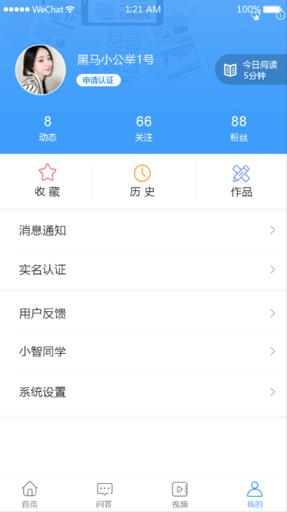
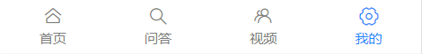
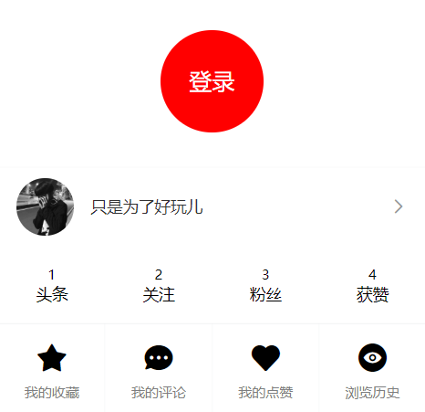

# 九、我的



## 准备

### 创建组件并配置路由

1、创建 `views/my/index.vue` 并写入

```html
<template>
  <div class="my">我的页面</div>
</template>

<script>
export default {
	name: 'MyIndex'
}
</script>

<style>

</style>

```


2、配置路由

```js
import Vue from 'vue'
import VueRouter from 'vue-router'
import Login from '@/views/login'
import Tabbar from '@/views/tabbar'
import Home from '@/views/home'
import Search from '@/views/search'
import SearchResult from '@/views/search-result'
import Article from '@/views/article'
import My from '@/views/my'

Vue.use(VueRouter)

const router = new VueRouter({
  // 配置路由表
  routes: [
    {
      name: 'login',
      path: '/login',
      component: Login
    },
    {
      name: 'search',
      path: '/search',
      component: Search
    },
    {
      name: 'search-result',
      path: '/search/:q',
      component: SearchResult
    },
    {
      name: 'article',
      path: '/article/:articleId',
      component: Article
    },
    {
      path: '/',
      component: Tabbar,
      children: [
        {
          name: 'home',
          path: '', // 默认子路由
          component: Home
        },
+        {
+          name: 'my',
+          path: '/my', // 默认子路由
+          component: My
+        }
      ]
    }
  ]
})

export default router

```

3、配置 tabbar 组件开启路由导航

```html
<template>
  <div class="tabbar">
    <!-- 子路由出口 -->
    <router-view />
    <!-- /子路由出口 -->

    <!-- 底部导航 -->
+    <van-tabbar route>
+      <van-tabbar-item icon="home-o" to="/">首页</van-tabbar-item>
      <van-tabbar-item icon="search">问答</van-tabbar-item>
      <van-tabbar-item icon="friends-o">视频</van-tabbar-item>
+      <van-tabbar-item icon="setting-o" to="/my">我的</van-tabbar-item>
    </van-tabbar>
    <!-- /底部导航 -->
  </div>
</template>

<script>
export default {
  name: 'Tabbar'
}
</script>

<style>

</style>

```

最后测试。

### 布局

```html
<template>
  <div>
    <!-- 未登录 -->
    <div class="not-login">
      <div class="circle" @click="$router.push({ name: 'login' })">
        <span>登录</span>
      </div>
    </div>
    <!-- /未登录 -->

    <!-- 用户信息 -->
    <van-cell-group class="user-info">
      <van-cell
        class="base-info"
        is-link :border="false"
        @click="$router.push('/user')"
      >
        <div slot="title">
          
          <span class="title">{{ user.name }}</span>
        </div>
      </van-cell>
      <van-grid class="data-info" :border="false">
        <van-grid-item>
          <span class="count">{{ user.art_count }}</span>
          <span class="text">头条</span>
        </van-grid-item>
        <van-grid-item>
          <span class="count">{{ user.follow_count }}</span>
          <span class="text">关注</span>
        </van-grid-item>
        <van-grid-item>
          <span class="count">{{ user.fans_count }}</span>
          <span class="text">粉丝</span>
        </van-grid-item>
        <van-grid-item>
          <span class="count">{{ user.like_count }}</span>
          <span class="text">获赞</span>
        </van-grid-item>
      </van-grid>
    </van-cell-group>
    <!-- /用户信息 -->

    <!-- 其它 -->
    <van-cell-group>
      <van-grid clickable>
        <van-grid-item icon="star" text="我的收藏"/>
        <van-grid-item icon="chat" text="我的评论"/>
        <van-grid-item icon="like" text="我的点赞"/>
        <van-grid-item icon="browsing-history" text="浏览历史"/>
      </van-grid>
    </van-cell-group>
    <van-cell-group>
      <van-cell title="消息通知" is-link />
      <van-cell title="用户反馈" is-link />
      <van-cell title="小智同学" is-link @click="$router.push('/chat')" />
      <van-cell title="系统设置" is-link to="/settings" />
    </van-cell-group>
    <!-- /其它 -->
  </div>
</template>

<script>
export default {
  name: 'UserIndex',
  data () {
    return {
      user: {} // 用户信息对象
    }
  }
}
</script>

<style lang="less" scoped>
.not-login {
  height: 150px;
  display: flex;
  justify-content: center;
  align-items: center;
  .circle {
    width: 50px;
    height: 50px;
    padding: 20px;
    background-color: red;
    border-radius: 100%;
    display: flex;
    justify-content: center;
    align-items: center;
    color: #fff;
    font-size: 20px;
  }
}

.user-info {
  .base-info {
    display: flex;
    align-items: center;
    div {
      display: flex;
      align-items: center
    }
    .avatar {
      margin-right: 15px;
      width: 50px;
      height: 50px;
      border-radius: 100%;
    }
  }
  .data-info {
    .text {
      font-size: 14px;
    }
    .count {
      font-size: 12px;
    }
  }
}
</style>

```


## 处理已登录和未登录的显示状态

一、tabbar 中的文字显示



- 已登录，显示“我的“
- 没有登录，显示“未登录”

```html
<template>
  <div class="tabbar">
    <!-- 子路由出口 -->
    <router-view />
    <!-- /子路由出口 -->

    <!-- 底部导航 -->
    <van-tabbar route>
      <van-tabbar-item icon="home-o" to="/">首页</van-tabbar-item>
      <van-tabbar-item icon="search">问答</van-tabbar-item>
      <van-tabbar-item icon="friends-o">视频</van-tabbar-item>
+      <van-tabbar-item icon="setting-o" to="/my">{{ $store.state.user ? '我的' : '未登录'}}</van-tabbar-item>
    </van-tabbar>
    <!-- /底部导航 -->
  </div>
</template>

<script>
export default {
  name: 'Tabbar'
}
</script>

<style>

</style>

```

二、处理我的页面中几个元素的显示状态



- 未登录，显示上面的圆环
- 已登录，显示下面的用户信息

```html
<template>
  <div>
    <!-- 用户信息 -->
+    <van-cell-group class="user-info" v-if="$store.state.user">
      <van-cell
        class="base-info"
        is-link :border="false"
        @click="$router.push('/user')"
      >
        <div slot="title">
          
          <span class="title">{{ user.name }}</span>
        </div>
      </van-cell>
      <van-grid class="data-info" :border="false">
        <van-grid-item>
          <span class="count">{{ user.art_count }}</span>
          <span class="text">头条</span>
        </van-grid-item>
        <van-grid-item>
          <span class="count">{{ user.follow_count }}</span>
          <span class="text">关注</span>
        </van-grid-item>
        <van-grid-item>
          <span class="count">{{ user.fans_count }}</span>
          <span class="text">粉丝</span>
        </van-grid-item>
        <van-grid-item>
          <span class="count">{{ user.like_count }}</span>
          <span class="text">获赞</span>
        </van-grid-item>
      </van-grid>
    </van-cell-group>
    <!-- /用户信息 -->

    <!-- 未登录 -->
+    <div class="not-login" v-else>
      <!-- <div class="circle" @click="$router.push('/login')"> -->
      <div class="circle" @click="$router.push({ name: 'login' })">
        <span>登录</span>
      </div>
    </div>
    <!-- /未登录 -->

    <!-- 其它 -->
    <van-cell-group>
      <van-grid clickable>
        <van-grid-item icon="star" text="我的收藏"/>
        <van-grid-item icon="chat" text="我的评论"/>
        <van-grid-item icon="like" text="我的点赞"/>
        <van-grid-item icon="browsing-history" text="浏览历史"/>
      </van-grid>
    </van-cell-group>
    <van-cell-group>
      <van-cell title="消息通知" is-link />
      <van-cell title="用户反馈" is-link />
      <van-cell title="小智同学" is-link @click="$router.push('/chat')" />
      <van-cell title="系统设置" is-link to="/settings" />
    </van-cell-group>
    <!-- /其它 -->
  </div>
</template>

<script>
export default {
  name: 'UserIndex',
  data () {
    return {
      user: {} // 用户信息对象
    }
  }
}
</script>

<style lang="less" scoped>
.not-login {
  height: 150px;
  display: flex;
  justify-content: center;
  align-items: center;
  .circle {
    width: 50px;
    height: 50px;
    padding: 20px;
    background-color: red;
    border-radius: 100%;
    display: flex;
    justify-content: center;
    align-items: center;
    color: #fff;
    font-size: 20px;
  }
}

.user-info {
  .base-info {
    display: flex;
    align-items: center;
    div {
      display: flex;
      align-items: center
    }
    .avatar {
      margin-right: 15px;
      width: 50px;
      height: 50px;
      border-radius: 100%;
    }
  }
  .data-info {
    .text {
      font-size: 14px;
    }
    .count {
      font-size: 12px;
    }
  }
}
</style>

```


## 展示用户信息

步骤：

- 封装接口
- 请求获取数据
- 处理模板

下面是具体实现流程：

1、在 `api/user.js` 中添加封装数据接口

```js
/**
 * 1、接口重用
 * 2、接口维护
 * 实际开发过程中，接口经常容易变化，
 * 你能记住你在哪里请求了这个接口吗？很难记住
 * 怎么办呢？
 *  我们单独的把接口请求的代码封装起来，统一的放到一起。
 * 放到哪里呢？
 *  我们放到项目的 api 目录中，
 *  根据接口的种类进行归类管理
 *  例如用户相关的接口放到 user.js 中
 *      文章相关的接口放到 article.js 中
 * 如何封装呢？
 *  一个函数，接收参数，返回请求结果就可以了。
 * 用户接口相关请求模块
 */
import request from '@/utils/request'

/**
* 登录
*/
export function login (user) {
  return request({
    // method 用来指定请求方法，这是 axios 的固定 API，不能瞎写
    method: 'POST',
    // url 用来指定请求路径
    url: '/app/v1_0/authorizations',
    // data 是 axios 请求要求的字段名，用来传递请求体数据的
    data: user
  })
}

/**
 * 关注用户
 */
export function followUser (userId) {
  return request({
    method: 'POST',
    url: '/app/v1_0/user/followings',
    data: {
      target: userId // 用户id
    }
  })
}

/**
 * 取消关注用户
 */
export function unFollowUser (userId) {
  return request({
    method: 'DELETE',
    url: '/app/v1_0/user/followings/' + userId
  })
}

/**
 * 获取用户自己信息
 */
+export function getSelf (userId) {
+  return request({
+    method: 'GET',
+    url: '/app/v1_0/user'
+  })
+}

```

2、在 `views/my/index.vue` 组件中

```html
<template>
  <div>
    <!-- 用户信息 -->
    <van-cell-group class="user-info" v-if="$store.state.user">
      <van-cell
        class="base-info"
        is-link :border="false"
        @click="$router.push('/user')"
      >
        <div slot="title">
+          
+          <span class="title">{{ user.name }}</span>
        </div>
      </van-cell>
      <van-grid class="data-info" :border="false">
        <van-grid-item>
+          <span class="count">{{ user.art_count }}</span>
          <span class="text">头条</span>
        </van-grid-item>
        <van-grid-item>
+          <span class="count">{{ user.follow_count }}</span>
          <span class="text">关注</span>
        </van-grid-item>
        <van-grid-item>
+          <span class="count">{{ user.fans_count }}</span>
          <span class="text">粉丝</span>
        </van-grid-item>
        <van-grid-item>
+          <span class="count">{{ user.like_count }}</span>
          <span class="text">获赞</span>
        </van-grid-item>
      </van-grid>
    </van-cell-group>
    <!-- /用户信息 -->

    <!-- 未登录 -->
    <div class="not-login" v-else>
      <!-- <div class="circle" @click="$router.push('/login')"> -->
      <div class="circle" @click="$router.push({ name: 'login' })">
        <span>登录</span>
      </div>
    </div>
    <!-- /未登录 -->

    <!-- 其它 -->
    <van-cell-group>
      <van-grid clickable>
        <van-grid-item icon="star" text="我的收藏"/>
        <van-grid-item icon="chat" text="我的评论"/>
        <van-grid-item icon="like" text="我的点赞"/>
        <van-grid-item icon="browsing-history" text="浏览历史"/>
      </van-grid>
    </van-cell-group>
    <van-cell-group>
      <van-cell title="消息通知" is-link />
      <van-cell title="用户反馈" is-link />
      <van-cell title="小智同学" is-link @click="$router.push('/chat')" />
      <van-cell title="系统设置" is-link to="/settings" />
    </van-cell-group>
    <!-- /其它 -->
  </div>
</template>

<script>
+ import { getSelf } from '@/api/user'

export default {
  name: 'UserIndex',
  data () {
    return {
+      user: {} // 用户信息对象
    }
  },

+  created () {
+    this.loadSelf()
+  },

+  methods: {
+    async loadSelf () {
+      const { data } = await getSelf()
+      this.user = data.data
+    }
+  }
}
</script>

<style lang="less" scoped>
.not-login {
  height: 150px;
  display: flex;
  justify-content: center;
  align-items: center;
  .circle {
    width: 50px;
    height: 50px;
    padding: 20px;
    background-color: red;
    border-radius: 100%;
    display: flex;
    justify-content: center;
    align-items: center;
    color: #fff;
    font-size: 20px;
  }
}

.user-info {
  .base-info {
    display: flex;
    align-items: center;
    div {
      display: flex;
      align-items: center
    }
    .avatar {
      margin-right: 15px;
      width: 50px;
      height: 50px;
      border-radius: 100%;
    }
  }
  .data-info {
    .text {
      font-size: 14px;
    }
    .count {
      font-size: 12px;
    }
  }
}
</style>

```


最后测试。

