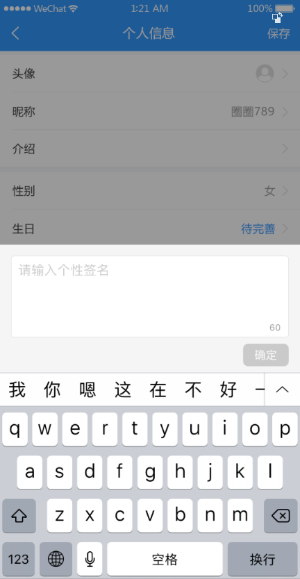
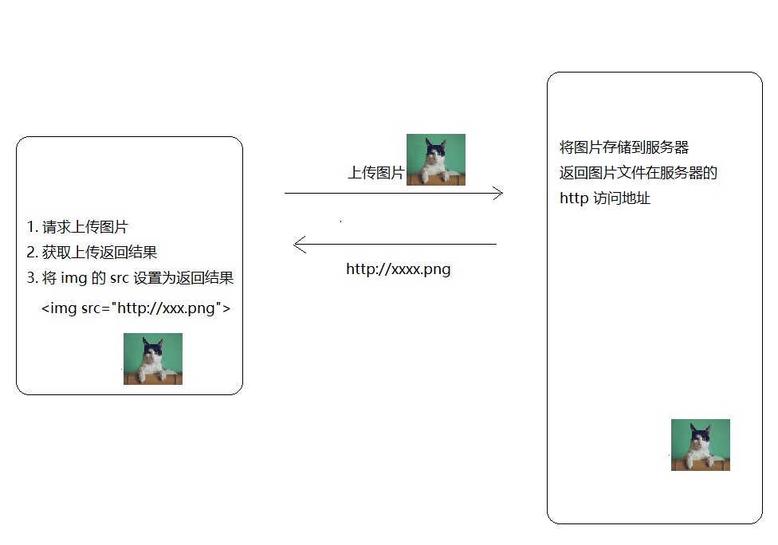

# 十、编辑个人信息




## 准备

1、创建 `user/index.vue` 并写入以下内容：

```html
<template>
  <div>
    <van-nav-bar
      title="个人信息"
      left-arrow
      right-text="保存"
    />
    <van-cell-group>
      <van-cell title="头像" is-link>
        <van-image
          round
          width="30"
          height="30"
          src="http://toutiao.meiduo.site/FgSTA3msGyxp5-Oufnm5c0kjVgW7"
        />
      </van-cell>
      <van-cell title="昵称" value="abc" is-link />
      <van-cell title="性别" value="男" is-link />
      <van-cell title="生日" value="2019-9-27" is-link />
    </van-cell-group>
  </div>
</template>

<script>
export default {
  name: 'UserIndex'
}
</script>

```

2、配置路由

```js
import Vue from 'vue'
import VueRouter from 'vue-router'
import Login from '@/views/login'
import Tabbar from '@/views/tabbar'
import Home from '@/views/home'
import Search from '@/views/search'
import SearchResult from '@/views/search-result'
import Article from '@/views/article'
import My from '@/views/my'
import User from '@/views/user'

Vue.use(VueRouter)

const router = new VueRouter({
  // 配置路由表
  routes: [
    {
      name: 'login',
      path: '/login',
      component: Login
    },
    {
      name: 'search',
      path: '/search',
      component: Search
    },
    {
      name: 'search-result',
      path: '/search/:q',
      component: SearchResult
    },
    {
      name: 'article',
      path: '/article/:articleId',
      component: Article
    },
+    {
+      name: 'user',
+      path: '/user',
+      component: User
+    },
    {
      path: '/',
      component: Tabbar,
      children: [
        {
          name: 'home',
          path: '', // 默认子路由
          component: Home
        },
        {
          name: 'my',
          path: '/my', // 默认子路由
          component: My
        }
      ]
    }
  ]
})

export default router

```

3、在我的页面中点击用户信息跳转到个人信息页面

```html
<template>
  <div>
    <!-- 用户信息 -->
    <van-cell-group class="user-info" v-if="$store.state.user">
      <van-cell
        class="base-info"
        is-link :border="false"
+        @click="$router.push('/user')"
      >
        <div slot="title">
          
          <span class="title">{{ user.name }}</span>
        </div>
      </van-cell>
      <van-grid class="data-info" :border="false">
        <van-grid-item>
          <span class="count">{{ user.art_count }}</span>
          <span class="text">头条</span>
        </van-grid-item>
        <van-grid-item>
          <span class="count">{{ user.follow_count }}</span>
          <span class="text">关注</span>
        </van-grid-item>
        <van-grid-item>
          <span class="count">{{ user.fans_count }}</span>
          <span class="text">粉丝</span>
        </van-grid-item>
        <van-grid-item>
          <span class="count">{{ user.like_count }}</span>
          <span class="text">获赞</span>
        </van-grid-item>
      </van-grid>
    </van-cell-group>
    <!-- /用户信息 -->

    <!-- 未登录 -->
    <div class="not-login" v-else>
      <!-- <div class="circle" @click="$router.push('/login')"> -->
      <div class="circle" @click="$router.push({ name: 'login' })">
        <span>登录</span>
      </div>
    </div>
    <!-- /未登录 -->

    <!-- 其它 -->
    <van-cell-group>
      <van-grid clickable>
        <van-grid-item icon="star" text="我的收藏"/>
        <van-grid-item icon="chat" text="我的评论"/>
        <van-grid-item icon="like" text="我的点赞"/>
        <van-grid-item icon="browsing-history" text="浏览历史"/>
      </van-grid>
    </van-cell-group>
    <van-cell-group>
      <van-cell title="消息通知" is-link />
      <van-cell title="用户反馈" is-link />
      <van-cell title="小智同学" is-link @click="$router.push('/chat')" />
      <van-cell title="系统设置" is-link to="/settings" />
    </van-cell-group>
    <!-- /其它 -->
  </div>
</template>

<script>
import { getSelf } from '@/api/user'

export default {
  name: 'UserIndex',
  data () {
    return {
      user: {} // 用户信息对象
    }
  },

  created () {
    // 如果用户登录了才发请求获取用户信息
    if (this.$store.state.user) {
      this.loadSelf()
    }
  },

  methods: {
    async loadSelf () {
      const { data } = await getSelf()
      this.user = data.data
    }
  }
}
</script>

<style lang="less" scoped>
.not-login {
  height: 150px;
  display: flex;
  justify-content: center;
  align-items: center;
  .circle {
    width: 50px;
    height: 50px;
    padding: 20px;
    background-color: red;
    border-radius: 100%;
    display: flex;
    justify-content: center;
    align-items: center;
    color: #fff;
    font-size: 20px;
  }
}

.user-info {
  .base-info {
    display: flex;
    align-items: center;
    div {
      display: flex;
      align-items: center
    }
    .avatar {
      margin-right: 15px;
      width: 50px;
      height: 50px;
      border-radius: 100%;
    }
  }
  .data-info {
    .text {
      font-size: 14px;
    }
    .count {
      font-size: 12px;
    }
  }
}
</style>

```

最后点击跳转测试。

## 展示个人信息

步骤：

- 封装接口
- 请求获取数据
- 处理模板


下面是具体的实现方式：

1、在 `api/user.js` 中添加封装数据接口

```js
/**
 * 1、接口重用
 * 2、接口维护
 * 实际开发过程中，接口经常容易变化，
 * 你能记住你在哪里请求了这个接口吗？很难记住
 * 怎么办呢？
 *  我们单独的把接口请求的代码封装起来，统一的放到一起。
 * 放到哪里呢？
 *  我们放到项目的 api 目录中，
 *  根据接口的种类进行归类管理
 *  例如用户相关的接口放到 user.js 中
 *      文章相关的接口放到 article.js 中
 * 如何封装呢？
 *  一个函数，接收参数，返回请求结果就可以了。
 * 用户接口相关请求模块
 */
import request from '@/utils/request'

/**
* 登录
*/
export function login (user) {
  return request({
    // method 用来指定请求方法，这是 axios 的固定 API，不能瞎写
    method: 'POST',
    // url 用来指定请求路径
    url: '/app/v1_0/authorizations',
    // data 是 axios 请求要求的字段名，用来传递请求体数据的
    data: user
  })
}

/**
 * 关注用户
 */
export function followUser (userId) {
  return request({
    method: 'POST',
    url: '/app/v1_0/user/followings',
    data: {
      target: userId // 用户id
    }
  })
}

/**
 * 取消关注用户
 */
export function unFollowUser (userId) {
  return request({
    method: 'DELETE',
    url: '/app/v1_0/user/followings/' + userId
  })
}

/**
 * 获取用户自己信息
 */
export function getSelf (userId) {
  return request({
    method: 'GET',
    url: '/app/v1_0/user'
  })
}

/**
 * 获取用户个人资料
 */
+ export function getProfile (userId) {
+  return request({
+    method: 'GET',
+    url: '/app/v1_0/user/profile'
+  })
+ }

```


2、在 `views/user/index.vue` 组件中请求获取数据

```js
+ import { getProfile } from '@/api/user'

export default {
  name: 'UserIndex',
  data () {
    return {
+      user: {}
    }
  },

  created () {
+    this.loadUserProfile()
  },

  methods: {
+    async loadUserProfile () {
      const { data } = await getProfile()
      this.user = data.data
    }
  }
}
```


3、模板绑定

```html
<template>
  <div>
    <van-nav-bar
      title="个人信息"
      left-arrow
      right-text="保存"
    />
    <van-cell-group>
      <van-cell title="头像" is-link>
        <van-image
          round
          width="30"
          height="30"
+          :src="user.photo"
        />
      </van-cell>
+      <van-cell title="昵称" :value="user.name" is-link />
+      <van-cell title="性别" :value="user.gender === 0 ? '男' : '女'" is-link />
+      <van-cell title="生日" :value="user.birthday" is-link />
    </van-cell-group>
  </div>
</template>
```

最后测试。

## 头像上传

需求：

- 头像上传预览
- 保存头像上传

### 图片上传预览

方式一：结合服务器的图片上传预览



方式二：纯客户端实现上传图片预览

```js
// 获取文文件对象
const file = this.files[0]

// 设置图片的 src
图片.src = window.URL.createObjectURL(file)
```

客户端上传预览示例：

```html
<!DOCTYPE html>
<html lang="en">
<head>
  <meta charset="UTF-8">
  <meta name="viewport" content="width=device-width, initial-scale=1.0">
  <meta http-equiv="X-UA-Compatible" content="ie=edge">
  <title>Document</title>
</head>
<body>
  <input type="file">
  
  <script>
    const file = document.querySelector('input')
    const img = document.querySelector('img')

    file.onchange = function () {
      // 获取文件对象
      const data = window.URL.createObjectURL(file.files[0])
      img.src = data
    }
  </script>
</body>
</html>

```

接下来就是在项目中使用纯客户端的方式处理用户头像上传预览。

在 `views/user/index.vue` 组件中：

```html
<template>
  <div>
    <van-nav-bar
      title="个人信息"
      left-arrow
      right-text="保存"
    />
    <van-cell-group>
+      <van-cell title="头像" is-link @click="onChangePhoto">
        <van-image
          round
          width="30"
          height="30"
          :src="user.photo"
        />
      </van-cell>
      <van-cell title="昵称" :value="user.name" is-link />
      <van-cell title="性别" :value="user.gender === 0 ? '男' : '女'" is-link />
      <van-cell title="生日" :value="user.birthday" is-link />
    </van-cell-group>

    <!--
      表单元素的 hidden 表示隐藏这个表单元素
     -->
+    <input type="file" hidden ref="file" @change="onFileChange">
  </div>
</template>

<script>
import { getProfile } from '@/api/user'

export default {
  name: 'UserIndex',
  data () {
    return {
      user: {}
    }
  },

  created () {
    this.loadUserProfile()
  },

  methods: {
    async loadUserProfile () {
      const { data } = await getProfile()
      this.user = data.data
    },

+    onChangePhoto () {
      this.$refs.file.click()
    },

+    onFileChange () {
      this.user.photo = window.URL.createObjectURL(this.$refs.file.files[0])
    }
  }
}
</script>

```


### 保存提交

步骤：

- 封装接口
- 请求提交
- 更新视图

1、在 `api/user.js` 中添加封装数据接口

```js
/**
 * 1、接口重用
 * 2、接口维护
 * 实际开发过程中，接口经常容易变化，
 * 你能记住你在哪里请求了这个接口吗？很难记住
 * 怎么办呢？
 *  我们单独的把接口请求的代码封装起来，统一的放到一起。
 * 放到哪里呢？
 *  我们放到项目的 api 目录中，
 *  根据接口的种类进行归类管理
 *  例如用户相关的接口放到 user.js 中
 *      文章相关的接口放到 article.js 中
 * 如何封装呢？
 *  一个函数，接收参数，返回请求结果就可以了。
 * 用户接口相关请求模块
 */
import request from '@/utils/request'

/**
* 登录
*/
export function login (user) {
  return request({
    // method 用来指定请求方法，这是 axios 的固定 API，不能瞎写
    method: 'POST',
    // url 用来指定请求路径
    url: '/app/v1_0/authorizations',
    // data 是 axios 请求要求的字段名，用来传递请求体数据的
    data: user
  })
}

/**
 * 关注用户
 */
export function followUser (userId) {
  return request({
    method: 'POST',
    url: '/app/v1_0/user/followings',
    data: {
      target: userId // 用户id
    }
  })
}

/**
 * 取消关注用户
 */
export function unFollowUser (userId) {
  return request({
    method: 'DELETE',
    url: '/app/v1_0/user/followings/' + userId
  })
}

/**
 * 获取用户自己信息
 */
export function getSelf (userId) {
  return request({
    method: 'GET',
    url: '/app/v1_0/user'
  })
}

/**
 * 获取用户个人资料
 */
export function getProfile (userId) {
  return request({
    method: 'GET',
    url: '/app/v1_0/user/profile'
  })
}

/**
 * 更新用户头像
 */
+ export function updateUserPhoto (data) {
  return request({
    method: 'PATCH',
    url: '/app/v1_0/user/photo',
    data
  })
}

```

2、在 `views/user/index.vue` 组件中保存提交

```html
<template>
  <div>
    <van-nav-bar
      title="个人信息"
      left-arrow
      right-text="保存"
+      @click-right="onSave"
    />
    <van-cell-group>
      <van-cell title="头像" is-link @click="onChangePhoto">
        <van-image
          round
          width="30"
          height="30"
          :src="user.photo"
        />
      </van-cell>
      <van-cell title="昵称" :value="user.name" is-link />
      <van-cell title="性别" :value="user.gender === 0 ? '男' : '女'" is-link />
      <van-cell title="生日" :value="user.birthday" is-link />
    </van-cell-group>

    <!--
      表单元素的 hidden 表示隐藏这个表单元素
     -->
    <input type="file" hidden ref="file" @change="onFileChange">
  </div>
</template>

<script>
+ import { getProfile, updateUserPhoto } from '@/api/user'

export default {
  name: 'UserIndex',
  data () {
    return {
      user: {}
    }
  },

  created () {
    this.loadUserProfile()
  },

  methods: {
    async loadUserProfile () {
      const { data } = await getProfile()
      this.user = data.data
    },

    onChangePhoto () {
      this.$refs.file.click()
    },

    onFileChange () {
      const fileObj = this.$refs.file.files[0]
      if (fileObj) {
        this.user.photo = window.URL.createObjectURL(fileObj)
      }
    },

+    async onSave () {
      // 如果 Content-Type 要求是	application/json	，则 data 传普通对象 {}
      // 如果 Content-Type 要求是	multipart/form-data	，则 data 传 FormData 对象
      // 纵观所有数据接口，你会发现大多数的接口都要求 Content-Type 要求是	application/json
      // 一般只有涉及到文件上传的数据接口才要求Content-Type 要求是	multipart/form-data
      // 这个时候传递一个 FormData 对象
      this.$toast.loading({
        duration: 0, // 持续展示 toast
        forbidClick: true, // 禁用背景点击
        loadingType: 'spinner',
        message: '保存中'
      })

      try {
        const formData = new FormData()
        // formData.append('名字', 数据)
        formData.append('photo', this.$refs.file.files[0])
        await updateUserPhoto(formData)
        this.$toast.success('保存成功')
      } catch (err) {
        console.log(err)
        this.$toast.fail('保存失败')
      }
    }
  }
}
</script>

```


## 其它字段修改

### 编辑昵称

```html
<template>
  <div>
    <van-nav-bar
      title="个人信息"
      left-arrow
      right-text="保存"
      @click-right="onSave"
    />
    <van-cell-group>
      <van-cell title="头像" is-link @click="onChangePhoto">
        <van-image
          round
          width="30"
          height="30"
          :src="user.photo"
        />
      </van-cell>
      <van-cell
        title="昵称"
        :value="user.name"
        is-link
        @click="isEditNameShow = true"
      />
      <van-cell title="性别" :value="user.gender === 0 ? '男' : '女'" is-link />
      <van-cell title="生日" :value="user.birthday" is-link />
    </van-cell-group>

    <!--
      表单元素的 hidden 表示隐藏这个表单元素
     -->
    <input type="file" hidden ref="file" @change="onFileChange">

    <!-- 编辑用户昵称弹窗 -->
+    <van-dialog
+      v-model="isEditNameShow"
+      title="用户昵称"
+      show-cancel-button
+      @confirm="onUserNameConfirm"
+    >
+      <van-field
+        placeholder="请输入用户名"
+        :value="user.name"
+        @input="onUserNameInput"
+      />
+    </van-dialog>
    <!-- /编辑用户昵称弹窗 -->
  </div>
</template>

<script>
import { getProfile, updateUserPhoto } from '@/api/user'

export default {
  name: 'UserIndex',
  data () {
    return {
      user: {},
+      isEditNameShow: false,
+      inputUserName: '' // 存储编辑用户名字的输入框数据
    }
  },

  created () {
    this.loadUserProfile()
  },

  methods: {
    async loadUserProfile () {
      const { data } = await getProfile()
      this.user = data.data
    },

    onChangePhoto () {
      this.$refs.file.click()
    },

    onFileChange () {
      const fileObj = this.$refs.file.files[0]
      if (fileObj) {
        this.user.photo = window.URL.createObjectURL(fileObj)
      }
    },

    async onSave () {
      // 如果 Content-Type 要求是	application/json	，则 data 传普通对象 {}
      // 如果 Content-Type 要求是	multipart/form-data	，则 data 传 FormData 对象
      // 纵观所有数据接口，你会发现大多数的接口都要求 Content-Type 要求是	application/json
      // 一般只有涉及到文件上传的数据接口才要求Content-Type 要求是	multipart/form-data
      // 这个时候传递一个 FormData 对象
      this.$toast.loading({
        duration: 0, // 持续展示 toast
        forbidClick: true, // 禁用背景点击
        loadingType: 'spinner',
        message: '保存中'
      })

      try {
        const formData = new FormData()
        // formData.append('名字', 数据)
        formData.append('photo', this.$refs.file.files[0])
        await updateUserPhoto(formData)
        this.$toast.success('保存成功')
      } catch (err) {
        console.log(err)
        this.$toast.fail('保存失败')
      }
    },

+    onUserNameConfirm () {
+      this.user.name = this.inputUserName
+    },

+    onUserNameInput (value) {
+      this.inputUserName = value
+    }
  }
}
</script>

```


### 编辑性别

```html
<template>
  <div>
    <van-nav-bar
      title="个人信息"
      left-arrow
      right-text="保存"
      @click-right="onSave"
    />
    <van-cell-group>
      <van-cell title="头像" is-link @click="onChangePhoto">
        <van-image
          round
          width="30"
          height="30"
          :src="user.photo"
        />
      </van-cell>
      <van-cell
        title="昵称"
        :value="user.name"
        is-link
        @click="isEditNameShow = true"
      />
      <van-cell
        title="性别"
        :value="user.gender === 0 ? '男' : '女'"
        is-link
        @click="isEditGenderShow = true"
      />
      <van-cell title="生日" :value="user.birthday" is-link />
    </van-cell-group>

    <!--
      表单元素的 hidden 表示隐藏这个表单元素
     -->
    <input type="file" hidden ref="file" @change="onFileChange">

    <!-- 编辑用户昵称弹窗 -->
    <van-dialog
      v-model="isEditNameShow"
      title="用户昵称"
      show-cancel-button
      @confirm="onUserNameConfirm"
    >
      <van-field
        placeholder="请输入用户名"
        :value="user.name"
        @input="onUserNameInput"
      />
    </van-dialog>
    <!-- /编辑用户昵称弹窗 -->

    <!-- 编辑用户昵称上拉菜单 -->
+    <van-action-sheet
+      v-model="isEditGenderShow"
+      :actions="actions"
+      cancel-text="取消"
+      @select="onSelect"
+    />
    <!-- /编辑用户昵称上拉菜单 -->
  </div>
</template>

<script>
import { getProfile, updateUserPhoto } from '@/api/user'

export default {
  name: 'UserIndex',
  data () {
    return {
      user: {},
      isEditNameShow: false,
      inputUserName: '', // 存储编辑用户名字的输入框数据
+      isEditGenderShow: false, // 控制编辑性别的上拉菜单的显示状态
+      actions: [ // 上拉菜单的数据
        // name 会当作文本输出渲染
        // value 是我自己自定义添加的
        { name: '男', value: 0 },
        { name: '女', value: 1 }
      ]
    }
  },

  created () {
    this.loadUserProfile()
  },

  methods: {
    async loadUserProfile () {
      const { data } = await getProfile()
      this.user = data.data
    },

    onChangePhoto () {
      this.$refs.file.click()
    },

    onFileChange () {
      const fileObj = this.$refs.file.files[0]
      if (fileObj) {
        this.user.photo = window.URL.createObjectURL(fileObj)
      }
    },

    async onSave () {
      // 如果 Content-Type 要求是	application/json	，则 data 传普通对象 {}
      // 如果 Content-Type 要求是	multipart/form-data	，则 data 传 FormData 对象
      // 纵观所有数据接口，你会发现大多数的接口都要求 Content-Type 要求是	application/json
      // 一般只有涉及到文件上传的数据接口才要求Content-Type 要求是	multipart/form-data
      // 这个时候传递一个 FormData 对象
      this.$toast.loading({
        duration: 0, // 持续展示 toast
        forbidClick: true, // 禁用背景点击
        loadingType: 'spinner',
        message: '保存中'
      })

      try {
        const formData = new FormData()
        // formData.append('名字', 数据)
        formData.append('photo', this.$refs.file.files[0])
        await updateUserPhoto(formData)
        this.$toast.success('保存成功')
      } catch (err) {
        console.log(err)
        this.$toast.fail('保存失败')
      }
    },

    onUserNameConfirm () {
      this.user.name = this.inputUserName
    },

    onUserNameInput (value) {
      this.inputUserName = value
    },

+    onSelect (item) {
+      // 修改数据
+      this.user.gender = item.value
+
+      // 关闭上拉菜单
+      this.isEditGenderShow = false
+    }
  }
}
</script>

```


### 编辑生日

```html
<template>
  <div>
    <van-nav-bar
      title="个人信息"
      left-arrow
      right-text="保存"
      @click-right="onSave"
    />
    <van-cell-group>
      <van-cell title="头像" is-link @click="onChangePhoto">
        <van-image
          round
          width="30"
          height="30"
          :src="user.photo"
        />
      </van-cell>
      <van-cell
        title="昵称"
        :value="user.name"
        is-link
        @click="isEditNameShow = true"
      />
      <van-cell
        title="性别"
        :value="user.gender === 0 ? '男' : '女'"
        is-link
        @click="isEditGenderShow = true"
      />
      <van-cell
        title="生日"
        :value="user.birthday"
        is-link
        @click="isEditBirthdayShow = true"
      />
    </van-cell-group>

    <!--
      表单元素的 hidden 表示隐藏这个表单元素
     -->
    <input type="file" hidden ref="file" @change="onFileChange">

    <!-- 编辑用户昵称弹窗 -->
    <van-dialog
      v-model="isEditNameShow"
      title="用户昵称"
      show-cancel-button
      @confirm="onUserNameConfirm"
    >
      <van-field
        placeholder="请输入用户名"
        :value="user.name"
        @input="onUserNameInput"
      />
    </van-dialog>
    <!-- /编辑用户昵称弹窗 -->

    <!-- 编辑用户昵称上拉菜单 -->
    <van-action-sheet
      v-model="isEditGenderShow"
      :actions="actions"
      cancel-text="取消"
      @select="onSelect"
    />
    <!-- /编辑用户昵称上拉菜单 -->

    <!-- 编辑用户生日 -->
+    <van-popup
+      v-model="isEditBirthdayShow"
+      position="bottom"
+      :style="{ height: '30%' }"
+    >
+      <van-datetime-picker
+        type="date"
+        @confirm="onUserBirthdayConfirm"
+        @cancel="isEditBirthdayShow = false"
+      />
+    </van-popup>
    <!-- /编辑用户生日 -->
  </div>
</template>

<script>
import { getProfile, updateUserPhoto } from '@/api/user'
+ import dayjs from 'dayjs'

export default {
  name: 'UserIndex',
  data () {
    return {
      user: {},
      isEditNameShow: false,
      inputUserName: '', // 存储编辑用户名字的输入框数据
      isEditGenderShow: false,
      actions: [
        // name 会当作文本输出渲染
        // value 是我自己自定义添加的
        { name: '男', value: 0 },
        { name: '女', value: 1 }
      ],
+      isEditBirthdayShow: false
    }
  },

  created () {
    this.loadUserProfile()
  },

  methods: {
    async loadUserProfile () {
      const { data } = await getProfile()
      this.user = data.data
    },

    onChangePhoto () {
      this.$refs.file.click()
    },

    onFileChange () {
      const fileObj = this.$refs.file.files[0]
      if (fileObj) {
        this.user.photo = window.URL.createObjectURL(fileObj)
      }
    },

    async onSave () {
      // 如果 Content-Type 要求是	application/json	，则 data 传普通对象 {}
      // 如果 Content-Type 要求是	multipart/form-data	，则 data 传 FormData 对象
      // 纵观所有数据接口，你会发现大多数的接口都要求 Content-Type 要求是	application/json
      // 一般只有涉及到文件上传的数据接口才要求Content-Type 要求是	multipart/form-data
      // 这个时候传递一个 FormData 对象
      this.$toast.loading({
        duration: 0, // 持续展示 toast
        forbidClick: true, // 禁用背景点击
        loadingType: 'spinner',
        message: '保存中'
      })

      try {
        const formData = new FormData()
        // formData.append('名字', 数据)
        formData.append('photo', this.$refs.file.files[0])
        await updateUserPhoto(formData)
        this.$toast.success('保存成功')
      } catch (err) {
        console.log(err)
        this.$toast.fail('保存失败')
      }
    },

    onUserNameConfirm () {
      this.user.name = this.inputUserName
    },

    onUserNameInput (value) {
      this.inputUserName = value
    },

    onSelect (item) {
      // 修改数据
      this.user.gender = item.value

      // 关闭上拉菜单
      this.isEditGenderShow = false
    },

+    onUserBirthdayConfirm (value) {
      // 更新数据
      this.user.birthday = dayjs(value).format('YYYY-MM-DD')

      // 关闭弹层
      this.isEditBirthdayShow = false
    }
  }
}
</script>

```


## 保存修改

步骤：

- 封装接口
- 请求提交
- 后续处理


下面是具体的实现流程：

1、在 `api/user.js` 中添加封装数据接口

```js
/**
 * 1、接口重用
 * 2、接口维护
 * 实际开发过程中，接口经常容易变化，
 * 你能记住你在哪里请求了这个接口吗？很难记住
 * 怎么办呢？
 *  我们单独的把接口请求的代码封装起来，统一的放到一起。
 * 放到哪里呢？
 *  我们放到项目的 api 目录中，
 *  根据接口的种类进行归类管理
 *  例如用户相关的接口放到 user.js 中
 *      文章相关的接口放到 article.js 中
 * 如何封装呢？
 *  一个函数，接收参数，返回请求结果就可以了。
 * 用户接口相关请求模块
 */
import request from '@/utils/request'

/**
* 登录
*/
export function login (user) {
  return request({
    // method 用来指定请求方法，这是 axios 的固定 API，不能瞎写
    method: 'POST',
    // url 用来指定请求路径
    url: '/app/v1_0/authorizations',
    // data 是 axios 请求要求的字段名，用来传递请求体数据的
    data: user
  })
}

/**
 * 关注用户
 */
export function followUser (userId) {
  return request({
    method: 'POST',
    url: '/app/v1_0/user/followings',
    data: {
      target: userId // 用户id
    }
  })
}

/**
 * 取消关注用户
 */
export function unFollowUser (userId) {
  return request({
    method: 'DELETE',
    url: '/app/v1_0/user/followings/' + userId
  })
}

/**
 * 获取用户自己信息
 */
export function getSelf (userId) {
  return request({
    method: 'GET',
    url: '/app/v1_0/user'
  })
}

/**
 * 获取用户个人资料
 */
export function getProfile (userId) {
  return request({
    method: 'GET',
    url: '/app/v1_0/user/profile'
  })
}

/**
 * 更新用户头像
 */
export function updateUserPhoto (data) {
  return request({
    method: 'PATCH',
    url: '/app/v1_0/user/photo',
    data
  })
}

/**
 * 更新用户基本信息
 */
+ export function updateUserProfile (data) {
+  return request({
+    method: 'PATCH',
+    url: '/app/v1_0/user/profile',
+    data
+  })
+ }

```

2、然后在 `views/user/index.vue` 组件中

```js
import { getProfile, updateUserPhoto, updateUserProfile } from '@/api/user'
import dayjs from 'dayjs'

export default {
  name: 'UserIndex',
  data () {
    return {
      user: {},
      isEditNameShow: false,
      inputUserName: '', // 存储编辑用户名字的输入框数据
      isEditGenderShow: false,
      actions: [
        // name 会当作文本输出渲染
        // value 是我自己自定义添加的
        { name: '男', value: 0 },
        { name: '女', value: 1 }
      ],
      isEditBirthdayShow: false
    }
  },

  created () {
    this.loadUserProfile()
  },

  methods: {
    async loadUserProfile () {
      const { data } = await getProfile()
      this.user = data.data
    },

    onChangePhoto () {
      this.$refs.file.click()
    },

    onFileChange () {
      const fileObj = this.$refs.file.files[0]
      if (fileObj) {
        this.user.photo = window.URL.createObjectURL(fileObj)
      }
    },

    async onSave () {
      // 如果Content-Type要求是application/json，则 data 传普通对象 {}
      // 如果Content-Type要求是multipart/form-data，则 data 传 FormData 对象
      // 纵观所有数据接口，你会发现大多数的接口都要求Content-Type要求是application/json
      // 一般只有涉及到文件上传的数据接口才要求Content-Type 要求是multipart/form-data
      // 这个时候传递一个 FormData 对象
      this.$toast.loading({
        duration: 0, // 持续展示 toast
        forbidClick: true, // 禁用背景点击
        loadingType: 'spinner',
        message: '保存中'
      })

      try {
+        const fileObj = this.$refs.file.files[0]
+
+        // 如果用户选择了新的头像，那就更新用户头像
+        if (fileObj) {
+          const formData = new FormData()
+          formData.append('photo', fileObj)
+          await updateUserPhoto(formData)
+        }
+
+        // 更新用户其它文本信息
+        await updateUserProfile({
+          name: this.user.name,
+          gender: this.user.gender,
+          birthday: this.user.birthday
+        })

        this.$toast.success('保存成功')
      } catch (err) {
        console.log(err)
        this.$toast.fail('保存失败')
      }
    },

    onUserNameConfirm () {
      this.user.name = this.inputUserName
    },

    onUserNameInput (value) {
      this.inputUserName = value
    },

    onSelect (item) {
      // 修改数据
      this.user.gender = item.value

      // 关闭上拉菜单
      this.isEditGenderShow = false
    },

    onUserBirthdayConfirm (value) {
      // 更新数据
      this.user.birthday = dayjs(value).format('YYYY-MM-DD')

      // 关闭弹层
      this.isEditBirthdayShow = false
    }
  }
}
```

> 提示：性别无法修改，因为接口有问题，实际工作需要好好的和后台小哥哥商量。


