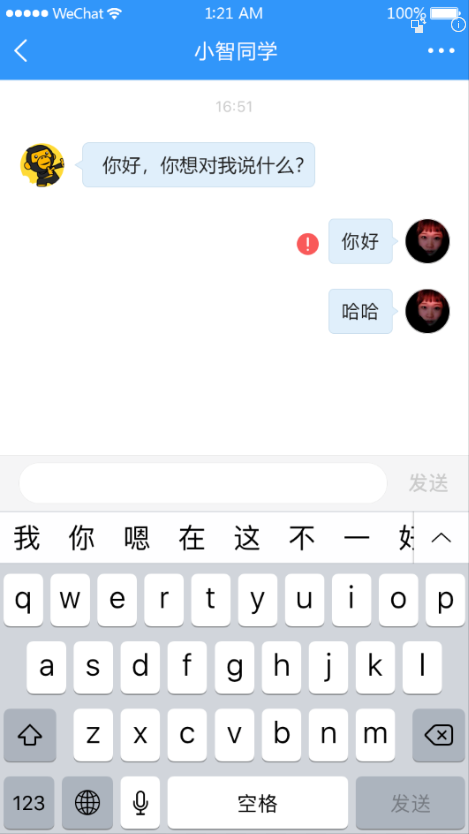
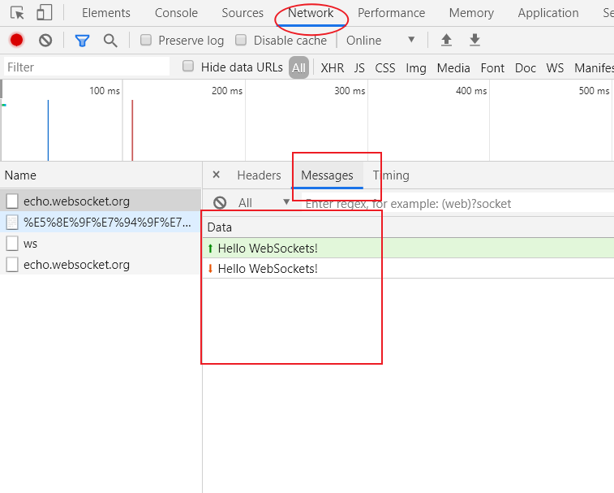

# 十一、小智同学



## WebSocket


- WebSocket 是一种数据通信协议，类似于我们常见的 http
- 既然有 http，为啥还要 WebSocket
- http 通信是单向的
  - 请求 + 响应
  - 没有请求也就没有响应


初次接触 WebSocket 的人，都会问同样的问题：我们已经有了 HTTP 协议，为什么还需要另一个协议？它能带来什么好处？

答案很简单，因为 HTTP 协议有一个缺陷：通信只能由客户端发起。

举例来说，我们想了解今天的天气，只能是客户端向服务器发出请求，服务器返回查询结果。HTTP 协议做不到服务器主动向客户端推送信息。

这种单向请求的特点，注定了如果服务器有连续的状态变化，客户端要获知就非常麻烦。我们只能使用["轮询"](https://www.pubnub.com/blog/2014-12-01-http-long-polling/)：每隔一段时候，就发出一个询问，了解服务器有没有新的信息。最典型的场景就是聊天室。

轮询的效率低，非常浪费资源（因为必须不停连接，或者 HTTP 连接始终打开）。因此，工程师们一直在思考，有没有更好的方法。WebSocket 就是这样发明的。


WebSocket 协议在2008年诞生，2011年成为国际标准。所有浏览器都已经支持了。

它的最大特点就是，**服务器可以主动向客户端推送信息**，**客户端也可以主动向服务器发送信息**，是真正的**双向平等对话**，属于[服务器推送技术](https://en.wikipedia.org/wiki/Push_technology)的一种。

简单理解：

HTTP 打电话：

- 我问一句
- 你回答一句
- 没有提问就没有回答，即便对方主动给你说话，我也是个聋子听不见

WebSocket 打电话：

- 双向对话


> HTTP 和 WebSocket 通信模型


其他特点包括：

（1）建立在 TCP 协议之上，服务器端的实现比较容易。

（2）与 HTTP 协议有着良好的兼容性。默认端口也是80和443，并且握手阶段（第1次建立连接）采用 HTTP 协议，因此握手时不容易屏蔽，能通过各种 HTTP 代理服务器。

（3）数据格式比较轻量，性能开销小，通信高效。

（4）可以发送文本，也可以发送二进制数据。

（5）没有同源跨域限制，客户端可以与任意服务器通信。

（6）协议标识符是`ws`（如果加密，则为`wss`），服务器网址就是 URL。

（7）浏览器专门为 WebSocket 通信提供了一个请求对象 `WebSocket`


```
ws://example.com:80/some/path
```


## 使用原生 WebSocket（了解）

> 参考文档：
>
> - [MDN - WebSocket](https://developer.mozilla.org/zh-CN/docs/Web/API/WebSocket)

浏览器为 HTTP 通信提供了 `XMLHttpRequest` 对象，同样的，也为 WebSocket 通信提供了一个通信操作接口：`WebSocket`。

通信模型：

- 拨号（建立连接）
- 通话（双向通信）
- 结束通话（关闭连接）


```html
<!DOCTYPE html>
<html lang="en">
<head>
  <meta charset="UTF-8">
  <meta name="viewport" content="width=device-width, initial-scale=1.0">
  <meta http-equiv="X-UA-Compatible" content="ie=edge">
  <title>Document</title>
</head>
<body>
  <script>
    // WebSocet 通信模型

    // 1. 拨打电话（建立连接）
    // 注意：wss://echo.websocket.org 是一个在线的测试接口，仅用于 WebSocket 协议通信测试使用
    var ws = new WebSocket("wss://echo.websocket.org");

    // 当连接建立成功，触发 open 事件
    ws.onopen = function(evt) { 
      console.log("建立连接成功 ..."); 

      // 连接建立成功以后，就可以使用这个连接对象通信了
      // send 方法发送数据
      ws.send("Hello WebSockets!");
    };

    // 当接收到对方发送的消息的时候，触发 message 事件
    // 我们可以通过回调函数的 evt.data 获取对方发送的数据内容
    ws.onmessage = function(evt) {
      console.log( "接收到消息: " + evt.data);

      // 当不需要通信的时候，可以手动的关闭连接
      // ws.close();
    };

    // 当连接断开的时候触发 close 事件
    ws.onclose = function(evt) {
      console.log("连接已关闭.");
    }; 
  </script>
</body>
</html>

```

怎么查看 WebSocket 请求日志：



> 朝上的绿色箭头是发出去的消息
>
> 朝下的红色箭头是收到的消息


## Socket.IO（了解体验）

### 介绍

- 原生的 WebSocket 使用比较麻烦，所以推荐使用一个封装好的解决方案：socket.io
- socket.io 提供了服务端 + 客户端的实现
  - 客户端：浏览器
  - 服务端：Java、Python、PHP、。。。。Node.js
- 对于前端开发者来说，只需要关心她的客户端如何使用即可
- 注意：Socket.io 必须前后端配套使用
  - 实际工作中，socket.io 已经成为了各大后端开发的 WebSocket 通信主流解决方案
- [GitHub 仓库](https://github.com/socketio/socket.io)
- [官网](https://socket.io/)

### 基本使用

官方的 Hello World：https://socket.io/get-started/chat/。


服务端代码：

```js
var app = require('express')();
var http = require('http').createServer(app);
var io = require('socket.io')(http);

app.get('/', function(req, res){
  res.sendFile(__dirname + '/index.html');
});

io.on('connection', function(socket){

  socket.on('disconnect', function(){
    console.log('user disconnected');
  });

  socket.on('chat message', function(msg){
    io.emit('chat message', msg);
  });
});

http.listen(3000, '0.0.0.0', function(){
  console.log('listening on *:3000');
});

```


客户端代码：

```html
<!doctype html>
<html>
  <head>
    <title>Socket.IO chat</title>
    <style>
      * { margin: 0; padding: 0; box-sizing: border-box; }
      body { font: 13px Helvetica, Arial; }
      form { background: #000; padding: 3px; position: fixed; bottom: 0; width: 100%; }
      form input { border: 0; padding: 10px; width: 90%; margin-right: .5%; }
      form button { width: 9%; background: rgb(130, 224, 255); border: none; padding: 10px; }
      #messages { list-style-type: none; margin: 0; padding: 0; }
      #messages li { padding: 5px 10px; }
      #messages li:nth-child(odd) { background: #eee; }
    </style>
  </head>
  <body>
    <!-- 消息列表 -->
    <ul id="messages"></ul>

    <!-- 发送消息的表单 -->
    <form action="">
      <input id="m" autocomplete="off" /><button>Send</button>
    </form>

    <!-- SocketIO 提供了一个客户端实现：socket.io.js -->
    <script src="/socket.io/socket.io.js"></script>
    <script src="https://code.jquery.com/jquery-1.11.1.js"></script>
    <script>
      // 建立连接，得到 socket 通信对象
      var socket = io()

      socket.on('connect', () => {
        console.log('建立连接成功了')
      })

      $('form').submit(function(e){
        e.preventDefault(); // prevents page reloading
        socket.emit('chat message', $('#m').val());
        $('#m').val('');
        return false;
      });

      socket.on('chat message', function(msg){
        $('#messages').append($('<li>').text(msg));
      });
    </script>
  </body>
</html>

```


### 总结

我们只需要关注客户端怎么使用：

- 怎么建立连接
- 怎么发送消息
- 怎么接收消息

建立连接：

```js
const socket = io('连接地址')
```

发送数据：

```js
// 等价于 soket.emit('message', 数据)
socket.send('数据')

// 发送指定类型的消息
socket.emit('消息类型', 数据)
```

接收消息：

```js
// 消息类型
// 回调函数参数获取消息数据
socket.on('消息类型', data => {
  console.log(data)
})
```


## 小智同学

### 准备

创建 `chat/index.vue`：

```html
<template>
  <div>小智同学</div>
</template>

<script>
export default {
  name: 'ChatIndex'
}
</script>

<style>

</style>

```

然后配置路由：

```js
...
import Chat from '@/views/chat'

Vue.use(VueRouter)

const router = new VueRouter({
  // 配置路由表
  routes: [
    ...
    {
      name: 'chat',
      path: '/chat',
      component: Chat
    }
  ]
})

export default router

```

最后，在我的页面中点击 “小智同学” 跳转到聊天页面：

```html
<!-- 其它 -->
<van-cell-group>
  <van-grid clickable>
    <van-grid-item icon="star" text="我的收藏"/>
    <van-grid-item icon="chat" text="我的评论"/>
    <van-grid-item icon="like" text="我的点赞"/>
    <van-grid-item icon="browsing-history" text="浏览历史"/>
  </van-grid>
</van-cell-group>
<van-cell-group>
  <van-cell title="消息通知" is-link />
  <van-cell title="用户反馈" is-link />
+  <van-cell title="小智同学" is-link @click="$router.push('/chat')" />
  <van-cell title="系统设置" is-link to="/settings" />
</van-cell-group>
<!-- /其它 -->
```

### 布局

```html
<template>
  <div class="chat-container">
    <!-- 导航栏 -->
    <van-nav-bar
      title="小智同学"
      left-arrow
      @click-left="$router.back()"
      fixed
    />
    <!-- /导航栏 -->

    <!-- 消息列表 -->
    <div class="message-list" ref="message-list">
      <div
        class="message-item"
        :class="{ reverse: item % 3 === 0 }"
        v-for="item in 20"
        :key="item"
      >
        <van-image
          class="avatar"
          slot="icon"
          round
          width="30"
          height="30"
          src="https://img.yzcdn.cn/vant/cat.jpeg"
        />
        <div class="title">
          <span>{{ `hello${item}` }}</span>
        </div>
      </div>
    </div>
    <!-- /消息列表 -->

    <!-- 发送消息 -->
    <van-cell-group class="send-message">
      <van-field
        v-model="message"
        center
        clearable
      >
        <van-button slot="button" size="small" type="primary">发送</van-button>
      </van-field>
    </van-cell-group>
    <!-- /发送消息 -->
  </div>
</template>

<script>
export default {
  data () {
    return {
      message: ''
    }
  },

  mounted () {
    window.list = this.$refs['message-list']
  }
}
</script>

<style scoped lang='less'>
.chat-container {
  position: absolute;
  width: 100%;
  height: 100%;
  padding: 46px 0 50px 0;
  top: 0;
  left: 0;
  box-sizing: border-box;
  background: #f5f5f6;
  .message-list {
    height: 100%;
    overflow-y: scroll;
    .message-item {
      display: flex;
      align-items: center;
      padding: 10px;
      .title {
        background: #fff;
        padding: 5px;
        border-radius: 6px;
      }
      .avatar {
        margin-right: 5px;
      }
    }
    .reverse {
      flex-direction: row-reverse;
      .title {
        margin-right: 5px;
      }
    }
  }

  .send-message {
    position: fixed;
    bottom: 0;
    left: 0;
    right: 0;
    background: #f5f5f6 !important;
  }
}
</style>

```


```html
<template>
  <div class="page-user-chat">
    <van-nav-bar fixed left-arrow @click-left="$router.back()" title="小智同学"></van-nav-bar>
    <div class="chat-list" ref="list">
      <div
        class="chat-item"
        :class="{left:item.name==='xz',right:item.name==='self'}"
        v-for="(item,i) in list"
        :key="i"
      >
        <van-image v-if="item.name==='xz'" fit="cover" round :src="xzAvatar" />
        <div class="chat-pao">{{item.msg}}</div>
        <van-image v-if="item.name==='self'" fit="cover" round src="https://img.yzcdn.cn/vant/cat.jpeg" />
      </div>
    </div>
    <div class="reply-container van-hairline--top">
      <van-field v-model="value" placeholder="说点什么...">
        <van-loading v-if="commentLoading" slot="button" type="spinner" size="16px"></van-loading>
        <span v-else @click="send()" slot="button" style="font-size:12px;color:#999">提交</span>
      </van-field>
    </div>
  </div>
</template>

<script>
import xzAvatar from '@/assets/images/xz.png'
import io from 'socket.io-client'
import { userLocal } from '@/utils/local'
export default {
  data () {
    return {
      value: '',
      list: null,
      xzAvatar,
      commentLoading: false
    }
  },
  created () {
    this.list = []
    this.socket = io('http://ttapi.research.itcast.cn', {
      query: {
        token: userLocal.getUser().token
      }
    })
    this.socket.on('connect', () => {
      // 建了链接后默认  小智给你打招呼
      this.list.push({ name: 'xz', msg: '你好' })
    })
    this.socket.on('message', data => {
      // 接受机器人消息
      this.list.push({ name: 'xz', msg: data.msg })
      this.scrollBottom()
    })
  },
  deactivated () {
    this.socket.close()
  },
  methods: {
    scrollBottom () {
      this.$nextTick(() => {
        this.$refs.list.scrollTop = this.$refs.list.scrollHeight
      })
    },
    send () {
      this.socket.emit('message', { msg: this.value, timestamp: Date.now() })
      this.list.push({ name: 'self', msg: this.value })
      this.value = ''
      this.scrollBottom()
    }
  }
}
</script>

<style scoped lang='less'>
.page-user-chat {
  height: 100%;
  width: 100%;
  position: absolute;
  left: 0;
  top: 0;
  box-sizing: border-box;
  padding: 46px 0 50px 0;
  .chat-list {
    height: 100%;
    overflow-y: scroll;
    .chat-item {
      padding: 10px;
      .van-image {
        vertical-align: top;
      }
      .chat-pao {
        vertical-align: top;
        display: inline-block;
        min-width: 20px;
        max-width: 60%;
        min-height: 40px;
        line-height: 40px;
        border: 0.5px solid #c2d9ea;
        border-radius: 4px;
        position: relative;
        padding: 0 10px;
        background-color: #e0effb;
        word-break: break-all;
        font-size: 14px;
        color: #333;
        &::before {
          content: "";
          width: 10px;
          height: 10px;
          position: absolute;
          top: 13px;
          border-top: 1px solid #c2d9ea;
          border-right: 1px solid #c2d9ea;
          background: #e0effb;
        }
      }
    }
  }
}
.chat-item.right {
  text-align: right;
  .chat-pao {
    margin-left: 0;
    margin-right: 15px;
    &::before {
      right: -6px;
      transform: rotate(45deg);
    }
  }
}
.chat-item.left {
  text-align: left;
  .chat-pao {
    margin-left: 15px;
    margin-right: 0;
    &::before {
      left: -6px;
      transform: rotate(-135deg);
    }
  }
}
.van-image {
  width: 40px;
  height: 40px;
}
.reply-container {
  position: fixed;
  left: 0;
  bottom: 0;
  height: 44px;
  width: 100%;
  background: #f5f5f5;
  z-index: 9999;
}
</style>
```


### 功能处理

一、建立 WebSocket 通信连接

步骤：

- 安装
  - https://github.com/socketio/socket.io-client
- 导入
- 建立连接


```bash
# yarn add socket.io-client
npm i socket.io-client
```


建立连接：

```html
<template>
  <div class="chat-container">
    <!-- 导航栏 -->
    <van-nav-bar
      title="小智同学"
      left-arrow
      @click-left="$router.back()"
      fixed
    />
    <!-- /导航栏 -->

    <!-- 消息列表 -->
    <div class="message-list" ref="message-list">
      <div
        class="message-item"
        :class="{ reverse: item % 3 === 0 }"
        v-for="item in 20"
        :key="item"
      >
        <van-image
          class="avatar"
          slot="icon"
          round
          width="30"
          height="30"
          src="https://img.yzcdn.cn/vant/cat.jpeg"
        />
        <div class="title">
          <span>{{ `hello${item}` }}</span>
        </div>
      </div>
    </div>
    <!-- /消息列表 -->

    <!-- 发送消息 -->
    <van-cell-group class="send-message">
      <van-field
        v-model="message"
        center
        clearable
      >
        <van-button
          slot="button"
          size="small"
          type="primary"
          @click="onSendMessage"
        >发送</van-button>
      </van-field>
    </van-cell-group>
    <!-- /发送消息 -->
  </div>
</template>

<script>
import io from 'socket.io-client'

export default {
  data () {
    return {
      message: ''
    }
  },

  created () {
    // 建立连接
    const socket = io('http://ttapi.research.itcast.cn')

    // 当客户端与服务器建立连接成功，触发 connect 事件
    socket.on('connect', () => {
      console.log('建立连接成功！')
    })
  }
}
</script>

<style scoped lang='less'>
.chat-container {
  position: absolute;
  width: 100%;
  height: 100%;
  padding: 46px 0 50px 0;
  top: 0;
  left: 0;
  box-sizing: border-box;
  background: #f5f5f6;
  .message-list {
    height: 100%;
    overflow-y: scroll;
    .message-item {
      display: flex;
      align-items: center;
      padding: 10px;
      .title {
        background: #fff;
        padding: 5px;
        border-radius: 6px;
      }
      .avatar {
        margin-right: 5px;
      }
    }
    .reverse {
      flex-direction: row-reverse;
      .title {
        margin-right: 5px;
      }
    }
  }

  .send-message {
    position: fixed;
    bottom: 0;
    left: 0;
    right: 0;
    background: #f5f5f6 !important;
  }
}
</style>

```

二、收发消息

```html
<template>
  <div class="chat-container">
    <!-- 导航栏 -->
    <van-nav-bar
      title="小智同学"
      left-arrow
      @click-left="$router.back()"
      fixed
    />
    <!-- /导航栏 -->

    <!-- 消息列表 -->
    <div class="message-list" ref="message-list">
      <div
        class="message-item"
        :class="{ reverse: item % 3 === 0 }"
        v-for="item in 20"
        :key="item"
      >
        <van-image
          class="avatar"
          slot="icon"
          round
          width="30"
          height="30"
          src="https://img.yzcdn.cn/vant/cat.jpeg"
        />
        <div class="title">
          <span>{{ `hello${item}` }}</span>
        </div>
      </div>
    </div>
    <!-- /消息列表 -->

    <!-- 发送消息 -->
    <van-cell-group class="send-message">
      <van-field
        v-model="message"
        center
        clearable
      >
        <van-button
          slot="button"
          size="small"
          type="primary"
          @click="onSendMessage"
        >发送</van-button>
      </van-field>
    </van-cell-group>
    <!-- /发送消息 -->
  </div>
</template>

<script>
import io from 'socket.io-client'

export default {
  data () {
    return {
      message: '',
+      socket: null
    }
  },

  created () {
    // 建立连接
    const socket = io('http://ttapi.research.itcast.cn')

    // 把 socket 存储到 data 中，然后就可以在 methods 中访问到了
+    this.socket = socket

    // 当客户端与服务器建立连接成功，触发 connect 事件
    socket.on('connect', () => {
      console.log('建立连接成功！')
    })

    // 监听接收服务端消息
+    socket.on('message', data => {
+      console.log('收到服务器消息：', data)
+    })
  },

  methods: {
+    onSendMessage () {
+      const message = this.message.trim()
+      if (!message) {
+        return
+      }
+
+      // 发送消息
+      this.socket.emit('message', {
+        msg: message,
+        timestamp: Date.now()
+      })
    }
  }
}
</script>

<style scoped lang='less'>
.chat-container {
  position: absolute;
  width: 100%;
  height: 100%;
  padding: 46px 0 50px 0;
  top: 0;
  left: 0;
  box-sizing: border-box;
  background: #f5f5f6;
  .message-list {
    height: 100%;
    overflow-y: scroll;
    .message-item {
      display: flex;
      align-items: center;
      padding: 10px;
      .title {
        background: #fff;
        padding: 5px;
        border-radius: 6px;
      }
      .avatar {
        margin-right: 5px;
      }
    }
    .reverse {
      flex-direction: row-reverse;
      .title {
        margin-right: 5px;
      }
    }
  }

  .send-message {
    position: fixed;
    bottom: 0;
    left: 0;
    right: 0;
    background: #f5f5f6 !important;
  }
}
</style>

```


三、展示消息列表

```html
<template>
  <div class="chat-container">
    <!-- 导航栏 -->
    <van-nav-bar
      title="小智同学"
      left-arrow
      @click-left="$router.back()"
      fixed
    />
    <!-- /导航栏 -->

    <!-- 消息列表 -->
    <div class="message-list" ref="message-list">
      <div
        class="message-item"
+        :class="{ reverse: item.isMe }"
+        v-for="(item, index) in messages"
+        :key="index"
      >
        <van-image
          class="avatar"
          slot="icon"
          round
          width="30"
          height="30"
+          :src="item.photo"
        />
        <div class="title">
+          <span>{{ item.message }}</span>
        </div>
      </div>
    </div>
    <!-- /消息列表 -->

    <!-- 发送消息 -->
    <van-cell-group class="send-message">
      <van-field
        v-model="message"
        center
        clearable
      >
        <van-button
          slot="button"
          size="small"
          type="primary"
          @click="onSendMessage"
        >发送</van-button>
      </van-field>
    </van-cell-group>
    <!-- /发送消息 -->
  </div>
</template>

<script>
import io from 'socket.io-client'

export default {
  name: 'ChatIndex',
  data () {
    return {
      message: '',
      socket: null,
      // [ { message: '消息数据', isMe: true, photo: '头像' }, ]
+      messages: [] // 存储所有的消息列表
    }
  },

  created () {
    // 建立连接
    const socket = io('http://ttapi.research.itcast.cn')

    // 把 socket 存储到 data 中，然后就可以在 methods 中访问到了
    this.socket = socket

    // 当客户端与服务器建立连接成功，触发 connect 事件
    socket.on('connect', () => {
      console.log('建立连接成功！')
    })

    // 监听接收服务端消息
    socket.on('message', data => {
      console.log('收到服务器消息：', data)
+      this.messages.push({
+        message: data.msg,
+        isMe: false,
+        photo: 'http://toutiao.meiduo.site/FkBUsGwtrHKjoF0NPLzeilckol1-'
+      })
    })
  },

  methods: {
    onSendMessage () {
      const message = this.message.trim()
      if (!message) {
        return
      }

      // 发送消息
      this.socket.emit('message', {
        msg: message,
        timestamp: Date.now()
      })

      // 把消息存储到数组中
+      this.messages.push({
+        message,
+        isMe: true,
+        photo: 'https://img.yzcdn.cn/vant/cat.jpeg'
+      })

      // 清空文本框
      this.message = ''
    }
  }
}
</script>

<style scoped lang='less'>
.chat-container {
  position: absolute;
  width: 100%;
  height: 100%;
  padding: 46px 0 50px 0;
  top: 0;
  left: 0;
  box-sizing: border-box;
  background: #f5f5f6;
  .message-list {
    height: 100%;
    overflow-y: scroll;
    .message-item {
      display: flex;
      align-items: center;
      padding: 10px;
      .title {
        background: #fff;
        padding: 5px;
        border-radius: 6px;
      }
      .avatar {
        margin-right: 5px;
      }
    }
    .reverse {
      flex-direction: row-reverse;
      .title {
        margin-right: 5px;
      }
    }
  }

  .send-message {
    position: fixed;
    bottom: 0;
    left: 0;
    right: 0;
    background: #f5f5f6 !important;
  }
}
</style>

```

四、持久化

```js
import io from 'socket.io-client'
+ import { getItem, setItem } from '@/utils/storage'

export default {
  name: 'ChatIndex',
  data () {
    return {
      message: '',
      socket: null,
      // [ { message: '消息数据', isMe: true, photo: '头像' }, ]
+      messages: getItem('chat-messages') || []
    }
  },

+  watch: {
+    messages (newValue) {
+      setItem('chat-messages', newValue)
+    }
+  },

  created () {
    // 建立连接
    const socket = io('http://ttapi.research.itcast.cn')

    // 把 socket 存储到 data 中，然后就可以在 methods 中访问到了
    this.socket = socket

    // 当客户端与服务器建立连接成功，触发 connect 事件
    socket.on('connect', () => {
      console.log('建立连接成功！')
    })

    // 监听接收服务端消息
    socket.on('message', data => {
      console.log('收到服务器消息：', data)
      this.messages.push({
        message: data.msg,
        isMe: false,
        photo: 'http://toutiao.meiduo.site/FkBUsGwtrHKjoF0NPLzeilckol1-'
      })
    })
  },

  methods: {
    onSendMessage () {
      const message = this.message.trim()
      if (!message) {
        return
      }

      // 发送消息
      this.socket.emit('message', {
        msg: message,
        timestamp: Date.now()
      })

      // 把消息存储到数组中
      this.messages.push({
        message,
        isMe: true,
        photo: 'https://img.yzcdn.cn/vant/cat.jpeg'
      })

      // 清空文本框
      this.message = ''
    }
  }
}
```


五、自动滚动到底部

公式：DOM.scrollTop = DOM.scrollHeight

```js
import io from 'socket.io-client'
import { getItem, setItem } from '@/utils/storage'

export default {
  name: 'ChatIndex',
  data () {
    return {
      message: '',
      socket: null,
      // [ { message: '消息数据', isMe: true, photo: '头像' }, ]
      messages: getItem('chat-messages') || []
    }
  },

  watch: {
    messages (newValue) {
      setItem('chat-messages', newValue)

      // 让列表滚动到最底部
+      const messageList = this.$refs['message-list']
+
+      // 这里需要把操作 DOM 的这个代码放到 $nextTick 中
+      // 为啥？明天再说
+      this.$nextTick(() => {
+        messageList.scrollTop = messageList.scrollHeight
+      })
    }
  },

  created () {
    // 建立连接
    const socket = io('http://ttapi.research.itcast.cn')

    // 把 socket 存储到 data 中，然后就可以在 methods 中访问到了
    this.socket = socket

    // 当客户端与服务器建立连接成功，触发 connect 事件
    socket.on('connect', () => {
      console.log('建立连接成功！')
    })

    // 监听接收服务端消息
    socket.on('message', data => {
      console.log('收到服务器消息：', data)
      this.messages.push({
        message: data.msg,
        isMe: false,
        photo: 'http://toutiao.meiduo.site/FkBUsGwtrHKjoF0NPLzeilckol1-'
      })
    })
  },

+  mounted () {
+    const messageList = this.$refs['message-list']
+    messageList.scrollTop = messageList.scrollHeight
+  },

  methods: {
    onSendMessage () {
      const message = this.message.trim()
      if (!message) {
        return
      }

      // 发送消息
      this.socket.emit('message', {
        msg: message,
        timestamp: Date.now()
      })

      // 把消息存储到数组中
      this.messages.push({
        message,
        isMe: true,
        photo: 'https://img.yzcdn.cn/vant/cat.jpeg'
      })

      // 清空文本框
      this.message = ''
    }
  }
}
```


