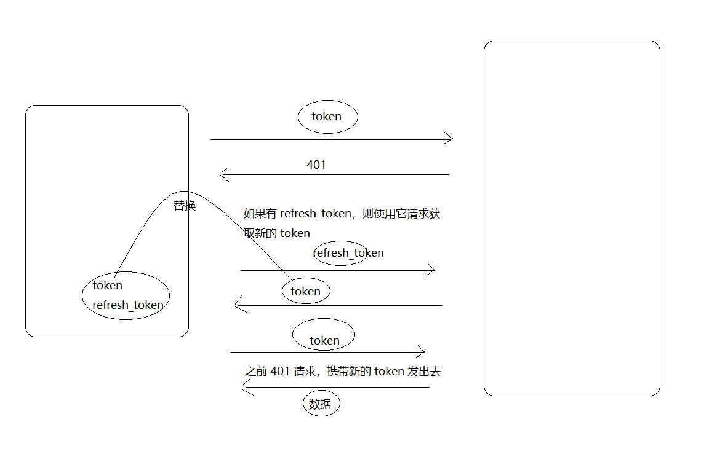

# 十二、功能优化

## 处理 token 过期

- 为什么 token 过期时间这么短？
  - 为了安全
- 过期了怎么办？
  - 通过登录页面重新登录获取 token
  - 使用 refresh_token 重新获取新的 token




```js
/**
 * axios 请求相关操作封装到这里
 */
import axios from 'axios'
import jsonBig from 'json-bigint'

// 在非组件模块中使用容器就直接加载即可
// 这里获取到的 store 和你在组件中的 this.$store 是一个东西
import store from '@/store'

// 非组件模块使用路由就直接加载即可
// 如果加载目录下的 index.js ，则可以省略文件名
+ import router from '@/router'

// 之前是这样写的
// axios.defaults.baseURL = 'xxx'
// 之前也是直接使用 axios 发送请求
// 为了方便，把 axios 挂载到了 Vue 的原型对象上了
// this.$axios

// axios.create 方法返回一个请求对象，这个请求对象的功能和 axios 的功能是一样的
// 也就是说我们复制了一个 axios
// 为什么要单独复制一个 axios 出来？
// 因为有时候我们需要单独定制不同的请求
// 例如有的项目中有多个请求地址
//      http://a.com
//      http://b.com
// axios.defaults.baseURL = 'xxx'
// 所以推荐这么做
const request = axios.create({
  // 请求的基础路径
  baseURL: 'http://ttapi.research.itcast.cn/'
})

/**
 * 配置处理后端返回数据中超出 js 安全整数范围问题
 */
request.defaults.transformResponse = [function (data) {
  return data ? jsonBig.parse(data) : {} // 换了一个转化方法 使得 计算更精确 保证id不失真
}]

/**
 * 请求拦截器，请求到达后台之前拦截
 */
request.interceptors.request.use(function (config) {
  // 在发起请求请做一些业务处理
  // config是要发送请求的配置信息
  const user = store.state.user
  if (user) {
    // Authorization 是后端要求的名字，不能瞎写
    // 数据值 "Bearer空格token" 也是后端要求的数据格式，不能瞎写
    // 千万!千万!千万!注意，Bearer 和 token 之间的空格不能少
    // 什么意义？这是后端要求的，我们决定不了。
    config.headers['Authorization'] = `Bearer ${user.token}` // 统一注入token 到headers属性 因为所有接口要求的token格式是一样的
  }
  return config
}, function (error) {
  // 对请求失败做处理
  return Promise.reject(error)
})

/**
 * 响应拦截器
 */
+++ request.interceptors.response.use(function (response) { // <400 的状态码进入这里
  return response
}, async function (error) { // >= 400 的状态码会进入这里
  console.dir(error)
  // 如果状态码是 401
  if (error.response && error.response.status === 401) {
    const { user } = store.state
    if (!user) {
      // 直接跳转登录页
      router.push({
        name: 'login'
      })
    } else {
      try {
        // 请求获取新的 token
        const { data } = await axios({
          method: 'PUT',
          url: 'http://ttapi.research.itcast.cn/app/v1_0/authorizations',
          headers: {
            Authorization: `Bearer ${user.refresh_token}`
          }
        })

        // 将最新的 token 替换原有 token
        store.commit('setUser', {
          token: data.data.token, // 最新获取的
          refresh_token: user.refresh_token // 还是原来的
        })

        // 将原来失败的请求继续发出去
        return request(error.config)
      } catch (err) {
        console.log(err)
        // 刷新 token 也失败了，直接跳转到登录页
        router.push({
          name: 'login'
        })
      }
    }
  }
  // 如果有 refresh_token，则请求刷新 token
  return Promise.reject(error)
})

// 导出这个请求对象，哪里需要发请求，哪里就加载使用
export default request

```


## 登录成功跳转回原来页面

首先在响应拦截器中：

```js
/**
 * axios 请求相关操作封装到这里
 */
import axios from 'axios'
import jsonBig from 'json-bigint'

// 在非组件模块中使用容器就直接加载即可
// 这里获取到的 store 和你在组件中的 this.$store 是一个东西
import store from '@/store'

// 非组件模块使用路由就直接加载即可
// 如果加载目录下的 index.js ，则可以省略文件名
import router from '@/router'

// 之前是这样写的
// axios.defaults.baseURL = 'xxx'
// 之前也是直接使用 axios 发送请求
// 为了方便，把 axios 挂载到了 Vue 的原型对象上了
// this.$axios

// axios.create 方法返回一个请求对象，这个请求对象的功能和 axios 的功能是一样的
// 也就是说我们复制了一个 axios
// 为什么要单独复制一个 axios 出来？
// 因为有时候我们需要单独定制不同的请求
// 例如有的项目中有多个请求地址
//      http://a.com
//      http://b.com
// axios.defaults.baseURL = 'xxx'
// 所以推荐这么做
const request = axios.create({
  // 请求的基础路径
  baseURL: 'http://ttapi.research.itcast.cn/'
})

/**
 * 配置处理后端返回数据中超出 js 安全整数范围问题
 */
request.defaults.transformResponse = [function (data) {
  return data ? jsonBig.parse(data) : {} // 换了一个转化方法 使得 计算更精确 保证id不失真
}]

/**
 * 请求拦截器，请求到达后台之前拦截
 */
request.interceptors.request.use(function (config) {
  // 在发起请求请做一些业务处理
  // config是要发送请求的配置信息
  const user = store.state.user
  if (user) {
    // Authorization 是后端要求的名字，不能瞎写
    // 数据值 "Bearer空格token" 也是后端要求的数据格式，不能瞎写
    // 千万!千万!千万!注意，Bearer 和 token 之间的空格不能少
    // 什么意义？这是后端要求的，我们决定不了。
    config.headers['Authorization'] = `Bearer ${user.token}` // 统一注入token 到headers属性 因为所有接口要求的token格式是一样的
  }
  return config
}, function (error) {
  // 对请求失败做处理
  return Promise.reject(error)
})

/**
 * 响应拦截器
 */
request.interceptors.response.use(function (response) { // <400 的状态码进入这里
  return response
}, async function (error) { // >= 400 的状态码会进入这里
  console.dir(error)
  // 如果状态码是 401
  if (error.response && error.response.status === 401) {
    const { user } = store.state
    if (!user) {
      // 在非组件中获取当前路由对象使用：router.currentRoute
      // 它和你在组件中获取的 this.$route 是一个东西
      // console.log(router.currentRoute)

      // 你喜欢上面的写法
      // router.push('/login?redirect=' + router.currentRoute.fullPath)

      // 我喜欢下面的写法
      router.push({
        name: 'login',
+        query: {
+          redirect: router.currentRoute.fullPath
+          // foo: 'bar'
+        }
      })
    } else {
      try {
        // 请求获取新的 token
        const { data } = await axios({
          method: 'PUT',
          url: 'http://ttapi.research.itcast.cn/app/v1_0/authorizations',
          headers: {
            Authorization: `Bearer ${user.refresh_token}`
          }
        })

        // 将最新的 token 替换原有 token
        store.commit('setUser', {
          token: data.data.token, // 最新获取的
          refresh_token: user.refresh_token // 还是原来的
        })

        // 将原来失败的请求继续发出去
        // request 请求会走自己的拦截器
        return request(error.config)
      } catch (err) {
        console.log(err)
        // 刷新 token 也失败了，直接跳转到登录页
        router.push({
          name: 'login',
+          query: {
+            redirect: router.currentRoute.fullPath
+          }
        })
      }
    }
  }
  // 如果有 refresh_token，则请求刷新 token
  return Promise.reject(error)
})

// 导出这个请求对象，哪里需要发请求，哪里就加载使用
export default request

```

然后在登录成功以后：

```js
<template>
  <div class="login">
    <!-- 导航栏 -->
    <van-nav-bar
      title="标题"
    />
    <!-- /导航栏 -->

    <!-- 登录表单 -->
    <ValidationObserver ref="loginForm">
      <van-cell-group>
        <!--
          name 提示的文本
          rules 验证规则
            required 必填项
            email
            max
            ....
            参考文档：https://logaretm.github.io/vee-validate/api/rules.html#alpha

          v-slot="{ errors }" 获取校验结果数据
            errors[0] 读取校验结果的失败信息
         -->
        <!-- <ValidationProvider name="手机号" rules="required|email|max:5" v-slot="{ errors }"> -->
        <ValidationProvider name="手机号" rules="required|phone" v-slot="{ errors }">
          <van-field
            v-model="user.mobile"
            required
            clearable
            label="手机号"
            placeholder="请输入手机号"
            :error-message="errors[0]"
          />
        </ValidationProvider>

        <ValidationProvider name="验证码" rules="required|max:6" v-slot="{ errors }">
          <van-field
            v-model="user.code"
            type="password"
            label="验证码"
            placeholder="请输入验证码"
            required
            :error-message="errors[0]"
          />
        </ValidationProvider>
      </van-cell-group>
    </ValidationObserver>
    <!-- /登录表单 -->

    <!-- 登录按钮 -->
    <div class="btn-wrap">
      <van-button class="btn" type="info" @click="onLogin">登录</van-button>
    </div>
    <!-- /登录按钮 -->
  </div>
</template>

<script>
import { login } from '@/api/user'
import { setItem } from '@/utils/storage'

export default {
  name: 'LoginIndex',
  data () {
    return {
      user: {
        mobile: '15555555555', // 手机号
        code: '246810' // 验证码
      }
    }
  },

  methods: {
    async onLogin () {
      // 表单验证
      const isValid = await this.$refs.loginForm.validate()

      // 如果验证失败，阻止表单提交
      if (!isValid) {
        return
      }

      // 验证通过，loading，请求
      this.$toast.loading({
        duration: 0, // 持续展示 toast
        forbidClick: true, // 禁用背景点击
        loadingType: 'spinner',
        message: '登录中'
      })

      try {
        // 请求提交表单数据
        const { data } = await login(this.user)

        console.log(data)

        // 如果 loading 后面有 success、fail 之类的提示，就不需要手动的关闭了
        // 因为 success、fail 会自动把 loading 也给关掉
        // toast.clear()

        // 登录成功，将 token 存储到 Vuex 容器中
        this.$store.commit('setUser', data.data)

        // 为了防止页面刷新数据丢失，我们需要把数据放到本地存储
        setItem('user', data.data)

        this.$toast.success('登录成功')

        // 跳转到之前的页面或首页
+        this.$router.push(this.$route.query.redirect || '/')
      } catch (err) { // 所有大于等于 400 的状态码都会进入 catch
        if (err.response && err.response.status === 400) {
          this.$toast.fail('登录失败，手机号或验证码错误')
        }
      }
    }
  }
}
</script>

<style lang="less" scoped>
.login {
  .btn-wrap {
    padding: 20px;
    .btn {
      width: 100%;
      background-color: #6db4fb;
      color: #fff;
    }
  }
}
</style>

```


## 解决移动端点击 300ms 延迟

有些移动端浏览器的点击事件有 300ms 延迟问题，为了保证都没事儿，我们建议把 fastclick 配置到你的项目中。

安装 FastClick：

```bash
npm i fastclick
```

在 `main.js` 中：

```js
import Vue from 'vue'
import App from './App.vue'
import router from './router'
import store from './store'
import './utils/datetime'
import {
  Button,
  Cell,
  CellGroup,
  NavBar,
  Field,
  Toast,
  Tabbar,
  TabbarItem,
  Tab,
  Tabs,
  List,
  PullRefresh,
  Grid,
  GridItem,
  Image,
  Lazyload,
  Popup,
  Icon,
  Search,
  Loading,
  Dialog,
  ActionSheet,
  DatetimePicker
} from 'vant'

import './styles/index.less'

// 表单验证
import { ValidationProvider, ValidationObserver, extend } from 'vee-validate' // 核心组件
import zhCN from 'vee-validate/dist/locale/zh_CN' // 中文语言包
import * as rules from 'vee-validate/dist/rules' // 验证规则
+ import fastClick from 'fastclick'

+ fastClick.attach(document.body)

// 配置使用中文语言
for (let rule in rules) {
  extend(rule, {
    ...rules[rule], // add the rule
    message: zhCN.messages[rule] // add its message
  })
}

// 注册为全局组件
Vue.component('ValidationProvider', ValidationProvider)
Vue.component('ValidationObserver', ValidationObserver)

// 扩展自定义校验规则
// extend('规则名称', 配置对象)
extend('phone', {
  // 验证方法，value 是需要校验的数据，返回一个布尔值，表示验证成功与否
  validate: function (value) {
    return /^1\d{10}$/.test(value)
  },
  // 错误提示消息
  message: '请输入有效的手机号码'
})

Vue
  .use(Button)
  .use(Cell)
  .use(CellGroup)
  .use(NavBar)
  .use(Field)
  .use(Toast)
  .use(Tabbar)
  .use(TabbarItem)
  .use(Tab)
  .use(Tabs)
  .use(List)
  .use(PullRefresh)
  .use(Grid)
  .use(GridItem)
  .use(Image)
  .use(Lazyload)
  .use(Popup)
  .use(Icon)
  .use(Search)
  .use(Loading)
  .use(Dialog)
  .use(ActionSheet)
  .use(DatetimePicker)

Vue.config.productionTip = false

new Vue({
  router,
  store,
  render: h => h(App)
}).$mount('#app')

```


## 组件缓存

> 参考文档：
>
> - [在动态组件上使用 `keep-alive`](https://cn.vuejs.org/v2/guide/components-dynamic-async.html#在动态组件上使用-keep-alive)

```html
<!-- 失活的组件将会被缓存！-->
<keep-alive>
  动态组件
</keep-alive>
```

> 注意：`<keep-alive>` 要求被切换到的组件都有自己的名字，不论是通过组件的 `name` 选项还是局部/全局注册。

### 禁用组件缓存

> 参考文档：
>
> - https://cn.vuejs.org/v2/api/#keep-alive

手动销毁的方式需要修改组件内部的代码，这里介绍一种更灵活的方式来配置哪些组件缓存，哪些组件不缓存。

`include` 和 `exclude` 属性允许组件有条件地缓存。二者都可以用逗号分隔字符串、正则表达式或一个数组来表示：

```html
<!-- 逗号分隔字符串 -->
<keep-alive include="a,b">
  <component :is="view"></component>
</keep-alive>

<!-- 正则表达式 (使用 `v-bind`) -->
<keep-alive :include="/a|b/">
  <component :is="view"></component>
</keep-alive>

<!-- 数组 (使用 `v-bind`) -->
<keep-alive :include="['a', 'b']">
  <component :is="view"></component>
</keep-alive>
```

匹配首先检查组件自身的 `name` 选项，如果 `name` 选项不可用，则匹配它的局部注册名称 (父组件 `components` 选项的键值)。匿名组件不能被匹配。

## 移动端 REM 适配

## 路由懒加载


