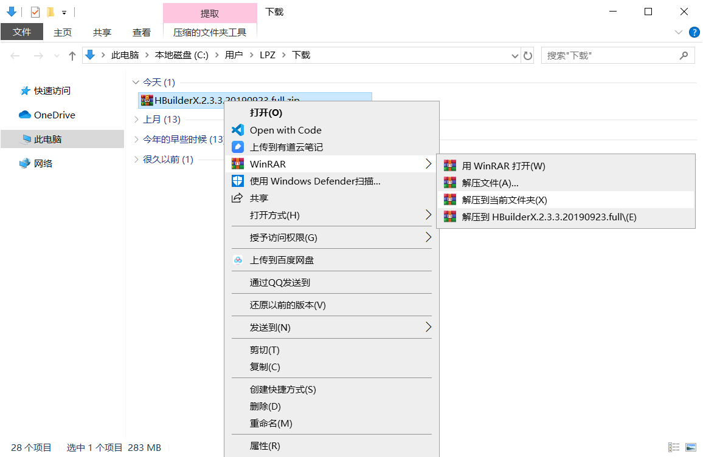

# 十四、打包移动 App

## [移动 App 开发相关概念](./mobile-app.md)

## DCloud HTML5+ App

### 下载安装 HBuilder

访问 HBuilder 的下载页面：https://www.dcloud.io/hbuilderx.html


> 选择 DOWNLOAD


> 根据自己的操作系统下载对应的安装包。
>
> - 标准版：可直接用于web开发、markdown、字处理场景。做App仍需要安装插件
>
> - App开发板：在标准版的基础之上预置了App/uni-app开发所需的插件，开箱即用
>
> 如果是开发 App 建议下载安装App开发版即可。


> 下载的文件是一个压缩包



> 解压到当前文件夹（或者其它目录都可以）


> 解压时间比较长，耐心等待一下...


> 解压好以后得到一个名为 `HBuilderX` 的目录


> 进入 HBuilderX 目录中，找到 `HBuilderX.exe` 并打开。


### 创建项目

在 Hbuilder 的菜单栏中依次找到：文件 -> 新建 -> 项目


> - 项目类型：选择 5+App
> - 项目名称：给项目起个名字
> - 存储目录：设置项目的存储目录
> - 项目模板：选择默认模板
>
> 配置好以后，点击“创建”


> 创建完成。

项目目录结构说明：

- `css`：存储项目中的样式文件资源

- `img`：存储项目中的图片文件资源

- `js`：存储项目中的js文件资源
- `unpackage`：存储不需要打包的文件资源
- `index.html`：项目首页
- `manifest.json`：打包App的配置文件

为了待会儿我们真机调试运行能够看到页面效果，我们这里在项目的 `index.html` 中添加一个标签：

```html
<h1>Hello World</h1>
```


### 真机调试运行

这里我们主要了解如何把上一步创建好的项目运行到手机上（仅用于开发测试）。

#### Android

1、打开手机的开发者选项

在手机的设置中找到开发者选项：


> 提示：大多数安卓手机的设置中默认没有开发者选项，如果没有就打开百度搜索：你的手机品牌型号开发者选项，例如：小米9开发者选项，然后根据搜索到的结果找到并打开开发者选项。

2、启用开发者选项和 USB 调试


3、使用数据线连接手机和电脑


4、在 HBuilder 的菜单栏中依次选择：运行 -> 运行到手机或模拟器 -> 你的手机设备


> 提示：如果没有发现你的手机设备，请参考：[HBuilder/HBuilderX真机运行、手机运行、真机联调常见问题](http://ask.dcloud.net.cn/article/97)


> 运行到设备之后，Hbuilder 中会自动打开一个控制台并输出运行日志。

然后 Hbuilder 需要安装调试基座（应用）到手机中，这个时候手机会提示你是否允许安装该应用，选择允许即可。

调试基座安装好以后，Hbuilder 会自动打开并将项目运行到这个 App 中。


然后我们在 `index.html` 新增一些内容：

```html
<p>杨柳青青江水平</p>
<p>闻郎江上唱歌声</p>
<p>东边日出西边雨</p>
<p>道是无晴却有晴</p>
```


我们可以看到，手机App中的内容也自动更新了。

#### iOS

1、下载安装 [iTunes](https://www.apple.com/cn/itunes/download/)

2、使用数据线连接到电脑

3、确保 iTunes 能够正常连接到手机

4、在 Hbuilder 中选择运行到你的 iPhone 设备

5、它会在手机中安装一个用于调试的测试 App：Hbuilder

6、在手机上设置 Hbuilder 为受信任的开发者

因为 iPhone 的权限比较高，所以打开 Hbuilder 会提示“未受信任的企业级开发者”，所以这里需要手动设置该应用为受信任的开发者。


> 打开手机的设置


> 在设置中找到通用并打开


> 打开设备管理


> 打开名称为 Digital Heaven... 的选项


> 选择“信任Digital Heaven...”


> 选择信任

设置好以后就可以正常打开了，之后的其它操作和 Android 类似。

### 访问 HTML5 + API

- [HTML5+ API Reference](http://www.html5plus.org/doc/h5p.html)

### 打包发布

- 配置 [manifest.json](http://ask.dcloud.net.cn/article/94) 文件
- 在 HBuilder 中找到：发行 -> 原生 App（云打包）
- 等待一段时间，得到打包结果安装包，然后安装到手机上测试
- 最后根据需要发布到对应的手机应用商店

#### 配置 manifest

- [Manifest.json文档说明 manifest配置](http://ask.dcloud.net.cn/article/94)

#### 打包

- 离线打包
- 云打包

#### 发布

## 使用 Vue.js 开发 HTML5+ App

### HelloWorld

一、使用 VueCLI 创建项目

```bash
vue create 项目名称
```


二、真机调试运行


三、打包发布

1、在项目的 `vue.config.js` 文件中

```js
/**
 * 配置文档：https://cli.vuejs.org/zh/config/
 */

module.exports = {
  /**
  * / 用于部署在 HTTP 服务中
  * 如果是混合应用，则将其设置为相对路径 ./
  * 参考文档：https://cli.vuejs.org/zh/config/#publicpath
  */
  publicPath: './',
  
  devServer: {
    // host: '和手机在一个网段的网卡地址'
  }
}

```

2、在项目的 `public` 目录中添加一个文件 `manifest.json`

```json
{
    "@platforms": ["android", "iPhone", "iPad"],
    "id" : "H54723C87",/*应用的标识*/
    "name" : "test",/*应用名称，程序桌面图标名称*/
    "version": {
        "name": "1.0",/*应用版本名称*/
        "code": ""
    },
    "description": "",/*应用描述信息*/
    "icons": {
        "72": "icon.png"
    },
    "launch_path": "http://172.20.10.8:8080",/*应用的入口页面，默认为根目录下的index.html；支持网络地址，必须以http://或https://开头*/
    "developer": {
        "name": "",/*开发者名称*/
        "email": "",/*开发者邮箱地址*/
        "url": ""/*开发者个人主页地址*/
    },
    "permissions": {
        "Accelerometer": {
            "description": "访问加速度感应器"
        },
        "Audio": {
            "description": "访问麦克风"
        },
        "Messaging":{
        	"description": "短彩邮件插件"
        },
        "Cache": {
            "description": "管理应用缓存"
        },
        "Camera": {
            "description": "访问摄像头"
        },
        "Console": {
            "description": "跟踪调试输出日志"
        },
        "Contacts": {
            "description": "访问系统联系人信息"
        },
        "Device": {
            "description": "访问设备信息"
        },
        "Downloader": {
            "description": "文件下载管理"
        },
        "Events": {
            "description": "应用扩展事件"
        },
        "File": {
            "description": "访问本地文件系统"
        },
        "Gallery": {
            "description": "访问系统相册"
        },
        "Geolocation": {
            "description": "访问位置信息"
        },
        "Invocation": {
            "description": "使用Native.js能力"
        },
        "Orientation": {
            "description": "访问方向感应器"
        },
        "Proximity": {
            "description": "访问距离感应器"
        },
        "Storage": {
            "description": "管理应用本地数据"
        },
        
        "Uploader": {
            "description": "管理文件上传任务"
        },
        "Runtime": {
            "description": "访问运行期环境"
        },
        "XMLHttpRequest": {
            "description": "跨域网络访问"
        },
        "Zip": {
            "description": "文件压缩与解压缩"
        },
        "Barcode": {
            "description": "管理二维码扫描插件"
        },
        "Maps": {
            "description": "管理地图插件"
        },
        "Speech": {
            "description": "管理语音识别插件"
        },
        "Webview":{
        	"description": "窗口管理"
        },
        "NativeUI":{
        	"description": "原生UI控件"
        },
        "Navigator":{
        	"description": "浏览器信息"
        },
        "NativeObj":{
        	"description": "原生对象"
        }
    },
    "plus": {
        "splashscreen": {
            "autoclose": true,/*是否自动关闭程序启动界面，true表示应用加载应用入口页面后自动关闭；false则需调plus.navigator.closeSplashscreen()关闭*/
            "waiting": true/*是否在程序启动界面显示等待雪花，true表示显示，false表示不显示。*/
        },
        "popGesture": "close",/*设置应用默认侧滑返回关闭Webview窗口，"none"为无侧滑返回功能，"hide"为侧滑隐藏Webview窗口。参考http://ask.dcloud.net.cn/article/102*/
        "runmode": "normal",/*应用的首次启动运行模式，可取liberate或normal，liberate模式在第一次启动时将解压应用资源（Android平台File API才可正常访问_www目录）*/
        "signature": "Sk9JTiBVUyBtYWlsdG86aHIyMDEzQGRjbG91ZC5pbw==",/*可选，保留给应用签名，暂不使用*/
        "distribute": {
            "apple": {
                "appid": "",/*iOS应用标识，苹果开发网站申请的appid，如io.dcloud.HelloH5*/
                "mobileprovision": "",/*iOS应用打包配置文件*/
                "password": "",/*iOS应用打包个人证书导入密码*/
                "p12": "",/*iOS应用打包个人证书，打包配置文件关联的个人证书*/
                "devices": "universal",/*iOS应用支持的设备类型，可取值iphone/ipad/universal*/
                "frameworks":[
                ]/*调用Native.js调用原生Objective-c API需要引用的FrameWork，如需调用GameCenter，则添加"GameKit.framework"*/
            },
            "google": {
                "packagename": "",/*Android应用包名，如io.dcloud.HelloH5*/
                "keystore": "",/*Android应用打包使用的密钥库文件*/
                "password": "",/*Android应用打包使用密钥库中证书的密码*/
                "aliasname": "",/*Android应用打包使用密钥库中证书的别名*/
               "permissions": ["<uses-permission android:name=\"android.permission.CHANGE_NETWORK_STATE\"/>","<uses-permission android:name=\"android.permission.MOUNT_UNMOUNT_FILESYSTEMS\"/>","<uses-permission android:name=\"android.permission.READ_CONTACTS\"/>","<uses-permission android:name=\"android.permission.VIBRATE\"/>","<uses-permission android:name=\"android.permission.READ_LOGS\"/>","<uses-permission android:name=\"android.permission.ACCESS_WIFI_STATE\"/>","<uses-feature android:name=\"android.hardware.camera.autofocus\"/>","<uses-permission android:name=\"android.permission.WRITE_CONTACTS\"/>","<uses-permission android:name=\"android.permission.ACCESS_NETWORK_STATE\"/>","<uses-permission android:name=\"android.permission.CAMERA\"/>","<uses-permission android:name=\"android.permission.RECORD_AUDIO\"/>","<uses-permission android:name=\"android.permission.GET_ACCOUNTS\"/>","<uses-permission android:name=\"android.permission.MODIFY_AUDIO_SETTINGS\"/>","<uses-permission android:name=\"android.permission.READ_PHONE_STATE\"/>","<uses-permission android:name=\"android.permission.CHANGE_WIFI_STATE\"/>","<uses-permission android:name=\"android.permission.WAKE_LOCK\"/>","<uses-permission android:name=\"android.permission.CALL_PHONE\"/>","<uses-permission android:name=\"android.permission.FLASHLIGHT\"/>","<uses-permission android:name=\"android.permission.ACCESS_COARSE_LOCATION\"/>","<uses-feature android:name=\"android.hardware.camera\"/>","<uses-permission android:name=\"android.permission.ACCESS_FINE_LOCATION\"/>","<uses-permission android:name=\"android.permission.WRITE_SETTINGS\"/>"]
				/*使用Native.js调用原生安卓API需要使用到的系统权限*/
            },
            "orientation": [
                "portrait-primary"
            ],/*应用支持的方向，portrait-primary：竖屏正方向；portrait-secondary：竖屏反方向；landscape-primary：横屏正方向；landscape-secondary：横屏反方向*/
            "icons": {
                "ios": {
                    "prerendered": true, /*应用图标是否已经高亮处理，在iOS6及以下设备上有效*/
                    "auto": "", /*应用图标，分辨率：512x512，用于自动生成各种尺寸程序图标*/
                    "iphone": {
                        "normal": "", /*iPhone3/3GS程序图标，分辨率：57x57*/
                        "retina": "", /*iPhone4程序图标，分辨率：114x114*/
                        "retina7": "", /*iPhone4S/5/6程序图标，分辨率：120x120*/
			"retina8": "", /*iPhone6 Plus程序图标，分辨率：180x180*/
                        "spotlight-normal": "", /*iPhone3/3GS Spotlight搜索程序图标，分辨率：29x29*/
                        "spotlight-retina": "", /*iPhone4 Spotlight搜索程序图标，分辨率：58x58*/
                        "spotlight-retina7": "", /*iPhone4S/5/6 Spotlight搜索程序图标，分辨率：80x80*/
                        "settings-normal": "", /*iPhone4设置页面程序图标，分辨率：29x29*/
                        "settings-retina": "", /*iPhone4S/5/6设置页面程序图标，分辨率：58x58*/
			"settings-retina8": "" /*iPhone6Plus设置页面程序图标，分辨率：87x87*/
                    },
                    "ipad": {
                        "normal": "", /*iPad普通屏幕程序图标，分辨率：72x72*/
                        "retina": "", /*iPad高分屏程序图标，分辨率：144x144*/
                        "normal7": "", /*iPad iOS7程序图标，分辨率：76x76*/
                        "retina7": "", /*iPad iOS7高分屏程序图标，分辨率：152x152*/
                        "spotlight-normal": "", /*iPad Spotlight搜索程序图标，分辨率：50x50*/
                        "spotlight-retina": "", /*iPad高分屏Spotlight搜索程序图标，分辨率：100x100*/
                        "spotlight-normal7": "",/*iPad iOS7 Spotlight搜索程序图标，分辨率：40x40*/
                        "spotlight-retina7": "",/*iPad iOS7高分屏Spotlight搜索程序图标，分辨率：80x80*/
                        "settings-normal": "",/*iPad设置页面程序图标，分辨率：29x29*/
                        "settings-retina": "" /*iPad高分屏设置页面程序图标，分辨率：58x58*/
                    }
                },
                "android": {
                    "mdpi": "", /*普通屏程序图标，分辨率：48x48*/
                    "ldpi": "", /*大屏程序图标，分辨率：48x48*/
                    "hdpi": "", /*高分屏程序图标，分辨率：72x72*/
                    "xhdpi": "",/*720P高分屏程序图标，分辨率：96x96*/
                    "xxhdpi": ""/*1080P 高分屏程序图标，分辨率：144x144*/
                }
            },
            "splashscreen": {
                "ios": {
                    "iphone": {
                        "default": "", /*iPhone3启动图片选，分辨率：320x480*/
                        "retina35": "",/*3.5英寸设备(iPhone4)启动图片，分辨率：640x960*/
                        "retina40": "",/*4.0 英寸设备(iPhone5/iPhone5s)启动图片，分辨率：640x1136*/
                        "retina47": "",/*4.7 英寸设备(iPhone6)启动图片，分辨率：750x1334*/
                        "retina55": "",/*5.5 英寸设备(iPhone6 Plus)启动图片，分辨率：1242x2208*/
                        "retina55l": ""/*5.5 英寸设备(iPhone6 Plus)横屏启动图片，分辨率：2208x1242*/
                    },
                    "ipad": {
                        "portrait": "", /*iPad竖屏启动图片，分辨率：768x1004*/
                        "portrait-retina": "",/*iPad高分屏竖屏图片，分辨率：1536x2008*/
                        "landscape": "", /*iPad横屏启动图片，分辨率：1024x748*/
                        "landscape-retina": "", /*iPad高分屏横屏启动图片，分辨率：2048x1496*/
                        "portrait7": "", /*iPad iOS7竖屏启动图片，分辨率：768x1024*/
                        "portrait-retina7": "",/*iPad iOS7高分屏竖屏图片，分辨率：1536x2048*/
                        "landscape7": "", /*iPad iOS7横屏启动图片，分辨率：1024x768*/
                        "landscape-retina7": ""/*iPad iOS7高分屏横屏启动图片，分辨率：2048x1536*/
                    }
                },
                "android": {
                    "mdpi": "", /*普通屏启动图片，分辨率：240x282*/
                    "ldpi": "", /*大屏启动图片，分辨率：320x442*/
                    "hdpi": "", /*高分屏启动图片，分辨率：480x762*/
                    "xhdpi": "", /*720P高分屏启动图片，分辨率：720x1242*/
                    "xxhdpi": ""/*1080P高分屏启动图片，分辨率：1080x1882*/
                }
            }
        }
    }
}

```

3、Vue 项目打包

```bash
npm run build
```


3、打包移动 App

在 Hbuilder 中打开上一步打包好的 `dist` 目录，然后分别选择：发行 -> 原生App云打包

### 开发调试

将 manifest.json 中的 `launch_path` 配置为你 `npm run serve` 中给出的局域网网络访问地址。

最后使用 Hbuilder 打开带有 `manifest.json` 文件的项目目录，选择：运行 -> 运行到手机或模拟器 -》 你的手机设备。

### App 打包

1、将 Vue 项目打包（构建为纯粹的 html、css、js），产出 dist

```bash
npm run build
```

2、把 dist 打包 App

3、安装到手机上进行测试

5、发布

## 打包黑马头条

