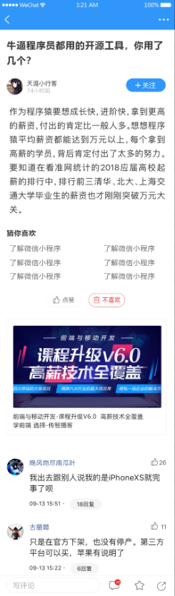

# 黑马头条移动端

- [一、项目初始化](./chapter1.md)
- [二、从登陆开始](./chapter2.md)
- [三、Token 处理](./chapter3.md)
- [四、首页（上）](./chapter4.md)
- [五、首页（下）](./chapter5.md)
- [六、搜索](./chapter6.md)
- [七、文章详情（上）](./chapter7.md)
- [八、文章详情（下）](./chapter8.md)
- [九、我的](./chapter9.md)
- [十、编辑个人信息](./chapter10.md)
- [十一、小智同学](./chapter11.md)
- [十二、功能优化](./chapter12.md)
- [十三、打包发布](./chapter13.md)
- [十四、打包移动App](./chapter14.md)

## 做什么

开发一个类似于今日头条的 Web App。

## 技术栈

- [Vue.js](<https://cn.vuejs.org/>)
- [Vue Router](<https://router.vuejs.org/>)
- [Vuex](<https://github.com/vuejs/vuex>)
- [axios](<https://github.com/axios/axios>)
- [Vue CLI](<https://cli.vuejs.org/>)
- [Vant UI](<https://github.com/youzan/vant>)
- [Lodash](https://lodash.com/)
- [VeeValidate](https://baianat.github.io/vee-validate/)
- [dayjs](https://github.com/iamkun/dayjs)
- ...

## 案例演示

> 用户登录

> 首页

> 频道管理

> 文章详情页

> 个人信息

> 搜索

> 个人中心

> 小智同学

## 课程收获

- 掌握使用 Vue.js 系列技术栈开发移动端项目

- 了解一个中度复杂规模的应用开发
- 学会组件化、模块化的开发思想及方式
- 了解类原生 App 体验交互的实现原理

## 学习前提

- HTML
- CSS
- JavaScript
- Vue.js 系列技术栈

## 课程资料

- 设计稿

- 接口文档

## 源码参考

- https://gitee.com/lipengzhou/topline-mobile

