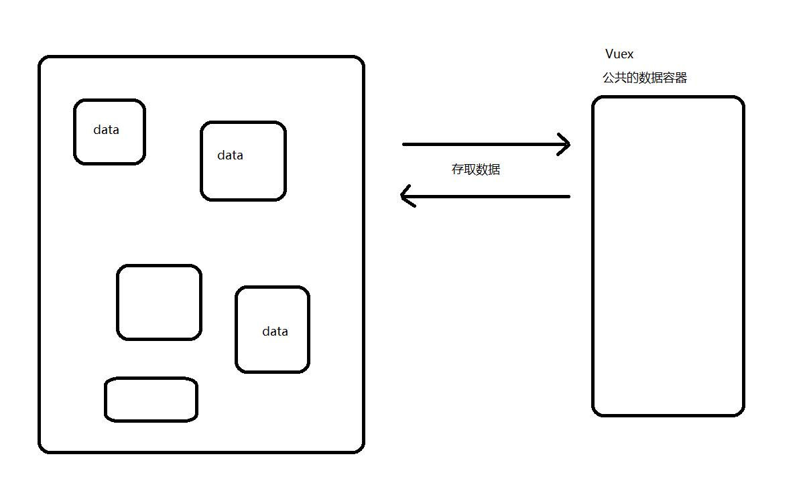
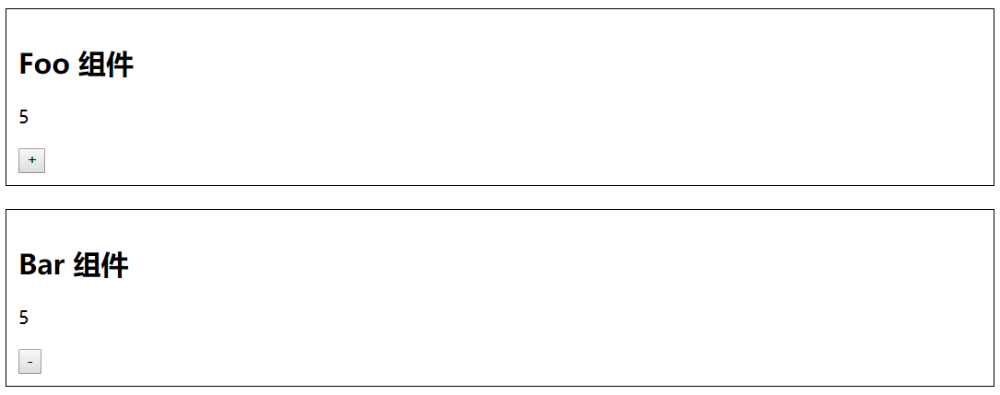
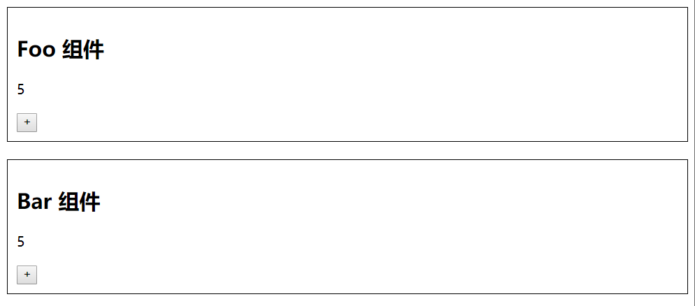
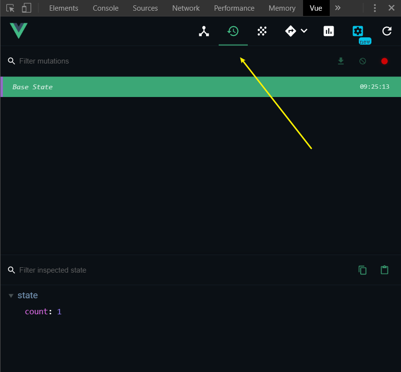
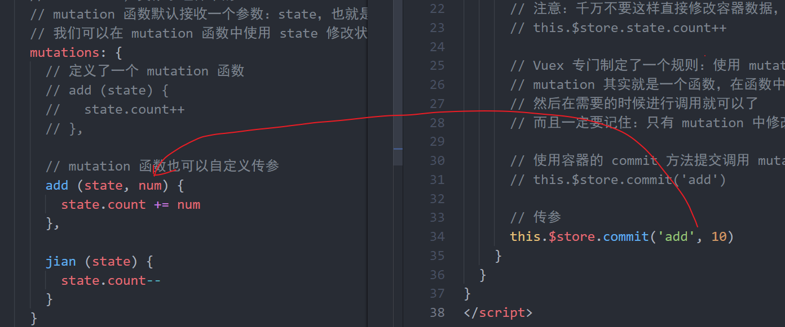
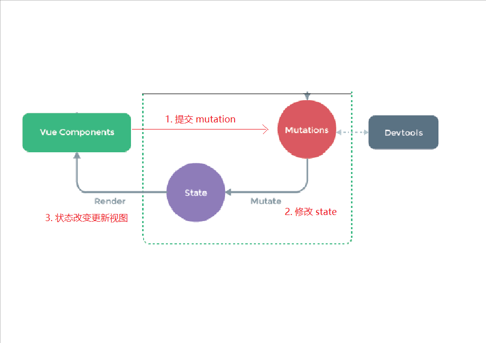
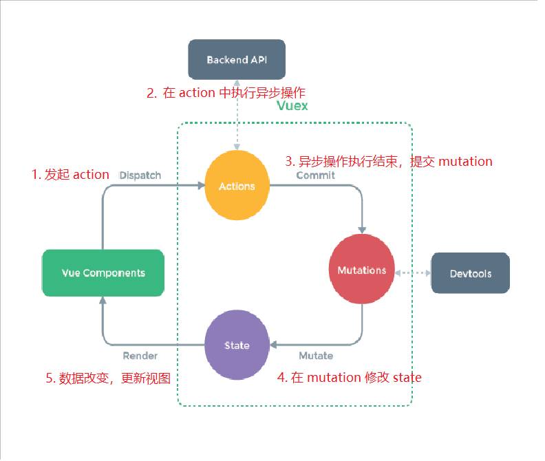

# Vuex 入门

## 介绍

### 组件化开发

在现代 Web 开发复杂多变的需求驱动之下，组件化开发已然成为了事实上的标准。


第三方开发引入了这个核心技术。

- 原生的 Web Components

组件化开发为我们带来了：

- 更快的开发效率
- 更好的可维护性

### 组件内的数据（状态）管理流程

每个组件都有自己的状态、视图和行为等组成部分。

```js
new Vue({
  // state
  data () {
    return {
      count: 0
    }
  },
  // view
  template: `
    <div>{{ count }}</div>
  `,
  // actions
  methods: {
    increment () {
      this.count++
    }
  }
})

```

- **state**，驱动应用的数据源；
- **view**，以声明方式将 **state** 映射到视图；
- **actions**，响应在 **view** 上的用户输入导致的状态变化。


### 组件通信

然而大多数场景下的组件都并不是独立存在的，而是相互协作共同构成了一个复杂的业务功能。在 Vue 中为不同的组件关系提供了不同的通信规则。


- 父子关系
- 非父子
- 。。。


#### 父传子：Props Down

```html
<blog-post title="My journey with Vue"></blog-post>
```

```js
Vue.component('blog-post', {
  props: ['title'],
  template: '<h3>{{ title }}</h3>'
})
```


#### 子传父：Events Up

在子组件中使用 `$emit` 发布一个自定义事件：

```html
<button v-on:click="$emit('enlarge-text')">
  Enlarge text
</button>
```

在使用这个组件的时候，使用 `v-on` 监听这个自定义事件

```html
<blog-post
  ...
  v-on:enlarge-text="postFontSize += 0.1"
></blog-post>
```

#### 通过 ref 获取子组件

在使用组件的时候，添加 ref 属性：

```html
<blog-post title="My journey with Vue" ref="post"></blog-post>
```

然后使用 `$refs` 访问：

```js
this.$refs.post
```


#### 非父子：Event Bus

我们可以使用一个非常简单的 Event Bus 来解决这个问题：

`event-bus.js`:

```js
export default new Vue()
```

然后在需要通信的两个组件中使用：

`$on` 注册/监听自定义事件：

```js
bus.$on('自定义事件名称', () => {
  // 执行操作
})
```

`$emit` 发布调用自定义事件处理函数：

```js
bus.$emit('自定义事件名称'[, 可选参数])
```

> 在很多技术文档中，[] 表示可选的意思，不是说让你写 []

`组件a.vue`:

```html
<script>
import eventBus from 'event-bus.js'
  
export default {
  created () {
    // 注册订阅
    eventBus.$on('事件名称', (参数) => {
      // ...
    })
  }
}
</script>
```

`组件b.vue`:

```html
<template>
  <div>
    <button @click="onEmit">发布</button>
  </div>
</template>

<script>
import eventBus from 'event-bus.js'
  
export default {
  methods: {
    onEmit () {
      // 发布
      eventBus.$emit('事件名称'[, 可选参数])
    }
  }
}
</script>
```


### 多个组件状态共享

但是，当我们的应用遇到**多个组件共享状态**时，单向数据流的简洁性很容易被破坏：

- 多个视图依赖于同一状态。
- 来自不同视图的行为需要变更同一状态。

> 最典型的场景就是购物车

对于问题一，传参的方法对于多层嵌套的组件将会非常繁琐，并且对于兄弟组件间的状态传递无能为力。对于问题二，我们经常会采用父子组件直接引用或者通过事件来变更和同步状态的多份拷贝。以上的这些模式非常脆弱，通常会导致无法维护的代码。

因此，我们为什么不把组件的共享状态抽取出来，以一个全局单例模式管理呢？在这种模式下，我们的组件树构成了一个巨大的“视图”，不管在树的哪个位置，任何组件都能获取状态或者触发行为！



通过定义和隔离状态管理中的各种概念并通过强制规则维持视图和状态间的独立性，我们的代码将会变得更结构化且易维护。

### 什么是 Vuex

> 官方文档：Vuex 是一个专为 Vue.js 应用程序开发的**状态管理模式**。它采用集中式存储管理应用的所有组件的状态，并以相应的规则保证状态以一种可预测的方式发生变化。Vuex 也集成到 Vue 的官方调试工具 [devtools extension](https://github.com/vuejs/vue-devtools)，提供了诸如零配置的 time-travel 调试、状态快照导入导出等高级调试功能。

- Vuex 是专门为 Vue.js 设计的状态管理库
- Vuex 是 Vue 官方开发的一个 Vue 核心插件
- 它的作用是进行状态管理，解决复杂组件通信


### 什么情况下使用 Vuex

> 官方文档：
>
> Vuex 可以帮助我们管理共享状态，并附带了更多的概念和框架。这需要对短期和长期效益进行权衡。
>
> 如果您不打算开发大型单页应用，使用 Vuex 可能是繁琐冗余的。确实是如此——如果您的应用够简单，您最好不要使用 Vuex。一个简单的 [store 模式](https://cn.vuejs.org/v2/guide/state-management.html#简单状态管理起步使用)就足够您所需了。但是，如果您需要构建一个中大型单页应用，您很可能会考虑如何更好地在组件外部管理状态，Vuex 将会成为自然而然的选择。引用 Redux 的作者 Dan Abramov 的话说就是：Flux 架构就像眼镜：您自会知道什么时候需要它。


当你的应用中具有以下需求场景的时候：

- 多个视图依赖于同一状态。
- 来自不同视图的行为需要变更同一状态。

建议符合这种场景的业务使用 Vuex 来进行数据管理，例如非常典型的场景：购物车。


**注意：Vuex 不要滥用，不符合以上需求的业务不要使用，反而会让你的应用变得更麻烦。**

## Vuex 快速入门




以前的思路：

- 在每个组件中都生成一份儿数据
  - num: 0
- 点击 Foo 组件 + 的时候
  - 让自己内部的 num++
  - 利用 eventBus 发布一个自定义事件：数字+
- 在 Bar 组价中
  - 订阅 数字+ 事件，当事件发生，让自己内部的数字 +1

太麻烦了！

### 准备

1、使用 VueCLI 创建一个练习项目：

```bash
vue create vuex-demo

cd vuex-demo

npm run serve
```

2、准备两个组件

Foo.vue

```html
<template>
  <div class="com">
    <h2>Foo 组件</h2>
    <p>5</p>
    <button>+</button>
  </div>
</template>

<script>
export default {

}
</script>

<style>

</style>

```

Bar.vue

```html
<template>
  <div class="com">
    <h2>Bar 组件</h2>
    <p>5</p>
    <button>+</button>
  </div>
</template>

<script>
export default {

}
</script>

<style>

</style>

```


3、最后在 App.vue 中加载使用 Foo 和 Bar

```html
<template>
  <div id="app">
    <foo />
    <bar />
  </div>
</template>

<script>
import Foo from './components/Foo'
import Bar from './components/Bar'

export default {
  name: 'App',
  components: {
    Foo,
    Bar
  }
}
</script>

<style>
.com {
  border: 1px solid #000;
  padding: 10px;
  margin-bottom: 20px;
}
</style>

```

最终预览结果如下：




### 安装 Vuex

官方文档：https://vuex.vuejs.org/zh/installation.html

最方便的方式就是使用 npm：

```bash
npm install vuex
```


### 配置 Vuex

1、在项目中新建 `store/index.js` 并写入以下内容：

```js
import Vue from 'vue'
import Vuex from 'vuex'

Vue.use(Vuex)

/**
 * 创建一个 Vuex 容器实例，用来在组件的外部管理共享的数据状态
 */
const store = new Vuex.Store({
  /**
   * 类似于组件中的 data
   */
  state: {
    count: 0
  }
})

export default store

```

2、在 `main.js` 将 store 配置到 Vue 根实例

```js
...
import store from './store'
..

new Vue({
  ...
  store
  ...
})
```

3、使用容器存取数据

在组件中访问容器数据：


在组件中修改容器数据：


### State


在容器的 state 中定义数据成员：

```js
...
state: {
  count: 0
}
...

```


在任何组件中访问容器中的数据：

- 在 JavaScript 中使用 `this.$store.state.count` 访问
- 在模板中直接 `$store.state.count` 访问


也可以通过调试工具查看 Vuex 容器中的数据：



在调试工具中修改数据我们可以看到 State 数据也是响应式的（数据驱动视图）。


总结：

- 容器中的数据是共享的，任何组件都可以访问
- 容器中的数据也是响应式的，数据改变也会驱动视图更新


> **任务：**
>
> - 在 state 中声明 count
> - 分别在两个组件中访问容器中的数据


### Mutation

> 目标：
>
> - 了解 Mutation 的作用是什么
> - 掌握如何定义 Mutation
> - 掌握如何调用 Mutation

定义 mutation：

```js
/**
 * Vuex 容器核心文件
 */

import Vue from 'vue'
import Vuex from 'vuex'

Vue.use(Vuex)

// 初始化 Vuex 容器
const store = new Vuex.Store({
  // 容器的 state 类似于组件中的 data
  // 我们要做的就是把需要共享的数据放到 state 中就可以了
  // 容器中的数据不属于任何组件，全局共享的，任何组件都可以访问
  state: {
    count: 10
  },

  // mutations，类似于组件中的 methods
  // mutation 函数默认接收一个参数：state，也就是容器的 state
  // 我们可以在 mutation 函数中使用 state 修改状态
+  mutations: {
+    // 定义了一个 mutation 函数
+    add (state) {
+      state.count++
+    },

+    jian (state) {
+      state.count--
+    }
+  }
})

// 导出容器
export default store

```

如何在组件中调用 mutation 函数：

```html
<template>
  <div class="com">
    <h2>Bar 组件</h2>
    <p>{{ $store.state.count }}</p>
+    <button @click="$store.commit('jian')">-</button>
  </div>
</template>

<script>
export default {

}
</script>

<style>

</style>

```

mutation 函数也可以自定义传参：



mutation 函数只能是同步操作：

```js
// 不要在 mutation 中执行操作修改 state
// 为什么？调试工具无法正常工作
// asyncAdd (state) {
//   setTimeout(() => {
//     state.count++
//   }, 1000)
// }
```


总结：

- **修改容器的 state 务必使用 mutation 函数**，因为只有 mutation 函数中修改 state 数据才会和调试工具正常工作。
- mutation 函数的第1个参数是 state 对象
- mutation 函数也可以自定义传递其它参数
- 不要在 mutation 中执行异步操作修改 state，mutation 中只能是同步操作
  - 因为调试工具也无法正常工作。
  - 如果需要执行异步操作，请使用 Action。


### Action

> 目标：
>
> - 了解 Action 的作用是什么
> - 掌握如何定义 Action
> - 掌握如何调用 Action

定义 action：

```js
actions: {
  asyncAdd (context) {
    // 执行异步操作
    // 提交 mutation 修改 state
  }
}
```

调用 action：

```js
$store.dispatch('action函数名称'[, 可选参数])
```


总结：

- 不要在 mutation 中执行异步操作修改 state，正确的做法是在 action 中执行异步操作
- action 中异步操作结束以后，提交 mutation 来修改 state
- 注意：也不要在 action 中直接修改 state，永远通过 mutation 来修改 state
- action 函数的第1个参数是容器对象
- action 也可以像 mutation 函数一样自定义传参


### 数据管理流程

> 目标：
>
> - 了解 Vuex 的状态管理流程


同步操作：



1. commit 提交 mutation

2. 在 mutation 中修改 state 状态

3. state 状态改变，驱动视图更新


异步操作：



1. dispatch 发起 action

2. 在 action 中执行异步操作

3. action 中异步操作执行结束之后，commit 提交 mutation

4. 在 mutation 中修改 state 状态

5. state 状态改变，驱动视图更新


