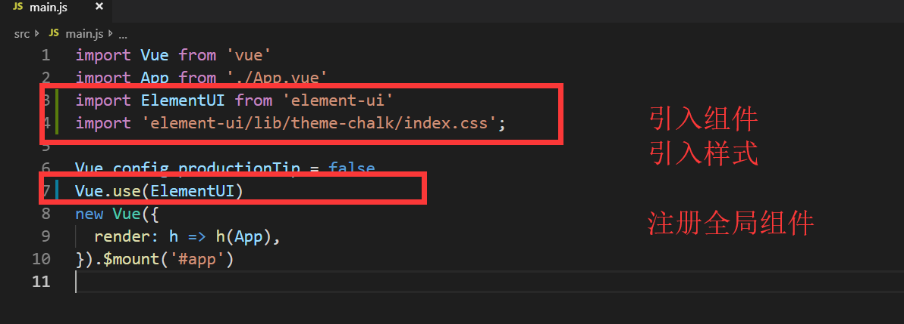
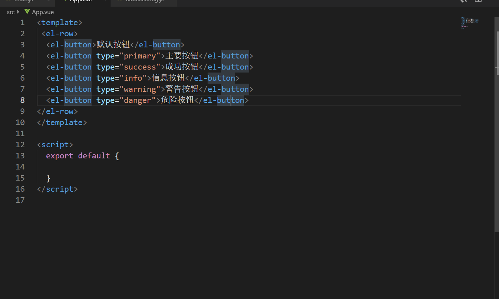

[TOC]

# 0. vue 结构

```HTML
<body>
    <div id="app"></div>
    <script src="./vue.js"></script>
    <script>
        var vm = new Vue({
            el: '#app',     // element
            template: ``,   // 模板（组件用法）
            data: {},       // model数据
            methods: {},    // 方法
            filters: {},    // 过滤器（局部/全局）
            directives: {}, // 自定义指令（局部/全局）
            computed: {},   // 计算属性
            watch: {},      // 监视
            components: {}, // 组件
            router: {},     // 路由  
            // 8个钩子函数
            beforeCreate: function () { },
            created: function () { },  // 创建
            beforeMount: function () { },
            mounted: function () { },  // 加载
            beforeUpdate: function () { },
            updated: function () { },  // 修改
            beforeDestory: function () { },
            destoryed: function () { },// 销毁
        });
    </script>
</body>
```

# 1. vue 介绍

## 1.1 vue 简介之前端现状

>**`目标`**: 了解Vue是什么 
>
>* Vue是一个优秀的**`前端框架`**
>* 开发者按照Vue的**`规范`**进行开发
>* 目前企业的技术栈中,Vue及Vue的语法规范占了**`半壁江山`** 
>* Vuejs 开发H5,微信小程序  Vue语法+ 一点react语法 + 一点自创语法 => 微信小程序
>* mpVue(美团) => Vue 85%  uni-app(多端应用) 90% Vue语法
>* 目前前端**`必备`**技能
>* 传统方式已经不能适应目前越来越**`复杂`**的开发需求
>* 前端发展**`日新月异`**
>* 一般新框架 不是以vue作为基础语言,就是用react

## 1.2 vue 的特点和能做什么

>**`目标`**了解Vue能做什么以及Vue的特点
>
>1. `数据`驱动**视图**  可以让我们只关注数据,完全**`解耦`**数据和**`视图`**  =>响应式数据 => 数据变化 => **`视图一定变化`**  
>  * document.getElementById("").innerText =""
>  * Vue将视图和数据进行绑定 => 改变数据 => 视图自动变化
>2. **`MVVM`** 双向绑定  => v-model => 数据变化 => 视图变化   视图变化 => 数据变化
>3. 通过**`指令`**增强了html功能 `新特性`
>4. 组件化 **`复用代码`**
>5. 开发者一般只需要关注数据
>6. 适应当前**`SPA`**的项目开发  single page application
>7. 传统网站开发 一般来说 需求不大
>8. 当下各种新框架都采用了**类Vue**或者**类React**的语法去作 为主语法, 微信小程序/MpVue/uni-app  
>
>**`结论`**掌握Vue的开发语法 相当于掌握了新的开发模式,可以适应目前绝大多数的技术环境

## 1.3 Vue学习的文档链接

>**`目标`** 知道如何查阅文档
>
>[Vue官方文档](https://cn.vuejs.org/)
>
>[Vue开源项目汇总](https://github.com/opendigg/awesome-github-vue)
>
>[Vue.js中文社区](https://www.vue-js.com/)
>
>* 所有关于Vue的问题都可以通过**`查阅文档`**解决
>

## 1.4 vue 三种安装方式

> **`目标`**: 了解采用几种方式安装vue
>
> 1. 采用本地文件引入的方式
> 2. 采用 **`在线cdn`**引入的方式
>
> - cdn相当于把一个文件放在了全国各地,然后你离哪里近,就从哪里调拨给你
>
> 1. 采用 **`npm`** 安装的方式 
> 2. 现状: 都会采用npm的方式来进行正式项目开发
>

# 2. vue 基本语法

## 2.1 vue 初体验

```html
<body>
	<!-- 1.设置vue的管理视图 -->
    <div id="app">
        <!-- 5.使用数据 -->
        {{ data }}
        {{ fn() }}
    </div>
    <!-- 2.引入vuejs -->
    <script src="./vue.js"></script>
    <script>
        // 3.实例化Vue对象
        var vm = new Vue({
            // 4. 设置vue实例的选项 将对象与视图发生关系
            el: '#app',
            data: {
                name: "helloWorld"
            },
            methods:{
                fn(){
                    return this.name;
                }
            }
        });
    </script>
</body>
```

## 2.2 实例选项

### 2.2.1 el

* 作用：当前Vue实例所管理的html视图
* 值：**`通常`**是id选择器(或者是一个 HTMLElement 实例)
* el所管理的视图**`不能是html或者body!`**
* 选择器 **只匹配第一个满足条件的元素** (**Vue实例 => 管理视图 1对1**)

### 2.2.2 data

**`数据驱动视图`** => 数据变化 => 视图一定变化  只需要关注数据

* Vue 实例的数据对象，是**`响应式数据`**(数据驱动视图) 数据变化 => 视图变化
* 可以通过 `vm.$data` 访问原始数据对象
* Vue 实例也代理了 data 对象上所有的属性，因此访问 `vm.a` 等价于访问 `vm.$data.a`
* 视图中绑定的数据必须**`显式`**的初始化到 data 中
* 数据对象的更新方式 直接 采用 **实例.属性 = 值**

### 2.2.3 methods

* methods是一个对象
* 可以直接通过 vm 实例访问这些方法，或者在**`插值表达式中使用`**。
* 方法中的 `this` 自动绑定为 Vue 实例。
* methods 中所有的方法 同样也被代理到了 Vue 实例对象上,都可通过this访问
* 注意，**不应该使用箭头函数来定义 method 函数** (例如 `plus: () => this.a++`)。理由是箭头函数绑定了**`父级作用域`**的上下文，所以 `this` 将不会按照期望指向 Vue 实例，`this.a` 将是 undefined

> vm. 调用到 data中所有的属性
> vm. 调用到methods中所有的方法
> **`data中命名不能和methods中的方法重名`**

# 3. 术语解释

## 3.1 插值表达式（重点）

> 作用：会将绑定的数据实时的显示出来:
>
> 形式： 通过 **`{{ 插值表达式 }}`**包裹的形式 
>
> 通过任何方式修改所绑定的数据，所显示的数据都会被实时替换(**响应式数据**)**数据驱动视图**
>
> 插值表达式 => **`为所欲为`**
>
> **`需要注意的是`**Vue实例上代理里 **`data`**中所有的属性 和 **`methods`**中的方法，而我们的el作用的视图直接可使用这些**`属性和方法`** 但是并不需要**`写this.属性 和 this.方法()`**
>
> **`注意`**：不能写 `var a = 10; 分支语句 循环语句`

## 3.2系统指令（重点）

> 指令 (Directives) 是带有 `v-` 前缀的特殊特性。 v- 相当于标识  angular的ng-  微信的 wx- 
>
> 指令特性的值预期是**`单个 JavaScript 表达式`**(`v-for` 是例外情况，稍后我们再讨论)。
>
> 指令的职责是，当表达式的值改变时，将其产生的连带影响，**`响应式`**地作用于 DOM。
>
> 指令位置:  **起始标签**

# 4. 系统指令 v-

## 4.1 v-text 和 v-html

很像**`innerText`**和**`innerHTML`**

- v-text：更新标签中的内容
- v-text和插值表达式的区别
  - v-text ：更新**`整个`**标签中的内容
  - 插值表达式： 更新标签中**`局部`**的内容
  - v-text 优先级大于 插值表达式 （同时使用显示v-text的值）
- v-html：更新标签中的内容/标签
  - 可以渲染内容中的HTML标签
  - 注意:尽量避免使用，容易造成危险 (XSS跨站脚本攻击)

```html
<body>
    <div id="app">
        <p v-text="text">{{ expression }}</p>  <!-- v-text优先级大于插值表达式 -->
        <p>测试:{{ expression }}:结尾</p>
        <p v-text="text">测试:结尾</p>
        <p v-text="content"></p>   <!-- v-text 不渲染标签 -->
        <p v-html="content"></p>   <!-- v-html 渲染标签 -->
    </div>
    <script src="./vue.js"></script>
    <script>
        var vm = new Vue({
            el: "#app",
            data: {
                text: "我是text的内容",
                expression: "我是表达式内容",
                content: "<span style='color:red;'>我是内容</span>"
            },
            methods: {}
        });
    </script>
</body>
```

## 4.2 v-if 和 v-show（条件渲染）

渲染指令的两种方式：v-if 和 v-show

- 场景:  需要**`根据条件`**决定 元素是否显示  使用以上指令
- 使用：v-if 和 v-show 后面的表达式返回的布尔值 来决定 该元素显示隐藏
- **注意**：v-if 是直接决定元素 的 添加 或者删除  而 v-show 只是根据样式来决定 显示隐藏

```html
<body>
    <div id="app">
        <div v-if="flag">成功</div>   <!-- flag为false时，该div不存在 -->
        <div v-else>失败</div> <!-- 配合上面的if使用 相当于 if else-->
        
        <div v-show="flag">成功</div> <!-- flag为false时，该div属性style="display: none;" -->
        <div v-show="!flag">失败</div>
    </div>
    <script src="./vue.js"></script>
    <script>
        var vm = new Vue({
            el: "#app",
            data: {
                flag: true
            },
            methods: {}
        });
    </script>
</body>
```

> v-if` 有更高的切换开销，而 `v-show` 有更高的初始渲染开销。
>
> 因此，如果需要非常频繁地切换，则使用 `v-show` 较好；
>
> 如果在运行时条件很少改变，则使用 `v-if` 较好。
>
> 如果 切换频繁 v-if 开销更大  
>
> 需要**`注意`**的是 如果 有多个元素 需要用v-if或者v-show控制, 但是又不想增加 外部标签怎么办?
>
> 可以用 **`template`**标签来包裹多个元素 v-if 作用在 template 上,最终 template 不会形成任何元素

## 4.3 v-on（绑定事件）

- 场景：使用 v-on 指令给元素绑定事件

- 使用：绑定 **`v-on:事件名.修饰符="方法名"`**   简写： **`@事件名="方法名"`**

- **注意** 方法中可以采用 **`$event`** 的方式传形参  也可以直接写事件名 默认第一个参数为event事件参数

- 事件修饰符(可不写)
  - `.once` - 只触发一次回调。
  - `.prevent` -取消默认行为  相当于调用 `event.preventDefault()`。
  - `.stop` -阻止事件冒泡  相当于调用 `event.stopPropagation()`。

  按键修饰符

  * @keyup.13       13键盘弹时触发事件
  * @keyup.enter    上下的等价

## 4.4 v-for（循环遍历）

- 根据一组数组或一个对象的选项列表进行渲染。

- `v-for` 指令需要使用 `item in items` 或者 `item of items` 形式的特殊语法，

- `items` 是源数据数组 or 对象

- 注意：v-fo r写的位置 应该是重复的标签上，不是其父级元素上 需要注意

- > - 数组变异方法 通过以下方法改变数组 页面数据会从新渲染
  > - `push()`
  > - `pop()`
  > - `shift()`
  > - `unshift()`
  > - `splice()`
  > - `sort()`
  > - `reverse()`

```html
<body>
    <div id="app">
        <ul>
            <!-- 遍历数组   item为当前遍历属性数组项的值   index为数组的索引-->  
            <li v-for="(item, index) in arr" :key=‘index’>{{item + '--' + index}}</li> 
        </ul>
        <ol>
            <!-- 遍历对象   item为当前遍历属性对象的值  key为当前属性名的值   index为当前索引的值-->
            <li v-for="(item, key, index) in obj" :key='index'>{{key + '--' + item + '--' + index}}</li>
        </ol>
    </div>
    <script src="./vue.js"></script>
    <script>
        var vm = new Vue({
            el: "#app",
            data: {
                arr: ['北京', '天津', '上海', '重庆'],
                obj: {
                    name: '张三',
                    age: 18,
                    sex: '男'
                }
            },
            methods: {}
        });
    </script>
</body>
```

> 如果 v-for 中同样有多个元素,但是不想增加额外标签,同样可以用**`template`**
>
>  v-for循环中给循环项赋值key
>
> - 场景:列表数据变动会导致 视图列表重新更新 为了 提升性能 方便更新 需要提供 一个属性 key
> - 使用: 通常是给列表数据中的唯一值 也可以用索引值
>
> <!-- v-for 
>        key属性: 值通常是一个唯一的标识
>        key是一个可选属性
>        养成好习惯：建议在写v-for时 设置:key="唯一值"
> -->

## 4.5 v-if 与 v-for 同时使用

> **`目标`**: 了解v-if 和v-for的层级关系及使用
>
> ```html
> <p v-if="index > 1" v-for="(item,index) in list" :key='index'></p>
> ```
>
> 以上代码执行: 会将数组中前两个元素忽略掉
>
> 说明一个问题: v-for 的优先级大于 v-if  ,所有 v-if 才能使用 v-for 的变量
>
> 官网说明：
>
> **不推荐**同时使用 `v-if` 和 `v-for`
>
> 当 `v-if` 与 `v-for` 一起使用时，`v-for` 具有比 `v-if` 更高的优先级。

## 4.6 v-bind（绑定属性）

* 作用：绑定标签上的任何属性
* 场景：当标签上的属性是变量、动态、需要改变的
* 语法: ` <p v-bind:属性="数据对象中的属性名"></p>  简写v-bind可以省略`

### 基本语法

```html
<body>
    <div id="app">
        <p v-bind:id="id">{{name}}</p>
        <p :class="className">{{name}}</p>   <!-- 简写可以省略 v-bind -->
    </div>
    <script src="./vue.js"></script>
    <script>
        var vm = new Vue({
            el: '#app',
            data: {
                id: 'id',
                className: 'showClass',
                name: 'zs'
            },
            methods: {}
        });
    </script>
</body>
```

### 绑定 class 

**`对象语法`**

> - 绑定class对象语法    :class="{ class名称": 布尔值 }"    布尔值为true的时候class中存在，false时不存在
>
> ```html
> <p :class="{left:showLeftClass,righet:showLeftClass}" class="default">内容</p>
> <p :class="{left,righet}" class="default">内容</p><!-- 要是class名和data中名相同可以简写 -->
> ```
>
> **注意**: 绑定class和原生class会进行合并

**`数组语法`**

> 绑定class数组语法 :class="[class变量1,class变量2..]"
>
> ```html
> <p :class="[activeClass,selectClass]" class="default">内容</p>
> ```

### 绑定 style

**`对象语法`**

> 语法: :style="{css属性名: 变量}"
>
> ```html
> <p :style="{fontSize:fontsize}">{{name}}</p>
> <p :style="{fontSize:fontsize,color:color}">{{name}}</p>
> ```
>
> **注意** css属性名 例如 font-size要写成 fontSize  以此类推
>
> 但是 后面的样式会顶替到前面的样式 因为合并时 **`原生样式在前`**

**`数组语法`**

> - 语法:  :style="[对象1,对象2...]"
>
> ```html
> <p :style="[{fontSize:fontsize},{color:color}]">{{name}}</p>
> <p :style="{fontSize:fontsize,color:color}">{{name}}</p>  <!-- 等价 -->
> ```
>
> **注意** 对象可以是多个属性的 集合  同样里面的css属性需要遵从小驼峰命名的规则

## 4.7 v-model（数据双向绑定）

**`MVVM是Model-View-ViewModel的简写。`**

> **作用:** **`表单元素`**的绑定
>
> 特点: **双向数据绑定**
>
> - 数据发生变化可以更新到界面 => 响应式数据
> - 通过界面可以更改数据  => 表单数据变化 => ViewModel => 数据
> - ` v-model` 会忽略所有表单元素的 `value`、`checked`、`selected` 特性的初始值而总是将 Vue 实例的数据作为数据来源。应该在 `data`选项中声明初始值。

### 基本语法

```html
<body>
    <div id="app">
        <p>{{name}}</p>
        <input type="text" v-model="name"> <!-- 双向绑定  页面改变值改变 值改变数据改变 -->
    </div>
    <script src="./vue.js"></script>
    <script>
        var vm = new Vue({
            el: '#app',
            data: {
                name: "张三",
            },
            methods: {}
        });
    </script>
</body>
```

### v-model 实现原理

* 数据改变 => 页面数据变化

* 表单元素数据改变 => 数据发生改变
* **`v-on:input`**与 **`v-bind:value`**

```html
<body>
    <div id="app">
        <p>{{name}}</p>
        <input type="text" v-model="name">
        <input type="text" v-on:input="changName" v-bind:value="name"> <!-- 实现原理-->
        <input type="text" @input="name = $event.target.value" :value="name"> <!-- 简写 -->
    </div>
    <script src="./vue.js"></script>
    <script>
        var vm = new Vue({
            el: '#app',
            data: {
                name: "张三",
            },
            methods: {
                changName(event) {   //表单改变则数据改变方法
                    this.name = event.target.value;
                }
            }
        });
    </script>
</body>
```

### 绑定其他表单元素

> 表单元素:  input  textarea checkbox radio  select 
>
> **注意**  checkbox在input标签中需要给定value值
>
> 所有表单元素一旦绑定了 v-model  就会忽略掉 原有的value值 checked值 selected值  需要从数据对象中取默认值

```html
<div id="app">
    <!-- input -->
    <p>{{name}}</p>
    <input type="text" v-model="name">
    <!-- textarea -->
    <p>{{textAreaName}}</p>
    <textarea v-model="textAreaName"></textarea>
    <!-- radio -->
    <p>{{radioName}}</p>
    <input type="radio" value="1" v-model="radioName">男
    <input type="radio" value="0" v-model="radioName">女
    <!-- checkbox 一个 -->
    <p>{{checkBoxName}}</p>
    <input type="checkbox" v-model="checkBoxName">是否同意
    <!-- checkbox 多个 -->
    <p>{{checkBoxsName}}</p>
    <input type="checkbox" v-model="checkBoxsName" value="bj">北京
    <input type="checkbox" v-model="checkBoxsName" value="sh">上海
    <input type="checkbox" v-model="checkBoxsName" value="tj">天津
    <input type="checkbox" v-model="checkBoxsName" value="cq">重庆
    <!-- select -->
    <p>{{selectName}}</p>
    <select v-model='selectName'>
        <option value="al">阿里</option>
        <option value="tx">腾讯</option>
        <option value="bd">百度</option>
    </select>
</div>
<!--
    data: {
        name: "张三",
        textAreaName: "文本域内容",
        radioName: "0",
        checkBoxName: false,
        checkBoxsName: ['tj'],
        selectName: "bd"
    }
-->
```

## 4.8 v-cloak（解决页面闪烁）

> - 场景: 解决页面初次渲染时 页面模板闪屏现象
>
> ​       1.  编写元素标签
>
> ​        2.  写入v-cloak指令
>
> ​        3.  将v-cloak指令 属性加上style
>
> **注意**  可以一次性 将v-cloak引用在实例视图上  避免多次写入标签
>
> ```html
> <div v-cloak id="app">
> 	<p>{{ name }}</p>
>     <p>{{ name }}</p>
> </div>
> ```
>
> ```css
> [v-cloak] {  /* 用属性选择器把所有元素都隐藏 等加载完系统会把带有v-cloak属性的元素全部取消隐藏 */
>   display: none;
> }
> ```

## 4.9 v-once（只渲染一次）

> - 作用：使得所在元素只渲染一次  
> - 场景：静态化数据 
>
> ```html
> <div id="app">
> 	<p v-once>{{ name }}</p>   <!-- 初始化的时候渲染一次 以后不会再随着数据改变而改变 -->
> </div>
> ```

## 4.10. ref 操作 DOM

> - 作用: **`通过 ref 特性可以获取元素的dom对象`**
> - 使用:  给元素定义 ref属性, 然后通过$refs.名称 来获取dom对象
> - **`$refs`**是vue实例的属性 
> - $data / $event => $开头的属性和方法都是Vue实例的方法和属性

```html
<div id="app">
    <!-- 定义 ref -->
    <input type="text" ref="myInput">
</div>
<script src="./vue.js"></script>
<script>
    var vm = new Vue({
        el: '#app',
        data: {},
        methods: {}
    });
    // 获取 DOM对象 并赋值value
    vm.$refs.myInput.value = "张三";
</script>
```

## 4.11 directive 自定义指令

> - 使用场景：需要对普通 DOM 元素进行操作，这时候就会用到自定义指令 
> - 基于Vue.directive自定义的指令，**`内部字母不能大写`**
> - 分类：**`全局注册`**和**`局部注册`**
>
> ```js
> // 注册一个全局自定义指令 `v-mydirective`  在实例化之前全局注册 (指令名称，指令对象)
> Vue.directive('mydirective', {
>     // 当被绑定的元素插入到 DOM 中时……
>     inserted: function (el,binding) { //可以省略  :function
>      	// el 当前DOM元素
>         // binding 传递的参数对象 binding.value
>     }
> })
> //###############################################
> //组件中注册一个局部自定指令   在实例化内部属性与data/methods同级上注册
> directives: {
>     mydirective: {
>         // 指令的定义
>         inserted: function (el,binding) {  //可以省略  :function
>             // el 当前DOM元素
>             // binding 传递的参数对象 binding.value
>         }
>     }
> }
> ```
>
> **简写**
>
> ```js
> // 全局自定义指令
> Vue.directive('mydirective', function(el, binding){
>     //el, binding, vnode, oldVnode  钩子函数的四个参数
>     console.log(el, binding);
> })
> 
> //局部自定义属性
> directives: {
>   mydirective(el, binding) {
>       console.log(el, binding);
>   }
> }
> ```

# 5. 过滤器 filter

> - 场景：data中的数据格式(日期格式/货币格式/大小写等)需要处理时
> - 使用位置：{{}} 和 v-bind="表达式 | 过滤器名称"
> - 具体用法：{{msg | 过滤器名字}}  **`中间用管道`**
> - 分类：**`全局`**和**`本地(局部)`**
> - 本地：通过el/data/methods**`选项`**filters
> - 局部和全局的区别 => 注册位置不同，应用范围不同
> - 全局：在new Vue上面 Vue.filter()  => **`所有实例都可以使用`**
> - 局部：在Vue实例上 的选项上 filters => 所有过滤器集合 =>**`当前实例使用`**

## 5.1 全局过滤器

>1. 在创建 Vue 实例**`之前`**定义全局过滤器Vue.filter()
>2. Vue.filter('该过滤器的名字',(要过滤的数据)=>{return 对数据的处理结果});
>3. 在视图中通过{{数据 | 过滤器的名字}}或者v-bind使用过滤器

```html
<div id="app">
    	<!-- 3 -->
        <p>{{name | toUpper }}</p>
        <input type="text" v-model="name">
</div>
<script src="./vue.js"></script>
<script>
    // # 1  2
    Vue.filter("toUpper", function (value) {
        return value.toUpperCase();
    });
    
    var vm = new Vue({
        el: '#app',
        data: {
            name: "zs"
        },
        methods: {}
    });
</script>
```

## 5.2 局部过滤器

> 1. 在vm对象的选项中配置过滤器filters:{}
> 2. (key)过滤器的名字: (value)(要过滤的数据)=>{return 过滤的结果}
> 3. 在视图中使用过滤器:  {{被过滤的数据 | 过滤器的名字}}

```html
<div id="app">
        <p>{{name | toUpper}}</p>
        <input type="text" v-model="name">
    </div>
    <script src="./vue.js"></script>
    <script>
        var vm = new Vue({
            el: '#app',
            data: {
                name: 'zs'
            },
            methods: {},
            //与全局过滤器的差别就在于过滤器定义的位子不同 导致作用的范围不同
            filters: {
                toUpper(value) {
                    return value.toUpperCase();
                }
            }
        });
    </script>
```

## 5.3 传参数和串联使用

> - 过滤器可以传递参数,**`第一个参数永远是前面传递过来的过滤值`**
>
> ```js
> // <p>{{ value | toUpper(2)}}</p>
> // 根据传入的索引找到对应的字母换成大写字母
> // index为传入的参数 
> toUpper(value, index) {
>    return value
>      .split("")
>      .map(function(item, i) {
>        if (i === index) {
>          return item.toUpperCase();
>        }
>        return item;
>      })
>      .join("");
>  }
> }
> ```

> 过滤器也可以多个串行起来并排使用，每一个过滤器都是使用前一个表达式的最后返回值进行过滤
>
> ```html
> <p>{{ value | toUpper(2) | reverse }}</p>    // 语法 多个过滤器用 | (管道符)分割
> ```

# 6. 计算属性 computed

> - 场景:当(插值表达式/v-bind表达式)过于复杂的情况下 可以采用计算属性 对于任何**`复杂逻辑`**都可以采用计算属性,**`简单逻辑也可以采用计算属性`**
> - 使用: 在Vue实例选项中 定义 computed:{ (key)计算属性名: **`带返回值`**的函数 }
> - 说明: 计算属性的值 依赖 数据对象中的值  **数据对象发生改变** => **计算属性发生改变**=> **视图改变**
> - methods 和 计算属性的区别
>   - methods 每次都会执行  
>   - 计算属性 每计算一次 都会讲结果缓存,如果 data中的数据没变化,则直接从缓存中取数据
>   - 如果 data中变化了 , 则会执行 新的计算方法 => 缓存
>   - 计算属性 会每次比较**`data更新`**前后的值 如果前后一致 则不会引起视图变化
> - methods每次都会执行 性能较计算属性较差
> - 计算属性是有缓存机制的,更智能化 ,更有效率
> - 由于计算属性中 要return 值 => 立刻返回 => 同步/异步 => 计算属性方法 => **`必须写同步代码`**

```html
<body>
    <div id="app">
        <!-- 计算属性不需要调用形式的写法  而methods方法必须采用 方法() 调用的形式 -->
        <p>{{getMethod()}}</p> <!-- 方法 -->
        <p>{{getComputed}}</p> <!-- 计算属性 -->  
    </div>
    <script src="./vue.js"></script>
    <script>
        var vm = new Vue({
            el: '#app',
            data: {
                name: "zs"
            },
            methods: {
                getMethod() { return this.name }
            },
            computed: {
                getComputed() { return this.name }
            }
        });
    </script>
</body>
```


# 7. 监听 watch

> 场景: 当需要根据**`数据变化`** 进行相应业务操作，且该操作是**`异步操作`**时，**`计算属性不能再使用`**,可以使用监听watch特性
>
> - 计算属性和watch区别
>   - 计算属性 必须要有返回值 所以说不能写异步请求 因为有人用它的返回值(插值表达式)
>   - watch选项中可以写很多逻辑 不需要返回值 因为没有人用它的返回值
>   - watch=> 是监听data数据 中数据项的变化对象 => data中数据变化  => watch 监控函数执行 =>监控函数 
>   - 监控函数 =>  newValue.oldValue
>   - watch选项不需要返回值 不需要return  只需要在函数体中执行对应的逻辑即可\
>   - watch:  {  data属性名(监视谁写谁的名字): function(newValue(新值),oldValue(旧值)){} } 

# 8. Vue中实现发送网络请求

> 在Vue.js中发送网络请求本质还是ajax，我们可以使用插件方便操作。
>
> 1. vue-resource: Vue.js的插件，已经不维护，不推荐使用
>
> 2. [axios](https://www.kancloud.cn/yunye/axios/234845) :**不是vue的插件**，可以在任何地方使用，**`推荐`**
>
>    说明: 既可以在浏览器端又可以在node.js中使用的发送http请求的库，**`支持Promise`**，不支持jsonp
>
>    如果遇到jsonp请求, 可以使用插件 `jsonp` 实现
>
>    axios 返回的是一个promise对象

## 8.1 json-server工具的使用

> - 目的: 没有后端的支撑下 ,前端难以为继,json-server可以快速构建一个后台的接口服务,供前端调用
> - mock => 模拟数据 
> - json-server 是一个命令行工具 可以json文件变成接口文件 
> - json-server遵循**`restful`**接口规则
>
> ```bash
> ## 安装
> npm i -g  json-server
> ```
>
> 新建一个json文件 xxx.json，并在相对目录下运行命令行命令
>
> json文件格式 
>
> ```json
> {
>     //表名
>     "brands": [{
>             "name": "苹果",
>             "date": "2018-05-30T08:07:20.089Z",
>             "id": 2
>         },
>         {
>             "name": "小米",
>             "date": "2018-07-04T08:59:51.200Z",
>             "id": 4
>         },
>         {
>             "name": "华为",
>             "date": "2019-07-14T04:04:56.599Z",
>             "id": 5
>         }
>     ]
> }
> ```
>
> 监视文件
>
> ```bash
> json-server --watch db.json
> ```

## 8.2 RESTFUL的接口规则

> - RESTful是一套**`接口设计规范`**
> - 用**`不同的请求类型`**发送**`同样一个请求标识`** 所对应的处理是`不同的`
> - 同样的请求标识 => 相同的请求地址**`url`**
> - 通过Http请求的不同类型(POST/GET/PUT/DELETE/)来判断是什么业务操作(CRUD ) 
> - CRUD => 增删改查 => C =>Create(增)  R => Read(查)    U => UPDATE(改)  D =>DELETE(删)
> - json-server应用了RESTful规范

**HTTP方法规则举例**

| **HTTP方法** | **数据处理** | **说明**                                           |
| ------------ | ------------ | -------------------------------------------------- |
| **POST**     | Create       | 新增一个没有id的资源                               |
| **GET**      | Read         | 取得一个或多个资源                                 |
| **PUT**      | Update       | 更新一个资源。或新增一个含 id 资源(如果 id 不存在) |
| **DELETE**   | Delete       | 删除一个资源                                       |

1. 查询数据  GET  /brands 获取db.json下brands对应的所有数据 **`列表`**
2. GET /brands/1 查询id=1数据 **`单条`**
3. 删除数据 DELETE   /brands/1 删除id=1数据
4. 修改数据 PUT  /brands/1 请求体对象 {name:'李四' }
5. 上传/添加 POST /brands 请求体  {name:'李四'}

> PUT和POST用法一样  请求体 {name:"张三",age: 18, sex:'男'}

5. 查询 GET /brands?title_like=关键字  -> 模糊搜索

# 9. axios 简单使用

> Axios 是一个基于 promise 的 HTTP 库，可以用在浏览器和 node.js 中。
>
> - 除去post请求 ,所有接口的正确请求返回码都是**`200`** 但是post的状态码是**`201`**
> - 本地引入axios文件
> - 在npm 中引入axios文件
>
> ```js
> axios.get(url).then((res) => {
>     // 请求成功 会来到这  res响应体
> }).catch((err) => {
>     // 请求失败 会来到这 处理err对象
> });
> ```

```js
axios({
    url:"",
    type:"get", //默认get
})

//#######################
axios.get(url);
axios.post(url,{});
axios.put(url,{});
axios.delete(url);
```

# 10. 组件

> 场景：重复的页面结构,数据,逻辑 都可以抽提成一个组件  
>
> 对于复杂的结构来说 都可以通过抽提组件的方式 来简化开发过程
>
> - 简单 高效 不重复
>
> 组件特点：组件是一个**`特殊的 Vue实例`**
>
> 和实例相似之处： data/methods/computed/watch  等一应俱全  
>
> - vue实例有**`el`**选项  组件实例没有el， 但是**`templete`**页面结构
>
> **注意** 值得注意的是  data和Vue实例的区别为 组件中data为一个函数   没有el选项 
>
> template 代表其页面结构 (**`有且只要一个根元素`**)
>
> 每个组件都是**`独立`**的 运行作用域  **`数据 逻辑没有任何关联`**
>
> data () {  return {  数据属性 } }

> 组件化与模块化的区别：
>
> * 模块化：是从代码逻辑的角度进行划分的；方便代码分层开发，保证每个功能模块的职能单一。
> * 组件化：是从UI界面的角度进行划分的；前端的组件化，方便UI组件的重复使用。

## 10.1 全局组件

```js
Vue.component("temp-counter", {
    // template 必须有且只有一个根元素
    template: `
        <div>
            <button @click="sub">减</button>
            <span>{{count}}</span>
            <button @click="add">加</button>
        </div>
    `,
    // 注意 data中必须为一个返回对象的函数
    data() {
        return {
            count: 1
        };
    },
    methods: {
        sub() {
            this.count--;
        },
        add() {
            this.count++;
        }
    }
});
```

## 10.2 局部组件

```js
var vm = new Vue({
        el: '#app',
        data: {},
        methods: {},
        components: {
        textA: {
        	template: `<div>我是局部组件</div>`,
            data(){
                return{name:'zs',age=18}
            },
            methods{}
        }
    }
});
```

## 10.3 组件嵌套

> - 我们可以在new Vue()实例中使用自定义组件,
> - 组件相当于特殊的vue实例独享，所以也可以**`在组件中注册组件`**
> - **`在谁的组件对象中注册,就只能在谁的模板里使用该标签(局部)`**
> - 也可以在注册自定义组件时,嵌套另一个自定义组件,也就是父子组件的关系
> - 组件嵌套 =>  大组件 => 若干个小组件 =>  更多小组件  => 各司其职

```js
Vue.component("parentB", {
    template: 
        `<div>
            我是父级组件
            <child-a></child-a>
        </div>`,
     components: {
         //父级内再次注册组件
        "childA": {
            template:
                `<div>
                	<button>子级按钮</button>
                </div>`
        }
     }
});
```

## 10.4 组件通信的几种情况

> 目标`**：了解组件通信的几种情况（
>
> - 父组件  =>  子组件   需要父组件将数据传给子组件
> - 子组件  =>  父组件  子组件也可以传数据给父组件
> - 兄弟组件1 =》兄弟组件2 **`eventBus`**  **`Vuex`**

## 10.5 父组件给子组件传值Props

> 使用属性 **`data/methods/computed/props`** 都代理给了Vue实例this
>
> - props作用: 接收父组件传递的数据
> - props就是父组件给**`子组件标签`**上定义的**`属性`**
>   - props是组件的选项  定义接收属性
>   - props的值可以是字符串数组 props:["list"]  
>   - props数组里面的元素称之为prop(属性) 属性=?值
>   - prop的值来源于外部的(组件的外部)
>   - prop是组件的属性->自定义标签的属性
>   - prop的赋值位置(在使用组件时,通过标签属性去赋值)
>   - prop的用法和data中的数据用法一样
> - 注意：
>   - `父组件传递给子组件的数据是`只读的,即**`只可以用,不可以改`**
>   - 用props完成父组件给子组件传值  传值的属性都是定义在 子组件的标签上,可以采用v-bind的形式传递动态值
>   - 定义props属性 在标签上定义属性  v-bind传递动态值
>   - 在子组件中声明接收的属性
>   - 在子组件中使用 组件 记住 属性只可以用 不可改

```html
<div id="app">
    <!-- 1. 定义prop的属性  把父元素的data值放入属性中（名字不能与子组件的 data/methods/computed 相同）-->
    <abc :list="cityList"></abc>
</div>
<script src="./vue.js"></script>
<script>
   var vm = new Vue({
      el: '#app',
      data: {
          cityList: ['北京', "上海", "天津"]
      },
      methods: {},
      components: {
          abc: {
              // 3. 引用父组件传过来的属性
              template: `
				<ul>
					<li v-for="item in list">{{item}}</li>
    			</ul>
			  `,
              // 2. 用字符串数组接收父元素传的值 数组中的字符串与prop定义的属性名对应
              props: ["list"]
            }
      	}
    });
</script>
```

## 10.6 子组件给父组件传值(自定义事件)

> - 可通过在子组件中触发**`$emit`**事件,然后在当前组件实例中监视此事件 进行追踪
> - **`$emit是在当前组件实例抛出一个事件`**
> - **`监听谁的实例事件,就写在谁的标签上`**
> - $emit触发的事件,只能在当前实例监听,因为是在当前实例触发的

```html
<div id="app">
    <!-- 3. 用子组件传递的当事件进行监听事件 -->
    <abc @selectcity="showname" v-for="item in cityList" :cityname="item" :ckname="ckname"></abc>
</div>
<script src="./vue.js"></script>
<script>
    var vm = new Vue({
        el: '#app',
        data: {
            cityList: ['北京', "上海", "天津"],
            ckname: ""
        },
        methods: {
            // 4. 执行监听事件函数
            showname(cityname) {
                this.ckname = cityname;
            }
        },
        components: {
            abc: {
                // 1. 注册一个点击事件
                template: `<span @click="fn" :class="{select:ckname==cityname}">{{cityname}}</span>`,
                props: ["cityname", "ckname"],
                methods: {
                    fn() {
                        // 2. 执行点击事件方法 用vm实例的$emit属性来向父组件传值（自定义事件名，传递的属性）
                        this.$emit("selectcity", this.cityname);
                    }
                }
            }
        }
    });
</script>
```

# 11. 单页应用-SPA

## SPA 特点

> single page application => 单页应用 =>Vue为单页应用而生
>
> - 传统模式 每个页面及其内容都需要从服务器**`一次次请求`**  如果网络差, 体验则会感觉很慢
> - spa模式, **`第一次加载`** 会将所有的资源都请求到页面 模块之间切换**`不会再请求`**服务器
>
> SPA 优点：
>
>  	1. 速度快,**`切换模块不需要经过网络请求`**,**`用户体验好`**,因为前段操作几乎感受不到网络的延迟
>  	2. 完全**`组件化`**开发 ,由于**`只有一个页面`**,所以原来属于一个个页面的工作被归类为一个个**`组件`**.
>
> SPA 缺点：
>
>  	1. **`首屏加载慢`**->**`按需加载`** 不刷新页面 只请求js模块
>  	2. **`不利于SEO`**->**`服务端渲染`**(node->自己写路由->express-art-template+res.render())
>  	3. 开发难度高(框架) 相对于传统模式,有一些学习成本和应用成本

## SPA 实现原理

> **`目标`** 掌握前段SPA的实现原理
>
> - SPA要实现 能够在**`前端自由切换模块`** 
> - SPA要能**`记忆当前切换的模块`**,并且刷新页面模块依然还在当前视图
> - SPA要实现在**`前端切换模块`**时,不能**`引起页面刷新`**,否则页面内容会被重置
>
> **`结论`**
>
> - 可以通过页面地址的**`锚链接`**来实现
> - hash(锚链接)位于链接地址 **`#`**之后
> - hash值的改变**`不会触发`**页面刷新
> - hash值是url地址的一部分,会存储在页面地址上 我们**`可以通过 window.location.hash 获取`**到
> - 可以通过**`事件 onhashchange 监听`**hash值得改变
> - 拿到了**`hash值`**,就可以根据不同的hash值进行不同的**`模块切换`**
> - **`前端路由`** 

# 12. Vue Router

> - Vue-Router 是 [Vue.js](http://cn.vuejs.org/) 官方的**`路由管理器`**。它和 Vue.js 的核心深度集成，让构建单页面应用变得易如反掌 
> - 实现根据不同的**`请求地址`** 而**`显示不同的组件`**
> - 如果要使用 vue开发项目,**`前端路由`**功能**`必须使用`**vue-router来实现

## 12.1 vue-router 起步

```html
<div id="app">
    <!-- 2 设置导航  类似于a标签 不完全等同  a-->
    <router-link to="/ys">勇士</router-link>
    <router-link to="/hr">湖人</router-link>
    <router-link to="/kc">快船</router-link>
    <router-link to="/hj">火箭</router-link>
    <!-- 3 容器必须有  承载组件的内容-->
    <router-view></router-view>
</div>
<script src="./vue.js"></script>
<!-- 1 引入vue-router -->
<script src="./vue-router.js"></script>
<script>
    // 4 实例化一个vue-router对象
    var router = new VueRouter({
        // 5 配置路由选项 => 路由表 => hash值对应的组件或者模块
        routes: [
            { path: '/ys', component: { template: `<div>勇士</div>` } },
            { path: '/hr', component: { template: `<div>湖人</div>` } },
            { path: '/kc', component: { template: `<div>快船</div>` } },
            { path: '/hj', component: { template: `<div>火箭</div>` } }
        ]
    });
    var vm = new Vue({
        el: '#app',
        data: {},
        methods: {},
        // 6 将路由实例挂载到Vue实例上
        router
    });
</script>
```

## 12.2 vue-router 动态路由

> - 点击**`列表页`** 跳转到**`详情页`**时,跳转的链接需要**`携带参数`**,会导致**`页面path`**不同
> - 当**`页面path不同`**却需要对应**`同一个组件`**时,需要用到**`动态路由`**这一概念

> 此时可以通过路由传参来实现，具体步骤如下：
>
> name是可以随意命名的,
>
> 1. 路由规则中增加参数，在path最后增加 **:`name`**
>
> **`注意`**这里的name相当于我们给路由加了参数 叫做**`name`**
>
> ```js
> { path: '/ys/:name', component: team },
> ```
>
> 2. 通过 <router-link> 传参，在路径上传入具体的值(**`实参`**)
>
> ```html
> <router-link to="/ys/湖人">湖人</router-link>
> ```
>
> 3. 在组件内部可以使用，**`this.$route`** 获取当前路由对象  并通过**`params`**获取定义的参数**`name`**
>
> ```html
> var team = { template: `<div>{{this.$route.params.name}}</div>` }
> ```

## 12.3 vue-router to属性赋值

```html
<!-- 常规跳转 -->
<!-- <router-link to="/sport">体育</router-link> -->
<!-- 变量 -->
<!-- <router-link :to="path">体育</router-link> -->
<!-- 根据对象name跳转 -->
<!-- <router-link :to="{name:'abcdefg'}">体育</router-link> -->
<!-- 根据对象path跳转 -->
<!-- <router-link :to="{path:'/sport'}">体育</router-link> -->
<!-- 带参数的跳转 -->
<router-link :to="{name:'abcdefg',params:{a:1}}">体育</router-link>
```

## 12.4 vue-router 重定向(redirect)

> 重定向 拦截谁就在谁的路由中写`** **`redirect`** 
>
> **`你希望它去哪就写谁的`** 地址 **`path`**
>
> 场景: 当希望某个页面被强制中转时  可采用redirect 进行路由重定向设置
>
> ```js
> {
>     path: "/sport",
>     redirect: "/news", // 强制跳转新闻页
>     component: {
>     	template: `<div>体育</div>`
>     }
> },
> ```

## 12.5 vue-router 编程式导航

> - 跳转不同的组件 不仅仅可以用router-link 还可以采用**`代码行为`**
> - (Vue实例)**`this.$router`** 可以拿到当前路由对象的实例
> - 路由对象的实例方法 有 **`push()  replace()  go(number)`**  
> - push 方法 相当于往历史记录里推了一条记录 如果点击返回 会回到上一次的地址  相当于 to属性
> - replace方法 想相当于替换了当前的记录  历史记录并没有多 但是地址会变
> - go(数字) 代表希望是前进还是回退,当数字大于0 时 就是前进 n(数字)次,小于0时,就是后退n(数字)次
>
> ```js
> goPage() {
>     // 跳转到新闻页面
>     this.$router.push({
>         path: "/news"
>     });
>     // 等价于  to="{path:'/news'}"
> }
> ```

## 12.6 vue-router routerlink-tag-激活样式 

> * 当前路由在导航中是拥有激活class样式的
>
> * 审查导航元素,可以发现 激活样式
>
>   **`class名称是可以设置的`**
>
>   ```html
>   <a href="#/news" class="router-link-exact-active router-link-active">新闻</a>
>   ```
>
>   设置激活class样式即可

## 12.7 嵌套路由

一级路由里面再加二级路由： 在当前的一级路由下 有一个属性 children；

```html
<body>
    <div id="app">
        <!-- 一级路由 -->
        <router-link to="/hot">热点</router-link>
        <router-link to="/edu">教育</router-link>
        <router-link to="/music">音乐</router-link>
        <router-link to="/sports">体育</router-link>
        <router-view></router-view>
    </div>
    <script src="./vue.js"></script>
    <script src="./vue-router.js"></script>
    <script>
        var router = new VueRouter({
            //一级路由
            routes: [{
                path: "/",
                redirect: "hot"
            }, {
                path: "/hot",
                component: { template: `<div>热点</div>` }
            }, {
                path: "/edu",
                component: { template: `<div>教育</div>` }
            },
            {
                path: "/music",
                component: {
                   // 二级路由也需要router-view
                    template: `<div>
                        音乐
                        <router-link tag="li" to="/music/gd">古典</router-link>
                        <router-link tag="li" to="/music/lx">流行</router-link>
                        <router-link tag="li" to="/music/my">民谣</router-link>
                        <router-view></router-view>
                        </div>`,
                },
                // 二级路由表 在当前的一级路由下 有一个属性 children
                children: [
                    {
                        path: "",     // 二级路由写空字符串代表默认的二级路由
                        component: { template: `<div>你喜欢什么音乐？</div>` } 
                    },
                    {	// 如果不写斜杠 直接 当前子路由的地址即可
                        path: 'gd',  
                        // path: ‘/music/gd’ 全匹配 如果写斜杠 路径必须写全
                        component: { template: `<div>我爱古典音乐</div>` }
                    },
                    {
                        path: 'lx',
                        component: { template: `<div>我爱流行音乐</div>` }
                    },
                    {
                        path: 'my',
                        component: { template: `<div>我爱民谣音乐</div>` }
                    },
                ]
            }, {
                path: "/sports",
                component: { template: `<div>体育</div>` }
            }]
        });
        var vm = new Vue({
            el: '#app',
            data: {},
            methods: {},
            router
        });
    </script>
</body>
```

# 13. 过渡与动画

在下列情形中，可以给任何元素和组件添加进入/离开过渡

- 条件渲染 (使用 `v-if`)
- 条件展示 (使用 `v-show`)
- 动态组件
- 组件根节点

```html
<!-- html -->
<div id="demo">
  <button v-on:click="show = !show">
    Toggle
  </button>
  <transition name="fade">
    <p v-if="show">hello</p>
  </transition>
</div>
<!-- js -->
<script>
    new Vue({
          el: '#demo',
          data: {
                show: true
          }
    })
</script>
<!-- css -->
<style>
    .fade-enter-active, .fade-leave-active {
      transition: opacity .5s;
    }
    .fade-enter, .fade-leave-to {
      opacity: 0;
    }
</style>
```


# 14. 钩子函数

> - 生命周期是指Vue实例或者组件从诞生到消亡经历的每一个阶段，在这些阶段的前后可以设置一些函数当做事件来调用。
> - 四个阶段 
> - **实例创建前后**  beforeCreate(**`鸡肋函数`**)=> 很少用  created=> 加载数据  this=>拥有了该有的东西 **`this.$refs(获取不到)`**
> - **页面渲染前后**  beforeMount(渲染前执行**`this.$refs获取不到`**) =>会用   mounted => 渲染完成 (会用) =>可以获取dom对象  `this.$refs(可以获取到)`
> - **数据更新前后**  beforeCreate updated  => **`鸡肋函数`** => 监控name的变化=> watch => data中某个数据的变化
> - **组件销毁前后** beforeDestoty => (销毁之前定义的定时器)  destoryed(**`鸡肋函数`**)
>
> 

# 15. Vue 的插槽 solt

## 15.1 默认插槽（匿名）

可以在定义组件的模板中 用到一个**`slot(插槽)`**标签来接收传入的模板内容

```html
<text-a>给匿名插值</text-a>

<!-- textA组件里设置插槽 -->
<div>
    <!-- 设置匿名插槽-->
   <slot></slot>
    <!-- 后备内容: 如果组件标签未传入值则默认设置为该值 -->
   <slot>插槽后备内容</slot>
</div>
```

## 15.2 具名插槽

给插槽设置名字

```html
<div>
    <text-a slot=“abc”>具名插槽</text-a>
    <text-a slot=“xyz”></text-a>
</div>

<!-- textA组件里设置插槽 -->
<div>
    <slot name="abc"></slot>
    <!-- 后备内容 -->
    <slot name="xyz">插槽后备内容</slot>
</div>
```

## 15.3 作用域插槽

```html
<div><!--slot-scope(作用域插槽) 是接收slot传过来所有属性集合对象-->
    <text-a slot="abc" slot-scope="obj">{{obj.name1}}</text-a>
</div>

<!-- textA组件里设置插槽 -->
<div>
	<slot name="abc" :name1="zs"></slot>
</div>
```

# 16. ElementUI 框架

## 16.1 ElementUI-介绍

- **`目标`**掌握目前Vue框架最火的前端UI框架ElementUI的介绍
- Element-UI 是 饿了么 前端团队，开源出来的一套 Vue 组件库(针对pc电脑浏览器端)，内部集成了许多项目中可以使用的成熟`组件component`，既增强了用户体验、又加快的开发速度。
- [ElementUI文档地址](https://element.eleme.cn/#/zh-CN/component/installation)

## 16.2 ElementUI-安装

**`目标`**掌握如何在Vue-cli项目中安装ElementUI框架

- 安装elementUI的方式 分为**`两种`**, 一种在vue-cli脚手架项目中,一种是在页面中**`直接引入`**,这推荐在spa项目中使用**`npm`**直接安装使用

1. 执行指令安装组件库

   ```bash
   $ npm i element-ui -S
   ```

2. 在main.js文件中引入elementui模块和注册

3. 

   

4. 在任意位置使用elementUI组件

   

5. 运行效果

   