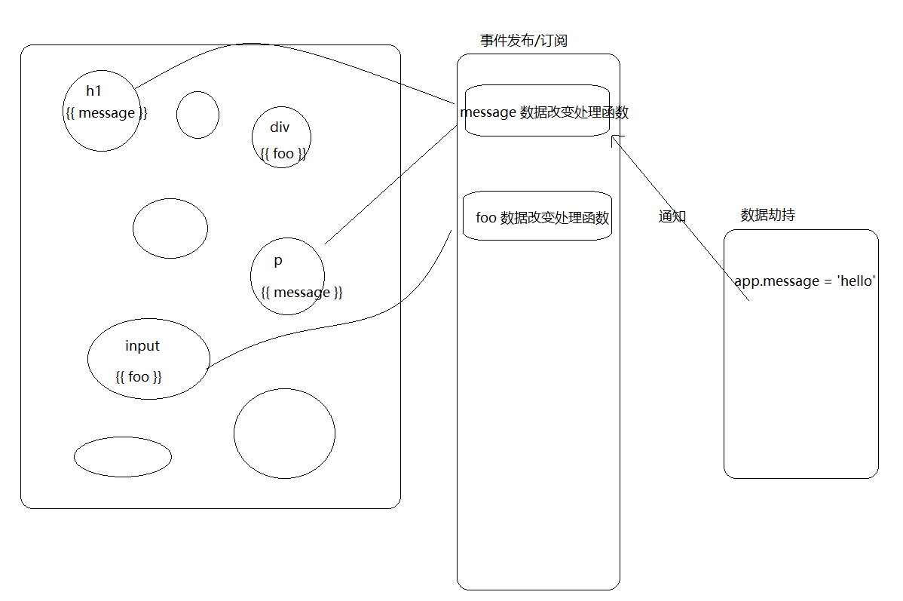

# Vue 数据绑定原理

> 为什么修改了一个 JavaScript 数据，就操作了视图的变化？

常见的面试问题：

- Vue 数据绑定的原理？
- MVVM 的原理？
- Vue 双向数据绑定的原理？
- Vue 数据响应式原理？
- 数据响应式原理？


## 介绍

修改视图的方式：

- 直接操作 DOM
- 数据驱动视图方式（MVVM）
  - 微软的一个技术：WPF
  - 前端框架 Angular.js 是第1个把 MVVM 带入了前端
    - 1.x 时代
    - 2.x 之后，变动太大（组件化）
  - React
    - 数据驱动视图
    - 组件化带入了前端领域
  - Vue.js
  - 微信小程序


所有实现了数据驱动视图的方式的框架，我们都称之为 MVVM 框架：

- M（Model）：普通 JavaScript 数据对象
- V（View）：视图
- VM（ViewModel）：视图模型
  - Vue
  - React
  - Angular
  - 。。。。

```html
<!-- 视图 -->
<template>
  <div>{{ message }}</div>
</template>

<!-- ViewModel -->
把普通的 JavaScript 对象和视图 DOM 之间建立了一种映射关系：
- 数据的改变影响视图
- 视图（表单元素）的改变影响数据

<script>
// Model 普通数据对象
export default {
  data () {
    return {
      message: 'Hello World'
    }
  }
}
</script>

<style>

</style>

```


```
// M
// 修改了普通数据
this.message = 'world'

// V
// 视图
<h1>{{ message }}</h1>

// VM
// Vue在中间件做了很多工作
// 随之视图也发生变化
```


MVVM：

- Model（M）：普通的 JavaScript 对象，例如 Vue 实例中的 data
  - 普通数据
- View（V）：视图
  - HTML DOM 模板
- ViewModel（VM）：视图模型，Vue实例
  - 负责数据和视图的更新
  - 它是 Model数据 和 View 视图通信的一个桥梁

Vue 在这里扮演的是 VM 的角色。


如何实现修改一个对象成员就修改了DOM？

```js
<h1>hello world</h1>

const data = {
	message: 'Hello World'
}

data.message = 'hello'
data.message = 'world'

// 监视 data.message 的改变
// watch('data.message', () => {
//  dom.innerHTML = xxx
// })

```


答案是：JavaScript 数据劫持，或者说是 JavaScript 对象属性拦截器。

什么是数据劫持（属性拦截器）？

说白了就是：观察数据的变化，执行特定业务逻辑。

- Object.defineProperty
  - ECMAScript 5 中的一个 API
  - Vue 1 和 Vue 2 中使用的都是 Object.defineProperty
- Proxy
  - ECMAScript 6 中的一个 API
  - 即将升级的 Vue 3 会升级使用 Proxy
  - Proxy 比 Object.defineProperty 性能要更好


## Object.defineProperty

> 参考资料：
>
> - [MDN - Object.defineProperty](https://developer.mozilla.org/zh-CN/docs/Web/JavaScript/Reference/Global_Objects/Object/defineProperty)

`**Object.defineProperty()**` 方法会直接在一个对象上定义一个新属性，或者修改一个对象的现有属性， 并返回这个对象。

### 基本语法

```js
Object.defineProperty(obj, prop, descriptor)
```

参数：

- `obj` 要在其上定义属性的对象。

- `prop` 要定义或修改的属性的名称。

- `descriptor` 将被定义或修改的属性描述符。

返回值：

被传递给函数的对象。


### 属性描述符

对象里目前存在的属性描述符有两种主要形式：**数据描述符**和**存取描述符**。**数据描述符**是一个具有值的属性，该值可能是可写的，也可能不是可写的。**存取描述符**是由getter-setter函数对描述的属性。描述符必须是这两种形式之一；不能同时是两者。

**数据描述符和存取描述符均具有**以下可选键值(默认值是在使用Object.defineProperty()定义属性的情况下)：

- `configurable`

  当且仅当该属性的 configurable 为 true 时，该属性`描述符`才能够被改变，同时该属性也能从对应的对象上被删除。**默认为 false**。

- `enumerable`

  当且仅当该属性的`enumerable`为`true`时，该属性才能够出现在对象的枚举属性中。**默认为 false**。

**数据描述符同时具有以下可选键值**：

- `value`

  该属性对应的值。可以是任何有效的 JavaScript 值（数值，对象，函数等）。**默认为 undefined**。

- `writable`

  当且仅当该属性的`writable`为`true`时，`value`才能被[赋值运算符](https://developer.mozilla.org/zh-CN/docs/Web/JavaScript/Reference/Operators/Assignment_Operators)改变。**默认为 false**。

**存取描述符同时具有以下可选键值**：

- `get`

  一个给属性提供 getter 的方法，如果没有 getter 则为 `undefined`。当访问该属性时，该方法会被执行，方法执行时没有参数传入，但是会传入`this`对象（由于继承关系，这里的`this`并不一定是定义该属性的对象）。

  **默认为 undefined**。

- `set`

  一个给属性提供 setter 的方法，如果没有 setter 则为 `undefined`。当属性值修改时，触发执行该方法。该方法将接受唯一参数，即该属性新的参数值。

  **默认为 undefined**。

描述符可同时具有的键值：

|            | configurable | enumerable | value | writable | get  | set  |
| ---------- | ------------ | ---------- | ----- | -------- | ---- | ---- |
| 数据描述符 | Yes          | Yes        | Yes   | Yes      | No   | No   |
| 存取描述符 | Yes          | Yes        | No    | No       | Yes  | Yes  |

**如果一个描述符不具有value,writable,get 和 set 任意一个关键字，那么它将被认为是一个数据描述符。如果一个描述符同时有(value或writable)和(get或set)关键字，将会产生一个异常。**

### 实现对一个对象所有成员的代理（了解）

需求：

```js
const data = {
  foo: 'bar',
  user: {
    name: '张三',
    age: 18
  }
}

// data.foo 被访问了
data.foo

// data.foo 被改变了
data.foo = xxx

// data.user 被改变了
data.user = xxx

// data.user.name 被访问了
data.user.name
```

实现：

```js
// 普通数据源
var data = {
  name: 'kindeng',
  user: {
    age: 18,
    foo: 'bar'
  },
  count: 0
};

// 对 data 中所有数据成员进行数据劫持（观察）
observe(data);

// data.name = 'dmq'; // 哈哈哈，监听到值变化了 kindeng --> dmq
// data.user.name = 'zs'

// console.log(data.user.name)

function observe(data) {
  // 如果 data 数据无效或者 data 不是一个对象，就停止处理
  if (!data || typeof data !== 'object') {
    return;
  }

  // 取出所有属性遍历，对属性成员进行代理（拦截、观察）操作
  Object.keys(data).forEach(function (key) {
    defineReactive(data, key, data[key]);
  });
};

/**
 * data 是数据对象
 * key 是属性名
 * val 当前属性名对应的值
 */
function defineReactive(data, key, val) {
  // observe('kindeng');
  // observe(data.user);
  observe(val); // 监听子属性

  // 'name'
  // 'age'
  // 'foo'
  // 'user'
  // 'count'
  console.log(key)

  Object.defineProperty(data, key, {
    enumerable: true, // 可枚举
    configurable: false, // 不能再define
    get: function () {
      return val;
    },
    set: function (newVal) {
      console.log('哈哈哈，监听到值变化了 ', val, ' --> ', newVal);
      val = newVal;
    }
  });
}

```


## Proxy

> 参考资料：
>
> - [MDN - Proxy](https://developer.mozilla.org/zh-CN/docs/Web/JavaScript/Reference/Global_Objects/Proxy)
> - [阮一峰 - Proxy](http://es6.ruanyifeng.com/#docs/proxy)


Proxy 可以理解成，在目标对象之前架设一层“拦截”，外界对该对象的访问，都必须先通过这层拦截，因此提供了一种机制，可以对外界的访问进行过滤和改写。Proxy 这个词的原意是代理，用在这里表示由它来“代理”某些操作，可以译为“代理器”。


### 语法

```js
let p = new Proxy(target, handler);
```


Proxy 对象的所有用法，都是上面这种形式，不同的只是`handler`参数的写法。其中：

- `new Proxy()`表示生成一个`Proxy`实例
- `target`参数表示所要拦截的目标对象
  - 可以是任意类型的对象，包括原生数组，函数，甚至是另一个 Proxy
- `handler`参数也是一个对象，用来定制拦截行为。
  - 其属性是当执行一个操作时定义代理的行为的函数


### 示例

```js
const data = {}

var proxy = new Proxy(data, {
  get: function(target, property) {
    return 35;
    // return property in target ? target[property] : 37;
  }
});

```

> 注意：要使得`Proxy`起作用，必须针对`Proxy`实例（上例是`proxy`对象）进行操作，而不是针对目标对象（上例是data）进行操作。


如果`handler`没有设置任何拦截，那就等同于直接通向代理目标。

```js
let target = {};
let p = new Proxy(target, {});

p.a = 37;   // 操作转发到目标

console.log(target.a);    // 37. 操作已经被正确地转发
```

上面代码中，`handler`是一个空对象，没有任何拦截效果，访问`proxy`就等同于访问`target`。


### 使用 Proxy 实现代理所有对象|数组成员（了解）

```js
const data = {
  a: 1,
  b: 2,
  c: {
    d: 3,
    e: 4,
    f: {
      g: 5,
      h: 6
    }
  },
  todos: [
    { id: 1, title: '吃饭' },
    { id: 2, title: '睡觉' },
    { id: 3, title: '打豆豆' }
  ]
}

let proxyData = observe(data)

function observe(data) {
  if (!data || typeof data !== 'object') {
    return
  }

  const p = new Proxy(data, {
    get (target, property) {
      console.log(`${property} 被访问了`)
      return target[property]
    },

    set (target, property, value) {
      console.log(`${property} 被修改了`)
      target[property] = observe(value) || value
    }
  })

  for (let key in data) {
    const item = data[key]
    if (typeof item === 'object') { // 对象或数组
      data[key] = observe(item)
    }
  }

  return p
}
```


## 事件发布/订阅模式

好处：

- 了解 EventBus 原理实现

- 发布/订阅模式

```js
// 监听一个自定义事件
bus.$on('事件类型', 处理函数)

// 发布事件
bus.$emit('事件类型', 处理函数)
```


```js
const bus = new Vue()

bus.$on('a', () => {
  
})

bus.$on('b', () => {
  
})

bus.$emit('a')

```


```js
function EventEmitter () {
  // 存储所有订阅的消息处理函数
  this.subs = {
    // 事件类型: [处理函数, 处理函数...]
    // a: [],
  }
}

EventEmitter.prototype.$on = function (eventType, callback) {
  this.subs[eventType] = this.subs[eventType] || []
  this.subs[eventType].push(callback)
}

// 参数中的 ... 表示函数的剩余（rest）参数
// 它会把所有参数放到一个数组中
EventEmitter.prototype.$emit = function (eventType, ...args) {
  const subs = this.subs[eventType]
  if (subs) {
    subs.forEach(callback => {
      callback(...args)
    })
  }
}

const e = new EventEmitter()

// 我就要在 $on 函数中往 subs 里面添加一个名字叫 a 的成员：值是一个数组
// 
e.$on('a', (arg1, arg2) => {
  console.log('a1', arg1, arg2)
})

e.$on('a', () => {
  console.log('a2')
})

e.$on('b', () => {
  console.log('b1')
})

e.$on('c', () => {
  console.log('c1')
})

console.log(e.subs)

e.$emit('a', 123, 456)
e.$emit('b')
e.$emit('abc')

```

## 模拟 Vue 简单实现



```html
<div id="app">
  <h1>{{ message }}</h1>
  <input v-model="message" />
</div>
```


```js
new Vue({
  el: '#app',
  data: {
    message: 'hello world'
  }
})

```


## 推荐阅读

- https://github.com/DMQ/mvvm
- https://cn.vuejs.org/v2/guide/reactivity.html

