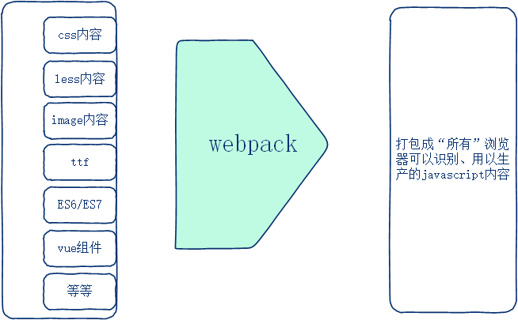

# 简介

> webpack是静态资源文件的打包工具

> 经过webpack可以一次性的做全部**`转码`**、**`降级`**处理，使得开发速度更高效，并且打包好的文件内容可以供所有浏览器使用。



# 适合使用的地方

> 1. spa(single program application单页面应用程序项目)项目(后台项目、手机移动端)，spa项目页面请求数量小于500个
> 2. vue、react、angular都要使用

# 安装配置

webpack官网：https://webpack.docschina.org/

```bash
$ yarn add -D webpack webpack-cli  ## 后者是前者的内部依赖
```

**package.json**

```JSON
"scripts":{
    "build": "webpack --config webpack.config.js"
},
// --config webpack.config.js 默认可以省略不写
```

> 执行 npm run build使用webpack了
>
> 打包完毕，就会在根目录生成dist目录，里边有main.js文件，其是jquery.js 和index.js 集成的体现

# 配置打包模式

`步骤`：

1. 在项目根目录创建名称为 **`webpack.config.js`** 的配置文件

2. 在webpack.config.js中做如下配置

   ```js
   module.exports = {
     mode: 'development'
   };
   ```

   > **production**:生产模式，打包好的文件内容是优化压缩的
   > **development**:开发模式，打包好的文件内容适合开发调试，有适当的空白、回车、注释

`注意`：

1. webpack默认配置文件名称为webpack.config.js，也可以自定义为其他，但是需要额外配置
2. 项目开发阶段适合使用 development 开发模式，开发完毕部署上线后使用 production(打包的文件体积小，节省资源)

# 配置入口文件和出口文件

`步骤`：

​	在**`webpack.config.js`**文件中做如下内容配置；

```js
const ph = require('path')
module.exports = {
  // 1) 给项目配置入口文件路径名
  entry: ph.resolve('./src/main.js'),  //默认是将打包 ./src/index.js
  // 2) 给项目配置出口文件路径名
  output: {  //默认是打包成 ./dist/main.js
    path: ph.resolve( './dist'), // 定义出口文件"目录"
    filename: 'bundle.js' // 定义出口"文件名称"
  }
}
```

`注意`：

1. 自行把入口文件名字 src/index.js 修改为 src/main.js 名字

2. path模块可以获得一个文件的绝对路径名

   1. path.join(__dirname,xxx)
   2. path.resolve(xxx)

   resolve相比join要更简便，可以不用设置__dirname，但是一样可以获得xxx文件的绝对路径名称

3. webpack是通过**nodejs**语言开发的，故在webpack.config.js文件中要通过**require**方式导入模块

   > 在src/main.js主入口文件可以使用import或require

# 编译模板文件

打包时要同时打包入口index.html模板文件，并在打包后的模板文件中自动引入打包好的js文件

1. 安装 **`html-webpack-plugin`** 插件依赖包  yarn  add -D  html-webpack-plugin

2. 在webpack.config.js中给上述插件做配置

   ```js
   const ph = require('path')
   var HtmlWebpackPlugin = require('html-webpack-plugin'); // 引入插件模块
   module.exports = {
   	// 给webpack配置功能插件
     plugins: [
       new HtmlWebpackPlugin({
         // 设置“源模板”文件的路径名
         template:ph.resolve('./src/index.html') 
       })
     ],
   }
   ```

3. 现在打包处理 npm  run build，就会发现在dist目录里边生成了index.html模板文件，内容来自 src/index.html，并且有**自动引入**打包好的js文件在里边

`注意`：

1. 如果不给HtmlWebpackPlugin内部配置template源模板文件，则会生成一个没有任何业务逻辑的、空的html模板文件
2. 在 src/index.html 文件中会自动引入 dist/bundle.js 文件

# 删除dist目录无效打包文件

1. 安装 **`webpack-cleanup-plugin`** 依赖包  yarn  add -D  webpack-cleanup-plugin

2. 在webpack.config.js中做如下配置

   ```js
   // 引入清理模块
   var WebpackCleanupPlugin = require('webpack-cleanup-plugin'); 
   module.exports = {
     // 给webpack配置功能插件
     plugins: [
       // 清除dist目录无用的文件
       new WebpackCleanupPlugin()
     ],
   }
   ```

   > 注意：上图的导入**需要**通过require方式进行  (官网提供是import方式)

3. 现在再次物理打包(npm run build)，就会发现dist目录无用的文件就被清除掉了

`注意`：

​	dist目录无效文件可以被清除 （目录暂时不支持清除）

# 实时打包介绍

`步骤`：

1. 安装实时打包 **`webpack-dev-server`** 依赖包  yarn add -D webpack-dev-server

2. 在webpack.config.js文件做如下配置

   ```js
   module.exports = {
     // 给dev-server(实时打包运行机制)做配置
     devServer: {
       open: true,  // 启动实时打包服务后会自动开启浏览器并展示项目效果
       port: 8080, // web服务的端口号码,可以自定义为其他
       host: '127.0.0.1', //  web服务的主机名地址，必须是本机真实的
       compress: true  // web服务运行程序文件可以被优化压缩处理，使得比较节省资源，运行速度快
     },
   }
   ```

3. 在package.json中做如下配置

   ```js
     "scripts": {
       "serve": "webpack-dev-server"
     },
   ```

   > serve：是自定义名称，可以修改为其他
   >
   > webpack-dev-server：是固定名称

4. 现在在项目根目录命令行终端中可以执行 npm  run serve 指令，就自动打开浏览器查看项目运行效果了

   > 现在，src源代码随时修改，浏览器随时查看效果

`注意`：

1. npm run serve 会开启一个前台服务，不能关闭，否则没有实时加载效果了
2. 实时打包的内容提供者是“内存”，不需要借助物理文件支持，本身也不生成**dist目录和相关打包文件**
3. 实时打包本身有创建了一个http服务，并支持访问

# loader 加载器

## CSS

`步骤`：

1. 安装loader相关依赖包  yarn add -D css-loader  style-loader

2. 在webpack.config.js中给loader做如下配置

   ```js
   module.exports = {
     // 给webpack配置各种loader
     module: {
       rules: [
         {
           // 1) css之loader配置
           test: /\.css$/, // 正则匹配名字以.css结尾的文件，然后交给如下loader处理
           use: ['style-loader', 'css-loader'],
         }
       ]
     }
   }
   ```

3. 现在重启实时打包服务(npm run serve)，css样式效果就ok了

`注意`：

   1. style-loader、css-loader有严格的前后设置顺序，不要颠倒
   2. 有的文件需要配置一个loader、有的需要配置多个，不固定

css-loader和style-loader的不同作用

> css-loader   :该loader可以实现在主入口js文件中以import/require的方式引入css 
>
> style-loader ：该loader可以实现在html文档中以style标签的形式嵌入css 内容
>
> css-loader第一个顺序执行，style-loader之后再执行

## img背景图片

`步骤`：

1. 安装loader依赖包  yarn  add -D url-loader  file-loader

2. webpack.config.js配置loader，具体如下：

   ```js
   rules: [
       {
           // 2) img图片之loader配置
           test: /\.(png|jpg|gif)$/i,
           loader: 'url-loader',
           options: {
               limit: 8192      //8K  大于10k的话还不如在发一次请求了
           }
       }
   ]
   ```
   
3. 现在实时打包服务重启(npm run serve)，发现背景图片效果已经呈现

`注意`：

​	file-loader不需要配置，条件满足会自动调用