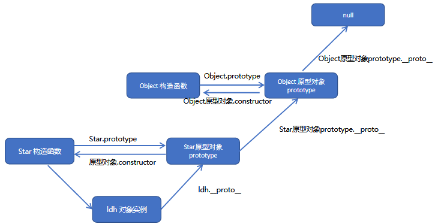
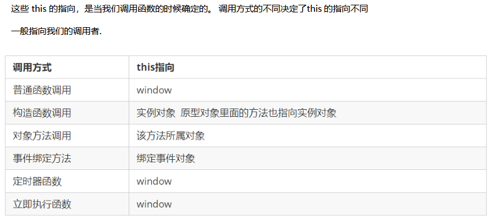

# 编程思想
## 面向过程编程 POP
面向过程就是分析出解决问题所需要的步骤，然后用函数把这些步骤一步一步实现，使用的时候再一个一个的依次调用就可以了
* 优缺点
  * 优点：性能比面向对象高，步骤联系紧密
  * 缺点：不好维护，不易多次使用及扩展
## 面向对象编程 OOP
面向对象是把事务分解成为一个个对象，然后由对象之间分工与合作
优缺点
- 优点：易维护，可复用，可扩展，灵活性高
- 缺点：性能没有面向过程高
**面向对象的思维特点:**
	​	 1.抽取对象共用的属性和方法(封装)形成一个类(模板)
	​	 2.对类进行实例化, 获取类的对象
### 三大特性
* **封装性**
* **继承性**
* **多态性**
# ES6中的类和对象
## class类
`在ES6中新增加了类的概念，可以使用class关键字声明一个类，之后以这个类来实例化对象。【构造函数实例化对象】`
- **类**抽象了对象的公共部分，它泛指某一类（class）
- **对象**特指某一个，通过类实例化一个具体的对象
```js
//创建类
class Person{
    //定义构造方法
    constructor(name,age){
        //定义属性
        this.name=name;
        this.age=age;
    }
    //定义普通方法
    say(){
        console.log("说话");
    }
}
```
## class类的继承
* **extends**
* **super**
  * **总结：super调用父类的属性和方法，那么查找属性和方法的原则就近原则**
```js
//父类
class Father {
    constructor(name){
        this.name=name;
    }
    say(){}
}
//子类继承父类
class Son extends Father{
    constructor(name,age){
        //调用父类构造方法
        super(name);
        this.age=age;
    }
    say(){
        //调用父类普通方法
        super.say();
    } 
}
```
## 三个注意点
* 在ES6中类没有变量提升，所以必须先定义类，才能通过类实例化对象.
* 类里面的共有属性和方法一定要加this使用
* 类里面的this指向问题.
  * constructor 里面的this指向实例对象,
  * 方法里面的this 指向这个方法的调用者，谁调用指向谁
## 类的本质
```
class本质还是function
类的所有方法都定义在类的prototype属性上
类创建的实例,里面也有__proto__ 指向类的prototype原型对象
所以ES6的类它的绝大部分功能，ES5都可以做到，新的class写法只是让对象原型的写法更加清晰、更像面向对象编程的语法而已。所以ES6的类其实就是语法糖.
```
# ES5中的构造函数
` 在典型的OOP的语言中（如Java），都存在类的概念，类就是对象的模板，对象就是类的实例，但在ES6之前，JS中并没用引入类的概念。` 
 `ES6，全称ECMAScript6.0 ，2015.06 发版。但是目前浏览器的JavaScript是ES5版本，大多数高版本的浏览器也支持ES6，不过只实现了ES6的部分特性和功能。`
 `在ES6之前，对象不是基于类创建的，而是用一种称为构建函数的特殊函数来定义对象和它们的特征。 `
## 定义构造函数
构造函数是一种特殊的函数，主要用来初始化对象，即为对象成员变量赋初始值，它总与new一起使用。我们可以把对象中一些公共的属性和方法抽取出来，然后封装到这个函数里面。
```js
//定义构造函数
function Person(name){
    this.name=name;
}
//实例化一个对象
var person = new Person("zs");
```
* 在JS中，使用构造函数时要注意以下两点
  1. 构造函数用于创建某一类对象，其首字母要大写
  2. 构造函数要和new 一起使用才有意义
* **new在执行时会做四件事情**
  1. 在内存中创建一个新的空对象。
  2. 让this指向这个新的对象。
  3. 执行构造函数里面的代码，给这个新对象添加属性和方法。
  4. 返回这个新对象（所以构造函数里面不需要return）。
## 静态成员和实例成员
JavaScript 的构造函数中可以添加一些成员，可以在构造函数本身上添加，也可以在构造函数内部的this 上添加。通过这两种方式添加的成员，就分别称为静态成员和实例成员。
- 静态成员：在构造函数本身上添加的成员称为静态成员，只能由构造函数本身来访问，不需要实例化对象。
- 实例成员：在构造函数内部创建的对象成员称为实例成员，只能由实例化的对象来访问，需要实例化对象。
## 原型对象 prototype
* 原型对象：就是构造函数的一个属性，这个属性是一个对象，我们称呼这个属性prototype 为原型对象。
* 每一个构造函数都有一个prototype属性
* 作用：是为了共享方法，从而达到节省内存
```js
function Person(name){
    this.name=name;
}
//把方法放入原型对象中
//1.第一种方式
Person.prototype.sing=function(){}
//2、第二种方式
Person.prototype = {
    sing:function(){},
    say:function(){},
    constructor:Person
}
```
**总结：所有的公共属性写到构造函数里面，所有的公共方法写到原型对象里面**
## 对象原型 `__proto__`
**总结：每一个对象都有一个对象原型属性，作用是指向原型对象prototype**
`注意：__proto__是一个非标准属性，不可以拿来赋值或者设置【只读属性】`
* `__proto__`对象原型和原型对象prototype是等价的
- `__proto__`对象原型的意义就在于为对象的查找机制提供一个方向，但是它是一个非标准属性，因此实际开发中，不可以使用这个属性，它只是内部指向原型对象prototype
## 构造函数constructor
**总结：constructor  主要作用可以指回原来的构造函数**
在原型对象和对象原型中都有一个属性constructor
## 构造函数、实例对象、原型对象三者之间的关系
1. new 构造函数() ==> 实例对象           实例对象.`__proto__`.constructor ==> 构造函数
2. 构造函数.prototype ==> 原型对象   原型对象.constructor ==> 构造函数
3. 实例对象.`__proto__` ==> 原型对象
* prototype：原型对象，每一个构造函数都有这个属性
* `__proto__`：对象原型，每一个实例对象都有这个属性，这个属性的作用就是指向prototype
* constructor：构造函数，prototype，`__proto__`都有这个属性，这个属性的作用指回构造函数
## 原型链
* 作用；提供一个成员的查找机制，或者查找规则

## JavaScript 的成员查找机制(规则)
```*
当访问一个对象的属性（包括方法）时，首先查找这个对象自身有没有该属性。
如果没有就查找它的原型（也就是__proto__指向的prototype 原型对象）。
如果还没有就查找原型对象的原型（Object的原型对象）。
依此类推一直找到Object 为止（null）。
__proto__对象原型的意义就在于为对象成员查找机制提供一个方向，或者说一条路线。
// console.log(Star.prototype.__proto__.__proto__);
// console.log(Object.prototype);
```
## 继承
``ES6之前并没有给我们提供extends 继承。我们可以通过构造函数+原型对象模拟实现继承，被称为组合继承。``

### 属性的继承
```js
//函数属性的继承是通过 call() 方法
function Father(name,age){
    this.name = name;
    this.age = age;
}
function Son(name,age,score){
    //调用的父类的构造方法，但把this的指向改成当前要new的对象，所以当前new的对象就具有父类的几个属性了
    Father.call(this,name,age);
    this.scroe = score;
}
```
### 方法的继承
```js
//子类继承父类的方法
function Father(){}
Father.prototype.sing = function(){}

function Son(){}
//把父类的实例对象保存给子类的原型对象
Son.prototype = new Father();
//把子类原型对象的构造函数设置成子构造函数
Son.prototype.curstructor = Son;
```
**总结：用构造函数实线属性继承，用原型对象实线方法继承**
## 函数的定义与调用
* **函数的定义**
  1. 命名函数 function fn(){}
  2. 匿名函数
     * 函数表达式 var fn = function(){}
     * 子调用函数 (function(){})();
  3. 实例化创建 var fn = new Function(‘参数1’，‘参数2’，......，‘函数体’)；
* **函数的调用**
  1. 普通函数
  2. 对象的方法
  3. 构造函数
  4. 绑定事件函数
  5. 定时器函数
  6. 立即执行函数
# this的指向
this：当前调用者，谁调用代表谁

## 改变this的指向
`JavaScript 为我们专门提供了一些函数方法来帮我们更优雅的处理函数内部this 的指向问题，常用的有bind()、call()、apply() 三种方法。`
### call()
```js
//调用fun函数并改变this的指向为thisArg 参数一个个数
fun.call(thisArg, arg1, arg2, ...)
```
### apply()
```js
//调用fun函数并改变this的指向为thisArg 参数是以一个数组形式传递
fun.apply(thisArg, [argsArray])
//例：arr数组求取最大值  Math.max.apply(null,arr);  
```
### bind()
```js
//只是改变fun函数的this指向，而不调用执行函数，返回一个新的函数  参数形式与call()相同
fun.bind(thisArg, arg1, arg2, ...)
```
### 总结
```*
相同点:  都可以改变函数内部的this指向.

区别点:  
1.call 和apply  会调用函数, 并且改变函数内部this指向.
2.call 和apply 传递的参数不一样, call 传递参数aru1, aru2..形式apply 必须数组形式[arg]
3.bind  不会调用函数, 可以改变函数内部this指向

主要应用场景:  
1.call  经常做继承. 
2.apply 经常跟数组有关系.比如借助于数学对象实现数组最大值最小值
3.bind  不调用函数,但是还想改变this指向. 比如改变定时器内部的this指向
```
# 严格模式
## js的两种模式
* 正常模式
* 严格模式
```什么是严格模式
JavaScript 除了提供正常模式外，还提供了严格模式（strictmode）。ES5 的严格模式是采用具有限制性JavaScript 变体的一种方式，即在严格的条件下运行JS 代码。
严格模式在IE10 以上版本的浏览器中才会被支持，旧版本浏览器中会被忽略。
严格模式对正常的JavaScript 语义做了一些更改：
1.消除了Javascript语法的一些不合理、不严谨之处，减少了一些怪异行为。【例如变量，不声明就报错】
2.消除代码运行的一些不安全之处，保证代码运行的安全。
3.提高编译器效率，增加运行速度。
4.禁用了在ECMAScript的未来版本中可能会定义的一些语法，为未来新版本的Javascript做好铺垫。比如一些保留字如：class, enum, export, extends, import, super 不能做变量名
```
## 开启严格模式
* 开启严格模式："use strict"
* 脚本开启严格模式
  ```js
  //整个脚本都是严格模式
  <script>
  	"use strict";
  	console.log("这是严格模式。");
  </script>
  //因为"use strict"加了引号，所以老版本的浏览器会把它当作一行普通字符串而忽略。
  ```
* 函数开启严格模式
  ```js
  //当前函数是严格模式
  function fn(){
      "use strict";
      return "这是严格模式。";
  }
  //将"use strict"放在函数体的第一行，则整个函数以"严格模式"运行。
  ```
## 严格模式下的变化
* 变量规定
  * 正常模式：变量不声明默认是全局变量；严格模式：变量不声明算未定义变量；
  * 正常模式：可用delete x；删除变量；严格模式：不允许删除变量；
* this的指向问题
  * 正常模式：普通函数里的this指**window**；
  * 严格模式：普通函数里的this指**undefined**；
* 函数变化
  * 正常模式下：function fun(a,a,a){}；
  * 严格模式：函数参数不允许重名，
  * 严格模式：函数必须声明在顶层.新版本的JavaScript 会引入“块级作用域”（ES6 中已引入）。为了与新版本接轨，不允许在非函数的代码块内声明函数。【if，for等里面定义函数也不可以，但是现在不可以】
# 高阶函数
**高阶函数是对其他函数进行操作的函数，它接收函数作为参数或将函数作为返回值输出。**
# 闭包
* 一个作用域访问另外一个函数的局部变量
* 闭包就是能够读取其他函数内部变量的函数。在本质上，闭包就是将函数内部和函数外部连接起来的一座桥梁
* 作用：作用域的变量延申
## 作用域链
在当前的作用寻找不到的变量去上一级作用域去找，直到找到0级作用域还未找到为止。
# 递归
* 函数调用函数其本身
* 必须有一个结束的方法，容易造成内存溢出
## 浅拷贝与深拷贝
  * 浅拷贝只复制最外一层
  * 深拷贝
    ```js
    function copy (newObj,obj) {
    	for (key in obj) {
    		if (obj[key] instanceof Array) {
    			newObj[key] = [];
    			copy(newObj[key],obj[key]);
    		} else if (obj[key] instanceof Object) {
    			newObj[key] = {};
    			copy(newObj[key],obj[key])
    		} else {
    			newObj[key] = obj[key];            
    		}
    	}
    }
    ```
# 正则表达式
正则表达式（ Regular Expression）是用于匹配字符串中字符组合的模式。在JavaScript中，正则表达式也是对象。
作用：检索关键字，过滤敏感字符，表单验证
## 创建正则
1. var reg = /abc/;
2. var reg = new RegExp(‘/abc/’);
## 测试正则
**reg.test(str)**  正则对象方法，用于检测字符串是否符合该规则，该对象返回 true 或 false，其参数是测试字符串

## 正则表达式的组成
正则表达式：简单字符 和 特殊字符【元字符】
### 边界符
```js
正则表达式中的边界符（位置符）用来提示字符所处的位置，主要有两个字符
^:表示匹配行首的文本（以谁开始）【/^abc/：以abc为开头】
$:表示匹配行尾的文本（以谁结束）【/abc$/：以abc为结尾】
如果 ^ 和 $ 在一起，表示必须是精确匹配。【/^abc$/：只能是abc】
```
### 字符类
```js
[]:表示【多选一】；
量词符：
	量词	  说明
	*		重复0次或更多次【>=0次】/^[a-z]*$/
	+		重复1次或更多次【>=1次】【/^[a-z]+$/】
	?		重复0次或1次
	{n}		重复n次
	{n,}	重复n次或更多次
	{n,m}	重复n到m次
【注意：{n,m}n和m之间不准有空格】
```
### 括号总结
```js
1.大括号  量词符.  里面表示重复次数
2.中括号 字符集合。匹配方括号中的任意字符. 
3.小括号表示优先级
【正则表达式在线测试 ： https://c.runoob.com】
```
### 预定义类

## replace替换
/表达式/[修饰符]
	g：全局匹配
	i：忽略大小写
	gi：全局+忽略
