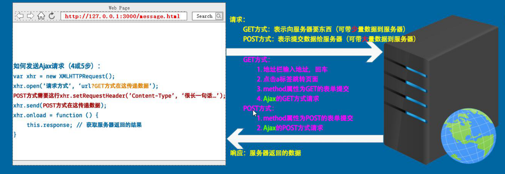
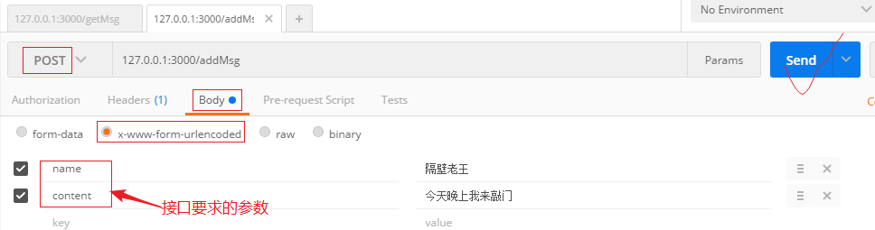

# 客户端(Client)与服务器(Server)
* 浏览器相当于一个客户端
* 真实的服务器也就是一个安装了服务软件的超级计算机
## 请求(Request)与响应(Response)
- 请求（Request），指浏览器向服务器发出的请求；
  - 请求的方式
    1. GET （获得）
       * 地址栏输入网址，按回车
       * a标签的超链接跳转
       * 表单提交（不设置method属性，或设置为GET）
       * Ajax的GET请求
    2. POST （邮递）
       * 表单提交（一定要设置method为POST）
       * Ajax的POST请求
- 响应（Response），指服务器接收到浏览器的请求后，做出的回应；
  
# Ajax简介
Asynchronous Javascript And Xml：异步的JavaScript和XML；
简单来说，Ajax是一种技术、是能够使浏览器和服务器进行交互（请求响应）的一种技术。
Ajax也是一套内置在浏览器端的API，核心对象是 `XMLHttpRequest` ，通过这些API的调用，可以实现发送Ajax类型的请求和收取服务器端响应的数据。
# Request 请求方式
## GET 方式请求
```js
//1. 创建一个 XMLHttpRequest 对象
var xhr = new XMLHttpRequest();
//2. 设置请求的方式和路径
xhr.open('GET', '/query-get?name=zs&age=18');
//3. 发送请求
xhr.send();
//4. 注册事件
xhr.onload = function () {
    //通过xhr的 response 获取到响应的响应体
  	console.log(this.response)
}
```
* **传递参数：** URL后拼接问好传递参数，多个参数用&符拼接； url?name=zs&age=18
* *缓存问题：只有IE浏览器会有缓存问题，缓存问题指的是：两次或多次 Ajax GET 请求**同一个** URL ，IE浏览器在第二次请求的时候，并不会从新向服务器发请求，而是直接使用上次请求的结果。*
  ​`缓存解决办法：让每次请求的URL都不同；多传一个不同的参数  --例如  _=Date.now()`
## POST 方式请求
post 把传递的数据封装在 HTTP 请求数据中，以键/值的形式出现，可以传输大量数据，对数据量没有限制，也不会显示在 URL 中。
```js
//1. 创建一个 XMLHttpRequest 对象
var xhr = new XMLHttpRequest();
//2. 设置请求的方式和路径
xhr.open('POST', '/query-post');
//3. 设置 Content-Type 为 application/x-www-form-urlencoded
xhr.setRequestHeader('Content-Type', 'application/x-www-form-urlencoded')
//4. 发送请求并传递参数
xhr.send('name=zs&age=18');
//5. 注册事件
xhr.onload = function () {
    //通过xhr的 response 获取到响应的响应体
  	console.log(this.response)
}
```
* post 请求，**必须调用setRequestHeader方法设置 Content-Type**
  * 请求头中的 Content-Type，告诉服务器发送过去的数据的格式
* **传递参数：**在send()方法中传递参数 --例如 xhr.send('name=zs&age=18')
## GET与POST区别
GET和POST的区别（Ajax请求和非Ajax）
- 字母意思不同，如果请求希望从服务器获取数据，则使用GET方式；如果请求是把数据提交给服务器，则使用POST方式
- GET请求传递数据（参数）大小有限制，一般限制为2k；POST请求传参大小没有限制
- GET请求传递的参数在url上，不是很安全；POST请求传递的数据不在url上，稍微安全一些。
- GET请求不能上传文件；POST请求可以上传文件
# 同步与异步
Asynchronous -- 异步的  (分头行动)
synchronous   -- 同步的（一步步完成的过程）
设置Ajax请求方式同步与异步：
​	xhr.open(请求方式，url，true);    --异步请求  默认是true
​	xhr.open(请求方式，url，false);   --同步请求  同步请求前某些事件必须在send前注册 要不无法执行事件
# 测试接口工具 postman


# 相应数据格式
## JSON
* **数据类型**

  ```json
  null    ==> null
  number  ==> 1024
  boolean ==> true
  string  ==> "hello"
  Object  ==> {"name":"zs","age":18,"arr":[1,2,3]}
  Array   ==> ["zs","ls","ww"]
  ```
* **注意**
  1. JSON 中属性名称**必须用双引号**包裹
  2. JSON 中表述字符串（==值）**必须使用双引号**
  3. JSON 中不能有单行或多行注释
  4. JSON 没有 `undefined` 这个值
  5. 一个完整的JSON，不能有其他内容掺杂，必须是且是一个完整数据类型。
* **数据转换**
  * JSON ==》JS数据  JSON.parse(jsonStr);
  * JS数据==》JSON   JSON.stringify(JS)；
## XML
XML: 可扩展标记语言
`一种数据描述手段----老掉牙的东西，基本现在的项目不用了。淘汰的原因：数据冗余太多，操作不方便`
```xml
<?xml version="1.0" encoding="UTF-8" ?>
<students>
	<student id="1">
    	<name>张三</name>
        <age>18</age>
        <sex>男</sex>
        <other height="175cm" weight="65kg" />
    </student>
    <student id="2">
    	<name>李四</name>
        <age>20</age>
        <sex>女</sex>
        <other height="170cm" weight="60kg" />
    </student>
</students>
```
XML语法规范：
- 和html写法差不多
- 有且只有一个根标签
- 标签区分大小写
- 标签必须闭合
- 属性值必须加引号
# 模板引擎
## 模板引擎介绍
客户端中拿到请求的数据过后最常见的就是把这些数据呈现到界面上。如果数据结构简单，可以直接通过字符串操作（拼接）的方式处理，但是如果数据过于复杂，字符串拼接维护成本太大，就不推荐了
> 模板引擎：
>
> - artTemplate：https://aui.github.io/art-template/
## 使用模板引擎步骤
1. 引入template-web.js文件
2. 定义模板（具体语法可以去官网查看），一定要指定script的id和type属性
3. 调用template函数，为模板分配数据，template函数有两个参数一个返回值
   * 参数1：模板的id
   * 参数2：分配的数据，必须是一个**JS对象**的形式
   * 一个返回值：是数据和模板标签组合好的结果
```html
<!-- 使用模板引擎-1.加载js文件 -->
<script src="./assets/template-web.js"></script>

<!-- 使用模板引擎-2.设置模板 -->
<script id="test" type="text/html">
    <h1>{{title}}</h1>
</script>

<!-- 使用模板引擎-3.调用template函数 -->
<script>
    // 调用插件提供的方法template。将数据和模板组合起来。
    var html = template('test', {title: '这是模板引擎的例子'});
    console.log(html);
    /* <h1>这是模板引擎的例子</h1> */
    document.body.innerHTML = html;
</script>
```
## 模板语法
* **输出普通数据（字符串、数值等）**
```js
// 模板写法
{{var}}

// template函数写法
var html = template('id', {
    var: 'hello world'
});
```
* **条件判断**
```js
// 模板写法
{{if age > 18}}
	大于18
{{else}}
	小于18
{{/if}}

// template函数写法
var html = template('id', {
    age: 20
});
```
* **each循环**
```js
// 模板写法
{{each arr}}    // arr后再写两个形参可为 $value $index起别名
	{{$value}}  //-- 数组的值
	{{$index}}  //-- 数组的下标
{{/each}}

// template函数写法
var html = template('id', {
    arr: ['apple', 'banana', 'orange']
});
```
## 总结
- 步骤
  - 加载template-web.js
  - 定义模板
    - 要使用script标签
    - 要设置id属性
    - 要设置type属性
  - 调用template函数
    - 参数1：模板的id
    - 参数2：必须是js对象，表示模板中使用的数据
    - 返回值：模板和数据组合好的结果
- 模板语法
  - {{title}}
  - {{if 条件}} ..... {{/if}}
  - {{each 变量}}   {{$index}} {{$value}}   {{/each}}
# XmlHttpRequset对象的其他API
## readyState和onreadystatechange
* **readyState**
| readyState | 状态描述         | 说明                                                         |
| ---------- | ---------------- | ------------------------------------------------------------ |
| 0          | UNSENT           | 代理（XHR）被创建，但尚未调用 `open()` 方法。                |
| 1          | OPENED           | `open()` 方法已经被调用，建立了连接。                        |
| 2          | HEADERS_RECEIVED | `send()` 方法已经被调用，并且已经可以获取状态行和响应头。    |
| 3          | LOADING          | 响应体（服务器返回的数据）下载中， `responseText` 属性可能已经包含部分数据。 |
| **4**      | **DONE**         | **响应体（服务器返回的数据）下载完成，可以直接使用 `responseText`或response 获取完整的结果。** |
`一般都不说Ajax请求响应的几个阶段，大多数都说Ajax的几个状态，也就是说readyState表示Ajax请求过程中的几个状态。`
* **onreadystatechange事件**
onload是H5之后新增的事件，在H5之前，都是使用onreadystatechange。
**当对象的readyState状态发生改变时，或者接收的数据量发生改变时触发该事件。**（数据量非常大时，xhr对象会分块接收数据，一次性接收一部分，直至接收完毕为止。）
## onprogress接收事件
* 当正在接收服务器返回数据的时候，它会触发
- **onload** -- 当readyState等于4的时候触发。只有请求成功了才触发。
- **onprogress** -- 当readyState等于3的时候触发（数据正在返回途中的时候触发）
- **onloadstart()** -- 当开始发送请求的时候触发，要放到send之前
- **onloadend()** -- 当请求响应过程结束的时候触发。无论成功还是失败都会触发。
## 创建XHR对象的兼容方案
* `XMLHttpRequest 在老版本浏览器（IE5/6）中有兼容问题，可以通过另外一种方式代替。`
    ```js
    var xhr = window.XMLHttpRequest ? new XMLHttpRequest() : new ActiveXObject('Microsoft.XMLHTTP')
    ```
## responseType
`responseType`，表示预期服务器返回的数据的类型，当设置了该属性后，通过 `response` 接收数据的时候，会根据该属性的值来自动处理结果为JS能够识别的数据。
比如，当设置了 `responseType='json'`  后，使用 `response` 来接收服务器返回的数据时，会自动处理 JSON 数据为 JS 数组，免去了 `JSON.parse()` 这一步。
  responseType的可选值为下面几个：
  - **“”**  -- 空，表示文本，和text一样。空为默认值
  - **text** -- 文本
  - **json** -- JSON格式数据
  - **document** -- 文档对象。当服务器返回的结果是XML类型的时候，需要指定为document
  ```js
  var xhr = new XMLHttpRequest();
  xhr.onload = function () {
      // 因为指定了responseType为json。所以ajax会自动将服务器返回的结果当做json来处理
      // 会自动调用JSON.parse来将结果处理成JS数据
      console.log(this.response);
  }
  xhr.open('GET', '/getMsg');
  // send之前，指定预期服务器返回数据的类型
  xhr.responseType = 'json'; // 可选的值 '' 、 text 、 json 、 document
  xhr.send();
  ```
## API小结
  - XHR 1 版 API
    - **open** -- 设置请求方式、请求url、同步或异步
    - **send** -- 发送请求
    - **readyState** -- ajax的状态，值（0，1，2，3，4）
    - **onreadystatechange** -- 当readyState的值改变的时候，或当接收的数据发生改变的时候都会触发
    - **responseText：**-- 用于接收服务器返回的 `文本类型` 的结果
  - XHR 2.0 新增API （h5之后新增的API）
    - **onload** -- 当请求响应成功了，会触发
    - **onprogress** -- 当响应的数据，正在接收中，会触发。数据量比较大的话，可能会触发多次
    - **onloadstart** -- 当请求开始的时候，会触发
    - **onloadend** -- 当请求结束的时候，会触发
    - **response** ：可以接收任何的响应结果
    - **responseType：**配合response使用的一个属性
#  jQuery 中封装的 AJAX
`jQuery 中有一套专门针对 AJAX 的封装，功能十分完善，经常使用，具体方法请查看jQuery的API文档`
## $.ajax
```html
<script src="./js/jquery.js"></script>
<script>
    // $.ajax(JS对象);
    $.ajax({
    // 属性: 值
    type: 'GET', // 请求方式
    url: '/query-get',
    // data: 'id=111&age=222&name=zs',
    data: {id: 333, name: 'zs', age: 18}, // 发送给接口的数据，可以写成对象，jQuery内部会自动将对象转成字符串
    dataType: 'json', // 如同 responseType。
    success: function (res) {
        console.log(res);
    }
});
</script>
```
常用选项参数介绍：
- cache: 设置ie浏览器的缓存问题， cache: false 不缓存  (会自动帮你拼接一个参数 _=时间戳)
- url：请求地址
- type：请求方法，默认为 `get`
- dataType：预期服务端响应数据类型
- contentType：请求体内容类型，如果是POST请求，默认 `application/x-www-form-urlencoded`
- data：（object|string）传递到服务端的数据
- timeout：请求超时时间，多少毫秒后没得到返回值则结束请求
- beforeSend：请求发起之前触发  --相当于onloadstart
- complete：请求完成触发（不管成功与否）--onloadend
- success：请求成功之后触发（响应状态码 200）
- error：请求失败触发
- processData：是否让jQuery帮我们将发送给服务器的数据进行处理（默认：true表示将对象处理成字符串）
## jQuery封装的发送Ajax请求的快捷方法
**GET 请求快捷方法**
`$.get(url, [data], [callback], [dataType])`
`$.get({settings})`
**POST 请求快捷方法**
`$.post(url, [data], [callback], [dataType])`
`$.post({settings})`
**ajaxSetup 全局事件处理**
$.ajaxSetup({事件: 处理函数, 事件:处理函数, ...});  //代表每个ajax渴死都设置的事件
# Axios封装的Ajax
`Axios 是目前应用最为广泛的 AJAX 封装库，相对于 jQuery 的优势在于功能能强劲，职责更单一。`
```html
<script src="./assets/axios.js"></script>
<script>
    axios.get('/query-get?name=zs&age12')
      .then(function (res) {
        console.log(res.data)
      })
      .catch(function (err) {
        console.error(err)
      })
      .finally(function(xx) {
        console.log(xx)  
    })
</script>
```
# H5新增FormData内置对象
`FormData对象用以将数据编译成键值对，以便用`XMLHttpRequest`来发送数据。其主要用于发送表单数据，但亦可用于发送带键数据(keyed data)，而独立于表单使用`
```js
// 当点击提交按钮的时候，需要把表单各项的值，提交给fd接口。
document.getElementById('btn').onclick = function () {
    // 1. 有表单，找到表单
    var form = document.getElementById('fm');
    
    // 2. 实例化FormData，将表单的DOM对象传入即可
    //--- 只会key-value 的key是根据标签的name获取的
    var fd = new FormData(form); // fd对象中包含了表单所有的值
    
    //如果单独设置值的话
    fd.append("username",document.getElementById("username"));
   
    // 将各项值发送给fd接口
    var xhr = new XMLHttpRequest();
    xhr.open('POST', '/fd');
    // xhr.setRequestHeader('Content-Type', 'application/x-www-form-urlencoded');
    //不设置请求头系统会自动会找到form-data
    xhr.responseType = 'json';
    
    //发送时传递FromData实例化对象
    xhr.send(fd);
    xhr.onload = function () {
        console.log(this.response);
    }
}
```

