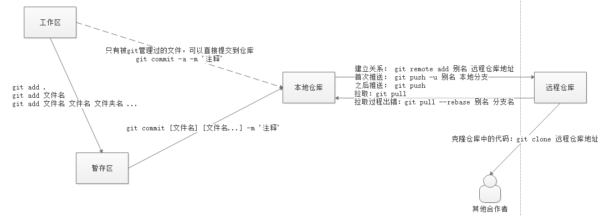
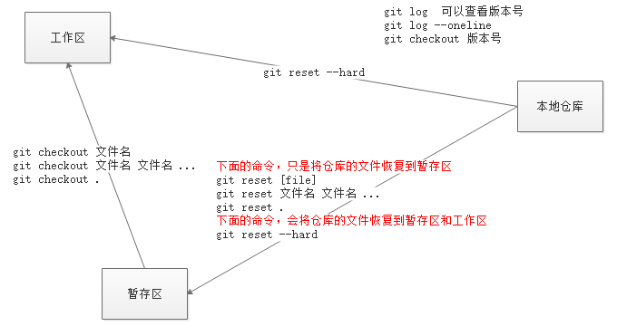
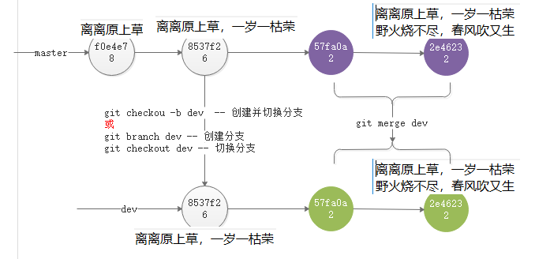

# Git

## 版本控制

版本控制主要解决两个问题：

- 历史记录，能够记录开发过程中的每一个版本，也能够在每个版本之间来回穿梭。
- 多人协作

### 集中式版本控制

`集中式版本控制系统，版本库是集中存放在中央服务器的，而干活的时候，用的都是自己的电脑，所以要先从中央服务器取得最新的版本，然后开始干活，干完活了，再把自己的活推送给中央服务器。`

主要代表：**SVN（Subversion）**

### 分布式版本控制

`分布式版本控制系统根本没有“中央服务器”，每个人的电脑上都是一个完整的版本库，这样，你工作的时候，就不需要联网了，因为版本库就在你自己的电脑上。`

主要代表：**Git**

git资源链接：<https://www.liaoxuefeng.com/wiki/896043488029600>

# 简单语法

### 初次运行时配置

```bash
# 查看git版本
$ git --version
```

配置用户名与邮箱 ：

`在 Windows 系统中，Git 会查找 $HOME 目录下（一般情况下是 C:\Users\$USER）的 .gitconfig 文件。Git 同样也会寻找 /etc/gitconfig 文件 ` 

```bash
# global 会将配置项保存到用户配置
$ git config --global user.name "John Doe"
$ git config --global user.email johndoe@example.com
```

### Git三种区域及工作流程

- 工作区域
  - 工作区域是对项目的某个版本独立提取出来的内容。 这些从 Git 仓库的压缩数据库中提取出来的文件，放在磁盘上供你使用或修改。
- 暂存区域
  - 暂存区域是一个文件，保存了下次将提交的文件列表信息，一般在 Git 仓库目录中。 有时候也被称作`‘索引’'，不过一般说法还是叫暂存区域。
- Git 仓库
  - Git 仓库目录是 Git 用来保存项目的元数据和对象数据库的地方。 这是 Git 中最重要的部分，从其它计算机克隆仓库时，拷贝的就是这里的数据。

### 使用Git管理自己的代码

- 在你写代码的文件夹，右键，选择 `Git Bash Here` ，这个写代码文件夹就是工作区
- 在弹出的黑色窗口中，执行 `git init` ，进行初始化
  - 初始化之后，会在当前目录生成一个隐藏文件 `.git`
- 然后就可以新建文件写代码了，此时文件在工作区
- 执行 `git add 文件名(.)` ，表示将工作区的文件添加到暂存区 不写文件名写.代表当前文件夹下的所有增删改的文件都添加进暂存区
- 在黑色窗口中，执行 `git commit -m "提交注释"` ，表示将暂存区的文件提交到仓库

**使用命令如下：**

```bash
# 初始化 git 仓库
$ git init

# 将工作区的文件添加到暂存区
$ git add 文件名(.)

# 提交暂存区到仓库区形成历史记录
$ git commit -m "提交日志"
```

## Git基础

### 文件状态

执行 `git status` 命令，可以查看到文件的状态

- 未跟踪 （ Untracked files  未受git管理）
- 已暂存 （ staged   add进暂存区）
- 已修改（ modified   受git管理过的文件被修改）
- 已提交（ committed  文件已提交进仓库）

### 添加文件到暂存区

```bash
# 添加指定文件到暂存区
$ git add 文件名

# 以空格隔开可以一次 add 多个文件
$ git add [file1] [file2] ...

# 添加指定目录到暂存区，包括子目录
$ git add [dir] [file] [dir] [file] [file] ...

# 添加当前目录的所有文件到暂存区，包括子目录
$ git add .
```

### 提交到仓库

```bash
# 提交暂存区到仓库区
$ git commit -m [message]

# 提交暂存区的指定文件到仓库区
$ git commit [file1] [file2] ... -m [message]

# 提交工作区和暂存区自上次commit之后的变化，直接到仓库区
# 注意：不包括未跟踪文件，即不包含没有被GIt管理过的文件
$ git commit -a -m "提交日志"
```

### 查看状态

```bash
# 最好用的是 gitk
$ gitk

# 显示有变更的文件
$ git status

# 显示当前分支的版本历史
$ git log

# 简略查看历史版本
$ git log --oneline
```

### 撤销操作

```bash
# 恢复暂存区的指定文件到工作区
$ git checkout [file]

# 恢复暂存区的所有文件到工作区
$ git checkout .

# 恢复某个commit的指定文件到暂存区和工作区
$ git checkout [commit版本号] [file]

# 重置暂存区的指定文件，与上一次 commit 保持一致，但工作区不变
$ git reset [file]

# 重置暂存区与工作区，与上一次commit保持一致
$ git reset --hard
```

## 分支

**默认主分支 master**

```bash
# 查看分支
git branch

# 创建分支
$ git branch <name>

# 切换分支
$ git checkout <name>

# 创建+切换分支
$ git checkout -b <name>

# 合并某分支到当前分支
$ git merge <name>

# 删除分支
$ git branch -d <name>
```

# GitHub

## 本地放到线上

```bash
# 别名我们通常喜欢使用 origin 作为默认仓库的别名
$ git remote add 别名 远程仓库地址

# 当本地分支和远程分支名字一样的时候，可以简写只写一些
# -u 的作用是记住本次的 push 地址和分支信息
# 如果不加 -u，则下一次 push 的时候，还需要使用完整的命令
$ git push -u 远程仓库地址别名 本地分支:远程分支

# 如果要推送的本地分支和远端分支已有，可以简写为
$ git push 别名 分支

# 之后推送
$ git push
```

## 从线上克隆

```bash
# 克隆远程地址
$ git clone 远程仓库地址
# clone 下来的仓库会自动创建一个名字叫 origin 的 remote 远端地址
# 并且自动和 origin master 建立关系
# 所以你这里可以直接 git push
git push
```

## 拉去和更新

```bash
# 拉取远程代码到当前分支，并和本地分支合并
$ git pull
# 取回远程仓库的变化，并与本地指定分支合并
$ git pull [remote] [branch]
```

# 总结

> 首次推送代码到远程仓库的时候，会有一个弹出框，让你输入你的GitHub的账号和密码。

添加、提交、推送：




回退：




分支创建及合并：

