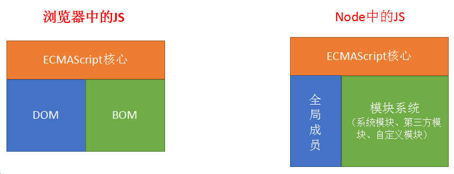
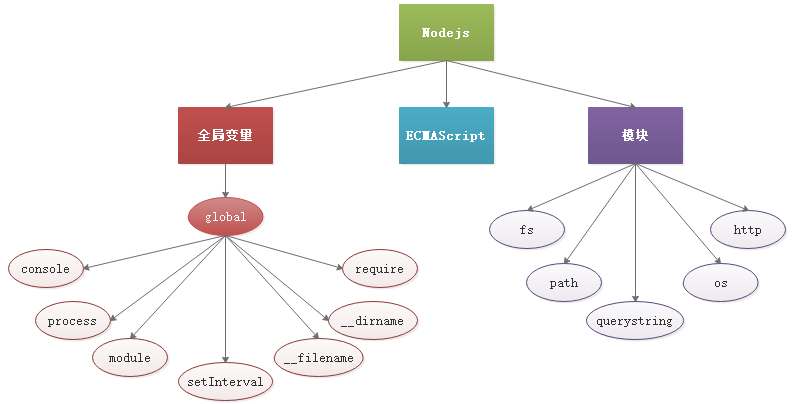

# 1. Node 概述

**1.1 Node介绍**

Node.js 是一个基于 Chrome V8 引擎的 JavaScript 运行环境。 
Node.js 使用了一个事件驱动、非阻塞式 I/O 的模型，使其轻量又高效。 

**1.2 node.js中的JS和浏览器中的JS的区别**

- 安装了浏览器这个软件，它不但可以执行ECMAScript，浏览器这个软件内置了window对象，所以浏览器有处理DOM和BOM的能力。
- 安装了Node.Js这个软件，它不但可以执行ECMAScript，NodeJS这个软件也内置了一些东西，包括全局成员和模块系统。
  
  

**1.3 为什么要学习Nodejs**

主要原因：
- 大前端必备技能
- 使得JS能够和操作系统 “互动”（读写、创建文件等，还可以处理计算机中的进程）
- 为JavaScript提供了服务端编程的能力
  - 文件IO
  - 网络IO
- 了解服务器这个黑盒内部的实现原理
- 了解接口开发
- 进一步理解Web开发

# 2. Node学习

前面介绍了node也提供了一种JS的执行环境，确切的说是ECMAScript的执行环境。
node不但可以执行我们学习过的ECMAScript，node还自带了很多全局对象和很多模块。


## 全局变量

**一、说明：**

- node中有一个全局变量**global**，是node中最大的一个对象，相当于浏览器中的window对象。
- global中的成员在使用时，可以省略global，这点也类似浏览器中的window

**二、全局变量成员：**

* **global（全局变量）**

    * 全局的命名空间对象
* **console（控制台）**

  * `console` 模块提供了一个简单的调试控制台，类似于 Web 浏览器提供的 JavaScript 控制台。
* **require(id)**，它是全局对象global中的一个方法，用于引入模块、 `JSON`、或本地文件
  - require() 方法可以在js文件中加载另外的js文件（模块）
  - require() 方法可以在js文件中加载json文件
* **process（进程）**

  * `process` 对象是一个全局变量，它提供有关当前 Node.js 进程的信息并对其进行控制。 作为一个全局变量，它始终可供 Node.js 应用程序使用，无需使用 `require()`。
* **定时器**
  * **setImmediate(callback[, ...args])**   预定在 I/O 事件的回调之后立即执行的 `callback`。
  * **setInterval(callback, delay[, ...args])**  预定每隔 `delay` 毫秒重复执行 `callback`。
  * **setTimeout(callback, delay[, ...args])**  预定在 `delay` 毫秒之后执行一次性的 `callback`。
  * clearImmediate(immediate)     清除 setImmediate
  * clearInterval(timeout)                清除 setInterval
  * clearTimeout(timeout)               清除 setTimeout
* **__dirname（目录路径）**

  * 当前执行文件的文件夹绝对路径（在js文件中使用）
* **__filename（文件路径）**

  * 当前执行文件的绝对路径（在js文件中使用）
* **module （模块）**

    * 在每个模块中， `module` 的自由变量是对表示当前模块的对象的引用。 为方便起见，还可以通过全局模块的 `exports` 访问 `module.exports`。 `module` 实际上不是全局的，而是每个模块本地的。
* **exports（导出）**
    * 这是一个对于 `module.exports` 的更简短的引用形式。
    * `exports` 变量是在模块的文件级作用域内可用的，且在模块执行之前赋值给 `module.exports`。
      它允许使用快捷方式，因此 `module.exports.f = ...` 可以更简洁地写成 `exports.f = ...`。 但是，就像任何变量一样，如果为 `exports` 赋予了新值，则它将不再绑定到 `module.exports`：
      ```js
      module.exports.hello = true; // 从模块的引用中导出。
      exports = { hello: false };  // 不导出，仅在模块中可用。
      ```
> 所有模块都提供这些对象。 以下变量虽然看起来是全局的，但其实并不是。 它们仅存在于模块范围内
> - `__dirname`
> - `__filename`
> - `exports`
> - `module`
> - `require()`
## 核心模块
> **核心模块是Node.js 平台自带的一套基本的 API(功能模块)。**
>
> **每个模块都相当于有一个函数包裹着**  检测：console.log(arguments.callee + "");
> function (exports, require, module, \__filename, \__dirname) {
>             console.log(arguments.callee + "");
> }

### 01. path 模块（路径）

`path` 模块提供用于处理文件路径和目录路径的实用工具。

```js
//加载 path模块
const path = require('path');
```

| 方法                       | 作用                                                         |
| -------------------------- | ------------------------------------------------------------ |
| path.basename(path[, ext]) | `path.basename()` 方法返回 `path` 的最后一部分，类似于 Unix 的 `basename` 命令。 |
| path.dirname(path)         | `path.dirname()` 方法返回 `path` 的目录名，类似于 Unix 的 `dirname` 命令。 |
| path.extname(path)         | `path.extname()` 方法返回 `path` 的扩展名，从最后一次出现 `.`（句点）字符到 `path` 最后一部分的字符串结束。 |
| path.parse(path)           | `path.parse()` 方法返回一个对象，其属性表示 `path` 的重要元素。对象属性： 【dir\|\|root\|\|base\|\|name\|\|ext】   【目录\|\|根路径\|\|文件名.后缀\|\|文件名\|\|.后缀】 |
| path.format(pathObject)    | `path.format()` 方法从对象返回路径字符串。 与 `path.parse()`相反。 |
| path.join([...paths])      | `path.join()` 方法使用平台特定的分隔符作为定界符将所有给定的 `path` 片段连接在一起，然后规范化生成的路径。 |
| path.resolve([...paths])   | `path.resolve()` 方法将路径或路径片段的序列解析为绝对路径。  |
| ......                     | ......                                                       |

```js
//案例
const path = require('path');

//extname 查看文件后缀
console.log(path.extname('index.coffee.md')); // .md
//join 拼接路径
console.log(path.join('/a', 'b', 'index.html')); // \a\b\index.html
```

### 02. fs 模块（文件系统）

`fs` 模块提供了一个 API，用于以模仿标准 POSIX 函数的方式与文件系统进行交互。

文件系统，对文件/文件夹的操作  `file system`

```js
//加载 fs模块
const fs = require('fs');
```

| 方法                                          | 作用                         |
| --------------------------------------------- | ---------------------------- |
| fs.access(path, callback)                     | 判断路径是否可以访问         |
| fs.appendFile(path, data, callback)           | 向文件中追加内容             |
| fs.copyFile(src, dest, callback)              | 复制文件                     |
| fs.mkdir(path, callback)                      | 创建目录                     |
| fs.readDir(path, callback)                    | 读取目录列表                 |
| fs.rename(oldPath, newPath, callback)         | 重命名文件/目录              |
| fs.rmdir(path, callback)                      | 删除目录（只能删除空文件夹） |
| fs.readFile(path[, options], callback)        | 读取文件                     |
| fs.writeFile(file, data[, options], callback) | 写入文件                     |
| fs.watch(filename [, options] [, listener])   | 监视文件/目录                |
| fs.watchFile(filename[, options], listener)   | 监视文件                     |
| ......                                        | ......                       |

```js
//案例
const fs = require('fs');

//1.access  --判断文件是否存在
fs.access('D:/test.json', (err) => {
    // err 为 错误对象，意思判断的文件 不存在
    if (err) {
        console.log('文件不存在');
    } else {
        console.log('文件存在');
    }
});

//2.readFile --异步读取文件
fs.readFile('./test.json', (err, data) => {
    if (err) {
        console.log('读取文件出错');
    } else {
        console.log(data); // 读取到的二进制数据  如果带字符集参数则直接得到原始数据
        console.log(data.toString()); // 得到原始数据  
    }
});
```

### 03. querystring 模块

`querystring` 模块提供用于解析和格式化 URL 查询字符串的实用工具。

```js
//加载 querystring模块
const querystring = require('querystring');
```

| 方法                                               | 作用                                                         |
| -------------------------------------------------- | ------------------------------------------------------------ |
| querystring.parse(str[, sep[, eq[, options]]])     | `querystring.parse()` 方法将 URL 查询字符串 `str` 解析为键值对的集合。 |
| querystring.decode()                               | 是 `querystring.parse()` 的别名。                            |
| querystring.stringify(obj[, sep[, eq[, options]]]) | `querystring.stringify()` 方法通过迭代对象的自身属性从给定的 `obj` 生成 URL 查询字符串。 |
| querystring.encode()                               | 是 `querystring.stringify()` 的别名。                        |
| ......                                             | ......                                                       |

```js
//案例
const querystring = require('querystring');

// parse -- 将查询字符串解析成JS对象
querystring.parse('id=1&name=zs&age=20'); //{ id: '1', name: 'zs', age: '20' }
// stringify -- 将JS对象转成查询字符串
querystring.stringify({ id: '1', name: 'zs', age: '20' }); //id=1&name=zs&age=20
//与JSON串的不同在于：querystring是类似与url参数形式，而JSON是和object长得相同的字符串
```

### 04. url 模块（URL）

`url` 模块用于处理与解析 URL。

*一个完整的url  协议://主机地址:[端口]/文件地址?参数*

```js
//加载 url模块
const url = require('url');
```

* 提供两套处理url的API
  * 遗留的API（node封装的一套API），提供url.parse();方法解析url
  * 新的API（ECMAScript新增对象URL），通过实例化URL，来解析url

```js
//遗留API使用方法
const url = require('url');
let myURL = url.parse('/test.html?id=11&age=22'); // 返回一个包含url各个部分的对象
```

```js
//新的API使用方法，实例化的时候，必须传递一个完整的url
// 1.直接提供一个完整的url
let myURL = new URL('http://www.xxx.com/test.html?id=11&age=22');
// 或者
// 2.提供两个参数，一是文件路径及参数部分，二是域名，总之，二者组合必须是完整的url
let myURL = new URL('/test.html?id=11&age=22', 'http://www.xxx.com');

// 得到的myURL是一个对象，包含url中的各个部分
// 如果需要解析参数部分，则使用querystring模块，或使用URL的一个子对象searchParams中的get方法
let age = myURL.searchParams.get('age')； // 22
```

### 05. http 模块（HTTP）

要使用 HTTP 服务器和客户端，必须 `require('http')`。

http是一个系统模块，让我们能够通过简单的流程创建一个Web服务器。

```js
//加载 http模块
const http = require('http');
```

* **5.1 使用http模块搭建Web服务器**

  * 创建 Web 服务器的步骤
    - 导入 http 核心模块
    - 创建 server 对象(server 对象负责建立连接，接收数据)
    - 监听端口 （==这个步骤也可以放到注册request事件之后==）
    - 注册 request 事件，当浏览器发送请求到服务器执行，设置处理请求的函数

  ```js
  //加载http模块
  const http = require('http');
  //创建服务对象
  let server = http.createServer();
  //监听端口
  server.listen(端口，() => console.log('服务器启动了'))；
  //注册request事件
  server.on('request'，（）=> console.log('接收到请求'));
  ```

* **5.2 如何对浏览器的请求做出响应**

  * **形参req请求**
    * 形参req是request的缩写，请求对象，浏览器发送的请求报文中的数据已经被解析到该对象上
    * **req.url**            获取请求行中的路径
    * **req.method**   获取请求行中的请求方法
    * req.headers    获取请求头
  * **形参res响应** 
    * 形参res是response的缩写，响应对象，服务器给浏览器返回的响应内容，可以通过该对象设置
    * res.write()  设置响应体的内容，但是只调用write不会做出响应，发送响应要调用 end() 
    * **res.end()**    把响应报文发送给浏览器 可把相应内容加到参数中
    * res.setHeader()  设置响应头，比如设置响应体的编码
    * res.statusCode 设置状态码
    * res.writeHead(状态码, {响应头}) => statusCode + setHeader

  ```js
  const http = require('http');
  let server = http.createServer();
  server.listen(端口，() => console.log('服务器启动了'))；
  server.on('request'，
            （req, res）=> {  //request  response
            		res.end('我收到你的请求了');
            });
  ```

  * **响应一个html文件**

  ```js
  // 如果需要将一个html页面返回给浏览器，则读取文件，然后返回即可
  const fs = require('fs');
  // 1. 加载http模块
  const http = require('http');
  
  // 2. 创建服务对象，一般叫做server
  const server = http.createServer();
  
  // 3. 监听端口，开启服务
  server.listen(端口号, () => console.log('服务器启动了'));
  
  // 4. 给server注册request事件。当有浏览器的请求，就会触发该事件
  server.on('request', (req, res) => {
      // 浏览器请求的是什么？
      /**
       * req.url ----  获取请求的url
       * req.method --- 获取请求的方式，值为GET或POST
       * req.headers -- 所有的请求头
       */
      // 判断，如果请求的是index.html。则相应index.html
      if (req.url === '/index.html') {
          // 使用fs.readFile读取index.html。读取的结果就是index.html里面的源代码
          // 最后将读取的结果响应即可
          fs.readFile('./manager/index.html', (err, data) => {
              //如果报错则抛出错误信息
              if (err) throw err;
              //做出响应
              res.end(data);
          });
      }
  });
  ```

* **5.3 根据不同 url 地址处理不同请求**

  ```js
  server.on('request', (req, res) => {
      // 判断浏览器请求的文件是否存在，如果存在，则读取文件响应结果；如果不存在，则告知404
      fs.access('.' + req.url, (err) => {
          if (err) {
              // 说明文件不存在
              res.writeHead(404, {
                  'Content-Type': 'text/html; charset=utf-8'
              });
              res.end('资源文件找不到...');
          } else {
              // 说明文件存在
              fs.readFile('.' + req.url, (err, data) => {
                  if (err) throw err;
                  res.end(data);
              });
          }
      });
  });
  ```

* **5.4 处理静态资源**

  * 静态资源指的是html文件中链接的外部资源，如css、js、image文件等等。
  * 如果请求的a.html 文件中链接了外部文件(静态资源)，比如css、images、js文件等，浏览器会自动再次发送请求，向服务器请求这些文件
  * 服务器要判断浏览器请求的路径是否是静态资源，如果是静态资源把静态资源的内容返回给浏览器

  建议每个响应都告诉客户端我给你发送的 Content-Type 内容类型是什么

  为不同的文件类型设置不同的 Content-Type

  - .html：text/html
  - .css：text/css
  - .js：application/javascript
  - .jpg：image/jpg

  ```js
  if(path.extname(req.url)===".css"){
  	res.setHeader('Content-Type', 'text/css');
  }else if(path.extname(req.url)===".js"){
  	res.setHeader('Content-Type', 'application/javascript');
  }else if(path.extname(req.url)===".jpg"){
  	res.setHeader('Content-Type', 'image/jpg');
  }
  ```

* **5.5 处理浏览器POST请求方式**

  * POST请求一般会提交数据给服务器，服务器在接收数据的时候也是分块接收的

  ```js
  // 有请求过来，就会触发这个事件。请求包含GET和POST两种请求
  server.on('request', (req, res) => {
      // 当有数据提交给服务器之后。
      /*
       * 1. 创建一个空字符串，用于保存提交过来的数据
       * 2. 给req注册data事件，只要有数据提交过来，就会触发；用于接收提交过来的数据；
       	  数据比较大的话，是分块接收的
       * 3. 给req注册end事件，当完全接收了提交过来的数据，就会触发
       */
      let str = ''; // 定义一个用于保存数据的空字符串
      req.on('data', (chunk) => {  //req注册data事件
          // chunk -- 块
          str += chunk;
      });
      req.on('end', () => {      //req注册end事件
          console.log(str); // id=1&name=zs&age=43
      });
  });
  ```