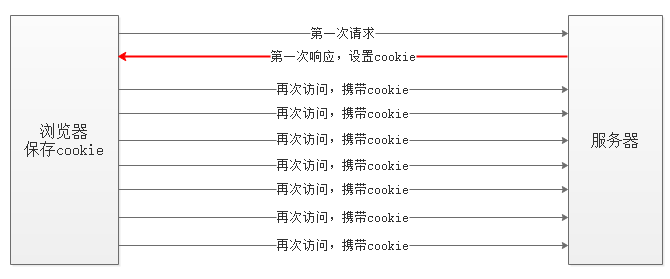
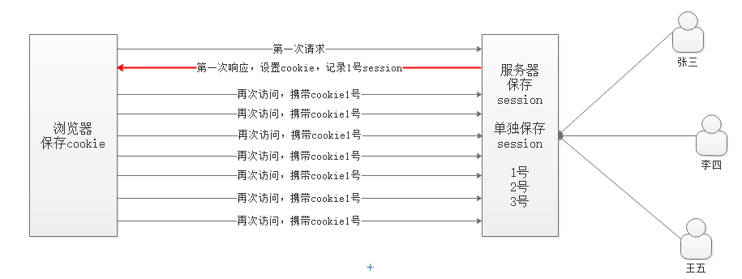

# 1. Node 概述

## 1.1 Node介绍

Node.js 是一个基于 Chrome V8 引擎的 JavaScript 运行环境。 
Node.js 使用了一个事件驱动、非阻塞式 I/O 的模型，使其轻量又高效。 

## 1.2 Node中JS和浏览器中JS的区别

- 安装了浏览器这个软件，它不但可以执行ECMAScript，浏览器这个软件内置了window对象，所以浏览器有处理DOM和BOM的能力。
- 安装了Node.Js这个软件，它不但可以执行ECMAScript，NodeJS这个软件也内置了一些东西，包括全局成员和模块系统。
  

## 1.3 为什么要学习NodeJS

主要原因：
- 大前端必备技能
- 使得JS能够和操作系统 “互动”（读写、创建文件等，还可以处理计算机中的进程）
- 为JavaScript提供了服务端编程的能力
  - 文件IO
  - 网络IO
- 了解服务器这个黑盒内部的实现原理
- 了解接口开发
- 进一步理解Web开发

## 1.4 特点

**优点**：

* **异步**非阻塞的 I/O（I/O线程池）
* 特点适用于**I/O密集型**操作
* 事件循环机制
* 单线程（一个线程服务多个客户端）
* 跨平台

**缺点**：

* 回调函数嵌套太多，太深（俗称回调地狱）
* 单线程，处理**不好CPU密集型**任务

**与java服务器对比**

java: 一对一服务，成本高

node:众多任务均由一个线程服务，成本低

# 2. Node 学习

前面介绍了node也提供了一种JS的执行环境，确切的说是ECMAScript的执行环境。
node不但可以执行我们学习过的ECMAScript，node还自带了很多全局对象和很多模块。


## 全局变量

**一、说明：**

- node中有一个全局变量**global**，是node中最大的一个对象，相当于浏览器中的window对象。
- global中的成员在使用时，可以省略global，这点也类似浏览器中的window

**二、全局变量成员：**

* **global（全局变量）**

    * 全局的命名空间对象

* **Buffer（缓冲区）**

    `Buffer的结构与数组非常像，它的元素为16进制的两位数；实际上一个元素就代表内存中的一个字节；Buffer中的内存不是通过javaScript分配的，底层通过c++申请的；也就是我们可以直接通过Buffer来创建内存中的空间。`

    Buffer的存在就是为了弥补数组不能存储二进制字符的情况（比如视频、图片等）

    使用Buffer时直接使用，而不需要引入模块

    ```js
    var str = 'hello';
    //将一个字符串转换成Buffer对象
    var buffer = Buffer.from(str);  
    
    console.log(buffer); //<Buffer 68 65 6c 6c 6f> 二进制数据 计算机中显示是十六进制的
    buffer.length  // 代表的是buffer所占的内存空间字节数
    
    buffer[0] = 10;    //     0a
    buffer[1] = 0xaa; //16进制 aa
    buffer[2] = 255;  //      ff
    buffer[3] = 600;  // 会显示不正确的数据  因为600超出0-255的范围 会截取后八位来填充进去
    buffer[5] = 12;  // 不会显示 应为Buffer一旦创建 就不可改变长度 是一段连续的内存空间
    
    //创建一个指定大小的Buffer
    var buf1 = new Buffer(字节长度)；// Buffer的构造函数方法都已经废弃 不推荐使用
    var buf2 = Buffer.alloc(10); 
    ```

    | 方法                                   | 作用                                                         |
    | -------------------------------------- | ------------------------------------------------------------ |
    | **Buffer类**                           |                                                              |
    | Buffer.alloc(size[, fill[, encoding]]) | 分配一个大小为 `size` 字节的新 `Buffer`。 如果 `fill` 为 `undefined`，则用零填充 `Buffer`。 |
    | Buffer.allocUnsafe(size)               | 不安全的，这种方式创建的 `Buffer` 实例的底层内存是未初始化的。 |
    | Buffer.from()                          | 参数转换成Buffer对象（array/arrayBuffer/buffer/object/string） |
    | **buffer实例化对象**                   |                                                              |
    | buffer[index]                          | 获取/设值                                                    |
    | buffer.length                          | 代表的是buffer所占的内存空间字节数                           |
    | buf.toString()                         | 转换成字符串                                                 |
    | buf.toJSON()                           | 转换成JSON串                                                 |

* **console（控制台）**

  * `console` 模块提供了一个简单的调试控制台，类似于 Web 浏览器提供的 JavaScript 控制台。

* **require(id)**，它是全局对象global中的一个方法，用于引入模块、 `JSON`、或本地文件
  - require() 方法可以在js文件中加载另外的js文件（模块）
  - require() 方法可以在js文件中加载json文件

* **process（进程）**

  * `process` 对象是一个全局变量，它提供有关当前 Node.js 进程的信息并对其进行控制。 作为一个全局变量，它始终可供 Node.js 应用程序使用，无需使用 `require()`。

* **定时器**
  * **setImmediate(callback[, ...args])**   预定在 I/O 事件的回调之后立即执行的 `callback`。
  * **setInterval(callback, delay[, ...args])**  预定每隔 `delay` 毫秒重复执行 `callback`。
  * **setTimeout(callback, delay[, ...args])**  预定在 `delay` 毫秒之后执行一次性的 `callback`。
  * clearImmediate(immediate)     清除 setImmediate
  * clearInterval(timeout)                清除 setInterval
  * clearTimeout(timeout)               清除 setTimeout

* **__dirname（目录路径）**

  * 当前执行文件的文件夹绝对路径（在js文件中使用）

* **__filename（文件路径）**

  * 当前执行文件的绝对路径（在js文件中使用）

* **module （模块）**

    * 在每个模块中， `module` 的自由变量是对表示当前模块的对象的引用。 为方便起见，还可以通过全局模块的 `exports` 访问 `module.exports`。 `module` 实际上不是全局的，而是每个模块本地的。

* **exports（导出）**
    * 这是一个对于 `module.exports` 的更简短的引用形式。
    * `exports` 变量是在模块的文件级作用域内可用的，且在模块执行之前赋值给 `module.exports`。
      它允许使用快捷方式，因此 `module.exports.f = ...` 可以更简洁地写成 `exports.f = ...`。 但是，就像任何变量一样，如果为 `exports` 赋予了新值，则它将不再绑定到 `module.exports`：
      ```js
      module.exports.hello = true; // 从模块的引用中导出。
      exports = { hello: false };  // 不导出，仅在模块中可用。
      ```
> 所有模块都提供这些对象。 以下变量虽然看起来是全局的，但其实并不是。 它们仅存在于模块范围内
> - `__dirname`
> - `__filename`
> - `exports`
> - `module`
> - `require()`
## 核心模块
> **核心模块是Node.js 平台自带的一套基本的 API(功能模块)。**
> **每个模块都相当于有一个函数包裹着**----外层函数
> 外层函数的作用：
> 1 --隐藏内部实现
> 2 --支持CommonJS的模块化
>   检测：console.log(arguments.callee + "");
> function (exports, require, module, \__filename, \__dirname) {
>       console.log(arguments.callee + "");
> }

### 01. path 模块（路径）

`path` 模块提供用于处理文件路径和目录路径的实用工具。

```js
//加载 path模块
const path = require('path');
```

| 方法                       | 作用                                                         |
| -------------------------- | ------------------------------------------------------------ |
| path.basename(path[, ext]) | `path.basename()` 方法返回 `path` 的最后一部分，类似于 Unix 的 `basename` 命令。 |
| path.dirname(path)         | `path.dirname()` 方法返回 `path` 的目录名，类似于 Unix 的 `dirname` 命令。 |
| path.extname(path)         | `path.extname()` 方法返回 `path` 的扩展名，从最后一次出现 `.`（句点）字符到 `path` 最后一部分的字符串结束。 |
| path.parse(path)           | `path.parse()` 方法返回一个对象，其属性表示 `path` 的重要元素。对象属性： 【dir\|\|root\|\|base\|\|name\|\|ext】   【目录\|\|根路径\|\|文件名.后缀\|\|文件名\|\|.后缀】 |
| path.format(pathObject)    | `path.format()` 方法从对象返回路径字符串。 与 `path.parse()`相反。 |
| path.join([...paths])      | `path.join()` 方法使用平台特定的分隔符作为定界符将所有给定的 `path` 片段连接在一起，然后规范化生成的路径。 |
| path.resolve([...paths])   | `path.resolve()` 方法将路径或路径片段的序列解析为绝对路径。  |
| ......                     | ......                                                       |

```js
//案例
const path = require('path');

//extname 查看文件后缀
console.log(path.extname('index.coffee.md')); // .md
//join 拼接路径
console.log(path.join('/a', 'b', 'index.html')); // \a\b\index.html
```

### 02. fs 模块（文件系统）

`fs` 模块提供了一个 API，用于以模仿标准 POSIX 函数的方式与文件系统进行交互。

文件系统，对文件/文件夹的操作  `file system`

```js
//加载 fs模块
const fs = require('fs');
```

| 方法                                          | 作用                         |
| --------------------------------------------- | ---------------------------- |
| fs.access(path, callback)                     | 判断路径是否可以访问         |
| fs.appendFile(path, data, callback)           | 向文件中追加内容             |
| fs.copyFile(src, dest, callback)              | 复制文件                     |
| fs.mkdir(path, callback)                      | 创建目录                     |
| fs.readDir(path, callback)                    | 读取目录列表                 |
| fs.rename(oldPath, newPath, callback)         | 重命名文件/目录              |
| fs.rmdir(path, callback)                      | 删除目录（只能删除空文件夹） |
| fs.rename(oldPath,newPath,callback)           | 重命名文件/剪切              |
| fs.readFile(path[, options], callback)        | 读取文件                     |
| fs.writeFile(file, data[, options], callback) | 写入文件                     |
| fs.watch(filename [, options] [, listener])   | 监视文件/目录                |
| fs.watchFile(filename[, options], listener)   | 监视文件                     |
| ......                                        | ......                       |

```js
//案例
const fs = require('fs');

//1.access  --判断文件是否存在
fs.access('D:/test.json', (err) => {
    // err 为 错误对象，意思判断的文件 不存在
    if (err) {
        console.log('文件不存在');
    } else {
        console.log('文件存在');
    }
});

//2.readFile --异步读取文件
fs.readFile('./test.json', (err, data) => {
    if (err) {
        console.log('读取文件出错');
    } else {
        console.log(data); // 读取到的二进制数据  如果带字符集参数则直接得到原始数据
        console.log(data.toString()); // 得到原始数据  
    }
});
```

### 03. querystring 模块

`querystring` 模块提供用于解析和格式化 URL 查询字符串的实用工具。

```js
//加载 querystring模块
const querystring = require('querystring');
```

| 方法                                               | 作用                                                         |
| -------------------------------------------------- | ------------------------------------------------------------ |
| querystring.parse(str[, sep[, eq[, options]]])     | `querystring.parse()` 方法将 URL 查询字符串 `str` 解析为键值对的集合。 |
| querystring.decode()                               | 是 `querystring.parse()` 的别名。                            |
| querystring.stringify(obj[, sep[, eq[, options]]]) | `querystring.stringify()` 方法通过迭代对象的自身属性从给定的 `obj` 生成 URL 查询字符串。 |
| querystring.encode()                               | 是 `querystring.stringify()` 的别名。                        |
| ......                                             | ......                                                       |

```js
//案例
const querystring = require('querystring');

// parse -- 将查询字符串解析成JS对象
querystring.parse('id=1&name=zs&age=20'); //{ id: '1', name: 'zs', age: '20' }
// stringify -- 将JS对象转成查询字符串
querystring.stringify({ id: '1', name: 'zs', age: '20' }); //id=1&name=zs&age=20
//与JSON串的不同在于：querystring是类似与url参数形式，而JSON是和object长得相同的字符串
```

### 04. url 模块（URL）

`url` 模块用于处理与解析 URL。

*一个完整的url  协议://主机地址:[端口]/文件地址?参数*

```js
//加载 url模块
const url = require('url');
```

* 提供两套处理url的API
  * 遗留的API（node封装的一套API），提供url.parse();方法解析url
  * 新的API（ECMAScript新增对象URL），通过实例化URL，来解析url

```js
//遗留API使用方法
const url = require('url');
let myURL = url.parse('/test.html?id=11&age=22'); // 返回一个包含url各个部分的对象
```

```js
//新的API使用方法，实例化的时候，必须传递一个完整的url
// 1.直接提供一个完整的url
let myURL = new URL('http://www.xxx.com/test.html?id=11&age=22');
// 或者
// 2.提供两个参数，一是文件路径及参数部分，二是域名，总之，二者组合必须是完整的url
let myURL = new URL('/test.html?id=11&age=22', 'http://www.xxx.com');

// 得到的myURL是一个对象，包含url中的各个部分
// 如果需要解析参数部分，则使用querystring模块，或使用URL的一个子对象searchParams中的get方法
let age = myURL.searchParams.get('age')； // 22
```

### 05. http 模块（HTTP）

要使用 HTTP 服务器和客户端，必须 `require('http')`。

http是一个系统模块，让我们能够通过简单的流程创建一个Web服务器。

```js
//加载 http模块
const http = require('http');
```

* **5.1 使用http模块搭建Web服务器**

  * 创建 Web 服务器的步骤
    - 导入 http 核心模块
    - 创建 server 对象(server 对象负责建立连接，接收数据)
    - 监听端口 （==这个步骤也可以放到注册request事件之后==）
    - 注册 request 事件，当浏览器发送请求到服务器执行，设置处理请求的函数

  ```js
  //加载http模块
  const http = require('http');
  //创建服务对象
  let server = http.createServer();
  //监听端口
  server.listen(端口，() => console.log('服务器启动了'))；
  //注册request事件
  server.on('request'，（）=> console.log('接收到请求'));
  ```

* **5.2 如何对浏览器的请求做出响应**

  * **形参req请求**
    * 形参req是request的缩写，请求对象，浏览器发送的请求报文中的数据已经被解析到该对象上
    * **req.url**            获取请求行中的路径
    * **req.method**   获取请求行中的请求方法
    * req.headers    获取请求头
  * **形参res响应** 
    * 形参res是response的缩写，响应对象，服务器给浏览器返回的响应内容，可以通过该对象设置
    * res.write()  设置响应体的内容，但是只调用write不会做出响应，发送响应要调用 end() 
    * **res.end()**    把响应报文发送给浏览器 可把相应内容加到参数中
    * res.setHeader()  设置响应头，比如设置响应体的编码
    * res.statusCode 设置状态码
    * res.writeHead(状态码, {响应头}) => statusCode + setHeader

  ```js
  const http = require('http');
  let server = http.createServer();
  server.listen(端口，() => console.log('服务器启动了'))；
  server.on('request'，
            （req, res）=> {  //request  response
            		res.end('我收到你的请求了');
            });
  ```

  * **响应一个html文件**

  ```js
  // 如果需要将一个html页面返回给浏览器，则读取文件，然后返回即可
  const fs = require('fs');
  // 1. 加载http模块
  const http = require('http');
  
  // 2. 创建服务对象，一般叫做server
  const server = http.createServer();
  
  // 3. 监听端口，开启服务
  server.listen(端口号, () => console.log('服务器启动了'));
  
  // 4. 给server注册request事件。当有浏览器的请求，就会触发该事件
  server.on('request', (req, res) => {
      // 浏览器请求的是什么？
      /**
       * req.url ----  获取请求的url
       * req.method --- 获取请求的方式，值为GET或POST
       * req.headers -- 所有的请求头
       */
      // 判断，如果请求的是index.html。则相应index.html
      if (req.url === '/index.html') {
          // 使用fs.readFile读取index.html。读取的结果就是index.html里面的源代码
          // 最后将读取的结果响应即可
          fs.readFile('./manager/index.html', (err, data) => {
              //如果报错则抛出错误信息
              if (err) throw err;
              //做出响应
              res.end(data);
          });
      }
  });
  ```

* **5.3 根据不同 url 地址处理不同请求**

  ```js
  server.on('request', (req, res) => {
      // 判断浏览器请求的文件是否存在，如果存在，则读取文件响应结果；如果不存在，则告知404
      fs.access('.' + req.url, (err) => {
          if (err) {
              // 说明文件不存在
              res.writeHead(404, {
                  'Content-Type': 'text/html; charset=utf-8'
              });
              res.end('资源文件找不到...');
          } else {
              // 说明文件存在
              fs.readFile('.' + req.url, (err, data) => {
                  if (err) throw err;
                  res.end(data);
              });
          }
      });
  });
  ```

* **5.4 处理静态资源**

  * 静态资源指的是html文件中链接的外部资源，如css、js、image文件等等。
  * 如果请求的a.html 文件中链接了外部文件(静态资源)，比如css、images、js文件等，浏览器会自动再次发送请求，向服务器请求这些文件
  * 服务器要判断浏览器请求的路径是否是静态资源，如果是静态资源把静态资源的内容返回给浏览器

  建议每个响应都告诉客户端我给你发送的 Content-Type 内容类型是什么

  为不同的文件类型设置不同的 Content-Type

  - .html：text/html
  - .css：text/css
  - .js：application/javascript
  - .jpg：image/jpg

  ```js
  if(path.extname(req.url)===".css"){
  	res.setHeader('Content-Type', 'text/css');
  }else if(path.extname(req.url)===".js"){
  	res.setHeader('Content-Type', 'application/javascript');
  }else if(path.extname(req.url)===".jpg"){
  	res.setHeader('Content-Type', 'image/jpg');
  }
  ```

* **5.5 处理浏览器POST请求方式**

  * POST请求一般会提交数据给服务器，服务器在接收数据的时候也是分块接收的

  ```js
  // 有请求过来，就会触发这个事件。请求包含GET和POST两种请求
  server.on('request', (req, res) => {
      // 当有数据提交给服务器之后。
      /*
       * 1. 创建一个空字符串，用于保存提交过来的数据
       * 2. 给req注册data事件，只要有数据提交过来，就会触发；用于接收提交过来的数据；
       	  数据比较大的话，是分块接收的
       * 3. 给req注册end事件，当完全接收了提交过来的数据，就会触发
       */
      let str = ''; // 定义一个用于保存数据的空字符串
      req.on('data', (chunk) => {  //req注册data事件
          // chunk -- 块
          str += chunk;
      });
      req.on('end', () => {      //req注册end事件
          console.log(str); // id=1&name=zs&age=43
      });
  });
  ```

# 3. npm 概述

## 3.1 第三方模块

- Node安装过后，就可以使用一些模块，比如fs、path、http等，这些模块叫做**内置模块**或**核心模块**
- 第三方模块，它不是Node软件自带的模块，是其他人编写的模块。不过我们可以下载下来使用。
- 使用第三方模块，多数都是为了简化开发，将复杂的代码封装后，形成的模块
- 使用第三方模块，需要先安装（从网上下载）
- 第三方模块也叫做  ”**包**“  或  **第三方库**。

## 3.2 npm 概述

- **npm（node package manager）**翻译过来就是Node包管理器
- npm 就是安装、卸载第三方模块的管理工具
- npm 不用单独安装，安装完node，npm默认就安装好了
- 试着执行 `npm -v`或者`npm --version` 命令，看下能否看到 npm 的版本

```bash
# 从外国官网升级最新版本   
npm install -g npm      #https://registry.npmjs.org/
```

## 3.3 npm安装第三方模块

**全局安装**

全局安装的一般都是**命令**，所以全局安装的模块，在任何文件夹都可以调用这个命令。

全局安装的模块不能通过require加载模块。

```bash
# 安装语法
npm install -g 模块名
# npm 表示使用npm工具
# install 表示安装 简写 i
```

```bash
# 全局安装 nodemon 模块
npm install -g nodemon
# nodemon是一个用于自动启动服务的工具(当node启动问价改变时，自动重启)，是一个类似node的命令
```

**本地安装**

本地安装的都是能够直接使用的模块，他们不是命令，是类似于 `fs` 等可以通过 `require()` 加载的模块。
在需要使用第三方模块的文件夹，执行下面的命令，本地安装第三方模块。

如果一个模块需要require加载，这个模块必须是本地安装，只有当前目录或者当前目录的后代目录才能加载本地安装的模块

本地安装 mime 模块

```bash
# 本地安装
npm install mime
```

```js
const mime = require('mime');

//根据文件名或者类型生成合理的类型
let type = mime.getType('txt');          // ⇨ 'text/plain'
res.steHeader('Content-Type',type);
mime.getExtension('text/plain');        // ⇨ 'txt'
```

## 3.4 npm 常用命令

```bash
npm -v               #查看npm当前版本
npm init             #初始化  创建模块 会在当前目录下生成 package.json
npm install -g npm   #更新npm最新版本
#-g global表示全局 不加表示本地
npm install 模块名    #安装模块   会在当前目录下写入node_modules文件夹和package_lock.json
nmp uninstall 模块名  #卸载模块 un
npm update 模块名     #更新模块
npm search 模块名     #搜索模块
npm root             #查看npm目录路径
npm ls               #查看所有安装的模块

# 查看缓存目录
npm config get cache
# 从缓存目录下载包
# --cache-min 后面跟的是时间，单位是分钟，超过这个时间才去服务器下载
npm install 包名 --cache-min 9999999
```

**Package.json 属性说明**

- **name** - 包名。
- **version** - 包的版本号。
- **description** - 包的描述。
- **main** - main 字段指定了程序的主入口文件，require('moduleName') 就会加载这个文件。这个字段的默认值是模块根目录下面的 index.js。
- **homepage** - 包的官网 url 。
- **author** - 包的作者姓名。
- **contributors** - 包的其他贡献者姓名。
- **dependencies** - 依赖包列表。如果依赖包没有安装，npm 会自动将依赖包安装在 node_module 目录下。
- **repository** - 包代码存放的地方的类型，可以是 git 或 svn，git 可在 Github 上。
- **keywords** - 关键字

## 3.5 cnpm 的使用

cnpm 是淘宝开发的，用cnpm命令可以替代npm,可以更快的安装模块资源。

> **第一种方法**  安装全局模块cnpm 仓库指向淘宝镜像
> npm install -g cnpm --registry=https://registry.npm.taobao.org
> 第二种方式  更改npm的仓库地址为淘宝镜像
> npm config set registry=https://registry.npm.taobao.org
> 查看是否更改成功  npm config get registry

## 3.6 yarn 的使用

> 优点： yarn使用本地缓存，无需联网就能安装本地已经缓存的依赖项
>
> nmp install -g yarn

**yarn命令与npm命令对应关系**

```bash
# 初始化项目
yarn init -y  # -y 表示一切都是用默认值  --yes
npm init -y

#下载项目的所有声明的依赖
yarn
npm install

#下载指定的运行时依赖包
yarn add webpack@3.2.1
npm i webpack@3.2.1 -S 
=>npm install webpack@3.2.1 --save  写入到 dependencies 对象

#下载指定的开发时依赖包
yarn add webpack@3.2.1 -D
npm i webpack@3.2.1 -D
=>npm install webpack@3.2.1 --save-dev  写入到 devDependencies 对象

#全局下载
yarn global add webpack
npm i webpack -g

#删除依赖
yarn remove webpack
npm remove webpack -S
yarn global remove webpack
npm remove webpack -g

#运行项目中配置的script
yarn run xxx
npm run xxx

#查看某个包的信息
yarn info xxx
npm info xxx

#仓库地址设置为淘宝镜像
yarn config set registry http://registry.npm.taobao.org
npm config set registry http://registry.npm.taobao.org
```

## 3.7 require 的加载机制

- `require` 优先加载**缓存**中的模块
- 如果缓存中没有模块，优先加载**核心模块（node自带的模块，fs、path、http）**，并缓存
- 如果有**相对路径**，则根据路径加载**文件模块**，并缓存
  - `require('./main')`  省略扩展名的情况
  - 先加载 `main.js`，如果没有再加载 `main.json`，如果没有再加载 `main.node`(c/c++编写的模块)
- 如果不是文件模块，也不是核心模块，则加载**第三方模块（下载的，比如express/mysql等）**
- node 会去 node_modules 目录中找（找跟你引用的名称一样的目录），例如这里 `require('moment')`
- 如果在 node_modules 目录中找到 `moment` 目录，则加载该模块并缓存
- 如果过程都找不到，node 则取上一级目录下找 `node_modules` 目录，规则同上
- 如果一直找到代码文件的根路径还找不到，则报错

# 4. express 框架

## 4.1 Express 简介

> - Express 官网：http://expressjs.com/
> - Express 中文文档（非官方）：http://www.expressjs.com.cn/
> - Express GitHub仓库：https://github.com/expressjs/express

Express 是一个简洁而灵活的 node.js Web应用框架, 提供了一系列强大特性帮助你创建各种 Web 应用，和丰富的 HTTP 工具。

Express 是一个基于 Node.js 平台，快速、开放、极简的 **web 开发框架**。

Express 框架核心特性：

- express保留了http模块的基本API，也就是说使用express时也能使用req和res对象
- express还额外封装了一些新方法，能让我们更方便的搭建服务器
- express提供了中间件功能，其他很多强大的第三方模块都是基于express开发的
- 可以设置中间件来响应 HTTP 请求。
- 定义了路由表用于执行不同的 HTTP 请求动作。
- 可以通过向模板传递参数来动态渲染 HTML 页面。

## 4.2 安装 express

```bash
npm install express   安装express
```

以上命令会将 Express 框架安装在当前目录的 **node_modules** 目录中， **node_modules** 目录下会自动创建 express 目录。以下几个重要的模块是需要与 express 框架一起安装的：

- **body-parser** - node.js 中间件，用于处理 JSON, Raw, Text 和 URL 编码的数据。
- **cookie-parser** - 这就是一个解析Cookie的工具。通过req.cookies可以取到传过来的cookie，并把它们转成对象。
- **multer** - node.js 中间件，用于处理 enctype="multipart/form-data"（设置表单的MIME编码）的表单数据。

```bash
npm install body-parser
npm install cookie-parser
npm install multer
```

## 4.3 使用Express构造Web服务器

1. **使用Express构建Web服务器步骤：**
     1) 加载 express 模块
     2) 创建 express 服务器
     3) 开启服务器
     4) 监听浏览器请求并进行处理
```js
① 加载express模块    const express = require('express');
② 创建express服务器  const app = express();
③ 开启express服务器  app.listen(端口号, () => {})
④ 注册服务器事件      app.get(url, callback)   
					app.post(url, callback)
```

2. express框架封装了一些额外的API（例如:send，sendFile），可以让我们更方便的构造Web服务器
	​	1 ）使用**send**方法响应数据的话，会自动设置content-type。但有时候会错误设置
	​	2 ）注意send不能直接响应数字，需要加引号，否则会将数字当做响应状态码处理
	​	3）send自动设置编码，还可以响应JS结构的数据。
3. 浏览器请求的每一个url地址都会由一个独立方法接收并处理，没有了 if ... else if ... else 这样的分支，程序结构更加清晰
4. **sendFile**(文件路径); -- 功能是读取文件，并将读取到的结果响应给浏览器。它的参数**必须是绝对路径**。

## 4.4 中间件

> express中间件是一个特殊的url地址处理函数
>
> - 中间件是 express 的最大特色，也是最重要的一个设计
> - 一个 express 应用，就是由许许多多的中间件来完成的
> - 中间件就是一个函数，中间件函数要当做 `app.use();` 的参数，这样来使用
> - 中间件函数中有三个基本参数， req、res、next
> - req就是请求相关的对象，它和后面用到的req对象是一个对象
> - res就是响应相关的对象，它和后面用到的res对象也是一个对象
> - next：它是一个函数，调用它将会跳出当前的中间件函数，执行后续代码；如果不调用next，则会在当前中间件卡住

```js
//app.use([请求的url的开头], 中间件函数);
app.use((req,res,next) => {})
```

## 4.5 使用express自带的中间件静态资源文件

```js
const express = require('express');
const app = express();
app.listen(3000, () => console.log('服务器开启了'));

// 通过如下代码就可以将 public 目录下的image、CSS、JavaScript文件对外开放访问了
app.use(express.static('public'));
================================================================================
// 下面定义中间件，处理所有的文件（html、css、js、png等）
app.use((req, res, next) => {
    // console.log(req.url);
    // 判断是否有浏览器请求的文件，如果有，则读取并响应；如果没有则next
    const fs = require('fs');
    let filename = __dirname + '/public' + req.url;
    fs.access(filename, (err) => {
        if (err) {
            next();
        } else {
            res.sendFile(filename);
        }
    });   
});
```

## 4.6 使用body-parser中间件处理POST提交数据

```bash
# 安装
npm install body-parser
```

```js
//======================================  自我封装的方法  ============================================
app.use((req, res, next) => {
    // 判断，看是否是POST方式的请求
    if (req.method === 'POST') {
        // 这里的代码和之前一样，还是接收数据
        let str = '';
        req.on('data', (chunk) => {
            str += chunk;
        });
        req.on('end', () => {
            // 将接收到的数据，赋值给req.body
            // req.body属性本来不存在，是自定义的，你也可以用其他的名字
            req.body = querystring.parse(str);
            next();
        });
    } else {
        // 不是POST方式的请求，继续向下走
        next();
    }
})

//=============================   body-parser模块  ================================================
//body-parser模块的方法 处理post请求数据
const bodyParser = require('body-parser');
// 如果请求头的 Content-Type为application/x-www-form-urlencoded，则将请求体赋值给req.body
app.use(bodyParser.urlencoded({extended: false})); 
// extended: false 表示将接收的数据用querystring模块处理成对象
```

# 5. mysql第三方模块

## 5.1 mysql模块的作用

mysql模块是一个第三方模块，专门用来操作MySQL数据库。 可以执行增删改查操作。

```bash
# 安装mysql
npm i mysql
```

## 5.2 mysql基本用法

在Node中使用MySQL模块一共需要5个步骤：

1) 加载 MySQL 模块

2) 创建 MySQL 连接对象

3) 连接 MySQL 服务器

4) 执行SQL语句           

5) 关闭链接  

```js
//架子mysql模块
const mysql = require('mysql');
//创建mysql连接
const conn = mysql.createConnection({
   host:"172.0.0.1", //主机地址   
   port:3306,        //端口号（默认3306）
   user:'root',      //用户名
   password:'',      //密码
   database:'test',  //数据库名
   .......
   multipleStatements: true // 表示可以一次性执行多条SQL
});
//链接mysql服务器
conn.connect();
//执行sql语句
conn.query(sql,[,占位符的值]，(error, results, fields) => {});
//关闭sql连接
conn.end();
```

## 5.3 数据库操作( CURD )

*增删改查CRUD（create read update delete）*

**查询数据**

```js
//1.基础查询
conn.query('select * from user limit 0,10', (err,result)=>{});  //返回值是数组

//2.单个占位符查询  传递值
conn.query('select * from user where id=?', 1, (err,result)=>{})

//3.多个占位符     传递数组
conn.query('select * from user where id=? and name=?, [1,'zs'], (err,result)=>{})

//4.多条语句查询
//创建mysql连接时开启 multipleStatements: true 表示可以一次性执行多条SQL
conn.query('select * from student;select * from teacher', (err,res)=>{})  //返回值为二维数组
```

**添加数据**

添加结果（result）是一个对象，该对象中有两个属性需要记住

- affectedRows： 受影响行数
- insertID： 查询数据的主键值

`name="zs",age=18'  这种格式的都可以用占位符，对象来替换。对象的属性是数据表字段名，值是要写入数据表的数据`

```js
//1. 基础添加
conn.query('insert into user set name="zs",age=18', (err,result)=>{})；
//2.1 占位符
conn.query('insert into user set name=?,age=?', ['zs', 18], (err,result)=>{})；
//2.2 占位符需要一个对象。 
conn.query('insert into user set ？', {name:'zs',age:18}, (err,result)=>{})；
```

**修改数据**

 * affectedRows 

```js
//1.基础修改
conn.query('update user set name="zs" where id=1',['zs', 1], (err,result)=>{});
//2.占位符
conn.query('update user set name=? where id=?',['zs', 1], (err,result)=>{});
conn.query('update user set ? where id=?',[{name:'zs',age:18}, 1], (err,result)=>{});
```

**删除数据**

* affectedRows 

```js
//1.基本修改
conn.query('delete form user where id=1', (err,result)=>{});
//2.占位符
conn.query('delete form user where id=?', 1, (err,result)=>{});
conn.query('delete form user where id=? and name=?', [1,'zs'], (err,result)=>{});
```

# 6. 模块化

- js设计之初只是为了实现表单验证这样的简单功能，没设计模块化方案，所以js天生不支持模块化
- 不支持模块化简单来说就是在一个js文件内不能引入其他js文件
- 为了让js支持模块化，一些大神自己编写底层库文件，让js开始支持模块化
- js模块化规范有四种标准： AMD   CMD   **CommonJS**   ES6
- Node属于CommonJS标准
- 使用模块化可以很好的解决变量、函数名冲突问题，也能灵活的解决文件依赖问题
- 没有模块化，不允许一个js文件引入另外的JS，有了模块化，就允许一个js文件引入其他的js文件

## 6.1 局部作用域和全局作用域

局部作用域（模块的作用域）：

- 一个js文件就是一个模块
- 在一个js文件中定义的属性（变量、常量）和方法（函数）默认都只能在当前js文件中使用

全局作用域：

- 在js文件中声明的属性和方法如果都挂载到global对象下；当其他js文件导入该模块后，就能使用该模块下的属性和方法了。(警告：这种做法会污染全局作用域，污染全局命名空间)

## 6.2 module.exports 和 exports

`module.exports === exports    true`

**exports 和 module.exports 的使用**

如果要对外暴露属性或方法，就用 **exports** 就行，要暴露对象(类似class，包含了很多属性和方法)，就用 **module.exports**。

```js
b.js
//module.exports.aa = 1;
//module.exports.bb = function(){console.log('b.js的bb方法')};

//module.exports = {aa,bb};  //{aa:aa,bb:bb}的简写

与上面结果结果相同
//exports.aa = 1;
//exports.bb = function(){console.log('b.js的bb方法')};

==这样写法错误的，只是单独改变了exports的指向，module.exports的指向还是原来的对象==
exports = {aa,bb};
```

```js
a.js
//引入b.js
const b = require('./b.js');
//调用b模块的属性和方法
console.log(b.aa);
b.bb();
```

## 6.3 自封装db.js模块

```js
// 封装 mysql 查询的代码；
function query (sql, params, callback) {
    const mysql = require('mysql');
    const conn = mysql.createConnection({
        host: '127.0.0.1',
        port: 3306,
        user: 'root',
        password: '',
        database: 'heroesdb',
        multipleStatements: true
    });
    conn.connect();
    conn.query(sql, params, callback);
    conn.end();
}
//导出模块
module.exports = query;
```

# 7. multer 文件上传模块（基于express）

## 7.1 简介

- multer 是基于express框架的一个实现文件上传功能的中间件。
- multer在GitHub仓库地址是：<https://github.com/expressjs/multer>，里面有中文文档

## 7.2 配置

```bash
# 安装 multer
npm install multer
```

使用multer，主要用于文件上传。那么文件上传到哪里？保存到哪里？上传后的文件名是否需要重命名等等问题，都可以通过multer来进行配置。

下面介绍一种**非常简单的配置**，一般网站使用此配置即可

```js
// 加载模块
const multer  = require('multer');

// 配置
/*
	1. 调用multer函数，需要给他传递一个对象，来对上传的文件进行配置
	2. dest：表示目标，在这里表示文件上传的保存位置。下面设置上传的文件保存在当前文件夹的 uploads 子文件夹中
	3. 设置 dest 为一个目录后，如果该目录不存在，还可以自行创建该文件夹。
	4. 得到的 upload 是一个对象，该对象的几个方法都可以当做中间件，可以在添加或注册的时候使用
*/
const upload = multer({
  dest: __dirname + '/uploads'  //(保存上传文件的路径，相对或绝对路径)
});
```

如果需要更加**复杂的配置**，则看下面的代码

```js
// 加载模块
const multer  = require('multer');

// 配置
/*
1. 仍然是调用multer函数，给它传递一个对象进行配置
2. storage：文件的存储引擎，multer内置了磁盘存储(DiskStorage)和内存存储(MemoryStorage)
3. 下面使用的是diskStorage磁盘存储引擎，及它的配置
4. destination表示上传文件的存储路径，可以是一个函数，也可以是一个字符串
   如果用函数设置此项，函数的三个形参，分别表示请求的req对象、表示上传文件的file对象和一个回调函数
   无论使用函数还是字符串设置destination，都不会自动创建文件夹
5. filename 用于确定文件夹中的文件名的确定。 如果没有设置 filename，每个文件将设置为一个随机文件    名，并且是没有扩展名的。
6. 下面配置中，回调函数中的file形参表示上传的文件对象，对象的属性见后面的表
*/
const myupload = multer({
  storage: multer.diskStorage({
    destination: function (req, file, cb) {
      // cb是回调函数，用它设置上传路径，null的位置可以写成err，用于获取错误，使用null表示不获取错误
      cb(null, __dirname + '/abcd')
    },
    // destination: __dirname + '/cdef',
    filename: function (req, file, cb) {
      cb(null, file.fieldname + '-' + Date.now())
    }
  })
});
```

上面配置 destination和filename函数的file参数表示上传的文件对象，该对象具有以下属性：

| Key            | Description                     |
| -------------- | ------------------------------- |
| `fieldname`    | Field name 由表单指定           |
| `originalname` | 用户计算机上的文件的名称        |
| `encoding`     | 文件编码                        |
| `mimetype`     | 文件的 MIME 类型                |
| `size`         | 文件大小（字节单位）            |
| `destination`  | 保存路径                        |
| `filename`     | 保存在 `destination` 中的文件名 |
| `path`         | 已上传文件的完整路径            |

## 7.3 使用

在有文件上传的请求处理中，使用中间件即可

```js
/////////////////////////////// 1. 单文件上传 ////////////////////////
// 单文件上传使用方式（形如：<input type="file" name="pic" />）
/*
在下面的 /abc 接口中，使用upload.single() 方法作为该接口的中间件
upload.single() 的参数 pic 为 表单项的name值
因为是单文件上传，所以在函数内部可以通过req.file 来获取上传的文件对象
*/
app.post('/abc', upload.single('pic'), (req, res) => {
  console.log(req.file); // 上传的文件对象
  console.log(req.body); // 表单的文本信息
  res.send('文件上传成功');
});

/////////////////////////////// 2. 多文件上传 ////////////////////////
// 一个可以多文件上传的文件域（形如：<input type="file" multiple name="pic" />）
/*
在下面的 /abc 接口中，使用upload.array() 方法作为该接口的中间件
upload.array() 的参数 pic 为 表单项的name值， 2 表示允许上传的文件个数不能超过2个
因为是多文件上传，所以在函数内部可以通过req.files 来获取上传的文件对象
*/
app.post('/abc', myupload.array('pic', 2), (req, res) => {
  console.log(req.files); // 上传文件的数组
  console.log(req.body);
  res.send('文件上传成功');
});


/////////////////////////////// 3. 多个文件域 ////////////////////////
// 有多个文件域 (形如：<input type="file" multiple name="pic1" /><input type="file" multiple name="pic2" />)
/*
在下面的 /abc 接口中，使用upload.fields() 方法作为该接口的中间件
upload.fields() 的参数 为一个数组，数组中的每个单元对应着一个文件域，name为文件域name属性值，maxCount表示该文件域可以选择的文件个数最大值
因为是多文件上传，所以在函数内部可以通过req.files 来获取上传的文件对象
*/
let up = upload.fields([
    { name: 'pic1', maxCount: 1 }, 
    { name: 'pic2', maxCount: 8 }
]);
app.post('/abc', up, (req, res) => {
  console.log(req.files);
  console.log(req.body);
  res.send('文件上传成功');
});
```

# 8. svg-captcha 验证码模块（基于express）

## 使用

```bash
# 安装 
npm i svg-captcha
```

```js
// 加载
var svgCaptcha = require('svg-captcha');

// 拦截验证码请求
app.get('/captcha', function (req, res) {
    var options = {
        background: 'pink',
        noise: 3
    };
	var captcha = svgCaptcha.create(options);  //普通验证码创建
	// var captcha = svgCaptcha.createMathExpr(options);  //数字加减乘除
    
    // req.session.captcha = captcha.text; // 这行注释，否则报错  这个是给session赋值的
    console.log(captcha.text); // captcha.text 是验证码上的文字或计算结果
	
	res.type('svg');
	res.status(200).send(captcha.data);
});
```

# 9. 会话控制

## 9.1 介绍

**1）http协议的缺陷**

http是无状态的，就是无记忆，不能让同一浏览器和服务器进行多次数据交换时，产生业务的连续性。

目前，每次请求都是独立的，没有关系的。所以服务器和客户端都不知道是否是登录过的。

**2） 什么是会话控制**

会话控制就是弥补http无记忆的缺陷的。能够将数据持久化的保存在客户端(浏览器)或者服务器端，从而让浏览器和服务器进行多次数据交换时，产生连续性。

**3） 会话控制的分类**

- cookie： 将数据持久化保存到**客户端**（浏览器）
- session： 将数据持久化保存到**服务器端**

## 9.2 cookie技术

* **9.2.1 什么是cookie**
  * cookie是将数据持久化存储到客户端的一种技术。
  * 网站可以将数据写到浏览器中， 一个网站最多能在一个浏览器写20个cookie。现在的浏览器能写的更多
  * 一个浏览器能够设置的总cookie数最多为300个，每个不能超过4kb。
  * cookie既能保存在文件中，也能保存在内存中。
  * 可以通过浏览器查看某个网站的cookie

* **9.2.2 设置cookie**

  * 核心： cookie是服务端设置的，随着响应头返回给浏览器的信息，浏览器要将这些信息记录下来
  * 如何设置cookie
    - 使用 res.setHeader
    - 使用res.writeHead
    - 如果使用的是express框架，可以使用res.set()方法
  * cookie设置格式：`key=value;expires=time`
    - key: cookie的名称
    - value： 名称对应的值
    - expires： 有效期

  ```js
  // 所有的设置cookie，都必须写到一个请求中
  
  //1. 使用 http模块中的setHeader 方法，它可以和sendFile一起使用
  res.setHeader('set-cookie', 'id=101');                   //设置单个cookie
  res.setHeader('set-cookie', ['id=101', 'name=zs']);      //设置多个cookie
  
  //2. 使用 http模块中的writeHead 方法，它不能和sendFile及send一起使用
  res.writeHead(200, {
      'content-type': 'text/html;charset=utf-8',
      'set-cookie': ['type=10', 'name=my']
  })；
  
  //3. 使用 express模块中的set 方法，该方法是express封装的方法，它可以和sendFile一起使用
  res.set({
      'set-cookie':['goodsName=xiaomi 6', 'goodsPrice=3999']
  })；
  
  //4. 设置cookie时，指定有效期
  //注意：要使用UTC时间，使用 toUTCString()方法转换
  //设置有效期为 1小时
  const expiresTime = new Date(Date.now() + 3600000).toUTCString();
  res.set({
      'set-cookie':['goodsName=xiaomi 6;expires=' + expiresTime, 'goodsPrice=3999']
  })
  ```

* **9.2.3 读取cookie**

  一旦网站在浏览器设置好cookie之后，浏览器**再访**问网站（任何页面）时，浏览器会将cookie信息随着请求头一起发送给服务器。所以我们在服务器端通过 `req.headers.cookie` 可以获取到cookie的信息。

  ```js
  const express = require('express');
  const app = express();
  app.listen(3000, () => console.log('启动了'));
  
  app.get('/captcha', (req, res) => {
      let vcode = '3Hj9';
      // 将验证码设置为cookie
      // cookie设置为响应头即可
      // res.setHeader('Set-Cookie', '名字=值');
      // res.setHeader('Set-Cookie', ['名字=值', '名字=值']);
      // res.setHeader('Set-Cookie', 'yzm=3Hj9');
  
      let time = new Date(Date.now() + 3600000).toUTCString();
      res.set({
          // 设置响应头
          'Content-Type': 'text/html; charset=utf-8',
          // 'Set-Cookie': ['age=20;expires=世界时间', 'name=zs', 'sex=F']
          'Set-Cookie': ['age=20;expires=' + time, 'name=zs', 'sex=F']
      });
  
      res.send('设置成功');
  });
  
  app.get('/login', (req, res) => {
      // 获取cookie，因为cookie中有yzm
      console.log(req.headers.cookie); // yzm=3Hj9
      res.send('获取成功');
  });
  ```

* **9.2.4 cookie有效期**

  - 默认情况是，当关闭浏览器，cookie即消失
  - 如果设置了cookie的有效期（expires），则cookie会在指定的有效期内一直存在，无论浏览器是否关闭

  ```js
  // 设置cookie的有效期为1小时
  // 方式: 先找到一小时之后的时间戳，再转为utc时间
  // Date.now()： 获取当前时间点的时间戳 （毫秒数）
  // Date.now() + 3600000： 一小时之后的毫秒数
  // new Date(Date.now() + 3600000).toUTCString(): 将时间戳转为时间格式（UTC时间格式）
  let time = new Date(Date.now() + 3600000).toUTCString();
  // 设置cookie，有效期为1个小时
  res.set({
      'set-cookie': ['name=zs;expires='+time]
  });
  ```

## 9.3 session技术

* **9.3.1 session介绍**

  * 因为cookie是保存在客户端的数据，不够安全，所以出现了session。
  * session会将数据保存到服务器端（保存在文件、内存服务器或数据表中），安全性就可以得到保证。

* **9.3.2 设置/读取session**

  express设置session时，需要使用第三方模块 --- express-session

  ```bash
  npm i express-session
  # 这个模块也可以设置session     cookie-session
  ```

  使用步骤：

  1) 加载 express-session 模块

  2) 将session注册为中间件（这样，当有请求过来的时候，都会先经过中间件）

  3) 使用 `req.session` 对象设置/读取session

  ```js
  const express = require('express');
  const app = express();
  app.listen(3000, () => console.log('启动了'));
  
  const session = require('express-session');
  // 使用session中间件
  app.use(session({ 
      secret: 'asre23s2323',  // 加密串，随便写
      cookie: { maxAge: 60000 }, // 过期时间，目前设置为 1分钟
      resave: false, // 重新保存
      saveUninitialized: false, // 即使未初始化也要保存
      // store: 保存位置 （文件、数据库中、memcache中......，保存到其他位置，还需要其他中间件）
  }));
  
  app.get('/captcha', (req, res) => {
      // 设置session
      // req.session.名字 = 值;
      req.session.yzm = 'abcd';
      req.session.isLogin = true;
      res.send('设置成功');
  });
  
  app.get('/login', (req, res) => {
      // 获取session
      console.log(req.session.yzm); // abcd
      console.log(req.session.isLogin); // true
      res.send('获取成功');
  });
  ```

* **9.3.3 session有效期**

  * 当服务器关闭后，session消失
  * express-session会将session保存在内存中，每次重启服务器时即使没有关闭浏览器session也会消失

  > 学习阶段都是开发环境，服务器一会关闭了，一会开启了。
  >
  > 开发环境中，session是保存在内存中的，所以关闭服务器，session就消失了
  >
  > 生产环境中session的有效期要设置在配置项中，`cookie: {maxAge: 3600000}`，session应该保存到内存服务器中（memcache、Redis、MongoDB等）

* **9.3.4 删除session**

  * 核心： req.session.destroy()    销毁所有session

  ```js
  // 删除所有session
  req.session.destroy((err) => {
      if (err) {
          // 删除失败
      } else {
          // 删除成功
      }
  });
  ```

* **9.3.5 session的有效范围**

  * 在一个网站中设置了session，则整个网站都能找到这个session

## 9.4 cookie、session原理

**cookie原理：**



**session原理：**

服务器端会为每个用户（浏览器）各自保存一个session（文件）

下次用户再来访问的时候，就不能确定该用户的session是哪一个了

所以当服务器保存session之后，会以cookie的形式告诉浏览器，你的session是哪一个

下次再来访问服务器的时候，浏览器就会带着它自己的session号去访问，服务器就可以找到对应的session了



## 9.5 cookie和session的优缺点

- cookie：优点是节省服务器空间，缺点不安全。
  - 不需要特别安全的，使用cookie
  - 比如，视频观看的位置
- session：优点是安全，缺点需要服务器空间。
  - 安全性要求较高，使用session

# 10. 路由模块 （router）

## 10.1 介绍

* 路由（router），就是请求的接口地址
* 越大的文件越难于维护，所以我们需要将app.js文件进行拆分，让每个文件变的更小，功能更单一，这样就有利于项目的后期维护了。
* **原则： 让每个文件都更小，功能更单一**
* 将功能相同或相近的功能单独拆分成一个路由文件

## 10.2 使用路由语法

在xx.js 中使用创建路由对象，将路由挂载到路由对象上

```js
// 1. 加载express
const express = require('express');
// 2. 创建路由对象
const router = express.Router();

// 3. 将接口挂载到路由对象上
router.post('/login', (req, res) => {
    ....
});
router.get('/reg', (req, res) => {
    ....
});
...
// 4. 导出路由模块
module.exports = router;
```

然后在app.js 中加载路由，然后将其注册成中间件即可：

```js
// 5. 加载路由模块，并注册成中间件
const router = require(__dirname + '/login.js');
app.use(router);
```

> 拆分路由后，需要从新整理代码，解决错误。策略是路由文件中使用了什么第三方模块，就需要加载第三方模块，否则报错。

> __dirname指向发生变化了，需要在app.js中，使用全局变量 global.rootPath 将 \_\_dirname 的值保存，其他路由文件使用rootPath代替\_\_dirname

# 11.Promise - ES6新对象

## 11.1 回调地狱

JS中或node中，都大量的使用了回调函数进行异步操作，而异步操作什么时候返回结果是不可控的，如果我们希望几个异步请求按照顺序来执行，那么就需要将这些异步操作嵌套起来，嵌套的层数特别多，就叫做回调地狱。

下面的案例就有回调地狱的意思：

案例：有 a.txt、b.txt、c.txt三个文件，使用fs模板按照顺序来读取里面的内容，代码：

```js
// 将读取的a、b、c里面的内容，按照顺序输出
const fs = require('fs');

// 读取a文件
fs.readFile('./a.txt', 'utf-8', (err, data) => {
    if (err) throw err;
    console.log(data.length);
    // 读取b文件
    fs.readFile('./b.txt', 'utf-8', (err, data) => {
        if (err) throw err;
        console.log(data);
        // 读取c文件
        fs.readFile('./c.txt', 'utf-8', (err, data) => {
            if (err) throw err;
            console.log(data);
        });
    });
});
```

> 案例中，只有三个文件，试想如果需要按照顺序读取的文件非常多，那么嵌套的代码将会多的可怕，这就是回调地狱的意思。

## 11.2 Promise简介

- Promise对象可以解决回调地狱的问题
- Promise 是异步编程的一种解决方案，比传统的解决方案（回调函数和事件）更合理和更强大
- ==Promise可以理解为一个容器，里面可以编写异步请求的代码==
- 从语法上说，Promise 是一个对象

## 11.3 Promise简单使用

Promise是“承诺”的意思，实例中，它里面的异步操作就相当于一个承诺，而承诺就会有两种结果，要么完成了承诺的内容，要么失败。

所以，使用Promise，分为两大部分，首先是有一个承诺（异步操作），然后再兑现结果。

第一部分：定义“承诺”

```js
// 实例化一个Promise，表示定义一个容器，需要给它传递一个函数作为参数，而该函数又有两个形参，通常用resolve和reject来表示。该函数里面可以写异步请求的代码
// 换个角度，也可以理解为定下了一个承诺
let p = new Promise((resolve, reject) => {
    // 形参resolve，单词意思是 完成
    // 形参reject ，单词意思是 失败
    fs.readFile('./a.txt', 'utf-8', (err, data) => {
        
        if (err) {
            // 失败，就告诉别人，承诺失败了
            reject(err);
        } else {
            // 成功，就告诉别人，承诺实现了
            resolve(data.length);
        }  
    });
});
```

第二部分：获取“承诺”的结果

```js
// 通过调用 p 的then方法，可以获取到上述 “承诺” 的结果
// then方法有两个函数类型的参数，参数1表示承诺成功时调用的函数，参数2可选，表示承诺失败时执行的函数
p.then(
	(data) => {},
    (err) => {}
);
```

完整的代码：

```js
const fs = require('fs');
// promise 承诺

// 使用Promise分为两大部分

// 1. 定义一个承诺
let p = new Promise((resolve, reject) => {
    // resolve -- 解决，完成了; 是一个函数
    // reject  -- 拒绝，失败了; 是一个函数
    // 异步操作的代码，它就是一个承诺
    fs.readFile('./a.txt', 'utf-8', (err, data) => {
        if (err) {
            reject(err);
        } else {
            resolve(data.length);
        }
    });
});

// 2. 兑现承诺
// p.then(
//     (data) => {}, // 函数类似的参数，用于获取承诺成功后的数据
//     (err) => {} // 函数类型的参数，用于或承诺失败后的错误信息
// );
p.then(
    (data) => {
        console.log(data);
    },
    (err) => {
        console.log(err);
    }
);
```

## 11.4 then方法的链式调用

- 前一个then里面返回的字符串，会被下一个then方法接收到。但是没有意义；

- 前一个then里面返回的Promise对象，并且调用resolve的时候传递了数据，数据会被下一个then接收到

- 前一个then里面如果没有调用resolve，则后续的then不会接收到任何值

    ```js
    const fs = require('fs');
    // promise 承诺
    
    new Promise((resolve, reject) => {
        fs.readFile('./a.txt', 'utf-8', (err, data) => {
            err ? reject(err) : resolve(data.length);
        });
    })
    .then((a) => {
        console.log(a);
        return new Promise((resolve, reject) => {
            fs.readFile('./a.txt', 'utf-8', (err, data) => {
                err ? reject(err) : resolve(data.length);
            });
        });
    })
    .then((b) => {
        console.log(b);
        return new Promise((resolve, reject) => {
            fs.readFile('./a.txt', 'utf-8', (err, data) => {
                err ? reject(err) : resolve(data.length);
            });
        });
    })
    .then((c) => {
        console.log(c)
    })
    .catch((err) => {
        console.log(err);
    });
    ```

    > catch 方法可以统一获取错误信息

## 11.5 封装按顺序异步读取文件的函数

```js
function readFile(path) {
    return new Promise((resolve, reject) => {
        fs.readFile(path, 'utf-8', (err, data) => {
            err ? reject(err) : resolve(data.length);
        })
    });
}


readFile('./a.txt')
.then((a) => {
    console.log(a);
    return readFile('./b.txt');
})
.then((b) => {
    console.log(b);
    return readFile('./c.txt');
})
.then((c) => {
    console.log(c)
})
.catch((err) => {
    console.log(err);
});

```

## 11.6 async 和 await 修饰符

异步操作是 JavaScript 编程的麻烦事，麻烦到一直有人提出各种各样的方案，试图解决这个问题。

从最早的回调函数，到 Promise 对象，再到 Generator 函数，每次都有所改进，但又让人觉得不彻底。它们都有额外的复杂性，都需要理解抽象的底层运行机制。

异步I/O不就是读取一个文件吗，干嘛要搞得这么复杂？**异步编程的最高境界，就是根本不用关心它是不是异步。**

==async 函数就是隧道尽头的亮光，很多人认为它是异步操作的终极解决方案==。

ES7提供了async和await关键字。await和async关键词能够将异步请求的结果以返回值的方式返回给我们。

- async 修饰的函数，表示该函数里面有异步操作
- await和async需要配合使用，没有async修饰的函数中使用await是没有意义的
- await需要定义在async函数内部，await后面跟的一般都是一个异步操作
- await修饰的异步操作，可以使用返回值的方式去接收异步操作的结果
- 如果有哪一个await操作出错了，会中断async函数的执行

总结来说：**async 表示函数里有异步操作，await 表示紧跟在后面的表达式需要等待结果**。

```js
const fs = require('fs');
// 将异步读取文件的代码封装
function readFile (path) {
    return new Promise((resolve, reject) => {
        fs.readFile(path, 'utf-8', (err, data) => {
            err ? reject(err) : resolve(data.length);
        });
    })
}

async function aa () {
    let a = await readFile('./a.txt');
    let b = await readFile('./b.txt');
    let c = await readFile('./c.txt');
    console.log(b);
    console.log(a);
    console.log(c);
}

aa();
```